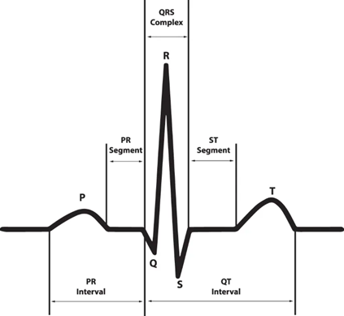

# 2.4. P-QRS-T 복합체 (ECG 신호의 기본 구성 요소)
ECG 데이터는 **P-QRS-T 복합체**라고 불리는 일정한 패턴을 가집니다. 각 부분은 심장의 전기적 활동을 반영하며, 정상 심장 박동과 이상 신호를 구별하는 중요한 요소입니다.

## 주요 파형 성분

### P파 (P-wave)
- **의미**: 심방 탈분극(Atrial depolarization) - 심방 수축 신호
- **정상 지속시간**: ≤ 0.12초 (3개의 작은 칸)
- **진폭**: ≤ 0.25 mV

### QRS 복합체 (QRS complex)
- **의미**: 심실 탈분극(Ventricular depolarization) - 심실 수축 신호
- **정상 지속시간**: 0.06~0.10초
- **특징**: ECG에서 가장 크고 뾰족한 파형

### T파 (T-wave)  
- **의미**: 심실 재분극(Ventricular repolarization) - 심실 이완 신호
- **정상 특성**: 대부분 양성(upright), P파와 같은 방향

## 주요 간격 (Intervals)

### PR 간격
- **정의**: P파 시작 ~ QRS 시작까지의 시간
- **정상 범위**: 0.12~0.20초 (3~5개 칸)
- **임상 의미**: 심방 탈분극 + 심실 전도 시간
- **이상 신호 1**:(>0.20초): 1차 방실차단(First-degree AV block)
- **이상 신호 2**:(<0.12초): WPW 증후군(Wolff-Parkinson-White) 의심

### QT 간격
- **정의**: QRS 시작 ~ T파 끝까지의 시간
- **정상 범위**: 남성 <0.44초, 여성 <0.46초 (심박수에 따라 변동)
- **임상 의미**: 심실 전체 탈분극 + 재분극 시간
- **이상 신호 1**: 심실 재분극 장애 → 위험한 부정맥(Torsades de Pointes) 위험
- **이상 신호 2**: 저칼슘혈증, 고칼륨혈증 등

### ST 분절
- **정의**: QRS 끝 ~ T파 시작까지의 구간
- **정상**: 기저선(Baseline)상에 위치
- **임상 의미**: 심근경색, 심각한 허혈성 변화 감지

## 진단적 가치

| 파라미터 | 정상 범위 | 임상적 의미 | 이상 신호 예 |
|---------|---------|----------|-----------|
| **P파** | ≤0.12초 | 심방 기능 | 심방세동, 심방비대 |
| **QRS** | 0.06-0.10초 | 심실 전도 | 각차단, 심실 빈맥 |
| **PR 간격** | 0.12-0.20초 | AV 전도 | AV 차단 |
| **QT 간격** | 남<0.44초 | 심실 재분극 | QT 연장 증후군 |
| **ST 분절** | 기저선 | 허혈 평가 | 심근경색 |

