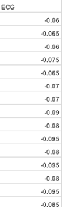
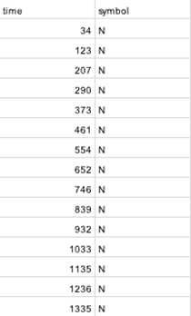
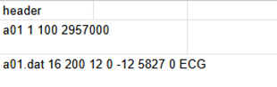

# Apnea Dataset

# 1. Dataset Information

Apnea-ECG 데이터베이스는 수면 무호흡증 검출 연구를 지원하기 위해 제작된 70개의 장시간 ECG 기록(각 7~10시간)으로 구성되어 있습니다. 데이터는 학습용 세트(35개)와 테스트 세트(35개)로 나뉘며, 각 기록에는 100Hz로 샘플링된 연속적인 ECG 신호, 전문가가 주석한 무호흡 주석(학습용 세트에만 포함), 그리고 기계가 생성한 QRS 주석(일부 오류 포함)이 포함됩니다. 또한, 8개의 기록에는 추가적인 호흡 신호(흉부 및 복부 호흡 노력, 기도 흐름, 산소포화도)가 함께 제공됩니다. 데이터는 .dat 및 .hea 파일 형식으로 저장되며, 이벤트 주석용 .apn 및 .qrs 파일이 포함되어 있습니다. 이 데이터셋은 수면 무호흡증 검출 알고리즘 개발, ECG 분석, 및 다중 신호 처리를 위한 연구에 널리 활용됩니다.

# 2. Dataset Basic Information

## 2.1 Data Information

| # of Leads | Sampling Frequency | Recording Duration | File Format |
| --- | --- | --- | --- |
| 1 | Fixed 100 Hz | 7~10 hours | .hea(metadata)
.dat(signal)
.apn(apnea annotations)
.qrs(QRS annotations) |

## 2.2 Label distribution

Apnea

| **Type** | **# recording** | **Propotion(%)** |
| --- | --- | --- |
| Normal (N) | 15223 | 61.00 |
| Apnea (A) | 9732 | 39.00 |

QRS annotation

| **Type** | **# recording** | **Propotion(%)** |
| --- | --- | --- |
| Normal (N) | 2519761 | 99.78 |
| Irregular ('|') | 5674 | 0.22 |

## 2.3 Raw Dataset


!!! note ""
    ```
    apnea_dataset/ 
    
    ├── .dat
    
    ├── .apn
    
    ├── .hea
    
    └── .qrs
    
    1 directories, 280 files
    ```


Apnea-ECG 데이터셋에는 단일 리드(Lead I)의 장시간 ECG 신호가 포함되어 있으며, 다음과 같은 정보가 함께 제공됩니다:

- apnea events를 기록한 annotation 파일 (.apn)
- 메타데이터가 포함된 header 파일 (.hea)
- QRS 주석을 기록한 파일 (.qrs)

## 2.4 Preprocessed Dataset


!!! note ""
    ```
    apnea_dataset/ 
    ├──A01_data.csv
    │  ── A01_qrs.csv
    │  ── A01_annotations.csv
    │  ── A01_header.csv
      ... (total 280 files)
    
    1 directories, 280 files
    ```


각 신호에 대한 raw데이터셋을 신호를 담은 data.csv파일, qrs 주석을 기록한 qrs.csv, apnea event를 기록한  annotations.csv파일, 그리고 메타데이터를 담은 header.csv파일로 저장하였다.







# 3. Applications and Use Cases

Apnea-ECG Database는 장기 ECG 기록을 기반으로 한 수면 무호흡증 자동 탐지 연구에서 중요한 역할을 합니다.

이 데이터셋은 다음과 같은 연구 분야에서 활용됩니다:

- 자동 수면 무호흡 검출(Apnea Detection)
- 심전도 기반 수면 상태 분석(ECG-based Sleep Analysis)
- 딥러닝 및 머신러닝 모델 개발
- 웨어러블 건강 모니터링 기기 및 원격의료(Telemedicine) 응용

| Citation | Prediction task | Architectures | Unique Methodology |
| --- | --- | --- | --- |
| Zarei et al. (2021) | Apnea Detection based on single-lead ECG | CNN+LSTM | Apnea-Hypopnea Index (AHI)-based classification |

Zarei et al. (2021) 연구에서는 CNN+LSTM 기반 모델을 사용하여 단일 리드 ECG 신호를 활용한 수면 무호흡 검출을 수행하였으며, Apnea-Hypopnea Index (AHI) 기반 분류 기법을 도입하여 모델 성능을 개선하였습니다.

# 4. References

[^1]: Zarei, Asghar, Hossein Beheshti, and Babak Mohammadzadeh Asl. "Detection of sleep apnea using deep neural networks and single-lead ECG signals." *Biomedical Signal Processing and Control* 71 (2022): 103125.