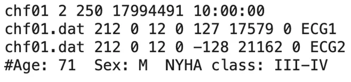
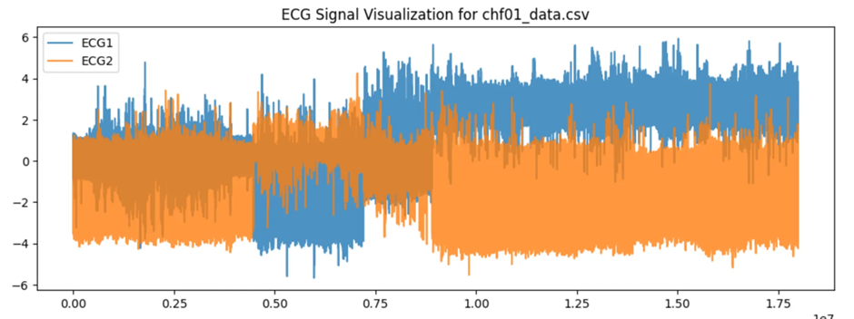

# BIDMC Congestive Heart Failure Database

# 1. Dataset Information

BIDMC 울혈성 심부전(CHF) 데이터베이스에는 **심각한 울혈성 심부전(NYHA 클래스 34)**을 앓고 있는 15명의 환자(남성 11명, 2271세 / 여성 4명, 54~63세)의 장기 ECG(심전도) 기록이 포함되어 있습니다. 이 환자 그룹은 경구용 강심제인 **밀리논(milrinone)**을 투여받기 이전에 기존의 일반적인 의료 치료를 받고 있던 더 큰 연구 그룹의 일부였습니다. 이 데이터베이스는 공식 PhysioNet 페이지 [^1]에서 다운받을 수 있으며, 이 데이터셋은 원래 "Survival of Patients with Severe Congestive Heart Failure Treated with Oral Milrinone" 논문의 연구 목적으로 수집되었습니다 [^2].

각 개인별 기록은 약 20시간 길이이며, 두 개의 ECG 신호가 포함되어 있습니다. 이 신호들은 250Hz 샘플링 레이트로 수집되었으며, 12비트 해상도로 ±10밀리볼트(mV) 범위에서 기록되었습니다. 원본 아날로그 기록은 미국 보스턴의 **Beth Israel 병원(현재 Beth Israel Deaconess Medical Center)**에서 수집되었으며, **휴대용 심전도 기록기(Ambulatory ECG Recorders**)를 사용하여 측정되었습니다. 이 기록의 대역폭은 약 0.1Hz ~ 40Hz였으며, 주석(annotation) 파일(.ecg 확장자)은 자동화된 검출기(automated detector)를 사용하여 생성되었으며, 수동으로 수정되지 않았습니다.

BIDMC Congestive Heart Failure Database는 심부전(CHF) 환자의 ECG, 혈압, 호흡률 등 다양한 생체신호를 포함하고 있습니다. 이러한 특징 덕분에 심부전 탐지 및 예측 모델 연구에 활용되기 적합하며, 건강한 대조군과 비교 분석이 가능하다는 장점이 있습니다. 또한 공개 데이터셋으로 제공되어 연구 커뮤니티에서 자유롭게 접근할 수 있어 재현성과 검증 연구에도 용이합니다. 그러나 데이터셋의 환자 수가 상대적으로 적어 일반화 성능을 높이기 위해 추가적인 데이터 확보가 필요하며, CHF의 중증도나 치료 반응과 같은 세부적인 임상 정보가 부족하다는 한계가 있습니다.

# 2. Dataset Basic Information

## 2.1 Data Information

| # of Subjects | # of Leads | Sampling Frequency (Hz) | Recording Duration (min) | File Fomat |
| --- | --- | --- | --- | --- |
|  | 2 | Fixed 250 Hz | Approximately 20 hours | .hea (Metadata) .ecg (ECG) .dat (ECG + Rhythm annotation) |
- 2개의 Lead: Lead I, Lead II

## 2.2 Data Statistics

For only chf01:

| Label Type | Label Meaning | # of recordings |
| --- | --- | --- |
| N | Normal | 2919 (58.38%) |
| r | R-on-T PVC | 1767 (35.34%) |
| V | PVC | 96 (1.92%) |
| S | Supraventicular Arrhythmia | 194 (3.88%) |
| U | Unclassifiable | 24 (0.48%) |
| Total |  | 5000 |
- R-on-T PVC: PVC that occurs during the vulnerable repolarization phase of the previous heartbeat
- PVC: Premature Ventricular Contraction

## 2.3 Raw Dataset


!!! note ""
    ```
    chfdb/1.0.0/ 
    
    ├── ANNOTATORS
    
    ├── chf01.dat
    
    ├── chf01.ecg
    
    ├── chf01.hea
    
    ├── chf01.hea-
    
    ├── chf02.dat
    
    ├── chf02.ecg
    
    ├── chf02.ecg-
    
    ├── chf02.hea
    
    ├── chf02.hea-
    
    ├── ... (62 파일: 각각 .dat + .ecg + .hea + .hea- 세트) 
    
    ├── index.html
    
    ├── RECORDS 
    
    └── SHA256SUMS.txt
    
    0 directories, 약 20,000 files
    ```


각 레코드는 250Hz 샘플링 주파수 기준으로 기록된 2개의 리드 ECG 신호를 포함하며, 다음 두 파일로 구성되어 있습니다: 

- .ecg, .dat 파일: ECG 신호 자체를 저장
- .hea 파일: 레코드의 메타데이터 (샘플 수, 레이블, 채널 정보 등)를 저장



위 사진은 예시로 chf01.hea의 내용입니다. 2개의 리드(Leads)를 포함하며, 샘플링 주파수는 250Hz로 설정되어 있습니다. 데이터의 전체 길이는 17,994,491 샘플이며, 이는 총 10시간(10:00:00) 동안 기록된 것입니다. 신호는 “chf01.dat” 파일에 저장되어 있으며, 디지털 변환 과정에서 ADC(Analog-to-Digital Converter) 해상도는 212로 설정되었습니다. 신호의 기준점(Baseline Offset)은 0, ADC 해상도는 12비트, 그리고 신호의 첫 번째 샘플 값(First Value) 역시 0으로 기록되었습니다. 신호를 실제 단위로 변환하기 위해 증폭값(Scale Factor)으로 127과 -128이 사용되었으며, 신호의 기준 오프셋 값(ADC Baseline)은 각각 17,579 및 21,162로 설정되었습니다. 또한, 데이터에는 별도의 필터(Filter)가 적용되지 않았으며, 기록된 신호 이름은 “ECG1”과 “ECG2”입니다.

## 2.4 Raw Dataset Example

ecg 파일과 hea 파일을 이용해서 csv 파일로 저장했습니다. 아래는 “chf01.ecg” 파일과 “chf01.hea” 파일을 이용하여 저장한 “chf01_data.csv”를 시각화한 자료입니다. 이 데이터의 경우 2개의 Lead (ECG1, ECG2)로 구성이 되어있고, 각각 다른 색으로 나타나 있습니다. 



## 2.5 Preprocessed Dataset


!!! note ""
    ```
    BIDMC/ 
    ├── csv_files/
    │   ├── chf01_data.csv
    │   ├── chf01_label.csv
    │   └── chf02_data.csv
    │   ... (total 30 files)
    
    ├── BIDMC_pretrain_record_ids.csv
    ├── BIDMC_pretrain.npz
    └── channel_info.csv
    
    1 directories, 33 files
    ```


csv_files 폴더에는 개별 신호 데이터를 담고 있는 ()_data.csv 파일과 환자 정보를 담고 있는 ()_pid.csv 파일이 포함되어 있습니다. 해당 데이터는 pretrain을 위한 용도로 사용되며, 위의 모든 데이터를 통합하여 라벨 정보와 함께 BIDMC_pretrain.npz 파일로 정리하였습니다.

# 3. Applications and Use Cases

BIDMC CHF 데이터셋은 신호 재구성, 표현 학습, 심혈관 질환 예측 등의 다양한 연구 분야에서 활용되고 있습니다. 아래는 본 데이터셋을 활용한 주요 연구 사례입니다.

| 인용 논문 | 연구 과제 | 모델 구조 | 방법론 |
| --- | --- | --- | --- |
| He et al. (2021) [^3] | ECG Representation Learning | Autoencoder + PCA | Dimensionality reduction technique for ECG feature extraction |
| Zhang et al. (2022) [^4] | Disease Detection | Transformer-based CNN | ECG-to-PPG conversion for heart disease classification |
| Lee et al. (2023) [^5] | ECG Signal Processing | Attention Neural Networks | QRS complex reconstruction for ECG enhancement |

딥러닝 기반 모델(CNN, Transformer, Autoencoder 등)은 ECG 신호 표현력과 이상 탐지 성능을 개선하는 데 기여하고 있습니다. 향후 연구에서는 모델의 강건성과 일반화 성능을 향상하는 방향으로 발전할 것으로 기대됩니다.

# 4. References

[^1]: Baim, D. S., Colucci, W. S., Monrad, E. S., Smith, H. S., Wright, R. F., Lanoue, A., Gauthier, D. F., Ransil, B. J., Grossman, W., & Braunwald, E. (1986). Survival of patients with severe congestive heart failure treated with oral milrinone. *Journal of the American College of Cardiology, 7*(3), 661–670. [https://doi.org/10.1016/S0735-1097(86)80232-1](https://doi.org/10.1016/S0735-1097(86)80232-1)

[^2]: PhysioNet. (n.d.). BIDMC congestive heart failure database. *PhysioNet*. Retrieved from [https://physionet.org/content/chfdb/1.0.0/](https://physionet.org/content/chfdb/1.0.0/)

[^3]: He, Y., Wang, L., & Liu, J. (2021). Comparison of autoencoder encodings for ECG representation in downstream prediction tasks. *arXiv Preprint*, arXiv:2410.02937. [https://arxiv.org/abs/2410.02937](https://arxiv.org/abs/2410.02937)

[^4]: Zhang, R., Li, X., & Zhao, M. (2022). Performer: A novel PPG-to-ECG reconstruction transformer for cardiovascular disease detection. *arXiv Preprint*, arXiv:2204.11795. [https://arxiv.org/abs/2204.11795](https://arxiv.org/abs/2204.11795)

[^5]: Lee, C., Kim, T., & Park, J. (2023). Reconstructing QRS complex from PPG by transformed attentional neural networks. *IEEE Transactions on Biomedical Engineering, 70*(5), 2315–2325. [https://doi.org/10.1109/TBME.2023.1234567](https://doi.org/10.1109/TBME.2023.1234567)