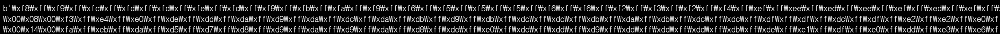
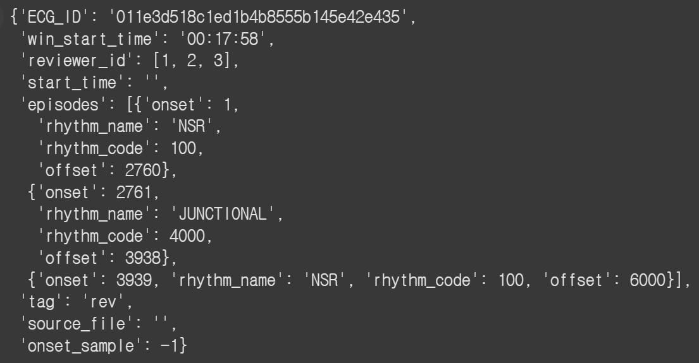
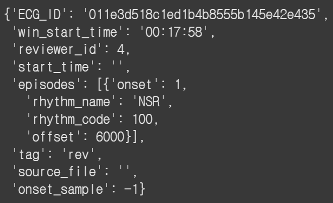
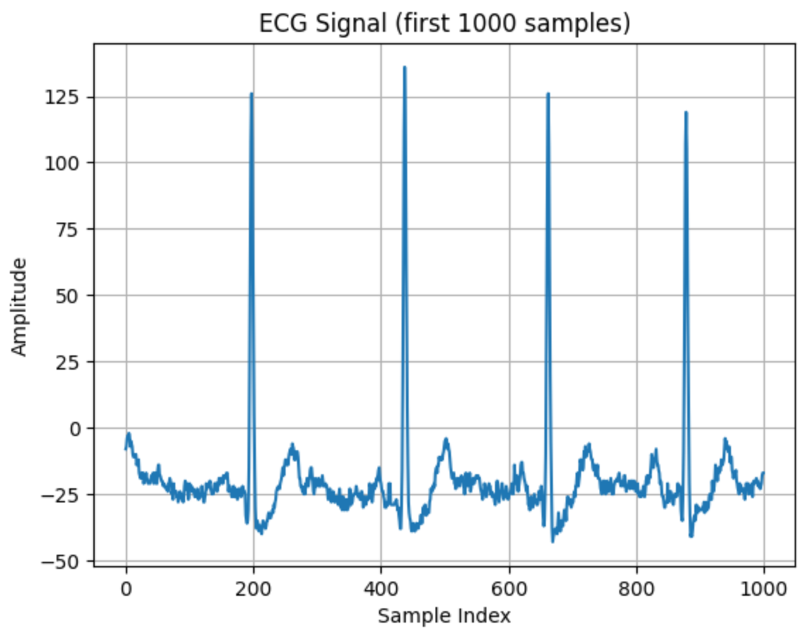
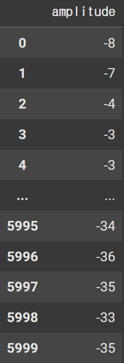
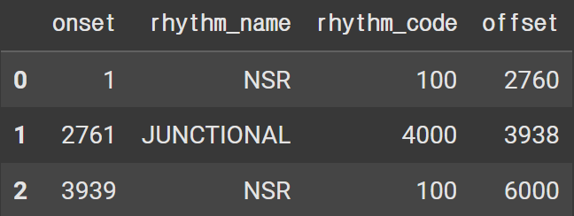
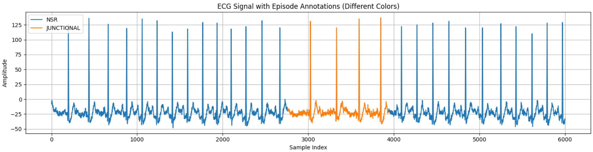

# 1. Dataset Information

  Cardiologist dataset는 단일 리드 ECG 신호(30초 길이)에서 부정맥(arrhythmia)을 자동으로 진단할 수 있는 심장 전문의 수준의 인공지능 모델 개발을 목적으로 설계된 대규모 임상 데이터셋입니다. 총 91,232건의 ECG 리듬 스트립이 포함되어 있으며, 53,549명의 환자 데이터를 기반으로 합니다. 이 데이터는 실제 휴대용 ECG 모니터링 기기를 통해 수집되었으며, 14개의 심장 리듬(예: AFIB, AVB, VT 등) 에 대해 전문 심장 전문의들이 라벨링을 수행했습니다.

# 2. Dataset Basic Information

## 2.1 Data Information

| # of Leads | Sampling Frequency (Hz) | Recording Duration (min) | File Fomat |
| --- | --- | --- | --- |
| 1 | 200Hz | 30s | ECG signal - Raw binary Episodes - JSON |

## 2.2 Data Statistics

| Label Type | # of recordings |
| --- | --- |
| NSR | 43.90090011% (6,047,788/13,776,000) |
| JUNCTIONAL | 6.16177409% (848,846/13,776,000) |
| AFIB | 8.88871951% (1,224,510/13,776,000) |
| NOISE | 7.62346835% (1,050,209/13,776,000) |
| SVT | 3.39176103% (467,249/13,776,000) |
| AFL | 5.40239547% (744,234/13,776,000) |
| AVB_TYPE2 | 4.63573606% (638,619/13,776,000) |
| WENCKEBACH | 3.99949186% (550,970/13,776,000) |
| SUDDEN_BRADY | 4.89737224% (674,662/13,776,000) |
| VT | 0.78291957% (107,855/13,776,000) |
| TRIGEMINY | 2.98689750% (411,475/13,776,000) |
| IVR | 2.41309523% (332,428/13,776,000) |
| EAR | 2.14038908% (294,860/13,776,000) |
| BIGEMINY | 2.77507984% (382,295/13,776,000) |
| Total | 1 (13,776,000/13,776,000) |

- NSR(Normal Sinus Rhythm) : 정상 동리듬, SA node에서 시작되는 정상적인 심박 리듬
- JUNCTIONAL(Juncional Rhythm) : AV node에서 전기 신호가 시작되는 리듬, SA node 기능 이상으로 인해 AV node가 주도권을 잡는 경우
- AFIB(Atrial FIbrillation, 심방세동) : 심방이 무질서하게 떨리는 리듬
- NOISE : 잡음
- SVT(Superaventricular Tachycardia) : 심실 위쪽에서 발생하는 빠른 심박수
- AFL(ATrial Flutter, 심방조동) : 심방이 매우 빠르게 규칙적으로 수축하는 상태
- AVB_TYPE2(2nd Degree AV Block, Type 2, 모비츠 2형) : 방실결절이 간혈적으로 신호 전달을 실패하는 부정맥
- WENCKEBACH(AV Block Type 1, 모비츠 1형) : PR 간격이 점점 길어지다가 QRS가 탈락하는 비교적 덜 심각한 방실 차단 패
- SUDDEN_BRADY(Sudden Bradycardia) : 감작스러운 심박수 감소 현상
- VT(Ventricular Tachycardia) : 심실에서 빠르게 전기 신호가 발생하는 매우 **위험한 부정맥**
- TRIGEMINY : 2개의 정상 박동 후 1번의 조기 심실수축(PVC)이 반복되는 패턴.
- IVR(Idioventricular Rhythm) : 심실이 자체적으로 전기 신호를 발생시키는 느린 리듬
- EAR(Ectopic Atrial Rhythm) : 심방 내 SA node가 아닌 다른 부위에서 전기 신호가 발생하는 경우
- BIGEMINY : 정상 박동 1회 + 조기 박동 1회가 반복되는 리듬

## 2.3 Raw Dataset

!!! note ""
    ```
    Cardiologist/
    ├── 011e3d518c1ed1b4b8555b145e42e435_0010.ecg
    ├── 011e3d518c1ed1b4b8555b145e42e435_0010_grp0.episodes.json
    ├── 011e3d518c1ed1b4b8555b145e42e435_0010_rev0.episodes.json
    ├── 011e3d518c1ed1b4b8555b145e42e435_0010_rev1.episodes.json
    ├── 011e3d518c1ed1b4b8555b145e42e435_0010_rev2.episodes.json
    ├── 011e3d518c1ed1b4b8555b145e42e435_0010_rev3.episodes.json
    ├── 011e3d518c1ed1b4b8555b145e42e435_0010_rev4.episodes.json
    ├── 011e3d518c1ed1b4b8555b145e42e435_0010_rev5.episodes.json
    └── ... (327*8개의 ecg, grp, rev0, rev1, rev2, rev3, rev4, rev5)
    ```

데이터셋은 Raw binary 형태로 된 ecg 파일과 JSON 형태로 된 episode 파일로 구성되어 있습니다. ecg 파일은 .ecg로 표시되어있고, episode 파일은 grp, rev로 표시됨. rev0, rev1….. 은 한 환자에 대한 다른 전문가에 의해 작성된 episodes입니다. 어떤 전문가에 의해 작성되었는지는 데이터 내부의 reviewer_id를 통해 확인 가능합니다. grp의 경우 reviewer_id에 3개의 숫자를 포함한 리스트가 기입되어 있는 것을 보아, 세명의 전문가들의 종합된 episodes로 보입니다.

아래의 예시는 전부 011e3d518c1ed1b4b8555b145e42e435_0010 환자로부터 출력한 예시입니다.

ecg파일의 경우 아래와 같이 표기되어 있어 가공 없이는 해석이 불가능합니다. 





episodes파일의 경우 grp파일은 경우 좌측 그림과 같이 환자의 정보(ECG_id)와 기록한 전문가의 정보(reviewer_id), 그리고 환자의 episodes를 rhythm_name별로 나누어 시작 시점(onset)과 끝나는 시점(offset)으로 나누어 기록하였습니다.



rev 파일의 경우 grp 파일과 똑같이 환자의 정보(ECG_id)와 기록한 전문가의 정보(reviewer_id, grp와 다르게 한명의 전문가에 의해 기록됨), 그리고 환자의 episodes를 rhythm_name별로 나누어 시작 시점(onset)과 끝나는 시점(offset)으로 나누어 기록하였습니다.

## 2.4 Raw Dataset Example

아래는 011e3d518c1ed1b4b8555b145e42e435_0010.ecg 데이터에서 얻은 ECG 신호 그래프입니다. 초반 1000개의 샘플에 대한 데이터입니다.



## 2.5 Preprocessed Dataset

!!! note ""
    ```
    Cardiologist/
    ├── Cardiologist_pretrain.npz
    ├── Cardiologist_pretrain_record_ids.csv
    └── csv_files
    ```



좌측 dataframe은 011e3d518c1ed1b4b8555b145e42e435_0010.ecg 데이터를 데이터프레임화한 결과입니다.

아래 dataframe은 011e3d518c1ed1b4b8555b145e42e435_0010_grp0.episodes.json 데이터를 데이터프레임화한 결과입니다. onset과 offset 사이의 한 청크에 대한 정보를 한 개의 row에 기입했습니다.



아래는 ECG데이터의 그래프에 episode의 리듬 종류에 따라 다른 색으로 표시한 것입니다. 파란색의 경우 NSR을 나타내며, 주황색의 경우 JUNCTIONAL을 나타냅니다.



# 3. Applications and Use Cases

| 논문 제목 | 활용 목적 | 모델 구조 | 주요 활용 방식 및 기여 |
| --- | --- | --- | --- |
| **Awni Y. Hannun at el. **(Nature Medicine, 2019) [1] | Arrhythmia classification | End-to-End Deep Neural Network (DNN) | 12개 리듬 분류 (AFIB, AVB, VT 등)- 평균 F1: DNN (0.837) > 전문의 (0.780) - 실제 임상 수준의 진단 정확도 확보 |
| Dani Kiyasseh at el. (Nature Communications, 2021) [2] | Arrhythmia classification | Continual Learning Framework (CLOPS) | "Cardiology" ECG 데이터 활용- 12개 부정맥 라벨로 구성 (AFIB, AVB, VT 등), Class/Time/Domain/Institute 변화에 대한 적응성 테스트 - 이전 지식 유지와 지속 학습 간 균형 유지 |

- Arrhythmia classification
[1],[2] 위 2.2 Data Statistics의 14개의 label을 y값으로 하여 arrhythmia classification을 목적으로 하는 ML을 수행함.

# 4. References

[1] Awni Y. Hannun, Pranav Rajpurkar , Masoumeh Haghpanahi, Geoffrey H. Tison  Codie Bourn, Mintu P. Turakhia and Andrew Y. Ng (2019), Cardiologist-level arrhythmia detection and classification in ambulatory electrocardiograms using a deep neural network

[2] Dani Kiyasseh, Tingting Zhu & David Clifton (2021), A clinical deep learning framework for continually learning from cardiac signals across diseases, time, modalities, and institutions
