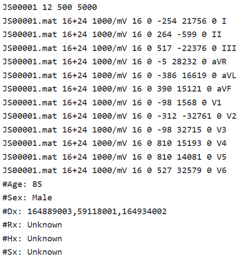
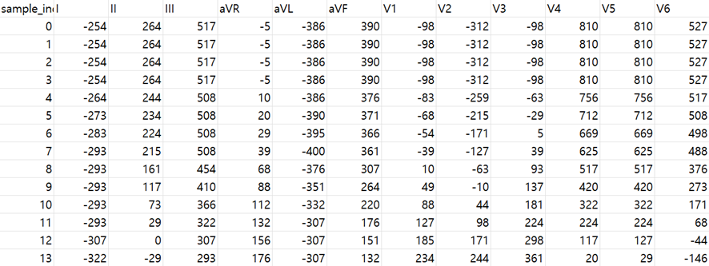
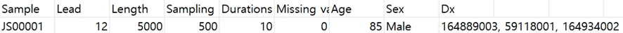
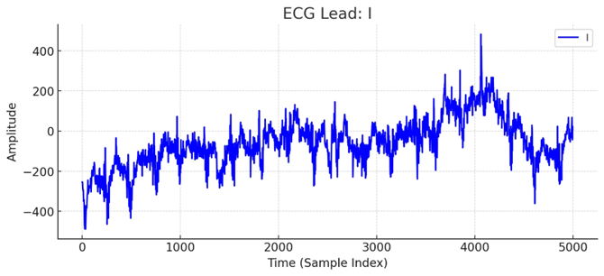
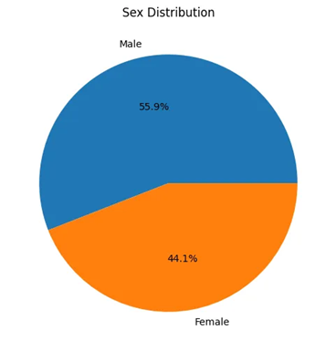
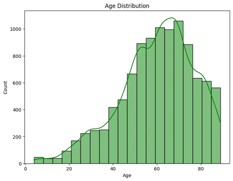

# Chapman Shaoxing

# 1. Dataset Information

Chapman_shaoxing dataset은 12리드 ECG 데이터로 구성된 대규모 데이터베이스로, 10,247명의 환자 데이터를 포함하고 있습니다. 이 데이터셋은 Chapman University, Shaoxing People’s Hospital의 협력으로 만들어졌으며, 500Hz 샘플링 주파수로 기록되었습니다. Chapman_shaoxing Dataset은 전문 심장 전문의의 라벨링을 통해 고품질로 구성되었으며, 자동 진단 알고리즘 개발 및 성능 검증을 목적으로 수집되었습니다. 이 데이터셋은 부정맥(arrhythmia) 및 심혈관 질환 연구와 기계 학습 알고리즘 훈련에 사용될 수 있도록 설계되었습니다.

# 2. Dataset Basic Information

## 2.1 Data Information

| # of Subjects | # of Leads | Sampling Frequency (Hz) | Recording Duration (min) | File Fomat |
| --- | --- | --- | --- | --- |
| More than 10,000 (10,247 records) | 12 | Fixed 500 Hz | 10 seconds | MATLAB V4 files .mat (ECG) .hea (Metadata) |

## 2.2 Data Statistics

| Label Type | Label Meaning | # of recordings |
| --- | --- | --- |
| SB | Sinus Bradycardia | 3889 (37.95%) |
| SR | Sinus Rhythm | 1826 (17.82%) |
| AF(AFIB) | Atrial Fibrillation | 1780 (17.37%) |
| ST | Sinus Tachycardia | 1568 (15.30%) |
| AFL | Atrial Flutter | 445 (4.34%) |
| SVT | Supraventricular Tachycardia | 587 (5.73%) |
| AT | Atrial Tachycardia | 121 (1.18%) |
| AVNRT | Atrioventricular Node Reentrant Tachycardia | 16 (0.16%) |
| AVRT | Atrioventricular Reentrant Tachycardia | 8 (0.08%) |
| SAAWR | Sinus Atrium to Atrial Wandering Rhythm | 2 (0.02%) |
| Total |  | 10247 |

이외에도 많은 Dx 진단 코드가 있었지만, 참고한 논문에서는 이 10개의 Rhythm label을 중점적으로 사용했습니다. 

(참고 논문: [https://www.nature.com/articles/s41597-020-0386-x](https://www.nature.com/articles/s41597-020-0386-x) Table 2 Rhythm information and baseline characteristics of participants.) 

## 2.3 Raw Dataset


!!! note ""
    ```
    chapman_shaoxing/ 
    
    ├── 01/ 
    
    │ ├── 010/
    
    │ │ ├── JS00001.hea
    
    │ │ ├── JS00001.mat
    
    │ │ ├── JS00002.hea
    
    │ │ ├── JS00002.mat
    
    │ │ └── ... (200 파일: 각각 .mat + .hea 세트) 
    
    │ ├── 011/
    
    │ │ ├── JS00105.hea
    
    │ │ ├── JS00105.mat
    
    │ │ └── ... (200 파일: 각각 .mat + .hea 세트) 
    
    │ └── ... (10 폴더) 
    
    ├── … 
    
    ├── 11/ (10폴더)
    
    │ ├── 110/ (200파일)
    
    │ ├── 111/ (200파일)
    
    │ └── 112/ (200파일)
    
    ├── ConditionNames_SNOMED-CT.csv
    
    ├── LICENSE.txt
    
    ├── RECORDS
    
    └── SHA256SUMS.txt
    
    10 directories, 18,604 files
    ```


각 레코드는 500Hz 샘플링 주파수 기준으로 기록된 12 리드 ECG 신호를 포함하며, 다음 두 파일로 구성되어 있습니다: 

- .mat 파일: ECG 신호 자체를 저장
- .hea 파일: 레코드의 메타데이터 (샘플 수, 레이블, 채널 정보 등)를 저장



위의 사진은 Chapman_shaoxing의 JS00001.hea의 내용입니다.

- Dx: SNOMED-CT 코드 체계에 기반한 질병의 진단코드
- Rx: 해당 환자의 약물 치료 정보
- Hx: 환자의 과거 병력 정보
- Sx: 환자의 현재 증상 정보

Chapman_shaoxing dataset의 Rx, Hx, Sx는 모두 unknown입니다.

## 2.4 Raw Dataset Example

Chapman_shaoxing의 mat, hea 파일들을 이용하여 data.csv, pid.csv 파일로 만듭니다. 다음 사진들은 JS00001_re_data.csv, JS00001_re_data.csv, 그리고 JS00001_re_data.csv에서 첫 번째 열인 Lead Ⅰ을 시각화한 사진입니다.







다음은 Gender와 Age distribution입니다.





## 2.5 Preprocessed Dataset


!!! note ""
    ```
    chapman_shaoxing/ 
    ├── csv_files/
    │   ├── JS00001_re_data.csv
    │   ├── JS00001_re_pid.csv
    │   └── JS00002_re_data.csv
    │   ... (total 18600 files)
    ├── channels_info.csv
    └── chapman_shaoxing_pretrain.npz
    
    1 directories, 18602 files
    ```


csv_files 폴더에는 개별 신호 데이터를 담고 있는 ()_re_data.csv 파일과 환자 정보를 담고 있는 ()_re_pid.csv 파일이 포함되어 있습니다. 해당 데이터는 pretrain을 위한 용도로 사용되며, 위의 모든 데이터를 통합하여 라벨 정보와 함께 chapman_shaoxing_pretrain.npz 파일로 정리하였습니다.

# 3. Applications and Use Cases

Chapman_shaoxing 데이터셋에는 각 ECG 파일에 해당하는 patient의 Age, Gender, Dx(진단명)에 관한 정보를 포함합니다. 이 데이터셋을 활용하는 논문들은 수많은 Dx 코드 중에서 대부분 Rhythm에 관련한 label을 사용하여 Arrhythmia classification을 수행합니다.

| 인용 논문 | 연구 과제 | 모델 구조 | 방법론 |
| --- | --- | --- | --- |
| Zheng et al. (2020) [^1] | Arrhythmia classification | Ensemble Tree Classifiers (Gradient Boosting, XGBoost) | 1. Robust noise removal 2. Multi-stage pipeline including filtering (Butterworth, LOESS, Non-Local Means 3. Feature Extraction |
| Soltanieh et al. (2024) [^2] | Arrhythmia classification | Self-Supervised Learning pipelines (SimCLR, BYOL, SwAV) + CNN backbones | 1. Extensive analysis of augmentations 2. Demonstrates competitive ID/OOD performance and conducts per-disease performance breakdown |
| Zeng et al. (2024) [^3] | Arrhythmia classification | Cascading Deep Neural Network (CNN-based) | 1. Converts Lead II ECG signals into images using Relative Positioning Matrix (RPM) 2. Employs explainability techniques (Grad-CAM, SHAP)  |
- Arrhythmia classification

[1][^2] chapman_shaoxing 데이터셋에서 총 11종류의 세부 Rhythm Label을 4개의 그룹(Sinus Bradycardia, Atrial Fibrillation, General Supraventricular Tachycardia, Sinus Rhythm)으로 통합하여 Arrhythmia Classification를 수행하였습니다.

[^3] 이 논문에서는 Chapman–Shaoxing 데이터셋에서 제공되는 7개(또는 4개) 심장 리듬 레이블(예: Sinus Rhythm, Atrial Fibrillation 등)을 이용해 이미지 기반 분류 모델(CDNNs)을 훈련하여 Arrhythmia classification을 수행하였습니다.

# 4. References

[^1]: Zheng, J., Chu, H., Struppa, D., & others. (2020). Optimal multi-stage arrhythmia classification approach. *Scientific Reports, 10*, 2898. [https://doi.org/10.1038/s41598-020-59821-7](https://doi.org/10.1038/s41598-020-59821-7)

[^2]: Soltanieh, S., Hashemi, J., & Etemad, A. (2024). In-distribution and out-of-distribution self-supervised ECG representation learning for arrhythmia detection. *IEEE Journal of Biomedical and Health Informatics, 28*(2), 789–800.

[^3]: Zeng, W., Shan, L., Yuan, C., & Du, S. (2024). Advancing cardiac diagnostics: Exceptional accuracy in abnormal ECG signal classification with cascading deep learning and explainability analysis. *Applied Soft Computing*. [https://www.sciencedirect.com/science/article/pii/S1568494624008305](https://www.sciencedirect.com/science/article/pii/S1568494624008305)

[^4]: Goldberger, A. L., Amaral, L. A. N., Glass, L., Hausdorff, J. M., Ivanov, P. C., Mark, R. G., ... & Stanley, H. E. (2000). PhysioBank, PhysioToolkit, and PhysioNet: Components of a new research resource for complex physiologic signals. *Circulation, 101*(23), e215–e220. [https://physionet.org/content/ecg-arrhythmia/1.0.0/](https://physionet.org/content/ecg-arrhythmia/1.0.0/)