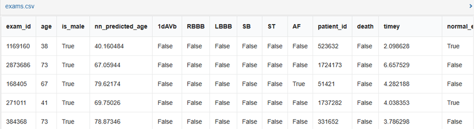

# 1. Dataset Information

CODE 15% ECG 데이터셋은 12-리드 심전도(ECG) 기록을 기반으로 한 연구를 지원하기 위해 설계된 대규모 데이터셋으로, 심전도 분석 및 심장 나이 예측과 같은 분야에서 딥러닝 모델의 개발 및 평가에 활용됩니다. 이 데이터셋은 233,770명의 환자로부터 수집된 345,779건의 심전도 검사 결과를 포함하고 있으며, CODE 데이터셋의 15%를 층화 추출 방식으로 샘플링하여 구축되었습니다. 데이터는 미나스제라이스주 원격의료 네트워크(TNMG)에 의해 2010년부터 2016년까지 수집되었습니다.

# 2. Dataset Basic Information

## 2.1 Data Information

| # of Leads | Sampling Frequency | Recording Duration | File Format |
| --- | --- | --- | --- |
| 12 | Fixed 400 Hz | 7 seconds (2800 sample) 10 seconds (4000 sample) | Exams.csv(metadata) Exams.hdf5(signal) |

## 2.2 Raw Dataset

!!! note ""
     CODE 15%_dataset/
    ├── Exams part(i).hdf5
    └── Exams.csv
    1 directories, 18 files

- Raw 데이터셋 개요
CODE 15% 데이터셋에는 Exams_id 및 tracing data가 포함되어 있으며, 환자의 메타데이터 및 ECG 신호 데이터를 포함하는 Exams.csv와 Exams.hdf5 파일로 구성되어 있습니다. Exams.hdf5파일은 0~17의 part로 분할되어있습니다.

다음은 exams.csv파일의 예시입니다.

## 2.3 Preprocessed Dataset

!!! note ""
     apnea_dataset/
     │  ── **exam_id**_signal.csv
     │  ── exams.csv

    1 directories, 345780files

hdf5파일을 로드한 데이터셋을 id별로 분할하여 csv로 저장하였습니다.

# 3. Applications and Use Cases

- 데이터셋의 활용 및 응용 분야
CODE 15% ECG Dataset은 자동화된 심전도 진단(Automated ECG Diagnosis), 심장 질환 분류(Disease Classification), 심장 나이 예측(Heart Age Estimation) 등의 연구에 널리 활용되고 있습니다. AI 기반 심혈관 연구 발전을 지원하는 대규모 ECG 데이터셋으로서, 다음과 같은 연구 분야에서 중요한 역할을 합니다:
- 자동 심장 질환 진단: ECG 신호를 분석하여 심장 이상을 자동으로 감지
- 다중 클래스 심장 질환 분류: 다양한 심장 질환의 ECG 패턴을 분류하는 머신러닝 및 딥러닝 모델 개발
- 심장 나이 예측(Heart Age Estimation): ECG 데이터를 기반으로 생리학적 나이를 예측하는 모델 구축
- 자기 지도 학습(Self-Supervised Learning, SSL) 기반 ECG 분석: 대량의 ECG 데이터를 활용한 사전 학습 및 질병 진단 모델 개발
관련 연구 및 활용 사례

| Citation | Prediction task | Architectures | Unique Methodology |
| --- | --- | --- | --- |
| Ribeiro et al. (2020) | Automated Diagnosis of Cardiac Abnormalities | ResNet-based CNN | Multi-label Classification |
| Song et al. (2024) | Multi-class ECG Disease Classification, Heart Age Estimation from ECG | Hybrid Self-Supervised Learning based Foundation model | Self-supervised Learning based ECG model |

이 데이터셋을 활용한 연구중 Ribeiro et al. (2020) 연구에서는 ResNet 기반 CNN 모델을 활용하여 12-리드 ECG 데이터를 자동으로 분석하고 심장 이상을 감지하는 다중 레이블 분류(Multi-label Classification) 모델을 개발하였습니다. 그리고 Song et al. (2024) 연구에서는 Hybrid Self-Supervised Learning 기반 ECG Foundation Model을 구축하여 다중 클래스 심장 질환 분류 및 심장 나이 예측을 수행하였습니다.

# 4. References

1. Ribeiro, Antônio H., et al. "Automatic diagnosis of the 12-lead ECG using a deep neural network." *Nature Communications* 11.1 (2020): 1760.
2. Song, Junho, et al. "Foundation Models for ECG: Leveraging Hybrid Self-Supervised Learning for Advanced Cardiac Diagnostics." *arXiv preprint arXiv:2407.07110* (2024).
