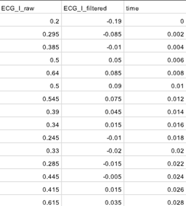

# 1. Dataset Information

ECG-ID 데이터베이스는 ECG 기반 생체 인식 연구를 위해 설계된 데이터셋으로, 90명의 자원봉사자로부터 수집된 총 310개의 기록을 포함하고 있습니다. 각 기록은 리드 I을 20초 동안 측정한 것으로, ±10mV 범위에서 500Hz 샘플링 주파수와 12비트 해상도로 디지털화되었습니다. 자동 검출기를 통해 R파와 T파의 피크가 주석 처리된 10개의 박동이 포함되어 있으며, 고주파 및 저주파 노이즈가 섞인 원시 신호와 필터링된 신호가 모두 제공됩니다. 각 기록에는 연령, 성별, 기록 날짜 등의 메타데이터가 포함되어 있으며, 이 데이터베이스는 ECG 기반 생체 인식 연구에 활용되어 높은 정확도로 개인을 구분할 수 있음을 보여주었습니다.

# 2. Dataset Basic Information

## 2.1 Data Information

| # of Leads | Sampling Frequency | Recording Duration | File Format |
| --- | --- | --- | --- |
| 1 | Fixed 500 Hz | 20 seconds | .atr(annotations) .dat (ECG signal) .hea (Metadata) |

## 2.2 Raw Dataset

!!! note ""
    ```
    ecg_id_dataset/
    └──  person(i)
    90 directories, 930 files
    ```

ECG-ID 데이터셋은 단일 리드(Lead I)의 원시 신호 및 필터링된 신호를 포함하며, 한 명의 피험자가 여러 개의 기록을 가질 수 있습니다. 총 90명의 피험자에게 310개의 ecg신호를 수집하였습니다.

- .hea: 메타데이터 정보 포함
- .atr: 주석이 포함된 파일
- .dat: ecg 신호파일

## 2.3 Preprocessed Dataset

!!! note ""
    ```
    ecg_id_dataset/
    ├── •	person(i)_record(j)_.header.csv
    ├── •	person(i)_record(j).annotations.csv
    └──  •	person(i)_record(j).signals.csv
    1 directories, 930files
    ```

위의 원본파일을 다음과 같이 person번호와 record번호를 구분하여 csv로 변환하였습니다.

- header.csv: 각 기록의 메타데이터 포함
- annotation.csv: 주석데이터 포함
- signals.csv: ecg 신호데이터 포함



Signals.csv는 다음과 같이 시간에 따른 raw 데이터와 filtered 된 ecg신호를 기록하고 있습니다.

# 3. Applications and Use Cases

ECG-ID Database는 생체 인식 및 개인 인증 연구에서 널리 사용되며, ECG 신호가 고유하고 안전한 생체 인식 마커로 활용될 가능성을 보여주었습니다.

이 데이터셋은 다음과 같은 연구 분야에서 활용됩니다:

- ECG 기반 개인 식별(Biometric Identification): 개인의 ECG 신호를 이용한 신원 확인
- ECG 기반 인증(Biometric Verification): 개인 인증을 위한 ECG 특징 추출 및 분석
- 머신러닝 기반 생체 인식 모델 개발: CNN, ResNet, Autoencoder 등의 딥러닝 모델을 활용한 ECG 신호 분류 연구

| Citation | Prediction task | Architectures | Unique Methodology |
| --- | --- | --- | --- |
| AlDuwaile et al. (2021) | Biometric Identification | CNN | Demonstrated the potential for high-accuracy personal recognition with just a single heartbeat (0.5 seconds) |
| Chu et al. (2019) | Biometric Identification & Verification | ResNet | Parallel Multi-Scale filter |
| Melzi et al. (2023) | Biometric Verification | Autoencoder, CNN | Feature Extraction model supporting both Multi-lead & Single-lead ECG signals |

이 데이터셋은 생체 인식을 위한 여러 연구에서 활용되고 있습니다. AlDuwaile et al. (2021) 연구에서는 CNN 모델을 사용하여 단일 심박만으로 높은 정확도의 개인 식별 성능을 달성하였습니다. Chu et al. (2019) 연구에서는 Parallel Multi-Scale One-Dimensional ResNet 구조를 도입하여 ECG 기반 인증 모델의 성능을 향상시켰습니다. Melzi et al. (2023) 연구에서는 Autoencoder와 CNN을 활용한 특징 추출 모델을 개발하여 단일 리드 및 다중 리드 ECG 신호를 모두 지원하는 Biometric Verification에 활용되었습니다.

# 4. References

1. AlDuwaile, Dalal A., and Md Saiful Islam. "Using convolutional neural network and a single heartbeat for ECG biometric recognition." *Entropy* 23.6 (2021): 733.
2. Chu, Yifan, Haibin Shen, and Kejie Huang. "ECG authentication method based on parallel multi-scale one-dimensional residual network with center and margin loss." *IEEE Access* 7 (2019): 51598-51607.
3. Melzi, Pietro, Ruben Tolosana, and Ruben Vera-Rodriguez. "ECG biometric recognition: Review, system proposal, and benchmark evaluation." *IEEE Access* 11 (2023): 15555-15566.
