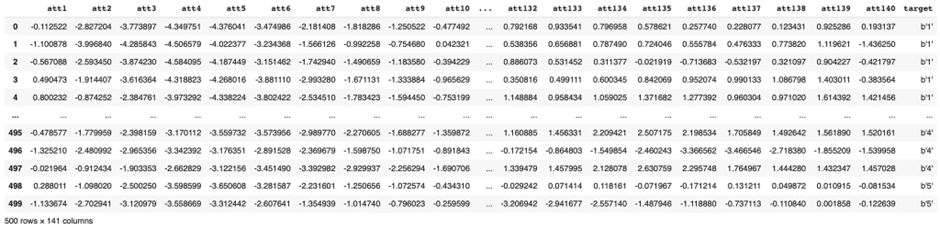
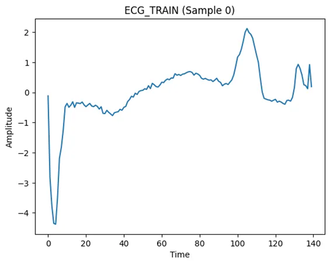
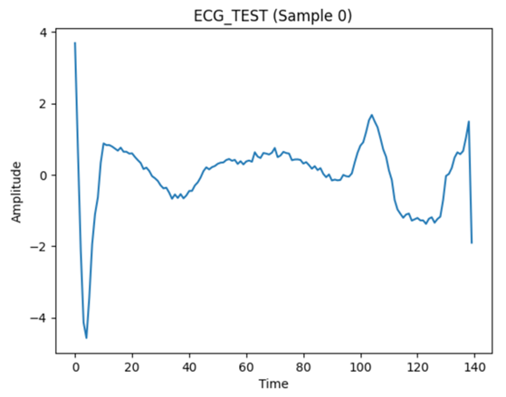

# 1. Dataset Information

ECG5000 데이터셋은 PhysioNet [1] 및 Papers with Code 공식 페이지 [2]에서 확인할 수 있습니다. PhysioNet의 BIDMC 울혈성 심부전(CHF) 데이터베이스(chfdb) [3]에서 파생되었습니다. 해당 데이터셋은 심각한 울혈성 심부전을 겪는 단일 환자(기록 번호 “chf07”)의 20시간 길이의 ECG 심전도 기록을 포함하고 있습니다. 해당 데이터셋은 원래 논문 “A General Framework for Never-Ending Learning from Time Series Streams” [4]에서 사용되었으며, 이후 5,000개의 심박이 랜덤으로 선택되었습니다.

원본 데이터는 미국 보스턴에 위치한 Beth Israel 병원 (현 Beth Israel Deaconess Medical Center)에서 수집되었으며, 환자의 장기적인 심전도 변화를 모니터링하기 위해 휴대용 심전도 기록기(Ambulatory ECG Recorder)를 사용하여 측정되었습니다. 그 중 “chf07” 환자는 NYHA (New York Heart Association) 심부전 등급이 Class III-IV인 중증(congestive) 심부전(Congestive Heart Failure, CHF)을 앓고 있는 환자였으며, 48세 남성이다. 클래스 값은 자동화된 주석(annotation) 과정을 통해 부여되었습니다.

ECG5000의 데이터는 원본 데이터에서 두 단계의 전처리 과정을 거쳤습니다:

1. 각 심박(heartbeat) 데이터를 개별적으로 추출
2. 모든 심박이 동일한 길이를 가지도록 보간(interpolation) 수행
ECG5000 데이터셋은 전처리가 완료된 상태로 제공되어 바로 학습 및 평가가 가능하다는 점에서 연구 및 모델 개발에 용이합니다. 또한, 다양한 심장 박동 패턴(레이블)을 포함하고 있어 심박 분류 및 이상 탐지와 같은 머신러닝 기반 분석에 활용될 수 있다. 의료 데이터 기반 벤치마크 데이터셋으로 많이 사용되며, 여러 연구에서 성능 비교를 위한 표준 데이터로 자리 잡고 있습니다.

이 데이터셋은 단일 환자(중증 심부전 환자)의 심전도 기록을 기반으로 하고 있어, 다양한 환자군을 대표하기 어려운 한계가 있습니다. 또한, 일부 레이블(예: 특정 부정맥 유형)이 데이터셋 내에서 불균형(Imbalanced Labels)하게 분포되어 있어 학습 시 편향(Bias)이 발생할 수 있습니다. 실제 의료 환경에서 발생할 수 있는 노이즈나 변동성을 충분히 반영하지 못할 가능성도 존재합니다.

# 2. Dataset Basic Information

## 2.1 Data Information

| # of Subjects | # of Leads | Sampling Frequency (Hz) | Recording Duration (min) | File Fomat |
| --- | --- | --- | --- | --- |
| 5,000 records | 1 | Fixed 500 Hz | 20 hours | .arff (ECG + Rhythm annotation) .ts (ECG) .txt (ECG) |

## 2.2 Data Statistics

| Label Type | Label Meaning | # of recordings | Time length (s) - Fixed |
| --- | --- | --- | --- |
| 1 | Normal (N) | 2919 (58.38%) | 140 |
| 2 | R-on-T PVC (R) | 1767 (35.34%) | 140 |
| 3 | PVC (V) | 96 (1.92%) | 140 |
| 4 | Supraventricular Arrhythmia (S) | 194 (3.88%) | 140 |
| 5 | Unclassifiable (U) | 24 (0.48%) | 140 |
| Total |  | 5000 |  |

- R-on-T PVC: PVC that occurs during the vulnerable repolarization phase of the previous heartbeat
- PVC: Premature Ventricular Contraction

## 2.3 Raw Dataset

!!! note ""
    ```
    ECG5000/
    ├── ECG5000_TEST.arff
    ├── ECG5000_TEST.ts
    ├── ECG5000_TEST.txt
    ├── ECG5000_TRAIN.arff
    ├── ECG5000_TRAIN.ts
    ├── ECG5000_TRAIN.txt
    └── ECG5000.txt
    0 directories, 5 files
    ```



ECG5000_TRAIN.arff를 데이터프레임으로 불러온 내용입니다. TRAIN 파일에서 각 열(att1 ~ att140)은 타임스템프를 나타내며, 각 행(0~499)는 개별적인 데이터를 의미합니다. 마지막 열(target)은 개별 데이터에 대한 주석(레이블 값)을 나타냅니다. 환자의 정보가 담긴 헤더파일은 존재하지 않습니다.

## 2.4 Raw Dataset Example

ECG5000_TRAIN.arff와 ECG5000_TEST.arff 파일들을 data.csv, label.csv 파일로 변환하였습니다. 전처리 후에는 각 열이 개별적인 데이터를, 각 열이 타임스템프를 나타냅니다. 주석 값은 1, 2, 3, 4, 5로 변환 후 저장하였습니다. 다음은 ECG5000_TRAIN_data.csv와 ECG5000_TEST_data.csv 파일의 첫번째 Sample을 시각화 한 것입니다.





## 2.5 Preprocessed Dataset

!!! note ""
    ```
    ECG5000/
    ├── csv_files/
    │   ├── A0001_data.csv
    │   ├── A0001_label.csv
    │   └── A0002_data.csv
    │   ... (total 10,000 files)
    ├── channels_info.csv
    └── label_info.csv
    1 directories, 10002 files
    ```

csv_files 폴더에는 개별 신호 데이터를 담고 있는 ()_re_data.csv 파일과 환자 정보를 담고 있는 ()_re_pid.csv 파일이 포함되어 있습니다. 해당 데이터는 파인튜닝(finetune)을 위한 용도로 사용되며, 위의 모든 데이터를 통합하여 라벨 정보와 함께 PhysioNet_2017_finetune.npz 파일로 정리하였습니다.

# 3. Applications and Use Cases

ECG5000은 Rhythm Label을 가지고 있어, Arrhythmia detection(부정맥 탐지), Heartbeat classification(심박 분류), Anomaly detection(이상 탐지) 연구에 활용될 수 있습니다.

| 인용 논문 | 연구 과제 | 모델 구조 | 방법론 |
| --- | --- | --- | --- |
| Pereira & Silveira (2019) [5] | Anomaly detection | VRAEs (Variational Recurrent Neural Networks) | Combination of unsupervised representation learning and anomaly detection using clustering and Wasserstein distance |
| Guillaume et al. (2021) [6] | Time Series Classification | VRNNs (Variational Recurrent Neural Networks) | Integration of variational inference with recurrent neural networks to model temporal dependencies in an unsupervised manner |

딥러닝 기반 모델(CNN, LSTM, Transformer 등)은 ECG5000 데이터에서 심박을 분류하고 이상을 탐지하는 능력을 크게 향상시켰습니다. 그러나, 모델의 일반화 성능 향상 및 과적합 방지는 여전히 해결해야 할 중요한 과제입니다.

# 4. References

[1] Papers With Code. (n.d.). *ECG5000 dataset*. Retrieved March 13, 2025, from [https://paperswithcode.com/dataset/ecg5000](https://paperswithcode.com/dataset/ecg5000)

[2] The UEA & UCR Time Series Classification Repository. (n.d.). *ECG5000 dataset description*. Retrieved March 13, 2025, from [https://www.timeseriesclassification.com/description.php?Dataset=ECG5000](https://www.timeseriesclassification.com/description.php?Dataset=ECG5000)

[3] PhysioNet. (n.d.). *BIDMC Congestive Heart Failure Database (chfdb) v1.0.0*. Retrieved March 13, 2025, from [https://physionet.org/content/chfdb/1.0.0/](https://physionet.org/content/chfdb/1.0.0/)

[4] Schäfer, P., & Leser, U. (2015). A general framework for never-ending learning from time series streams. *Data Mining and Knowledge Discovery, 29*(6), 1622–1648. [https://doi.org/10.1007/s10618-014-0388-4](https://doi.org/10.1007/s10618-014-0388-4)

[5] Pereira, J., & Silveira, M. (2019). Learning representations from healthcare time series data for unsupervised anomaly detection. *2019 IEEE International Conference on Big Data and Smart Computing (BigComp)*, 1–7. [https://doi.org/10.1109/BIGCOMP.2019.8679157](https://doi.org/10.1109/BIGCOMP.2019.8679157)

[6] Harford, S., & Elman, J. L. (2021). Unsupervised learning of temporal structure from event sequences using variational recurrent neural networks. *arXiv preprint arXiv:2109.13514*. [https://arxiv.org/abs/2109.13514](https://arxiv.org/abs/2109.13514)
