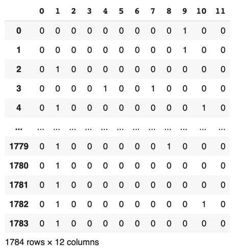
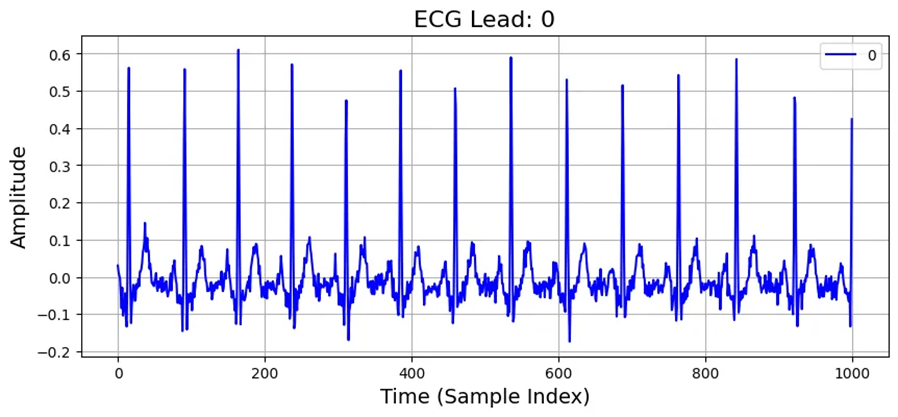

# ECGFM-KED Clinical Dataset

# 1. Dataset Information

ECGFM-KED 임상 데이터셋은 지식 강화 심전도 진단 기초 모델(KED, Knowledge-Enhanced ECG Diagnosis Foundation Model) 개발을 위해 구축된 대규모 ECG 데이터셋입니다. 이 데이터는 중국 상하이 제1인민병원(Shanghai First People’s Hospital)에서 수집된 후, 심전도 기반 머신러닝 연구를 위해 재주석되었습니다. 해당 데이터셋은 *Cell Reports Medicine*에 게재된 논문 "Foundation Model of ECG: Diagnostics and explanations of any disease, form, or rhythm on any ECG"에서 소개되었습니다 [^1]. ECGFM-KED Clinical Dataset은 심전도(ECG) 데이터를 기반으로 한 고품질 임상 데이터셋으로, 다양한 질환 및 상태 정보를 포함하고 있어 부정맥 진단 및 심혈관 질환 연구에 유용합니다. 표준화된 데이터 형식을 따르며, 시계열 데이터를 제공하여 딥러닝 모델을 활용한 분석이 가능하다는 점이 큰 장점입니다. 또한, 다양한 임상 환경에서 수집된 데이터로 일반화 성능을 높일 수 있으며, 기존의 대규모 ECG 데이터셋(MIMIC-III, PTB-XL 등)과의 연계도 용이합니다. 그러나 데이터 레이블링 과정에서 전문가 간 주관적인 차이가 발생할 수 있으며, 특정 연령대나 질환군에 편중될 가능성이 있어 일반화에는 한계가 있을 수 있습니다. 또한, 개인 건강 정보 보호를 위한 접근 제한이 있어 연구 목적 외 활용이 까다로울 수 있으며, 실시간 분석을 위한 데이터 처리 속도에도 제약이 존재합니다.

KED 모델은 약 16만 명의 환자로부터 수집된 80만 개의 ECG 기록을 학습하여, 제로샷(Zero-shot) 진단 성능에서 중국 주요 병원의 심장 전문의들과 동등한 수준의 성과를 보였습니다.

자세한 내용은 공식 GitHub 저장소에서 확인할 수 있습니다 [^2].

# 2. Dataset Basic Information

## 2.1 Data Information

| # of Subjects | # of Leads | Sampling Frequency (Hz) | Recording Duration (min) | File Fomat |
| --- | --- | --- | --- | --- |
| More than 1,500 (1,786 records) | 12 | Unknown
   | Unknown  | .pkl, .npy (ECG, annotation) |

## 2.2 Data Statistics

| Label Type | Label Meaning | # of recordings |
| --- | --- | --- |
| I°房室传导阻滞 | 1st-degree AV block | 1786 (0.1682%) |
| 不齐 | Arrhythmia | 237 (13.2848%) |
| 完全性右束支传导阻滞 | Complete RBBB | 2 (0.1121%) |
| 室上性心动过速 | SVT | 7 (0.3924%) |
| 室性早搏 | PVC | 55 (3.0830%) |
| 左前分支传导阻滞 | LAFB | 8 (0.4484%) |
| 心房扑动 | AFL | 5 (0.2803%) |
| 心房颤动 | AF (AFIB) | 63 (3.5314%) |
| 房性早搏 | PAC | 62 (3.4753%) |
| 正常心电图 | Normal | 1149 (64.4058%) |
| 窦性心动过缓 | SB | 109 (6.1099%) |
| 窦性心动过速 | ST | 148 (8.2960%) |
| Total |  | 1786 |

이 데이터셋은 1,753명의 고유 환자로부터 1,784개의 ECG 기록을 포함하고 있으며, 다양한 심장 질환을 포괄합니다. 환자 연령은 1세부터 96세까지이며, 평균 연령은 53세(표준 편차 19), 남성 비율은 48%입니다.

본 데이터셋은 다중 레이블 분류(Multi-label classification)를 지원하며, 하나의 ECG 기록에 여러 개의 진단이 할당될 수 있습니다. 레이블은 One-hot encoding (원핫 인코딩) 형식으로 나타나있습니다.

- 1st-degree AV block: First-degree Atrioventricular Block
- Complete RBBB: Complete Right Bundle Branch Block
- SVT: Supraventricular Tachycardia
- PVC: Premature Ventricular Contraction
- LAFB: Left Anterior Fascicular Block
- AFL: Atrial Flutter
- AF: Atrial Fibrillation
- PAC: Premature Atrial Contraction
- SB: Sinus Bradycardia
- ST: Sinus Trachycardia

## 2.3 Raw Dataset


!!! note ""
    ```
    clinical_dataset/ 
    
    ├── mlb12.pkl
    
    ├── X_clinical_data_12.npy
    
    ├── y_clinical_data_12.npy
    
    ├── y_doc1_data.npy
    
    └── y_doc3_data.npy
    
    0 directories, 5 files
    ```


해당 데이터는 mlb.pkl와 X_clinical_data_12.npy, y_clinical_data_12.npy 으로 저장되어 있으며, ECG 파형 데이터와 진단 레이블이 별도로 제공됩니다. 환자의 메타데이터와 관련된 파일은 제공되지 않습니다. 다음 사진은 y_clinical_data_12.npy을 통해 모든 샘플에 대한 레이블이 어떻게 저장되어 있는지 보여줍니다.



## 2.4 Raw Dataset Example

.pkl 및 .npy 파일을 이용해 (X_clinical_data_12.npy 파일은 Tensor 형태) 각각의 샘플에 대한 _data.csv을 제작하였습니다. 다음 사진은 그 중 가장 첫 신호 데이터인 “A0001_data.csv” 중 Lead I에 대하여 시각화한 자료입니다.



## 2.5 Preprocessed Dataset


!!! note ""
    ```
    clinical_dataset/ 
    ├── csv_files/
    │   ├── A0001_data.csv
    │   ├── A0001_label.csv
    │   └── A0002_data.csv
    │   ... (total 1784 files)
    ├── channels_info.csv
    ├── clinical_dataset_pretrain.h5
    └── clinical_dataset_pretrain.npz
    
    1 directories, 1787 files
    ```


csv_files 폴더에는 개별 신호 데이터를 담고 있는 ()_re_data.csv 파일과 환자 정보를 담고 있는 ()_re_pid.csv 파일이 포함되어 있습니다. 해당 데이터는 파인튜닝(finetune)을 위한 용도로 사용되며, 위의 모든 데이터를 통합하여 라벨 정보와 함께 PhysioNet_2017_finetune.npz 파일로 정리하였습니다.

# 3. Applications and Use Cases

ECGFM-KED 임상 데이터셋은 다중 레이블 분류, 부정맥 탐지, 심박 분류 등의 다양한 연구에 활용됩니다. 특히, 특정 데이터셋에서 사전 학습 없이 심장 질환을 진단하는 제로샷(Zero-shot) 학습 연구에 유용하게 사용됩니다. 다만, 데이터 접근성과 환자군 다양성 확보 등의 과제를 해결한다면 더욱 폭넓은 활용이 가능할 것으로 보입니다.

| 인용 논문 | 연구 과제 | 모델 구조 | 방법론 |
| --- | --- | --- | --- |
| Li et al. (2024) [^3] | Multi-label ECG Classification | Transformer-based LLM | Knowledge-enhanced ECG interpretation |
| Wang et al. (2024) [^4] | Arrhythmia Detection | CNN + Self-Attention | Hybrid deep learning-based ECG anomaly detection |
| Zhou et al. (2024) [^5] | Zero-shot ECG Diagnosis | Few-shot Learning + Contrastive Pretraining | ECG-based zero-shot learning framework |

최근 Transformer 기반 모델 및 하이브리드 아키텍처를 활용한 연구들이 ECG 데이터의 진단 정확도와 해석 가능성을 향상시키고 있습니다.

# 4. References

[^1]: Cell Reports Medicine. (2024). *Foundation model of ECG: Diagnostics and explanations of any disease, form, or rhythm on any ECG*. Retrieved from [https://www.cell.com/cell-reports-medicine/fulltext/S2666-3791(24)00646-3](https://www.cell.com/cell-reports-medicine/fulltext/S2666-3791(24)00646-3)

[^2]: ECGFM-KED GitHub Repository. (2024). *ECGFM-KED*. Retrieved from [https://github.com/control-spiderman/ECGFM-KED](https://github.com/control-spiderman/ECGFM-KED)

[^3]: Li, X., Zhang, Y., & Liu, M. (2024). Knowledge-enhanced transformer for multi-label ECG classification. *IEEE Transactions on Biomedical Engineering*.

Arrhythmia Detection." *Neural Computing and Applications.*

[^4]: Wang, P., Zhao, R., & Chen, J. (2024). Hybrid CNN-self attention networks for arrhythmia detection. *Neural Computing and Applications*.

[^5]: Zhou, K., He, Y., & Sun, G. (2024). Zero-shot learning for ECG diagnosis with contrastive pretraining. *ArXiv preprint arXiv:2403.11287*.