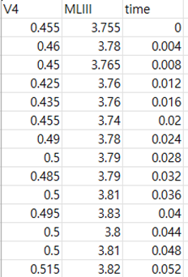
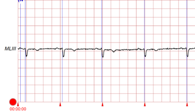
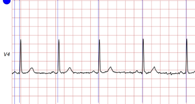

# 1. Dataset Information

European ST-T Database는 심근 허혈의 ECG 표현을 연구하고, ST 및 T 파형 변화 분석 알고리즘의 개발 및 평가를 위해 설계된 전문적으로 주석이 달린 데이터셋입니다. 이 데이터베이스는 79명의 피험자로부터 수집된 90개의 2시간 분량의 ECG 기록을 포함하고 있습니다. 각 피험자는 심근 허혈이 진단되었거나 의심되는 상태였습니다. 추가적인 선택 기준을 통해 고혈압, 심실 운동 이상, 약물 영향 등으로 인한 기저 ST 분절 변위를 포함한 다양한 ECG 이상을 대표적으로 포함하도록 구성되었습니다.

# 2. Dataset Basic Information

## 2.1 Data Information

| # of Leads | Sampling Frequency | Recording Duration | File Format |
| --- | --- | --- | --- |
| 2 | Fixed 250 Hz | 2h | .dat(ecg) .atr (annotation) .hea (Metadata) |

## 2.2 Label distribution

Rhythm

| **Type** | **# recording** | **Propotion(%)** |
| --- | --- | --- |
| Normal (N) | 753,676 | 97.75 |
| Noisy (~) | 8580 | 1.11 |
| Ventricular beat (V) | 4448 | 0.58 |
| Aberrant ventricular conduction (T) | 1293 | 0.17 |
| Supraventricular beat (S) | 1061 | 0.14 |
| Fusion beat (F) | 354 | 0.05 |
| Paced beat (+) | 688 | 0.09 |
| Other | 215 | 0.03 |

ST/T

| **Type** | **# recording** | **Propotion(%)** |
| --- | --- | --- |
| TO+ | 126 | 15.67 |
| ST1- | 122 | 15.17 |
| STO- | 118 | 14.68 |
| T1- | 89 | 11.07 |
| T1+ | 84 | 10.45 |
| TO- | 74 | 9.20 |
| STO+ | 60 | 7.46 |
| ST1+ | 51 | 6.34 |
| T1++ | 29 | 3.61 |
| TO++ | 27 | 3.36 |
| TO-- | 14 | 1.74 |
| T1-- | 9 | 1.12 |
| TS | 1 | 0.12 |

## 2.3 Raw Dataset

!!! note ""
     europrean_st_t_database/
    ├── •	.atr
    ├── •	.dat
    └──  •	.hea
    1directories,  270files

이 데이터셋의 ECG 신호는 두 개의 리드를 사용하여 기록되었으며, 시간에 따른 신호 변화를 포함합니다. 다음과 같은 파일이 포함되어 있습니다:
- .atr: 주석이 포함된 파일
- .dat: 신호 데이터 제공
- .hea: 메타데이터 파일 제공

## 2.4 Preprocessed Dataset

!!! note ""
     europrean_st_t_databas/
     ├── •	record number_annotations.csv
    ├── •	record number_rhythm_changes.csv
    └──  •	record number_st_t_changes.csv
      
    1 directories, 270files

위의 원본 파일을 로드 해서 다음과 같은 포맷으로 다시 저장했습니다.
- annotations.csv: 비트(beat) 주석이 포함된 파일
- rhythm_changes.csv: 리듬 변화 정보 제공
- st_t_changes.csv: ST-T 변화 기록 포함

위는 csv로 저장된 신호의 예시와 이를 시각화 한 파일입니다.

# 3. Applications and Use Cases

데이터셋의 활용
European ST-T Database는 ST-T 세그먼트 변화 감지 및 분석을 위한 연구에 널리 사용되고 있으며, 심근 허혈 및 기타 심장 이상을 탐지하는 머신러닝 모델 개발에 중요한 역할을 합니다.
- 데이터셋의 활용 및 응용 분야

| Citation | Prediction task | Architectures | Unique Methodology |
| --- | --- | --- | --- |
| Yin et al.(2024) | Detection and classification of ST-T segment changes | CNN+LSTM | Multitask Learning(MTL) |

Yin et al. (2024) 연구에서는 CNN+LSTM 아키텍처를 사용하여 ST-T 세그먼트 변화를 탐지하고 분류하는 모델을 개발하였으며, Multi-task Learning(MTL) 방식을 도입하여 모델 성능을 최적화하였습니다.

# 4. References

1. Yin, Ziyi, Wenjie Cai, and Mingjie Wang. "Optimizing ST-Segment classification in ECG using multi-task learning." *Biomedical Signal Processing and Control* 96 (2024): 106591.
