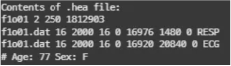
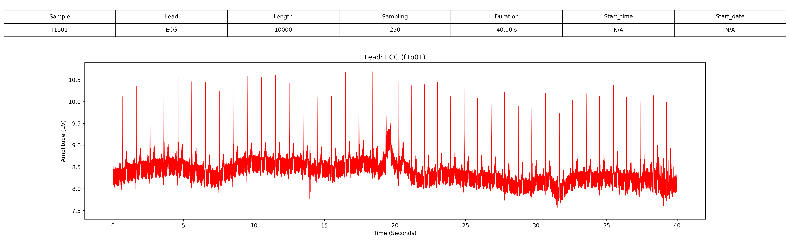
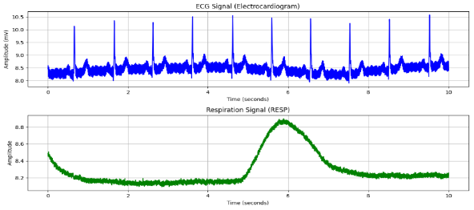

# 1. Dataset Information

Fantasia database는 두 개의 연령 그룹에서 선별된 건강한 참가자 40명의 장기간 생리 신호 기록을 포함하며, 심박 변동성(HRV), 자율신경 기능, 노화 관련 심장 역학 연구를 지원하기 위해 설계되었습니다. 피험자들은 디즈니 영화 “*Fantasia (1940)*”를 시청하며 지속적인 안정 상태를 유지하는 상태에서 기록이 수집되었습니다.

# 2. Dataset Basic Information

## 2.1 Data Information

| # of Subjects | # of Leads | Sampling Frequency (Hz) | Recording Duration (min) | File Fomat |
| --- | --- | --- | --- | --- |
| 144399 records | 3 (ECG/RESP/BP) | Fixed 250 Hz | 2 hour | (ECG/RESP/BP).dat/(ECG).ecg/(ECG/RESP/BP).hea |

## 2.2 Data Statistics

| Label Type | # of recordings | Time length (s) - Mean | Time length (s) - Standard Deviation |
| --- | --- | --- | --- |
| S | 0.42% (607/144399) | 30.35 | 77.12 |
| r | 0.30% (430/144399) | 21.50 | 90.33 |
| V | 0.25% (360/144399) | 18.00 | 55.51 |
| + | 0.04% (58/144399) | 2.90 | 6.63 |
| N | 98.22% (141822/144399) | 7091.1 | 1033.82 |
| Q | 0.02% (28/144399) | 1.4 | 6.08 |
| s | 0.10% (144/144399) | 7.2 | 19.78 |
| ? | 0.66% (950/144399) | 48 | 14.91 |

- S : Supraventricular premature or ectopic beat (atrial or nodal)
- r : R-on-T premature ventricular contraction
- V : Premature ventricular contraction
- + : Rhythm Change Annotation
- N : Normal Beat
- Q : Unclassifiable Beat
- s : ST segment change
- ? : Beat not classified during learning

## 2.3 Raw Dataset

!!! note ""
    ```
    ├── Fantasia_Database/
    │   ├── ANNOTATORS
    │   ├── RECORDS
    │   ├── SHA256SUMS.txt
    │   ├── f1o01.dat
    │   ├── f1o01.ecg
    │   ├── f1o01.hea
    │   ├── f1o02.dat
    │   ├── f1o02.ecg
    │   ├── f1o02.hea
    │   ├── f1o03.dat
    │   └── ... (125 파일, 각각 .dat + .hea + .ecg 세트)
    │       ├── subset/
    │       │   ├── ANNOTATORS
    │       │   ├── O1.txt
    │       │   ├── O2.txt
    │       │   ├── O3.txt
    │       │   ├── O4.txt
    │       │   ├── O5.txt
    │       │   ├── RECORDS
    │       │   ├── Y1.txt
    │       │   ├── Y2.txt
    │       │   ├── Y3.txt
    │       │   └── ... (36 파일)
    │       │       ├── heartbeat/
    │       │       │   ├── O1.txt
    │       │       │   ├── O2.txt
    │       │       │   ├── O3.txt
    │       │       │   ├── O4.txt
    │       │       │   ├── O5.txt
    │       │       │   ├── README
    │       │       │   ├── Y1.txt
    │       │       │   ├── Y2.txt
    │       │       │   ├── Y3.txt
    │       │       │   ├── Y4.txt
    │       │       │   └── ... (11 파일)
    3 directories, 약 202 files
    ```



헤더 파일은 ECG 기록에 대한 메타데이터를 제공합니다. 

- 첫 번째 줄: 환자 번호(f1o01), 두 개의 기록된 채널(ECG 및 RESP), 샘플링 주파수 250 Hz, 총 18,129,093개의 샘플.
- 두 번째 및 세 번째 줄: - RESP(호흡 신호) 및 ECG(심전도 신호)는 f1o01.dat 파일에 16비트 형식(코드 16)으로 기록됨, 2000 µV/LSB의 ADC gain. - ADC 기준값 및 신호의 최소/최대 진폭도 제공됨.
- 네 번째 줄: 환자 정보, 나이(77세), 성별(F, 여성).

## 2.4 Raw Dataset Example



환자의 정보와 신호 데이터 시각화의 예시입니다. 

## 2.5 Preprocessed Dataset

!!! note ""
    ```
    ├── fantasia/
    │   ├── channel_info.csv
    │   ├── fantasia_pretrain.npz
    │   ├── fantasia_pretrain_record_ids.csv
    │       ├── csv_files/
    │       │   ├── f2o01_data.csv
    │       │   ├── f2o01_label.csv
    │       │   ├── f2o02_data.csv
    │       │   ├── f2o02_label.csv
    │       │   ├── f2o03_data.csv
    │       │   ├── f2o03_label.csv
    │       │   ├── f2o04_data.csv
    │       │   ├── f2o04_label.csv
    │       │   ├── f2o05_data.csv
    │       │   ├── f2o05_label.csv
    │       │   └── ... (40 파일)
    2 directories, 약 53 files
    ```

이 시각화 자료는 Fantasia database의 환자 f1o01에 대한 10초 동안의 심전도(ECG) 및 호흡(RESP) 데이터를 보여줍니다. 해당 기록은 두 개의 신호(ECG 및 RESP)로 구성되며, 250 Hz로 샘링플 되었습니다.



# 3. Applications and Use Cases

Fantasia database는 심박 변이성(HRV) 분석, ECG 기반 호흡(EDR) 추정, 생체 인증, ECG 분할, QRS 검출 등의 연구에서 폭넓게 활용되고 있습니다. 아래 표는 해당 데이터베이스를 활용한 주요 연구들의 연구 과제, 모델 구조, 및 방법론을 요약한 것입니다.

Fantasia database를 활용한 연구들은 HRV 분석 및 노화 연구에 중요한 기여를 했으며,[1] 특히 심장 활동의 연령 관련 변화를 이해하는 데 큰 역할을 했습니다. 또한 생체 인증, ECG 신호 분할 및 QRS 검출 연구에서도 유용하게 사용되었으며,[3],[4],[5] 고해상도 신호 덕분에 보다 정교한 분석이 가능했습니다. ECG 기반 호흡(EDR) 추정 기법 또한 이 데이터베이스를 활용해 개선되었으며,[2] 실시간 모니터링 및 생리 신호 처리 기술 발전에 기여했습니다. Fantasia database는 딥러닝, 임상의료 진단, 건강 모니터링 기술에서 핵심적인 연구 자원으로 자리 잡고 있습니다.

| 인용 논문 | 연구 과제 | 모델 구조 | 방법론 |
| --- | --- | --- | --- |
| Iyengar et al. (1996) [1] | HRV 분석 및 노화 영향 연구 | 프랙탈 스케일링 분석 | 프랙탈 스케일링 기법을 사용하여 노화에 따른 HRV 변화 연구 |
| Brown & Arunachalam (2009) [2] | ECG 기반 호흡(EDR) 추정 | 신호 처리 | ECG 신호로부터 실시간 호흡 추정을 위한 알고리즘 개발 |
| Fratini et al. (2013) [3] | ECG 기반 생체 인증 | 형태 분석 | ECG 형태 분석을 활용한 개인 식별 기법 제안 |
| Niroshana et al. (2023) [4] | ECG 신호 분할 | 적응형 윈도잉 & 심층신경망(DNN) | 적응형 딥러닝 기법을 활용한 비트 단위 ECG 신호 분할 |
| Modak et al. (2021) [5] | QRS 검출 | 다중 임계값 분석 | 강건한 QRS 검출을 위한 새로운 적응형 임계값 알고리즘 개발 |

# 4. References

[1] Iyengar N, Peng C-K, Morin R, Goldberger AL, Lipsitz LA. Age-related alterations in the fractal scaling of cardiac interbeat interval dynamics. Am J Physiol 1996;271:1078-1084.

[2] Brown, Lewis F., and Shivaram P. Arunachalam. "Real-time estimation of the ECG-derived respiration (EDR) signal." *Biomed Sci Instrum* 45 (2009): 59-64.

[3] Fratini, Antonio, et al. "Individual identification using electrocardiogram morphology." *2013 IEEE International Symposium on Medical Measurements and Applications (MeMeA)*. IEEE, 2013.

[4] Niroshana, SM Isuru, et al. "Beat-wise segmentation of electrocardiogram using adaptive windowing and deep neural network." *Scientific Reports* 13.1 (2023): 11039.

[5] Modak, Sudipta, Esam Abdel-Raheem, and Luay Yassin Taha. "A novel adaptive multilevel thresholding based algorithm for QRS detection." *Biomedical Engineering Advances* 2 (2021): 100016.
