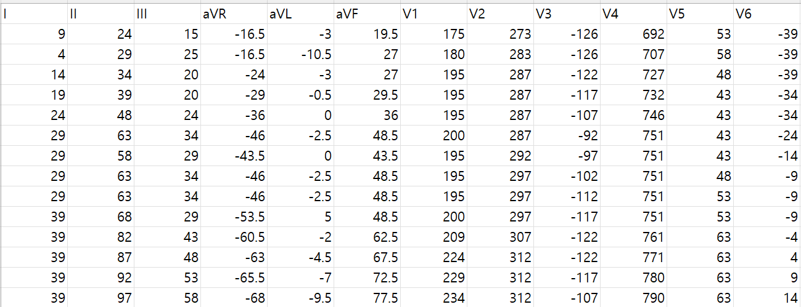

# IKEM ECG Dataset

# 1. Dataset Information

IKEM ECG 데이터셋은 체코 프라하에 위치한 임상 및 실험 의학 연구소(IKEM)에서 수집된 98,130건의 12-리드 심전도(ECG) 기록과 30,290명의 환자 데이터를 포함하고 있습니다. 각 심전도는 500Hz 샘플링 속도와 16비트 해상도(4.88 µV)로 10초간 기록되었습니다. 저장 공간을 최적화하기 위해 리드 III와 중복된 보강 리드를 제거하여 데이터 크기를 약 60% 줄였으며, HDF5 형식으로 저장된 8개의 리드 신호는 모델 입력 시 원래의 12리드 형태로 복원할 수 있습니다. 데이터셋에는 익명화된 환자 ID가 포함되어 있어 환자 단위의 종단적 연구가 가능하며, CSV 파일 형태의 메타데이터도 제공됩니다. 이 데이터셋은 부정맥 검출, 심전도 신호 분석 등 다양한 심혈관 연구에 활용될 수 있습니다

# 2. Dataset Basic Information

## 2.1 Data Information

| # of Leads | Sampling Frequency | Recording Duration | File Format |
| --- | --- | --- | --- |
| 12 | Fixed 500 Hz | 10 seconds | Exams.csv(metadata)
Exams.hdf5(signal) |

## 2.2 Raw Dataset


!!! note ""
    ```
    ikem_dataset/
    
    ├── •	Exams.csv	
    
    └── •    ****Exams.hdf5
    
    1directories,  2 files
    ```


IKEM 데이터셋에는 익명화된 환자 ID와 환자별 메타데이터가 포함되어 있으며, ECG 신호는 HDF5 형식으로 저장되어 있습니다. 

## 2.3 Preprocessed Dataset


!!! note ""
    ```
    ikem_dataset/ 
    
    └──  •	record number_data.csv
      
    
    1 directories, 98130files
    ```


해당 hdf5을 로드하여 8lead로 축소된 데이터를 12lead로 복원후  record별로 csv로 저장



위는 csv로 저장된 신호의 예시입니다.

# 3. Applications and Use Cases

IKEM ECG Dataset은 AI 기반 심전도 분석 모델 개발 및 검증에 중요한 역할을 하며, 다양한 심혈관 연구에 활용될 수 있습니다. 주요 응용 분야는 다음과 같습니다:

- 다중 클래스 심장 질환 분류 (Multi-class ECG Disease Classification)
- 심장 나이 예측 (Heart Age Estimation)
- 자기 지도 학습(Self-Supervised Learning, SSL) 기반 ECG 표현 학습
- 부정맥 및 기타 심장 이상 탐지

| Citation | Prediction task | Architectures | Unique Methodology |
| --- | --- | --- | --- |
| Song et al. (2024) | Multi-class ECG Disease Classification,
Heart Age Estimation from ECG | Hybrid Self-Supervised Learning
based Foundation model | Self-supervised Learning based ECG model
 |

이 데이터셋을 활용한 연구중 하나인 Song et al. (2024) 연구에서는 Hybrid Self-Supervised Learning 기반 ECG Foundation Model을 구축하여 다중 클래스 심장 질환 분류 및 심장 나이 예측을 수행하였습니다.

# 4. References

[^1]: Song, Junho, et al. "Foundation Models for ECG: Leveraging Hybrid Self-Supervised Learning for Advanced Cardiac Diagnostics." *arXiv preprint arXiv:2407.07110* (2024).