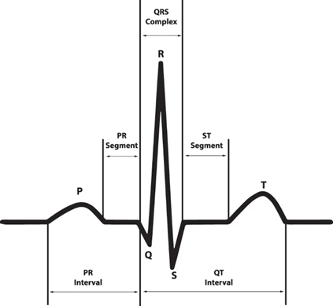

# ECG Dataset

# 1. 서론

최근 센서 기술의 발전과 디지털 헬스케어 솔루션의 확산으로 인해 다양한 생체전기신호 데이터를 대규모로 수집할 수 있게 되었습니다. 특히, 심전도(ECG) 신호는 심혈관 질환의 진단과 관리에서 핵심적인 역할을 하며, 임상 환경에서 기록된 표준 12‑리드 ECG 데이터는 심장 질환을 조기에 발견하고 정확하게 진단하는 데 중요한 정보를 제공합니다. 이를 기반으로 개발된 인공지능(AI) 알고리즘은 환자 모니터링 및 치료 결정 지원에 혁신적인 기여를 하고 있습니다.

그러나 생체전기신호를 활용한 AI 연구에서는 여러 가지 공통적인 도전 과제가 존재합니다. 첫째, 고품질 라벨링이 적용된 ECG 데이터셋을 확보하는 데 많은 비용과 시간이 소요되므로 라벨 데이터의 부족 문제가 심각합니다. 둘째, 센서 한계, 환경 요인, 개인의 생리적 차이 등으로 인해 ECG 신호는 본질적으로 잡음이 많고 신호 대 잡음비가 낮으며, 높은 변동성을 보입니다. 셋째, 특정 임상 환경에서 수집된 데이터를 기반으로 학습된 모델은 다른 환경이나 피실험자 집단에 대해 일반화하는 데 한계를 가집니다. 이러한 문제는 신뢰할 수 있는 AI 진단 시스템의 개발과 상용화에 있어 큰 장애 요소로 작용합니다.
이러한 배경에서 고품질 ECG 데이터셋의 중요성이 더욱 부각되고 있습니다. 예를 들어, PTB‑XL 데이터셋은 18,869명의 환자로부터 총 21,799개의 임상 기록을 포함하고 있으며, 각 기록은 10초 길이의 12‑리드 신호와 최대 71개의 표준화된 임상 주석을 제공합니다. 이를 활용한 연구에서는 심근경색, 부정맥, 전도 이상, 심장 비대 등 다양한 심장 질환에 대한 자동 분류 및 진단 알고리즘이 개발되었으며, 실제 임상 환경에서 빠르고 정확한 의사결정 지원 시스템으로 발전하고 있습니다.

또한, 최근 비대면 진료 및 원격 모니터링의 필요성이 증가함에 따라, 원격 ECG 모니터링 시스템이 활발히 연구되고 있습니다. 일부 의료기관에서는 이상치 탐지 기반의 알고리즘을 적용하여 환자의 심장 이상 징후를 실시간으로 감지하고, 비대면 재진 진료 시 신속한 대응을 가능하게 하고 있습니다. 정부와 관계 부처에서도 디지털 치료기기 및 AI 의료기기에 대한 보험 적용 가이드라인을 마련하는 등, 고품질 ECG 데이터셋을 활용한 연구의 사회적·경제적 파급 효과가 매우 크다는 점이 입증되고 있습니다.

본 백서는 AI 연구자, 임상의, 의료기기 개발자 등 심전도 데이터를 활용하여 혁신적인 진단 및 모니터링 솔루션을 개발하고자 하는 전문가를 대상으로 합니다. ECG 데이터셋의 상세 개요, 데이터 구성 및 특성을 설명하고, 실제 활용 사례와 시각화 자료를 제공하며, 전이 학습 및 Few‑Shot 학습 등 최신 기술 적용 사례를 종합적으로 소개합니다.

# 2. **ECG 데이터 설명**

ECG(심전도, Electrocardiogram)는 심장의 전기적 활동을 기록하는 기술로, 심장이 수축하고 이완하는 과정에서 발생하는 전기 신호를 감지하여 그래프로 표현합니다. 심장은 자율적으로 전기적 신호를 생성하고 이를 전도계를 통해 전달하며, 이 과정에서 심방과 심실이 주기적으로 수축하고 이완하여 혈액을 순환시킵니다.

전기적 신호는 피부 표면에 부착된 전극을 통해 감지할 수 있으며, ECG는 이를 기록하여 특정 심장 질환의 유무를 평가하는 데 사용됩니다. 정상적인 심장 리듬을 유지하는 경우 일정한 패턴(P-QRS-T 복합체)이 나타나지만, 부정맥, 심근경색, 전도 장애 등의 이상이 있을 경우 해당 신호가 비정상적으로 변형됩니다.

이러한 ECG 데이터를 수집할 때는 대부분 다음과 같은 특징들을 반영하여 수집합니다.

## 2.1 **Lead (리드)와 전극 배치**

ECG 신호는 몸에 부착된 여러 개의 전극(electrode)을 통해 측정됩니다. 전극 간의 전위 차이를 계산한 것이 lead(리드)이며, 몇 개의 리드를 사용하느냐에 따라 ECG 측정 방식이 구분됩니다.

- **12-lead ECG (표준 12유도 심전도)**
    - 병원에서 가장 일반적으로 사용되는 방식으로, 총 10개의 전극을 부착하여 12개의 리드 신호를 생성
    - 전극 배치: 양쪽 팔(오른팔, 왼팔)과 왼쪽 다리에 3개의 전극 가슴 부위(V1~V6)에 6개의 전극
    - 사용 목적: 심장 질환 진단(부정맥, 심근경색, 전도 이상 등)
- **Single-lead ECG (단일 유도 심전도)**
    - 웨어러블 기기(스마트워치, 패치형 센서)에서 주로 사용되며, 1개의 리드 신호만 기록
    - 전극 배치: 보통 손목, 가슴, 손가락 등의 부위에 부착됨
    - 사용 목적: 부정맥 감지(심방세동 등)
- **3-lead, 6-lead ECG**
    - 3-lead: 응급 의료 및 휴대용 장치에서 사용, 기본적인 심전도 모니터링 가능
    - 6-lead: 일부 웨어러블 의료 기기에서 제공하며, 12-lead에 비해 더 정밀한 분석 가능
    

이 외에도 데이터셋들은 수집 목적에 따라 각기 다른 lead 수를 가지고 있습니다.

## 2.2 Duration **(측정 시간, 기록 길이)**

ECG 데이터는 기록하는 시간에 따라 크게 두 가지 유형으로 나뉩니다.

- **단기(Short-term ECG, 일반적으로 10~30초)**
    - 병원에서 수행하는 **표준 12-lead ECG**는 보통 **10초에서 30초** 동안 기록됨
    - 심전도 파형의 순간적인 변화를 확인하여 심장 질환을 진단하는 용도로 사용
- **장기(Long-term ECG, 수 시간~수 일)**
    - 홀터 모니터(Holter monitor): 24~48시간 연속 기록
    - 패치형 ECG: 1주일 이상 지속적으로 측정 가능
    - 웨어러블 기기(스마트워치, 패치 센서): 심방세동 감지 등의 목적으로 장기간 데이터 기록

## **2.3 Sampling Frequency (샘플링 주파수, 신호 해상도)**

ECG 신호는 아날로그 형태로 기록되며, 디지털 데이터로 변환할 때 일정 주기로 샘플링됩니다. **샘플링 주파수**(sampling frequency)는 초당 몇 개의 샘플을 저장하는지를 나타내며, 단위는 보통 Hz(헤르츠) 입니다.

- **저해상도(100~250Hz)**
    - 웨어러블 기기 및 일부 원격 모니터링 시스템에서 사용
    - 기본적인 심장 리듬 분석 가능하지만, 정밀한 파형 분석에는 한계
- **표준 의료용(500~1,000Hz)일)**
    - 대부분의 병원 ECG 기기에서 사용되는 범위
    - P-QRS-T 파형 분석이 가능하고, 심장 질환 진단에 충분한 해상도를 제공

## **2.4 P-QRS-T 복합체 (ECG 신호의 기본 구성 요소)**

ECG 데이터는 **P-QRS-T 복합체**라고 불리는 일정한 패턴을 가집니다. 각 부분은 심장의 전기적 활동을 반영하며, 정상 심장 박동과 이상 신호를 구별하는 중요한 요소입니다.

- **P파 (P-wave):** 심방의 전기적 신호(탈분극) → 심방 수축을 의미
- **QRS 복합체 (QRS complex):** 심실의 전기적 신호(탈분극) → 심실 수축을 의미
- **T파 (T-wave)**: 심실이 다시 전기적 안정 상태로 돌아가는 과정(재분극)

추가로,

- **PR 간격:** P파 시작부터 QRS 시작까지의 시간 → 전도 장애 평가
- **QT 간격:** QRS 시작부터 T파 끝까지의 시간 → 심실 재분극 이상 평가

ECG 분석에서는 **QRS 복합체의 폭과 높이**, **ST 분절의 변동** 등을 기반으로 **부정맥, 심근경색, 전도 이상**을 판단할 수 있습니다.

## **2.5 Annotation (주석, 라벨링 정보)**

AI 모델을 학습하기 위해 많은 ECG 데이터셋에는 다양한 주석 정보가 포함됩니다. 대표적인 주석 유형은 다음과 같습니다.

- **부정맥(Arrhythmia) 진단 레이블**
    - 정상 박동(Normal)
    - 심방세동(Atrial fibrillation, AF)
    - 심실빈맥(Ventricular tachycardia, VT)
    - 심방 조기 박동(Atrial premature contraction, APC)
    - 심실 조기 박동(Ventricular premature contraction, VPC)
- **박동(Beat) 유형 라벨링**
    - 개별 심장 박동에 대해 **정상(N), 조기 심실 수축(V), 심방 조기 수축(A)** 등으로 분류
- **ST 분절 및 QT 간격 이상**
    - **ST 상승(ST-elevation)**: 심근경색 가능성
    - **QT 연장(QT prolongation)**: 돌연사 위험 평가
- **리듬(Rhythm) 정보**
    - 정상 동리듬(Normal sinus rhythm, NSR)
    - 심방세동(Atrial fibrillation, AF)
    - 심실 빈맥(Ventricular tachycardia, VT)

이와 같은 공통적인 특성을 바탕으로 다양한 ECG 데이터셋이 존재하며, 각 데이터셋은 리드 개수, 측정 시간, 샘플링 주파수, 주석 유형 등에 따라 차이를 가집니다.

# 3. **ECG 연구 동향**

센서 기술의 발전과 웨어러블 기기의 대중화로 인해 ECG(심전도) 신호를 비롯한 생체전기신호가 대규모로 축적되면서, 이를 활용한 AI(인공지능) 기반 분석이 의료 및 디지털 헬스케어 분야의 핵심 기술로 자리 잡고 있습니다. 특히, 심혈관 질환은 세계적으로 주요 사망 원인 중 하나로, 심전도 신호의 자동 분석과 진단 알고리즘의 임상 적용이 학계와 산업계에서 중요한 연구 과제로 떠오르고 있습니다. 기존에는 전통적인 신호처리 기법을 통해 QRS 복합 검출, RR 간격 측정, 주파수 분석 등을 수행하였으나, 최근에는 딥러닝 기반의 학습 기법이 빠르게 확산되고 있습니다.

## **3.1 전통적 ECG 분석과 딥러닝으로의 전환**

과거에는 Pan–Tompkins 알고리즘과 같은 전통적인 신호처리 기법을 활용하여 QRS 콤플렉스를 탐지하고, 피크 높이·폭, RR 간격, ST 분절 변화 등의 특징을 추출한 후, 이를 SVM이나 k-NN과 같은 분류기에 입력하는 방식이 사용되었습니다. 이러한 접근법은 설명 가능성이 높고 구현이 용이하다는 장점이 있으나 다음과 같은 한계를 가지고 있습니다.

1. 노이즈나 움직임 아티팩트(전극 접촉 불량, 신체 움직임 등)에 취약함
2. 환자별 ECG 파형의 편차가 커서 일반화가 어려움
3. 대규모 데이터에서 수작업으로 특징을 정의하고 확장하는 데 한계가 있음

이후, MIT-BIH Arrhythmia, PTB Diagnostic ECG, PTB-XL 등의 대규모 공개 데이터셋이 등장하면서, 전통적인 방식 대신 CNN, RNN, Transformer 등의 딥러닝 모델을 직접 ECG 파형에 적용하여 자동으로 특징을 추출하는 연구가 활발히 진행되고 있습니다.

- **CNN**: 시계열 상의 패턴을 효과적으로 식별하여 QRS 복합, 이상파 등을 탐지하는 데 유용함
- **RNN/LSTM**: 시간 순서 관계를 학습하여 리듬 이상 및 박동 간 변이를 포착함
- **Transformer 기반 모델**: 병렬적 주의(attention) 메커니즘을 활용하여 긴 시계열에서도 다양한 길이의 상관성을 학습함

딥러닝 모델을 활용하면 P파, QRS 콤플렉스, T파 구간뿐만 아니라 잡음 속에서도 미묘한 임상적 징후를 추론할 수 있어, 심방세동(AF), 심실성 빈맥(VT), 심근경색(MI) 등 다양한 심장 질환을 한 모델로 진단하는 연구가 지속적으로 확대되고 있습니다.

## **3.2 학계 및 산업계 동향**

### **3.2.1 학계 동향**

AI 기반 ECG 분석 연구는 지속적으로 발전하고 있으며, 특히 CNN 및 Transformer 모델을 활용한 심장 질환 조기 예측 및 진단 연구가 활발히 진행되고 있습니다. AI 모델이 심전도 데이터에서 이상 징후를 감지하는 정확도가 전문의 수준에 도달했다는 연구 결과도 보고되고 있습니다.

주요 응용 분야로는 부정맥 감지, 심부전 예측, 개인 맞춤형 위험 평가 등이 있으며, 심전도와 심초음파, 전자의무기록(EHR)을 결합한 머신러닝 모델을 통해 심혈관 질환을 더욱 정밀하게 예측하는 연구가 진행되고 있습니다.

### **3.2.2 산업계 동향**

AI 기반 ECG 분석 기술은 웨어러블 기기 및 원격 건강 모니터링 시스템을 중심으로 빠르게 발전하고 있습니다. Apple, Fitbit, Withings 등의 스마트워치뿐만 아니라, AliveCor KardiaMobile과 같은 의료 등급 웨어러블 기기가 심전도 기반 건강 관리를 지원하고 있습니다.

병원 및 의료 기관에서도 AI 기반 ECG 분석을 활용하여 심혈관 질환 조기 발견 및 심장 리듬 이상 감지 시스템을 도입하고 있으며, GE Healthcare, Philips, Medtronic 등은 AI 기반 ECG 판독 시스템을 개발하고 있습니다. 또한, Cardiologs와 [Eko.ai](http://eko.ai/) 같은 스타트업들은 클라우드 기반 ECG 분석 서비스를 제공하며, 보다 확장 가능한 ECG 진단 솔루션을 구현하고 있습니다.

### **3.2.3 ECG 기반 AI의 미래 전망**

차세대 AI 모델은 자기지도학습과 다중 모달 분석(ECG + 임상 정보)을 결합한 Transformer 모델을 활용하여 더욱 정밀한 분석을 가능하게 할 것으로 기대됩니다. 또한, IoT 기술과 원격 의료 서비스가 확산되면서, AI 기반 ECG 분석이 실시간 환자 모니터링과 조기 개입에 핵심 역할을 할 것으로 전망됩니다.

AI 기반 ECG 분석 기술의 발전은 심장 질환 진단의 정확도를 향상시키고, 의료 현장에서 신뢰성 있는 자동화 진단 시스템을 구축하는 데 기여할 것입니다.

# 4. **ECG 데이터셋의 정제 및 활용 방안**

## **4.1 Preprocessing 방법**

ECG 데이터는 다양한 데이터셋에서 수집되며, 샘플링 주파수, 기록 길이, 채널(Lead) 수 등에서 차이가 존재합니다. 이러한 차이를 효과적으로 처리하기 위한 전처리(Preprocessing) 기법이 필요하며, 주요 방법은 다음과 같습니다.

### **4.1.1 Sampling Frequency 및 Duration 통일**

ECG 데이터셋마다 샘플링 주파수(ex: 250Hz, 300Hz, 500Hz)와 기록 길이(duration, ex: 10초~24시간 이상)가 다릅니다. 이를 일관된 형태로 맞추기 위해 다음과 같은 방법이 사용됩니다.

- **Resampling**: 학습 시 일관된 샘플링 레이트를 기준으로 상향 또는 하향 샘플링을 수행하여 신호를 변환
- **Uniform Segmenting**: 다양한 길이의 기록을 짧은 시간 단위(예: 10초, 30초 등)로 분할하여 일정한 크기의 입력 데이터로 변환
- **Zero Padding**: 짧은 신호의 길이를 긴 신호와 일치시키기 위해 신호의 끝부분에 0을 추가하는 방식

이러한 전처리 과정을 거치면 서로 다른 데이터셋을 통합하여 일관된 입력 형태로 모델을 학습할 수 있습니다.

### **4.1.2 채널 수(Lead) 차이에 따른 처리**

ECG 데이터는 단일 채널(Lead I)에서 12-Lead까지 다양한 구성을 가질 수 있습니다. 이를 고려하여 데이터셋을 정리하는 방식은 다음과 같습니다.

- **공통 Lead 추출**: 다중 리드를 포함한 데이터셋을 통합하여 학습할 때, 공통적으로 존재하는 특정 Lead(I, II 등)만을 선택하여 모델에 입력
- **Lead Reconstruction**: 일부 Lead 정보가 없는 경우, 기존 Lead 데이터를 활용하여 누락된 Lead를 예측하는 방법

### **4.1.3 Noise Filtering**

ECG 신호에는 전극 접촉 불량, 근육 잡음, 기기 노이즈 등이 포함될 수 있으며, 이를 제거하기 위한 필터링이 필요합니다.

- **Bandpass Filter**: ECG 신호가 포함된 특정 주파수 대역(예: 0.5Hz~40Hz)을 유지하고, 나머지 노이즈 성분을 제거하는 필터 적용
- **Adaptive Filtering**: 환자 상태 및 측정 환경에 따라 변하는 노이즈를 동적으로 제거하는 기법

### **4.1.4 Normalization & Imputation**

- **Normalization**: 데이터셋 간 신호의 진폭 차이를 보정하여 학습 안정성을 높이는 기법 (예: Min-Max Scaling, Z-score Normalization)
- **Imputation**: 일부 결측치가 존재하는 경우, Linear/Cubic Spline Interpolation과 같은 방법을 활용하여 보완

## **4.2 통합 활용 방안**

### **4.2.1 단일 모델 학습**

전처리 과정을 거친 다양한 ECG 데이터셋을 통합하여 하나의 단일 모델을 학습할 수 있습니다. 이를 통해 일반화 성능을 향상할 수 있으나, 원본 데이터 간의 차이가 클 경우 성능 저하 가능성이 있어 신중한 조정이 필요합니다.

### **4.2.2 Transfer Learning**

사전 학습된 ECG 분석 모델을 활용하여 새로운 데이터셋에서 추가 학습하는 방법입니다. 소규모 데이터셋에서도 높은 성능을 낼 수 있으며, 특정 질환 감지를 위한 추가적인 미세 조정(fine-tuning)이 가능합니다.

### **4.2.3 Foundation Model**

Foundation Model은 대규모 ECG 및 생체신호 데이터를 Self-supervised Learning 방식으로 학습한 후, 다양한 의료 및 헬스케어 관련 downstream task에 활용할 수 있는 초거대 모델입니다. 다양한 ECG 데이터셋을 활용하여 구축된 모델은 심장질환 감지뿐만 아니라 다중 생체 신호 분석에도 적용될 가능성이 큽니다.

## **4.3 Downstream Task**

### **4.3.1 Arrhythmia Detection (부정맥 검출)**

부정맥(Arrhythmia)은 심장이 정상적인 리듬을 유지하지 못하고 불규칙하게 뛰는 현상을 의미합니다. 정상적인 심장은 규칙적인 전기 신호를 발생시켜 일정한 박동을 유지하지만, 부정맥이 발생하면 신호의 생성 또는 전달 과정에서 이상이 생겨 박동이 너무 빠르거나(빈맥, Tachycardia), 너무 느리거나(서맥, Bradycardia), 불규칙해집니다. 부정맥 검출은 ECG 신호에서 심장 박동의 패턴을 분석하여 비정상적인 리듬을 찾아내는 작업입니다. 예를 들어, 심방세동(Atrial Fibrillation, AFib)은 불규칙한 심장 박동을 특징으로 하며, ECG에서 P-wave가 사라지고 RR 간격이 불규칙해지는 특징을 보입니다.

대표적인 부정맥 유형

- 심방세동(Atrial Fibrillation, AFib): 불규칙한 심장 리듬 (P-wave 소실)
- 심실빈맥(Ventricular Tachycardia, VT): 빠르고 불규칙한 심실 리듬
- 심실세동(Ventricular Fibrillation, VFib): 심장의 비정상적 떨림으로 인해 효과적인 펌프 작용이 불가능한 상태
- 조기박동(Premature Beat): 심방 또는 심실에서 발생하는 조기 수축

### **4.3.2 Rhythm Detection (심장 리듬 분석)**

심장 리듬(Rhythm)은 심장이 뛰는 패턴을 의미하며, 정상적으로 규칙적인 리듬을 유지해야 합니다. 리듬 분석은 심장이 일정한 주기로 박동하는지 여부를 평가하는 과정입니다. 정상적인 심장 리듬은 동리듬(Sinus Rhythm)이라고 하며, 이는 심장의 자연적인 박동 조절기인 동방결절(Sinoatrial Node, SA Node)에서 신호가 시작될 때 발생합니다. 하지만 특정한 질환이 있거나 심장의 전기 신호 전달 경로에 이상이 생기면, 심장 리듬이 변할 수 있습니다.

주요 심장 리듬 유형

- 정상 동리듬(Normal Sinus Rhythm, NSR): 정상적인 심장 박동(60~100 bpm)
- 심방세동(Atrial Fibrillation, AFib): 심방이 무질서하게 수축하면서 불규칙한 박동을 보임
- 심실세동(Ventricular Fibrillation, VFib): 심장이 빠르고 무질서하게 떨려서 혈액을 제대로 펌프하지 못하는 상태

### **4.3.3 Abnormality Detection (환자 분류)**

Abnormality Detection은 ECG 데이터를 기반으로 환자를 특정한 질환 그룹으로 분류하는 작업입니다. 즉, 단순히 이상 징후를 탐지하는 것이 아니라, ECG 패턴을 분석하여 환자가 특정한 심장 질환(예: 심부전, 심근경색, 부정맥 등)에 속하는지 분류하는 것이 목표입니다.

### **4.3.4 Biometric Identification (생체 정보 예측 - 나이, 성별 등)**

Biometric Identification은 ECG 데이터를 이용하여 환자의 신체적 특성(나이, 성별 등)을 예측하는 작업입니다. 일반적인 신원 인증이 아니라, ECG 패턴을 기반으로 생체 정보를 추정하는 것이 목표입니다.

# 5. 데이터셋별 상세 소개

[PhysioNet 2017](physionet-2017/)

[**MIT-BIH Arrythmia database**](mit-bih-arrythmia-database/)

[**MIT-BIH Atrial Fibrillation**](mit-bih-atrial-fibrillation/)

[**MIT-BIH supraventricular arrhythmia database**](mit-bih-supraventricular-arrhythmia-database/)

[**MIT-BIH Noise Stress Test Database**](mit-bih-noise-stress-test-database/)

[**MIT-BIH Malignant Ventricular Ectopy Database**](mit-bih-malignant-ventricular-ectopy-database/)

[**MIT-BIH ST Change Database**](mit-bih-st-change-database/)

[**MIT-BIH Normal Sinus Rhythm Database**](mit-bih-normal-sinus-rhythm-database/)

[**MIT-BIH Long-Term ECG Database**](mit-bih-long-term-ecg-database/)

[**Fantasia**](fantasia/)

[**LUDB**](ludb/)

[**Long-term ST Database**](long-term-st-database/)

[music-sudden-cardiac-death-in-chronic-heart-failure-1.0.1](music-sudden-cardiac-death-in-chronic-heart-failur/)

[Cardiologist](cardiologist/)

[Apnea Dataset](apnea-dataset/)

[**CODE 15% ECG Dataset**   ](code-15-ecg-dataset/)

[**ECG-ID Database**   ](ecg-id-database/)

[**European ST-T Database**   ](european-st-t-database/)

[**IKEM ECG Dataset**   ](ikem-ecg-dataset/)

[**QT Database**   ](qt-database/)

[**SaMi-Trop ECG Dataset**   ](sami-trop-ecg-dataset/)

[**Sudden Cardiac Death Holter Database**   ](sudden-cardiac-death-holter-database/)

[SensSmartTech Dataset](senssmarttech-dataset/)

---

[Chapman Shaoxing](chapman-shaoxing/)

[SHDB-AF](shdb-af/)

[MIMIC-IV-ECG](mimic-iv-ecg/)

[ECG5000 Dataset](ecg5000-dataset/)

[BIDMC Congestive Heart Failure Database](bidmc-congestive-heart-failure-database/)

[PhysioNet Challenge 2020](physionet-challenge-2020/)

[ECGFM-KED Clinical Dataset ](ecgfm-ked-clinical-dataset/)

[Long-Term AF Database](long-term-af-database/)

[NINGBO](ningbo/)

---

# 6. 결론

ECG 데이터는 심장의 전기적 활동을 분석하는 핵심 생체신호로, 의료 및 헬스케어 분야에서 매우 중요한 역할을 하고 있습니다. 본 백서에서는 ECG 데이터의 기본적인 특성과 연구 동향을 살펴보고, AI 기반 분석 방법 및 다양한 데이터셋을 활용하는 방법을 정리하였습니다.

최근 AI 기술의 발전은 ECG 분석의 패러다임을 변화시키고 있으며, 특히 딥러닝과 Transformer 기반의 모델들이 심전도 데이터에서 의미 있는 패턴을 추출하고 질병을 예측하는 데 활용되고 있습니다. 하지만 데이터셋마다 샘플링 레이트, 리드 수, 노이즈 특성 등의 차이가 존재하며, 이를 효과적으로 처리하기 위한 전처리 기법이 필수적입니다. 본 문서에서 제시한 표준화 및 정규화 기법들은 다양한 데이터셋을 통합하여 AI 모델의 성능을 향상하는 데 중요한 역할을 할 것입니다.

또한, 단일 데이터셋을 활용하는 연구에서 벗어나 다양한 ECG 데이터셋을 통합하여 학습하는 방안이 연구되고 있으며, 이를 통해 모델의 일반화 성능을 높이고 환자별 변이를 효과적으로 처리할 수 있는 가능성이 열리고 있습니다. 특히, Transfer Learning 및 Foundation Model을 활용한 접근 방식은 의료 AI의 발전을 가속화하고, 다양한 임상 환경에서 활용될 수 있는 범용적인 ECG 분석 모델을 구축하는 데 기여할 것입니다.

향후 ECG 데이터 연구는 더욱 정밀한 AI 모델 개발과 데이터 품질 향상에 집중될 것으로 예상됩니다. 또한, 웨어러블 기기와의 연계를 통해 실시간 모니터링이 가능해지고, 다중 모달 데이터(예: 혈압, 혈당, 심초음파)와 결합한 분석이 이루어질 것으로 기대됩니다. 이러한 연구 방향을 통해, AI 기반 ECG 분석은 개인 맞춤형 의료와 조기 진단 기술의 핵심 요소로 자리 잡을 것입니다.

본 백서는 ECG 데이터셋 활용의 기초를 제공하며, 연구자와 산업 관계자들이 이를 기반으로 더욱 발전된 연구와 응용을 수행할 수 있도록 돕는 것을 목표로 합니다. 앞으로도 지속적인 데이터 품질 개선과 AI 기술의 발전을 통해 ECG 분석이 의료 현장에서 보다 신뢰할 수 있는 도구로 자리 잡을 수 있기를 기대합니다.

# 7. ECG 기반모델 연구 동향