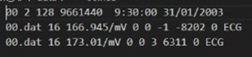
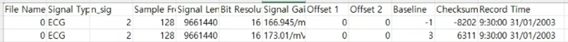
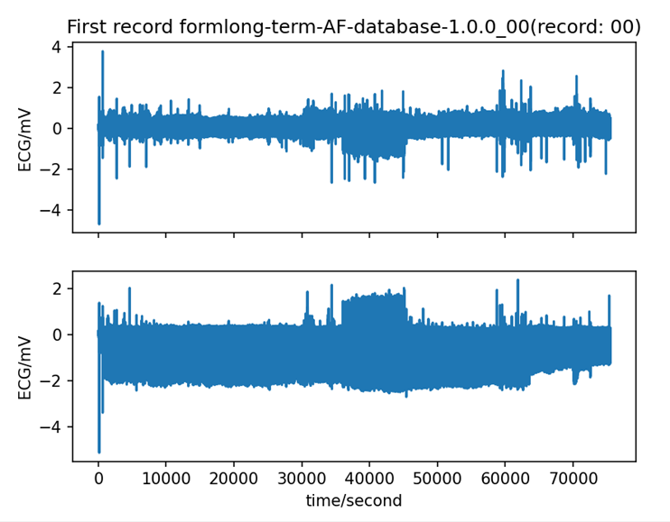

# Long-Term AF Database

# 1. Dataset Information

Long-term AF Database[^1]는 심박 세동(AF)이 지속적인지, 자발적으로 종료되는지 예측하기 위한 알고리즘 개발을 위해 수집되었습니다. 2개의 리드를 통해 초당 128개의 데이터가 20-24h 동안 수집되었습니다. 

# 2. Dataset Basic Information

## 2.1 Data Information

| # of Subjects | # of Leads | Sampling Frequency (Hz) | Recording Duration (min) | File Fomat |
| --- | --- | --- | --- | --- |
| 84 patients | 2 | Fixed 128 Hz
  
   | Generally 24h  | WFDB format
.dat (signal data, binary file)
.hea(signal data, meta data)
.qrs(location of heartbeat)
.atr(annotation)
 |
- Lead에 대한 명확한 정보는 주어져있지 않습니다 (Signal data에 ECG로 표기되어있음)

## 2.2 Data Statistics

atr annotation

| Label Type | # of recordings | Time length (s) - Mean | Time length (s) - Standard Deviation |
| --- | --- | --- | --- |
| Normal | 8710873 (96.10%) | 810.16 | 188.76 |
| AF | 152332 (1.68%) | 12.34 | 24.27 |
| Ventricular Contraction | 132679 (1.47%) | 22.45 | 34.80 |
| Unclassifiable Bear | 89 (0.001%) | 0.12 | 0.21 |
| Rhythm change | 53704 (0.59%) | 0.55 | 1.80 |
| Comment annotation | 5959 (0.07%) | 0.55 | 1.80 |
| Total | 9055636 | 836.45 | 188.45 |
- Normal (N): Normal sinus rhythm
- Atrial Fibrillation (AF or A): Presence of atrial fibrillation
- Ventricular Contraction (V): Premature ventricular contraction
- Unclassifiable Bear(Q): Unclassifiable beat
- + : Rhythm change
- “  : Comment annotation

qrs annotation

| Label Type | # of recordings |
| --- | --- |
| Normal | 8611567 (99.97%) |
| Isolated QRS-like artifact  | 2549 (0.03%) |
| AF terminations | 81 (0.001%) |
| Total | 8614197 |
- Normal (N): All detected beats
- |  : Isolated QRS-like artifact
- AF terminations(T): T-wave change

## 2.3 Raw Dataset


!!! note ""
    ```
    Long-Term AF Database/ 
    
    ├── 00.atr
    
    ├── 00.dat
    
    ├── 00.hea
    
    ├── 00.qrs
    
    └── ... (336 (84 * 4) 파일: 각각 .atr + .dat + .hea + .qrs 세트) 
    
    ├── README.md
    
    ├── RECORDS
    
    ├── SHA256SUMS.txt
    
    ├── tables.html
    
    └── tables.shtml
    
    1 dictionary, 341 files
    ```


각 레코드는 128Hz 샘플링 주파수 기준으로 기록된  2 lead ECG 신호를 포함하며, 다음 네 파일로 구성되어 있습니다: 

- .dat 파일: signal data
- .hea 파일: 레코드의 메타데이터 (샘플 수, 환자 정보 및 샘플링 일시, 레이블, 채널 정보 등)를 저장
- .atr 파일: 레코드의 주석 정보
- .qrs 파일: 레코드의 qrs annotation (심박의 위치 정보 등)



위의 사진은 Long-term AF의 00.hea의 내용입니다. 9:30:00는 Start time, 31/01/2003은 Start date를 의미합니다. 00.atr 파일에 해당 데이터에 대한 정보가 들어있습니다. tables.html 파일은 전 데이터 관련 주석 관련 정보를 포함합니다. 

## 2.4 Raw Dataset Example





환자의 정보와 신호 데이터 시각화의 예시입니다.

## 2.5 Preprocessed Dataset


!!! note ""
    ```
    Long-Term AF Database
    ├── csv_files/
    │   ├── 00_data.csv
    │   ├── 00_pid.csv
    
    │   ├── 00_label.csv
    │   └── 00_qrs.csv
    │   ... (332 more files)
    ├── Long_Term_AF_database_finetune.npz
    ├── channels_info.csv
    └── labels.csv
    
    1 directories, 17060 files
    ```


csv_files 폴더에는 개별 신호 데이터를 담고 있는 ()_data.csv 파일과 환자 정보를 담고 있는 ()_pid.csv 파일, 개별 신호 별 annotation 정보를 담고 있는 ()_label.csv, qrs annotation 정보를 담고 있는 ()_qrs.csv 파일이 포함되어 있습니다. 해당 데이터는 파인튜닝(finetune)을 위한 용도로 사용되며, 위의 모든 데이터를 통합하여 라벨 정보와 함께 Long_Term_AF_database_finetune.npz 파일로 정리하였습니다.

# 3. Applications and Use Cases

이 데이터셋은 Rhythm Label(N, A, V, Q, +, “)을 가지고 있습니다. 이 Label을 이용하여 할 수 있는 Task는 AF prediction, Arrhythmia Detection, Atrial Fibrillation Detection 등이 있습니다. 

| 인용 논문 | 연구 과제 | 모델 구조 | 방법론 |
| --- | --- | --- | --- |
|
  GB Moody et al. (2004) [^1]
   | 
  AF Prediction
   | 
  Hidden Markov Model (HMM),  SVM
   | 
  RR interval variability and
  atrial activity frequency analysis |

# 4. References

[^1]: Moody, G. (n.d.). Spontaneous termination of atrial fibrillation: A challenge from physionet and computers in cardiology 2004. Computers in Cardiology, 2004, 101–104. [https://doi.org/10.1109/cic.2004.1442881](https://doi.org/10.1109/cic.2004.1442881)

[^2]: Goldberger, A., Amaral, L., Glass, L., Hausdorff, J., Ivanov, P. C., Mark, R., ... & Stanley, H. E. (2000). PhysioBank, PhysioToolkit, and PhysioNet: Components of a new research resource for complex physiologic signals. Circulation [Online]. 101 (23), pp. e215–e220.