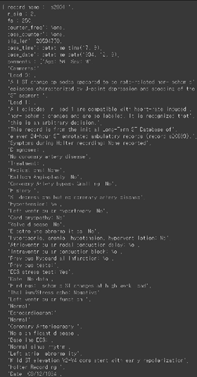
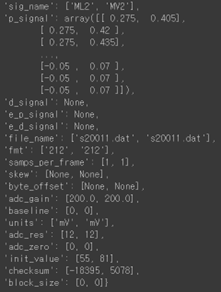
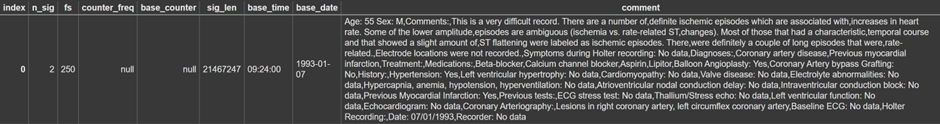
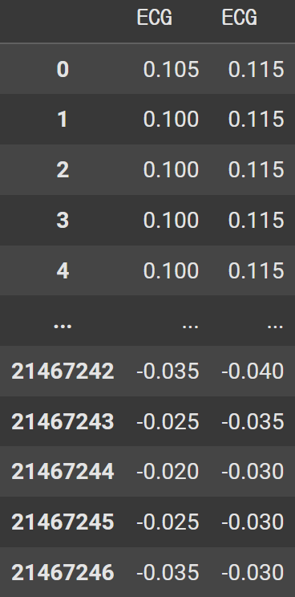
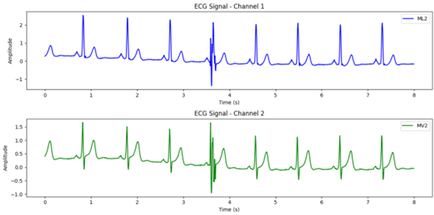
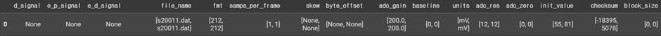
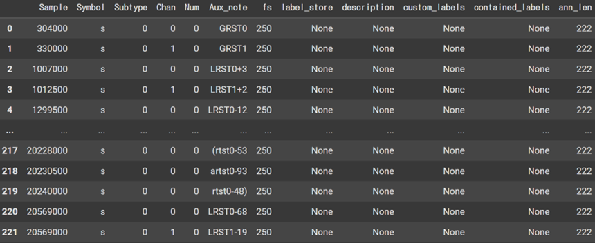

# Long-term ST Database

# 1. Dataset Information

Leiden University Database (LUDB)는 자동화된 ECG 해석, 부정맥 분류 및 ST 분절 분석 연구를 지원하기 위해 수집된 200명의 표준 12-리드 ECG 기록으로 구성된 데이터베이스입니다. 이 데이터베이스는 Leiden University에서 개발되었으며, 임상 및 머신러닝 연구를 위한 고품질 ECG 데이터를 제공하는 것을 목표로 합니다. 

Long-Term ST Databses는 80명의 인간 피험자에 대한 86개의 장기 ECG 기록이 포함되어 있으며, ischemic ST 에피소드, asix-related non-ischemic ST 에피소드, slow ST level drift 에피소드, 이러한 현상의 혼합을 포함하는 에피소드 등 다양한 ST segment 변화 이벤트를 보여주기 위해 선택되었습니다. 이 데이터베이스는 ischemic ST 이벤트와 non-ischemic ST 이벤트를 정확하게 구분할 수 있는 알고리즘의 개발 및 평가, myocardial ischemia의 메커니즘과 역학에 대한 기초 연구를 지원하기 위해 만들어졌습니다.

세부 정보는 [the official PhysioNet Challenge page](https://physionet.org/content/ltstdb/1.0.0/)에서 확인 가능합니다.

# 2. Dataset Basic Information

## 2.1 Data Information

| # of Leads | Sampling Frequency (Hz) | Recording Duration (min) | File Fomat |
| --- | --- | --- | --- |
|
  2 or 3
   | 
  Fixed 250 Hz
   | 
  21-24h
   | 
  WFDB format
   |
- Lead 정보 : laeds 종류별 환자를 기록함, leads 정보가 없는 경우 [‘ECG’, ‘ECG’]로 표기
    - ['ML2', 'MV2'] : s20011, s20201 ~ s20241
    - ['MLIII', 'V4'] : s20021, s20161, s20181, s20191, s20291, s20551
    - ['ECG', 'ECG'] : s20031 ~ s20141, s20251 ~ s20281, s20341 ~ s20461
    - ['V4', 'MLIII'] : s20151, s20171, s20301, s20321, s20331, s20471 ~ s20541, s20561
    - ['MLIII', 'V3'] : s20311
    - ['V5', 'MLIII'] : s20571
    - ['V5', 'V2'] : s20581
    - ['V2', 'MLIII'] : s20591 ~ 20651
    - ['V4', 'V3', 'II'] : s30661
    - ['V6', 'V5', 'aVF'] : s30671
    - ['V6', 'II', 'V5']  : s30681
    - ['E-S', 'A-S', 'A-I']  : s30691 ~ s30801

## 2.2 Data Statistics

| Label Type | # of recordings | Time length (s) - Mean | Time length (s) - Standard Deviation |
| --- | --- | --- | --- |
|
  N
   | 
  97.43% (8,669,297/8,897,780)
   | 
  73.58
   | 
  867.75
   |
|
  B
   | 
  1.00% (88,720/8,897,780)
   | 
  349.29
   | 
  809.66
   |
|
  V
   | 
  0.82%
  (72,852/8,897,780)
   | 
  1.02
   | 
  0.14
   |
|
  S
   | 
  0.64% (57,311/8,897,780)
   | 
  1.55
   | 
  20.82
   |
|
  A
   | 
  0.10%
  (8,730/8,897,780)
   | 
  1.04
   | 
  0.20
   |
|
  F
   | 
  0.01% (597/8,897,780)
   | 
  1.00
   | 
  0.04
   |
|
  a
   | 
  0.00%
  (162/8,897,780)
   | 
  1.03
   | 
  0.25
   |
|
  E
   | 
  0.00% (71/8,897,780)
   | 
  1.01
   | 
  0.12
   |
|
  e
   | 
  0.00%
  (30/8,897,780)
   | 
  1.0
   | 
  0.0
   |
|
  j
   | 
  0.00% (6/8,897,780)
   | 
  1.17
   | 
  0.37
   |
|
  Q
   | 
  0.00%
  (2/8,897,780)
   | 
  1.0
   | 
  0.0
   |
|
  /
   | 
  0.00% (1/8,897,780)
   | 
  1.0
   | 
  0.0
   |
|
  J
   | 
  0.00%
  (1/8,897,780)
   | 
  1.0
   | 
  0.0
   |
|
  Total
   | 
  1 (8,897,780)
   | 
  37.72
   | 
  615.03
   |
- N : 정상 박동 (Normal beat)
- B : 좌각차단 박동 (Left bundle branch block beat, LBBB)
- V : 심실 기원 박동 (Premature ventricular contraction, PVC)
- S : 상심실성 이소성 박동 (Supraventricular premature beat)
- A : 심방 조기 박동 (Atrial premature beat, APB)
- F : 융합 박동 (Fusion of ventricular and normal beat)
- a : 비정형 심방 조기 박동 (Aberrated atrial premature beat)
- E : 심실 빈맥에 포함된 박동 (Ventricular escape beat)
- e : 심방 이탈 박동 (Atrial escape beat)
- j : 접합부 조기 박동 (Junctional premature beat)
- Q : 확실하지 않은 박동 (Unclassifiable beat)
- / : 주석 제외 (Not a beat)
- J : 접합부 이탈 박동 (Junctional escape beat)

## 2.3 Raw Dataset


!!! note ""
    ```
    long-term-st-database-1.0.0/
    
    ├── 00README
    
    ├── ANNOTATORS
    
    ├── RECORDS
    
    ├── RECORDS-2003
    
    ├── SHA256SUMS.txt
    
    ├── figures
    
    ├── kl-single
    
    ├── kl-single-uncentralized
    
    ├── legendre
    
    ├── lt00
    
    ├── lt03
    
    ├── lt96
    
    ├── notes
    
    **├── s20011.16a**
    
    **├── s20011.ari**
    
    **├── s20011.atr**
    
    **├── s20011.cnt**
    
    **├── s20011.dat**
    
    **├── s20011.hea**
    
    **├── s20011.klt.zip**
    
    **├── s20011.sta**
    
    **├── s20011.stb**
    
    **├── s20011.stc**
    
    **├── s20011.stf**
    
    **├── s20011.tsr.zip**
    
    **├── s20021.16a**
    
    **├── s20021.ari**
    
    **├── s20021.atr**
    
    **├── s20021.cnt**
    
    **├── s20021.dat**
    
    **├── s20021.hea**
    
    **├── s20021.klt.zip**
    
    **├── s20021.sta**
    
    **├── s20021.stb**
    
    **├── s20021.stc**
    
    **├── s20021.stf**
    
    **├── s20021.tsr.zip**
    
    **└── ... (84*12 파일: 각각 .16a, .art, .atr, .cnt, .dat, .hea, .klt.zip, .sta, .stb, .stc, .stf, .tsr.zip 세트)**
    
    ├── semia
    
    ├── semia-3.0.1
    
    ├── semia-3.0.1.tar.gz
    
    ├── tables
    
    ├── thanks.shtml
    
    └── trends
    ```


각 레코드는 250Hz 샘플링 주파수 기준으로 기록된 2 or 3 리드 ECG 신호를 포함하며, 아래 파일들로 구성되어 있습니다.

- .hea : 환자의 임상정보
- .dat : ECG 신호
- annotation files
    - .ari : 자동 생성된 심박 annotation – 위2 정보 포함함
    - .atr : 매뉴얼에 따라 수정된 심박 annotation – 위2 정보 포함함
    - .16a : 자동 생성, 매뉴얼에 따라 수정된 ST-segment 측정, 16초 MA 기반
    - .sta : ST-segment episode annotation(Vmin = 75μV, Tmin = 30s)
    - .stb : ST-segment episode annotation(Vmin = 100μV, Tmin = 30s)
    - .stc : ST-segment episode annotation(Vmin = 100μV, Tmin = 60s)
    - .stf : ST level 함수, 선형 근사된 baseline ST level 함수

## 2.4 Raw Dataset Example

환자의 정보와 ECG 데이터 시각화의 예시입니다. (s20011)





- .hea 파일과 .dat 파일을 dictionary 형태로 출력한 예시입니다. 좌측 사진은 s20011.hea와 s20011.dat입니다.
- .hea 데이터는 환자의 임상정보를 담고 있으며 .dat은 ECG 데이터와 그 데이터에 대한 정보를 담고 있습니다.
- Arrhythmia annotation은 .ari와 .atr에 시점별로 기록되어 있습니다.


## 2.5 Preprocessed Dataset


!!! note ""
    ```
    ├── long-term-st-database-1.0.0_['E-S', 'A-S', 'A-I']
    │   ├── csv_files
    │   ├── long-term-st-database-1.0.0_['E-S', 'A-S', 'A-I']pretrain.npz
    │   └── long-term-st-database-1.0.0['E-S', 'A-S', 'A-I']pretrain_record_ids.csv
    ├── long-term-st-database-1.0.0['ECG', 'ECG']
    │   └── csv_files
    
    │   ├── long-term-st-database-1.0.0_['ECG', 'ECG']pretrain.npz
    │   └── long-term-st-database-1.0.0['ECG', 'ECG']pretrain_record_ids.csv
    ├── long-term-st-database-1.0.0_['ML2', 'MV2']
    │   ├── csv_files
    │   ├── long-term-st-database-1.0.0_['ML2', 'MV2']pretrain.npz
    │   └── long-term-st-database-1.0.0['ML2', 'MV2']pretrain_record_ids.csv
    ├── long-term-st-database-1.0.0['MLIII', 'V3']
    │   ├── csv_files
    │   ├── long-term-st-database-1.0.0_['MLIII', 'V3']pretrain.npz
    │   └── long-term-st-database-1.0.0['MLIII', 'V3']pretrain_record_ids.csv
    ├── long-term-st-database-1.0.0['MLIII', 'V4']
    │   ├── csv_files
    │   ├── long-term-st-database-1.0.0_['MLIII', 'V4']pretrain.npz
    │   └── long-term-st-database-1.0.0['MLIII', 'V4']pretrain_record_ids.csv
    ├── long-term-st-database-1.0.0['V2', 'MLIII']
    │   ├── csv_files
    │   ├── long-term-st-database-1.0.0_['V2', 'MLIII']pretrain.npz
    │   └── long-term-st-database-1.0.0['V2', 'MLIII']pretrain_record_ids.csv
    ├── long-term-st-database-1.0.0['V4', 'MLIII']
    │   ├── csv_files
    │   ├── long-term-st-database-1.0.0_['V4', 'MLIII']pretrain.npz
    │   └── long-term-st-database-1.0.0['V4', 'MLIII']pretrain_record_ids.csv
    ├── long-term-st-database-1.0.0['V4', 'V3', 'II']
    │   ├── csv_files
    │   ├── long-term-st-database-1.0.0_['V4', 'V3', 'II']pretrain.npz
    │   └── long-term-st-database-1.0.0['V4', 'V3', 'II']pretrain_record_ids.csv
    ├── long-term-st-database-1.0.0['V5', 'MLIII']
    │   ├── csv_files
    │   ├── long-term-st-database-1.0.0_['V5', 'MLIII']pretrain.npz
    │   └── long-term-st-database-1.0.0['V5', 'MLIII']pretrain_record_ids.csv
    ├── long-term-st-database-1.0.0['V5', 'V2']
    │   ├── csv_files
    │   ├── long-term-st-database-1.0.0_['V5', 'V2']pretrain.npz
    │   └── long-term-st-database-1.0.0['V5', 'V2']pretrain_record_ids.csv
    ├── long-term-st-database-1.0.0['V6', 'II', 'V5']
    │   ├── csv_files
    │   ├── long-term-st-database-1.0.0_['V6', 'II', 'V5']pretrain.npz
    │   └── long-term-st-database-1.0.0['V6', 'II', 'V5']pretrain_record_ids.csv
    └── long-term-st-database-1.0.0['V6', 'V5', 'aVF']
    
    long-term-st-database-1.0.0[leads] 파일의 csv_files는 해당 lead의 channel_info와 해당 lead를 사용한 환자의 16a, ari, atr, hea, sta, stb, stc, stf, data(ECG signal)를 csv로 전환한 파일을 포함함.
    ```


LTSTDB의 .hea, .dat, .ari, .atr, .sta, .stb, .stc, .16a, .stf 파일을 csv로 변환하였습니다.

Csv로 전환한 s20011.hea 파일입니다.



S20011.dat의 일부인 s20011의 ECG 신호입니다. 좌측은 표, 우측은 그래프입니다. 두개의 leads로부터 측정한 신호를 기록하였습니다.





.dat 파일은 ECG 신호에 대한 아래와 같은 정보들을 포함하고 있으며 아래와 같이 csv로 전환하였습니다.



Long Term ST dataset은 다양한 annotations를 포함하고 있습니다. 측정 중 발생한 다양한 arrhythmia에 대한 정보들 및 ST episodes에 대한 정보를 포함합니다.

ari, .atr, .sta, .stb, .stc, .16a, .stf를 아래와 같이 csv 형태로 변환하였습니다.

fs, label_store, description, custom_labels, contatined_labels, ann_len은 환자별로 한 개의 값만 가지고 있어 모든 row에 대해 같은 값을 기입하였습니다.



# 3. Applications and Use Cases

The Long Term ST Database는 arrhythims classification 문제를 해결하는데에 주로 쓰여져 왔습니다. .atr과 .ari 파일을 통해 다양한 arrhythmia를 classify하는 모델을 제작할 수 있습니다.-아래는 다양한 deep learning 방법론을 통해 long term ST database를 이용한 연구들에 대한 요약입니다. 

| 인용 논문 | 연구 과제 | 모델 구조 | 방법론 |
| --- | --- | --- | --- |
|
  Zekai Wang et al. (2023) [^1]
   | 
  Arrhythmia Classification
   | 
  Generative Adversarial Network (GAN)
   | 
  Hierarchical deep learning with GAN for
  anomaly detection and multi-class arrhythmia classification using transfer
  learning
   |
|
  Guijin Wang et al. (2018) [^2]
   | 
  Arrhythmia Classification
   | 
  Recurrent Neural Network (RNN)
   | 
  Global and updatable ECG classification
  system with active learning to improve performance over time
   |
|
  Saman Parvaneh et al. (2018) [^3]
   | 
  Atrial Fibrillation Detection
   | 
  Dense Convolutional Neural Network (DenseNet)
   | 
  Combination of densely connected CNNs with
  feature-based post-processing to detect atrial fibrillation from single-lead
  ECG
   |
|
  Ran Xiao et al. (2018) [^4]
   | 
  Ischemic ST Change Detection
   | 
  Convolutional Neural Network (CNN)
   | 
  Image-based ECG transformation with deep
  learning to improve detection of ST depression changes, leveraging Google
  Inception V3 via transfer learning.
   |
- Arrhythmia Classification
  [^2], [^3] Arrhythmia classification 는 다양한 종류의 arrhythimias를 ECG 신호를 이용해 식별하는 것을 목표로 합니다. 연구들은 ari와 atr 파일을 이용하여 ECG 기록에서 발생한 arrhythimias의 종류를 식별하고자 합니다.
- Atrial Fibrillation Detection
  [^4] Atrial fibrillation (AF) 은 비규칙적인 심장 박동입니다. 이는 뇌졸중과 같은 심각한 합병증을 증가시킬수 있습니다. ECG annotations은 AF episodes의 발생 시점을 기록하고 있어 AF 식별 모델을 제작하는데에 이용 가능합니다.
- Ischemic ST Change Detection
  [^5] Ischemic ST changes는 심장 근육으로의 혈류 감소에 의해 발생하며, ECG 신호에서의 ST-segment shifts로 감지 가능합니다. sta, stb, stc의 ECG annotations은 ST 변화를 감지하는데에 유용합니다.

# 4. References

[^1]: F. Jager1,2 A. Taddei3 R. Dorn1 G. B. Moody2,4 A. Smrdel1 M. Emdin3 C. Marchesi3,6 G. Anto (2003), Long-term ST database : a reference for the development and evaluation of automated ischaemia detectors and for the study of the dynamics of myocardial ischaemia.

[^2]: Zekai Wang, Stavros Stavrakis, Bing Yao (2023), Hierarchical deep learning with Generative Adversarial Network for automatic cardiac diagnosis from ECG signals.

[^3]: Guijin Wang, Chenshuang Zhang, Yongpan Liu, Huazhong Yang, Dapeng Fu, aiqing Wang, Ping Zhang (2019), A global and updatable ECG beat classification system based on recurrent neural networks and active learning.

[^4]: Ran Xiao, PhD, Yuan Xu, PhD, Michele M. Pelter, RN, PhD, David W. Mortara, PhD, Xiao Hu, PhD (2018), A Deep Learning Approach to Examine Ischemic ST Changes in Ambulatory ECG Recordings.

[^5]: Saman Parvaneh, Jonathan Rubin, Asif Rahman, Bryan Conroy and Saeed Babaeizadeh (2018), Analyzing single-lead short ECG recordings using dense convolutional neural networks and feature-based post-processing to detect atrial fibrillation.

[^6]: Goldberger, A., Amaral, L., Glass, L., Hausdorff, J., Ivanov, P. C., Mark, R., ... & Stanley, H. E. (2000). PhysioBank, PhysioToolkit, and PhysioNet: Components of a new research resource for complex physiologic signals. Circulation [Online]. 101 (23), pp. e215–e220.