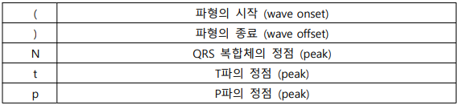
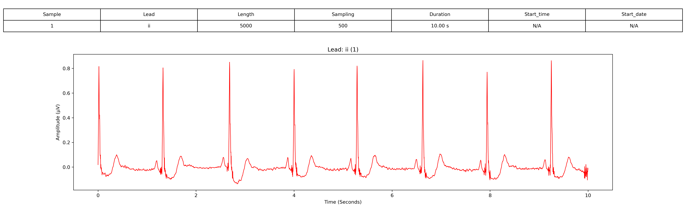
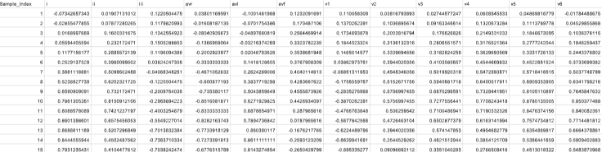
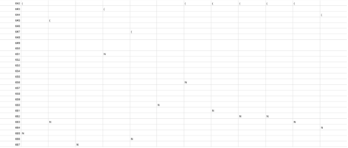
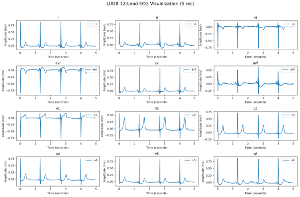

# 1. Dataset Information

Leiden University Database (LUDB)는 자동화된 ECG 해석, 부정맥 분류 및 ST 분절 분석 연구를 지원하기 위해 수집된 200명의 표준 12-리드 ECG 기록으로 구성된 데이터베이스입니다. 이 데이터베이스는 Leiden University에서 개발되었으며, 임상 및 머신러닝 연구를 위한 고품질 ECG 데이터를 제공하는 것을 목표로 합니다. 

# 2. Dataset Basic Information

## 2.1 Data Information

| # of Subjects | # of Leads | Sampling Frequency (Hz) | Recording Duration (min) | File Fomat |
| --- | --- | --- | --- | --- |
| 200 records | 12 | Fixed 500 Hz | 10 second | dat, hea, i , ii ,iii, v1, v2, v3, v4, v5, v6, avf, avl, avr |

## 2.2 Data Statistics

| Label Type | # of recordings | Time length (s) - Mean | Time length (s) - Standard Deviation |
| --- | --- | --- | --- |
| Sinus rhythm | 71.0% (142/200) |  |  |
| Sinus bradycardia | 12.0% (24/200) |  |  |
| Atrial fibrillation | 7.0% (14/200) |  |  |
| Sinus arrhythmia | 3.5% (7/200) |  |  |
| Sinus tachycardia | 2.0% (4/200) |  |  |
| Atrial flutter, typical | 1.5% (3/200) |  |  |
| Irregular sinus rhythm | 1.0% (2/200) |  |  |
| Atrial fibrillation, Aberrant conduction | 0.5% (1/200) |  |  |
| Sinus bradycardia, Wandering atrial pacemaker | 0.5% (1/200) |  |  |
| Sinus rhythm, Wandering atrial pacemaker | 0.5% (1/200) |  |  |
| Sinus arrhythmia, Wandering atrial pacemaker | 0.5% (1/200) |  |  |

- Sinus rhythm
- Sinus bradycardia
- Atrial fibrillation
- Sinus arrhythmia
- Sinus tachycardia
- Atrial flutter, typical
- Irregular sinus rhythm
- Atrial fibrillation, Aberrant conduction
- Sinus bradycardia, Wandering atrial pacemaker
- Sinus rhythm, Wandering atrial pacemaker
- Sinus arrhythmia, Wandering atrial pacemaker

## 2.3 Raw Dataset

!!! note ""
    ```
    ├── LUDB-data/
    │   ├── ANNOTATORS
    │   ├── LICENSE.txt
    │   ├── README
    │   ├── RECORDS
    │   ├── SHA256SUMS.txt
    │   ├── ludb.csv
    │       ├── data/
    │       │   ├── 1.avf
    │       │   ├── 1.avl
    │       │   ├── 1.avr
    │       │   ├── 1.dat
    │       │   ├── 1.hea
    │       │   ├── 1.i
    │       │   ├── 1.ii
    │       │   ├── 1.iii
    │       │   ├── 1.v1
    │       │   ├── 1.v2
    │       │   └── ... (2800 파일, 각각 .avf + .avl + .avr + .dat + .hea + .i + .ii+ .iii + .v1 + .v2 + .v3 + .v4 + .v5 + .v6 세트)
    2 directories, 약 2816 files
    ```

LUDB의 주석은 ECG 파형의 시작, 정점(peak), 종료를 나타내는 구조화된 형식을 따릅니다. 주요 주석 기호는 다음과 같습니다.



이러한 구조는 각 ECG 파형 요소의 시작, 정점, 종료를 명확하게 정의하여 정확한

ECG 분석을 가능하게 합니다.

## 2.4 Raw Dataset Example



환자의 정보와 신호 데이터 시각화의 예시입니다. 

## 2.5 Preprocessed Dataset

!!! note ""
    ```
    ├── LUDB/
    │   ├── LUDB_axis_finetune.npz
    │   ├── LUDB_diagnostic_finetune.npz
    │   ├── LUDB_rhythm_finetune.npz
    │   ├── channel_info.csv
    │       ├── axis/
    │       │   ├── label.csv
    │       │   ├── label_info.csv
    │       ├── csv_files/
    │       │   ├── 100_data.csv
    │       │   ├── 100_label.csv
    │       │   ├── 100_pid.csv
    │       │   ├── 101_data.csv
    │       │   ├── 101_label.csv
    │       │   ├── 101_pid.csv
    │       │   ├── 102_data.csv
    │       │   ├── 102_label.csv
    │       │   ├── 102_pid.csv
    │       │   ├── 103_data.csv
    │       │   └── ... (600 파일)
    │       │       ├── @eaDir/
    │       │       │   ├── 6_label.csv@SynoEAStream
    │       ├── diagnostic/
    │       │   ├── label.csv
    │       │   ├── label_info.csv
    │       ├── rhythm/
    │       │   ├── label.csv
    │       │   ├── label_info.csv
    6 directories, 약 621 files
    ```

data.csv 파일 예시: data 파일에는 12개 채널의 신호 데이터가 들어가 있다. 12 X 5000

의 크기를 가지고 있습니다



label.csv 파일 예시: label 파일에는 ( ) N t p의 5개의 주석으로 처리가 되어 있습니다.



- 샘플 인덱스 641→ ‘(’ → 파형이 시작됨
- 샘플 인덱스 664→ ‘N’ → QRS 복합체의 정점 도달
- 샘플 인덱스 690→ ‘)’ → 파형 종료
이 시각화 자료는 LUDB(Leiden University Database)의 5초 동안의 12-리드 ECG 데이터를 보여줍니다. ECG 기록은 12개의 채널로 구성되며, 500Hz로 샘플링되었습니다.



# 3. Applications and Use Cases

LUDB(Lobachevsky University ECG Database)는 ECG 신호 분할(delineation), QRS 복합파 검출, 딥러닝 기반 ECG 분류, 트랜스포머 기반 ECG 분석 연구를 발전시키는 데 중요한 역할을 해왔습니다.[4],[5] LUDB는 ECG 분할 모델의 벤치마킹과 QRS 복합파 및 T-파의 정밀한 위치 결정을 향상시키는 데 중요한 데이터베이스로 자리 잡고 있습니다.[1] 이러한 연구들은 LUDB가 ECG 분할(delineation) 알고리즘을 검증하고, ECG 세분화 정확도를 향상시키며, 트랜스포머, UNet 및 인코더-디코더 모델과 같은 딥러닝 아키텍처를 ECG 해석에 적용합니다.[2],[3]

| 인용 논문 | 연구 과제 | 모델 구조 | 방법론 |
| --- | --- | --- | --- |
| Kalyakulina et al. (2020) [1] | ECG 분할 검증 | 다중 ECG 알고리즘 | ECG 분할 방법을 검증하기 위한 개방형 평가 도구로 LUDB 개발 |
| Islam et al. (2024) [2] | ECG 분석을 위한 트랜스포머 응용 | 트랜스포머 | ECG 분류 및 특징 추출을 위한 트랜스포머 기반 모델 종합 조사 |
| Chen et al. (2023) [3] | ECG 분할 후처리 | 1D-UNet | 1D-UNet 모델을 활용한 ECG 분할 후처리 방법 제안 |
| Liang et al. (2022) [4] | ECG 신호 분할 | 인코더-디코더 (ECG_SegNet) | 인코더-디코더 구조 기반 ECG 세분화 네트워크 설계 |
| Han et al. (2022) [5] | QRS 및 T-파 위치 결정 | 딥러닝 + 전기생리학 | 딥러닝과 전기생리학 지식을 결합하여 정밀한 QRS 및 T-파 위치 결정 수행 |

# 4. References

[1] Kalyakulina, Alena I., et al. "LUDB: a new open-access validation tool for electrocardiogram delineation algorithms." IEEE access8 (2020): 186181-186190.

[2] Islam, Saidul, et al. "A comprehensive survey on applications of transformers for deep learning tasks." Expert Systems with Applications241 (2024): 122666.

[3] Chen, Zhenqin, et al. "Post-processing refined ECG delineation based on 1D-UNet." Biomedical Signal Processing and Control79 (2023): 104106.

[4] Liang, Xiaohong, et al. "ECG_SegNet: An ECG delineation model based on the encoder-decoder structure." Computers in biology and medicine145 (2022): 105445.

[5] Han, Chuang, et al. "QRS complexes and T waves localization in multi-lead ECG signals based on deep learning and electrophysiology knowledge." Expert Systems with Applications199 (2022): 117187.
