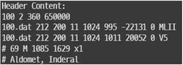
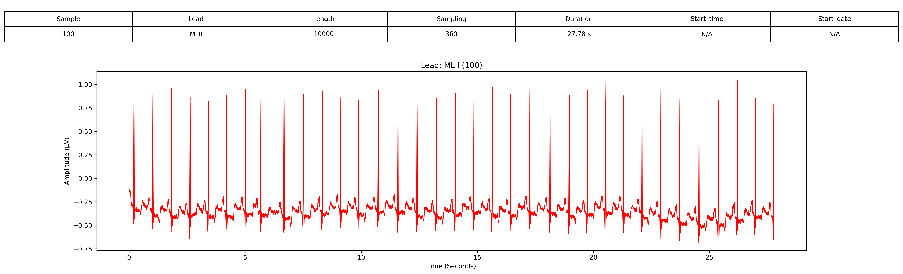
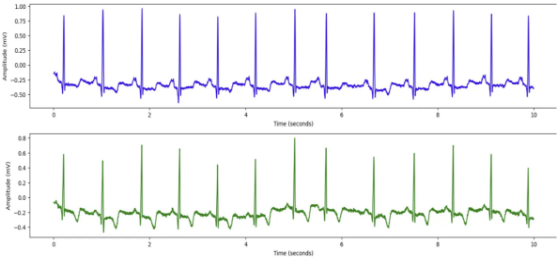

# 1. Dataset Information

MIT-BIH Arrythmia database는 Boston’s Beth Israel Hospital에서 1975년부터 1979년까지 수집된 4,000개의 24시간 연속 심전도(ECG) 기록에서 48개의 30분 길이 샘플을 선택하여 구성되었습니다.

# 2. Dataset Basic Information

## 2.1 Data Information

| # of Subjects | # of Leads | Sampling Frequency (Hz) | Recording Duration (min) | File Fomat |
| --- | --- | --- | --- | --- |
| 114839 records | 2 (MLII, V1/2/4/5) | Fixed 360 Hz | 30 minutes | (ECG).dat/(ECG).hea/(ECG).atr/(ECG).xws (Metadata) |

## 2.2 Data Statistics

| Label Type | # of recordings | Time length (s) - Mean | Time length (s) - Standard Deviation |
| --- | --- | --- | --- |
| + | 1.13% (1296/114839) | 26.4 | 42.1 |
| A | 2.22% (2546/114839) | 94.3 | 265.2 |
| N | 65.44% (75151/114839) | 1833 | 744 |
| V | 6.21% (7134/114839) | 187.7 | 255.5 |
| Q | 0.03% (33/114839) | 5.5 | 5.7 |
| \| | 0.11% (132/114839) | 6.9 | 8.9 |
| ~ | 0.54% (616/114839) | 16.2 | 17.9 |
| F | 0.7% (803/114839) | 47.2 | 117 |
| j | 0.2% (229/114839) | 45.8 | 83.2 |
| x | 0.17% (193/114839) | 38.6 | 48.6 |
| / | 7.89% (9056/114839) | 1811.2 | 291.1 |
| f | 0.9% (1038/114839) | 259.5 | 249 |
| L | 7.03% (8075/114839) | 2018.8 | 371 |
| a | 0.13% (150/114839) | 21.4 | 31.8 |
| J | 0.07% (83/114839) | 16.6 | 19.8 |
| R | 6.32% (7259/114839) | 1209.8 | 744 |
| ! | 0.41% (472/114839) | 472 | 0 |
| E | 0.09% (106/114839) | 53 | 52 |
| [ | 0.01% (6/114839) | 6 | 0 |
| ] | 0.01% (6/114839) | 6 | 0 |
| S | 0.0% (2/114839) | 2 | 0 |
| “ | 0.38% (437/114839) | 87.4 | 169.8 |
| e | 0.01%  16(16/114839) | 16 | 0 |

- + : Rhythm change annotation
- A : Atrial premature beat
- N : Normal beat
- V : Premature ventricular contraction
- Q : Unclassifiable beat
- | : Measurement annotation
- ~ : Change in signal quality
- F : Fusion of ventricular and normal beat
- j : Nodal (junctional) escape beat
- x : Non-conducted P-wave (blocked APC)
- / : Paced beat
- f : Fusion of paced and normal beat
- L : Left bundle branch block beat
- a : Aberrated atrial premature beat
- J : Nodal (junctional) premature beat
- R : Right bundle branch block beat
- ! : Ventricular flutter wave
- E : Ventricular escape beat
- [ : Start of ventricular flutter/fibrillation
- ] : End of ventricular flutter/fibrillation
- S : Supraventricular premature or ectopic beat (atrial or nodal)
- " : Comment annotation
- e : Atrial escape beat

## 2.3 Raw Dataset

!!! note ""
    ```
    ├── mit-bih-arrhythmia-database-1.0.0/
    │   ├── 100.atr
    │   ├── 100.dat
    │   ├── 100.hea
    │   ├── 100.xws
    │   ├── 101.atr
    │   ├── 101.dat
    │   ├── 101.hea
    │   ├── 101.xws
    │   ├── 102-0.atr
    │   ├── 102.atr
    │   └── ... (총 205 파일, 각각 .atr + .dat  + .hea + .xws 세트)
    │       ├── mitdbdir/
    │       │   ├── foreword.htm
    │       │   ├── intro.htm
    │       │   ├── mitdbdir.htm
    │       │   ├── records.htm
    │       │   ├── tables.htm
    │       │       ├── samples/
    │       │       │   ├── 1001103.xws
    │       │       │   ├── 1002513.xws
    │       │       │   ├── 1002609.xws
    │       │       │   ├── 1002755.xws
    │       │       │   ├── 1010134.xws
    │       │       │   ├── 1010148.xws
    │       │       │   ├── 1010513.xws
    │       │       │   ├── 1010954.xws
    │       │       │   ├── 1012432.xws
    │       │       │   ├── 1020055.xws
    │       │       │   └── ... (총 391 파일)
    │       │       ├── src/
    │       │       │   ├── contents.gz
    │       │       │   ├── [contents.tr](http://contents.tr/)
    │       │       │   ├── cover.gz
    │       │       │   ├── [cover.tr](http://cover.tr/)
    │       │       │   ├── dbnotes-html.c
    │       │       │   ├── dbnotes.c
    │       │       │   ├── dbtab.c
    │       │       │   ├── domit
    │       │       │   ├── exlist
    │       │       │   ├── extest
    │       │       │   └── ... (총 33 파일)
    │       ├── x_mitdb/
    │       │   ├── ANNOTATORS
    │       │   ├── RECORDS
    │       │   ├── x_108.atr
    │       │   ├── x_108.dat
    │       │   ├── x_108.hea
    │       │   ├── x_109.atr
    │       │   ├── x_109.dat
    │       │   ├── x_109.hea
    │       │   ├── x_111.atr
    │       │   ├── x_111.dat
    │       │   └── ... (총 71 파일, 각각 .atr + .dat  + .hea 세트)
    5 directories, 약 745 files
    ```



헤더 파일은 ECG 기록에 대한 메타데이터를 제공합니다.

- 첫 번째 줄: 기록 번호(100), 두 개의 ECG 채널, 샘플링 주파수 360Hz, 총 650,000개의 샘플을 포함합니다.
- 두 번째 및 세 번째 줄: 각 ECG 리드(MLII, V5)는 100.dat 파일에 16비트 형식, 200 µV/LSB ADC 이득, 11비트 해상도, ±10mV ADC 범위로 기록됩니다. 또한, 신호 기준선 및 최소/최대 값도 제공됩니다.
- 네 번째 줄: 환자 정보에는 나이(69세), 성별(남성, M) 및 추가적인 메타데이터가 포함됩니다.
- 다섯 번째 줄: 환자가 복용 중인 고혈압 및 부정맥 치료제(Aldomet, Inderal) 정보를 나타냅니다.

## 2.4 Raw Dataset Example



환자의 정보와 신호 데이터 시각화의 예시입니다. 

## 2.5 Preprocessed Dataset

!!! note ""
     (preprocessed 파일 안에 없음)

MIT-BIH Arrythmia database의 .hea 및 .dat 파일을 이용하여 data.csv, pid.csv 파일로 변환합니다. 다음은 100_data.csv, 100_pid.csv 파일을 변환 후 시각화한 결과입니다.
이 시각화 자료는 MIT-BIH Arrythmia database의 환자 100번에 대한 10초간의 ECG 데이터를 나타냅니다. ECG 기록은 두 개의 리드(MLII 및 V5)로 구성되며, 360Hz로 샘플링되었습니다.



# 3. Applications and Use Cases

MIT-BIH 부정맥 데이터베이스는 부정맥 분류, ECG 기반 생체 인증, 실시간 모니터링, 신호 노이즈 제거, 이상 탐지 등의 연구에서 광범위하게 활용되고 있습니다. 아래는 해당 데이터베이스를 사용한 연구들을 정리한 표로, 연구 목표, 모델링 기법, 고유한 방법론을 포함하고 있습니다.

| 인용 논문 | 연구 과제 | 모델 구조 | 방법론 |
| --- | --- | --- | --- |
| Rajpurkar et al. (2017)[1] | 부정맥 분류 | CNN | 대규모 ECG 분류를 위한ResNet활용 |
| Acharya et al. (2017)[2] | 부정맥 분류 | CNN | 다중 클래스 부정맥 분류를 위한 자동 특징 추출 |
| Yildirim et al. (2018)[3] | ECG 기반 생체 인증 | LSTM, CNN | 개별 신원 확인을 위한 순환 신경망 기반 아키텍처 적용 |
| Hannun et al. (2019)[4] | 실시간 ECG 모니터링 | CNN | 대규모 ECG 데이터셋으로 학습된 엔드투엔드 딥 러닝 모델 |
| Shashikumar et al. (2020)[5] | 심방세동 탐지 | Hybrid CNNLSTM | 개인 맞춤형 ECG 모니터링을 위한 적응형 딥 러닝 기법 |
| Acharya et al. (2017)[6] | 심방세동 탐지 | CNN | ECG 신호를 활용한 심근 경색 분류 딥러닝 모델 |

딥러닝 아키텍처(CNN, LSTM, Transformer)는 ECG 분류 연구에서 중요한 역할을 하며, 자동화된 특징 추출을 가능하게 합니다.[1,2] ECG 기반 생체 인증은 순환 신경망(LSTM)을 활용하여 개인 식별을 향상시키며, 신호 노이즈 제거 기법은 ECG 품질을 개선하여 보다 정확한 임상 진단을 돕습니다.[3,4] 하이브리드 딥러닝 모델을 적용한 개인 맞춤형 실시간 ECG 모니터링 기술은 웨어러블 헬스케어 및 원격 의료 솔루션 발전에 기여하고 있습니다.[5,6] 이러한 연구들은 MIT-BIH 부정맥 데이터베이스가 임상 진단, 원격 의료, AI 기반 생체 신호 분석 연구에서 중요한 역할을 하고 있음을 보여줍니다.

# 4. References

[1] Rajpurkar, P., Hannun, A. Y., Haghpanahi, M., Bourn, C., & Ng, A. Y. (2017). Cardiologist-level arrhythmia detection with deep neural networks. *arXiv preprint arXiv:1707.01836*.

[2] Acharya, U. R., Fujita, H., Lih, O. S., Hagiwara, Y., Tan, J. H., & Adam, M. (2017). Automated detection of arrhythmias using different intervals of tachycardia ECG segments with convolutional neural network. *Information Sciences, 405*, 81-90.

[3] Yildirim, O., Baloglu, U. B., Tan, R. S., Ciaccio, E. J., & Acharya, U. R. (2018). A deep convolutional LSTM network for automated detection of atrial fibrillation using ECG signals. *Applied Intelligence, 48(12)*, 3586-3597.

[4] Hannun, A. Y., Rajpurkar, P., Haghpanahi, M., Tison, G. H., Bourn, C., Turakhia, M. P., & Ng, A. Y. (2019). Cardiologist-level arrhythmia detection and classification in ambulatory electrocardiograms using a deep neural network. *Nature Medicine, 25(1)*, 65-69.

[5] Shashikumar, S. P., Shah, A. J., Li, Q., Clifford, G. D., & Nemati, S. (2020). A deep learning approach to monitoring and detecting atrial fibrillation using wearable technology. *IEEE Transactions on Biomedical Engineering, 67(5)*, 1547-1555.

[6] Acharya, U. R., Fujita, H., Lih, O. S., Adam, M., Tan, J. H., & Chua, C. K. (2017). Application of deep convolutional neural network for automated detection of myocardial infarction using ECG signals. *Information Sciences, 415*, 190-198.

[7] Moody, George B., and Roger G. Mark. "The impact of the MIT-BIH arrhythmia database." *IEEE engineering in medicine and biology magazine* 20.3 (2001): 45-50.
