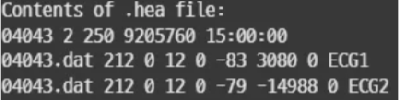
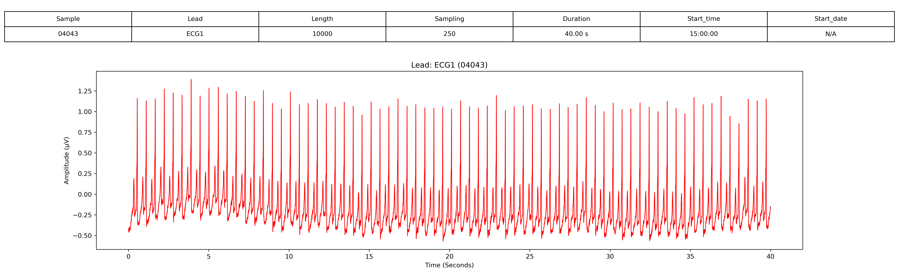
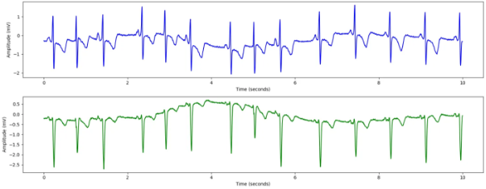

# 1. Dataset Information

MIT-BIH 심방세동(Atrial Fibrillation) 데이터베이스는 심방세동(AF) 연구를 위해 특별히 선정된 25개의 장시간 ECG 기록으로 구성되어 있으며, MIT-BIH 부정맥 데이터베이스 및 기타 데이터베이스에서 추출되었습니다.

# 2. Dataset Basic Information

## 2.1 Data Information

| # of Subjects | # of Leads | Sampling Frequency (Hz) | Recording Duration (min) | File Fomat |
| --- | --- | --- | --- | --- |
| 623 records | 2 | Fixed 250 Hz | 10 hour | (ECG).dat/(ECG).hea/(ECG).atr/(ECG).qrs (Metadata) |

## 2.2 Data Statistics

| Label Type | # of recordings | Time length (s) - Mean | Time length (s) - Standard Deviation |
| --- | --- | --- | --- |
| AFIB | 47.99% (299/623) | 12 | 17.5 |
| N | 46.87% (292/623) | 12.7 | 18.1 |
| AFL | 2.25% (14/623) | 1.8 | 1.1 |
| J | 2.89% (18/623) | 4.5 | 2.1 |

- AFIB : Atrial fibrillation
- N : Normal sinus rhythm
- AFL : Atrial flutter
- J : Nodal (junctional) premature beat

## 2.3 Raw Dataset

!!! note ""
     ├── mit-bih-atrial-fibrillation-database-1.0.0/
     │   ├── 00735.atr
     │   ├── 00735.hea
     │   ├── 00735.qrs
     │   ├── 03665.atr
     │   ├── 03665.hea
     │   ├── 03665.qrs
     │   ├── 04015.atr
     │   ├── 04015.dat
     │   ├── 04015.hea
     │   ├── 04015.hea-
     │   └── ... (131 파일, 각각 .atr + .hea + .qrs 세트)
     │       ├── mit-bih-st-change-database-1.0.0/
     │       │   ├── 300.atr
     │       │   ├── 300.dat
     │       │   ├── 300.hea
     │       │   ├── 300.hea-
     │       │   ├── 300.xws
     │       │   ├── 301.atr
     │       │   ├── 301.dat
     │       │   ├── 301.hea
     │       │   ├── 301.hea-
     │       │   ├── 301.xws
     │       │   └── ... (143 파일, 각각 .atr + .hea + .dat + .hea- 세트)
     │       ├── old/
     │       │   ├── 00735.atr
     │       │   ├── 03665.atr
     │       │   ├── 04015.atr
     │       │   ├── 04043.atr
     │       │   ├── 04048.atr
     │       │   ├── 04126.atr
     │       │   ├── 04746.atr
     │       │   ├── 04908.atr
     │       │   ├── 04936.atr
     │       │   ├── 05091.atr
     │       │   └── ... (25 파일)
    3 directories, 약 329 files

헤더 파일은 ECG 기록에 대한 메타데이터를 제공합니다.
- 첫 번째 줄: 기록 번호(04043), 두 개의 ECG 채널, 샘플링 주파수 250Hz, 총 9,205,760개의 샘플, 그리고 기록 시작 시간(15:00:00)이 포함됩니다. ECG 신호는 약 10시간 14분 동안 250Hz로 샘플링되었습니다.
- 두 번째 및 세 번째 줄: 각 ECG 리드(ECG1, ECG2)는 04043.dat 파일에 16비트 형식(코드 212), 12비트 해상도, ±10mV ADC 범위로 저장됩니다. 또한, ADC 기준값 및 최소/최대 신호 진폭이 제공됩니다.

## 2.4 Raw Dataset Example

환자의 정보와 신호 데이터 시각화의 예시입니다. 

## 2.5 Preprocessed Dataset

!!! note ""
     ├── mit-bih-atrial-fibrillation-database-1.0.0/
     │   ├── channel_info.csv
     │   ├── mit-bih-atrial-fibrillation-database-1.0.0_pretrain.npz
     │   ├── mit-bih-atrial-fibrillation-database-1.0.0_pretrain_record_ids.csv
     │       ├── csv_files/
     │       │   ├── 04015_data.csv
     │       │   ├── 04015_label.csv
     │       │   ├── 04043_data.csv
     │       │   ├── 04043_label.csv
     │       │   ├── 04048_data.csv
     │       │   ├── 04048_label.csv
     │       │   ├── 04126_data.csv
     │       │   ├── 04126_label.csv
     │       │   ├── 04746_data.csv
     │       │   ├── 04746_label.csv
     │       │   └── ... (46 파일)
    2 directories, 약 59 files

MIT-BIH Atrial Fibrillation database의 .hea 및 .dat 파일을 이용하여 data.csv, pid.csv 파일로 변환합니다. 다음은 00735_data.csv 파일을 변환 후 시각화한 결과입니다.
이 시각화 자료는 MIT-BIH 심방세동(Atrial Fibrillation) 데이터베이스의 환자 00735에 대한 10초간의 ECG 데이터를 나타냅니다. ECG 기록은 두 개의 리드(ECG1 및 ECG2)로 구성되며, 250Hz로 샘플링되었습니다.

# 3. Applications and Use Cases

| 인용 논문 | 연구 과제 | 모델 구조 | 방법론 |
| --- | --- | --- | --- |
| Rajpurkar et al. (2017) [1] | 실시간 심방세동(AF) 탐지 | CNN | 합성곱 신경망(CNN)을 활용한 실시간 심방세동 탐지 딥러닝 접근법 |
| Faust et al. (2018) [2] | 심방세동(AF) 탐지 | LSTM | RR 간격 신호를 활용한 장단기 기억 네트워크(LSTM) 기반 자동 심방세동 탐지 |
| Mathunjwa et al. (2021) [3] | ECG 부정맥 분류 | CNN + 재귀 플롯 | 재귀 플롯과 심층 합성곱 신경망(CNN)을 활용한 ECG 부정맥 분류 |
| Liu et al. (2018) [4] | ECG 리듬 및 형태 분석 | 오픈 액세스 데이터베이스 | ECG 리듬 및 형태 이상 탐지 알고리즘 평가를 위한 오픈 액세스 데이터베이스 개발 |
| Pereira et al. (2020) [5] | 광용적맥파(PPG) 기반 심방세동(AF) 탐지 | 딥러닝 | 디지털 헬스 응용을 위한 PPG 기반 심방세동 탐지 및 딥러닝 접근법에 대한 리뷰 |
| Zhang et al. (2017) [6] | ECG 기반 생체 인증 | 다중 해상도 CNN | 스마트 헬스 응용을 위한 ECG 기반 생체 인증 모델 HeartID 개발 (다중 해상도 CNN 활용) |

MIT-BIH Atrial Fibrillation database는 심방세동(AF) 탐지, ECG 분류, 실시간 모니터링, 생체 인증과 관련된 연구에서 광범위하게 활용되고 있습니다.[1],[2],[4] 이 데이터셋은 딥러닝 기반 AF 탐지, 자동 ECG 분류, 웨어러블 센서 기술의 발전을 가능하게 했습니다.[5]
MIT-BIH Atrial Fibrillation database는 심방세동 탐지 및 부정맥 분류 연구의 발전을 촉진하고 있습니다. 특히 딥러닝(CNN, LSTM) 기법은 실시간 심방세동 탐지 및 ECG 분류의 정확도를 크게 향상시켰습니다.[2],[3],[5],[6]

# 4. References

[1] Rajpurkar, P., Hannun, A. Y., Haghpanahi, M., Bourn, C., & Ng, A. Y. (2017). "Cardiologist-level arrhythmia detection with convolutional neural networks." *arXiv preprint arXiv:1707.01836*.
[2] Faust, O., Shenfield, A., Kareem, M., San, T. R., & Acharya, U. R. (2018). "Automated detection of atrial fibrillation using long short-term memory network with RR interval signals." *Computers in Biology and Medicine, 102*, 327-335.
[3] Mathunjwa, B. M., Lin, Y. T., Lin, C. H., Abbod, M. F., & Shieh, J. S. (2021). "ECG arrhythmia classification by using a recurrence plot and convolutional neural network." *Biomedical Signal Processing and Control, 64*, 102262.
[4] Liu, F., Liu, C., Zhao, L., Zhang, X., Wu, X., Xu, X., & Li, J. (2018). "An open access database for evaluating the algorithms of electrocardiogram rhythm and morphology abnormality detection." *Journal of Medical Imaging and Health Informatics, 8(7)*, 1368-1373.
[5] Pereira, T., Tran, N., Gadhoumi, K., Pelter, M. M., Do, D. H., & Lee, R. J. (2020). "Photoplethysmography-based atrial fibrillation detection: a review." *NPJ Digital Medicine, 3(1)*, 1-12.
[6] Zhang, Q., Zhou, D., & Zeng, X. (2017). "HeartID: A multiresolution convolutional neural network for ECG-based biometric human identification in smart health applications." *IEEE Access, 5*, 11805-11816.
[7] Moody GB, Mark RG. A new method for detecting atrial fibrillation using R-R intervals. Computers in Cardiology. 10:227-230 (1983).
