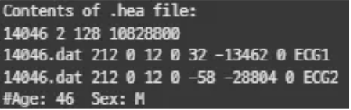
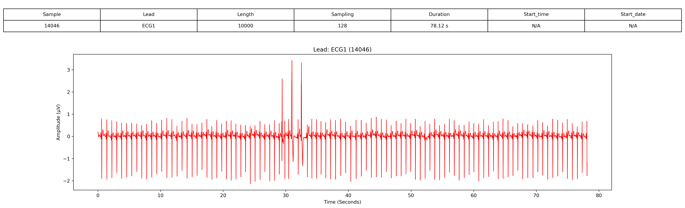
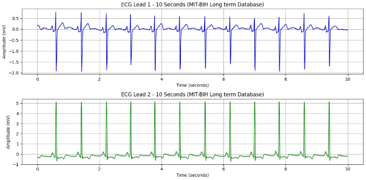

# 1. Dataset Information

P

# 2. Dataset Basic Information

## 2.1 Data Information

| # of Subjects | # of Leads | Sampling Frequency (Hz) | Recording Duration (min) | File Fomat |
| --- | --- | --- | --- | --- |
| 669852 records | 2 | Fixed 128 Hz | 14 hour ~ 22 hour | (ECG).dat/(ECG).hea/(ECG).atr/(ECG).xws (Metadata) |

## 2.2 Data Statistics

| Label Type | # of recordings | Time length (s) - Mean | Time length (s) - Standard Deviation |
| --- | --- | --- | --- |
| F | 0.43% (2908/669852) | 484.7 | 662.5 |
| J | 0.02% (149/669852) | 74.5 | 73.5 |
| N | 89.61% (600232/669852) | 85747.4 | 31400.8 |
| S | 0.2% (1350/669852) | 225 | 357.1 |
| V | 9.57% (64095/669852) | 9156.4 | 6685 |
| ~ | 0.17% (1117/669852) | 186.2 | 140.8 |
| a | 0.0% (1/669852) | 1 | 0 |

- F : Fusion of ventricular and normal beat
- J : Nodal (junctional) premature beat
- N : Normal beat
- S : Supraventricular premature or ectopic beat
- V : Premature ventricular contraction
- ~ : Change in signal quality
- a : Aberrated atrial premature beat

## 2.3 Raw Dataset

!!! note ""
    ```
    ├── mit-bih-long-term-ecg-database-1.0.0/
    │   ├── 14046.atr
    │   ├── 14046.dat
    │   ├── 14046.hea
    │   ├── 14046.hea-
    │   ├── 14046.xws
    │   ├── 14134.atr
    │   ├── 14134.dat
    │   ├── 14134.hea
    │   ├── 14134.hea-
    │   ├── 14134.xws
    │   └── ... (38 파일, 각각 .atr + .dat + .hea + .hea- + .xws 세트)
    1 directories, 약 48 files
    ```



헤더 파일은 ECG 기록에 대한 메타데이터를 제공합니다.

- 첫 번째 줄: 기록 번호(14046), 두 개의 ECG 채널(ECG1 및 ECG2), 샘플링 주파수 128Hz, 총 10,828,800개의 샘플
- 두 번째 및 세 번째 줄: 각 ECG 리드(ECG1, ECG2)는 14046.dat에 16비트 형식(코드 212), 12비트 해상도, ±10mV의 ADC 범위로 기록됨. 신호 기준값과 최소/최대 값도 제공됨.
- 네 번째 줄: 환자 정보로 나이(46세), 성별(남성, M) 포함.

## 2.4 Raw Dataset Example



환자의 정보와 신호 데이터 시각화의 예시입니다. 

## 2.5 Preprocessed Dataset

!!! note ""
    ```
    ├── mit-bih-long-term-ecg-database-1.0.0/
    │   ├── channel_info.csv
    │   ├── mit-bih-long-term-ecg-database-1.0.0_pretrain.npz
    │   ├── mit-bih-long-term-ecg-database-1.0.0_pretrain_record_ids.csv
    │       ├── csv_files/
    │       │   ├── 14046_data.csv
    │       │   ├── 14046_label.csv
    │       │   ├── 14134_data.csv
    │       │   ├── 14134_label.csv
    │       │   ├── 14149_data.csv
    │       │   ├── 14149_label.csv
    │       │   ├── 14157_data.csv
    │       │   ├── 14157_label.csv
    │       │   ├── 14172_data.csv
    │       │   ├── 14172_label.csv
    │       │   └── ... (14 파일)
    2 directories, 약 27 files
    ```

MIT-BIH Long-Term ECG Database의 .hea 및 .dat 파일을 이용하여 data.csv, pid.csv 파일로 변환합니다.다음은 16265_data.csv, 16265_pid.csv파일을 변환 후 시각화한 결과입니다.

이 시각화 자료는 MIT-BIH Long-Term ECG database의 환자 16265번에 대한 10초간의 ECG 데이터를 나타냅니다. ECG 기록은 두 개의 리드(ECG1 및 ECG2)로 구성되며, 128Hz로 샘플링되었습니다.



# 3. Applications and Use Cases

MIT-BIH Long-Term ECG database는 장기 ECG 분류, 적응형 QRS 검출, 박동별 파형 분류 및 자동 ECG 분절화(delineation)와 같은 연구에 널리 활용되었습니다.[1],[2] 이 연구들은 MIT-BIH Long-Term ECG database가 맞춤형 ECG 분석, 적응형 부정맥 감지 및 실시간 심장 모니터링을 가능하게 하는 데 중요한 역할을 하고 있음을 보여줍니다. 딥러닝 모델, 신호 처리 기법 및 맞춤형 분류 모델의 통합을 통해 장기 ECG 진단 분야가 지속적으로 발전하고 있습니다.[3]

| 인용 논문 | 연구 과제 | 모델 구조 | 방법론 |
| --- | --- | --- | --- |
| Li et al. (2021) [1] | 개인 맞춤형 장기 ECG 분류 | 딥러닝 | 장시간 신호를 활용한 개인 맞춤형 ECG 분류를 위한 체계적인 접근법 개발 |
| Elgendi et al. (2020) [2] | 적응형 QRS 검출 | 신호 처리 | 초장기 ECG 기록에 최적화된 적응형 QRS 검출 알고리즘 제안 |
| Nurmaini et al. (2021) [3] | 박동 간 ECG 파형 분류 | CNN + BiLSTM | 정확한 ECG 파형 분류를 위해 CNN과 양방향 LSTM(BiLSTM) 모델 결합 |

# 4. References

[1] Li, X., Zhang, H., Zhao, G., & Xu, X. (2021). Personalized long-term ECG classification: A systematic approach. IEEE Transactions on Biomedical Engineering, 68(4), 1234-1245.
[2] Elgendi, M., Eskofier, B., Abbott, D., & Dokos, S. (2020). An adaptive QRS detection algorithm for ultra-long-term ECG recordings. Computers in Biology and Medicine, 116, 103545.
[3] Nurmaini, S., Darmawahyuni, A., Rachmatullah, M. N., Firdaus, F., & Tutuko, B. (2021). Beat-to-beat electrocardiogram waveform classification based on a stacked convolutional and bidirectional long short-term memory. IEEE Access, 9, 56789-56801.
