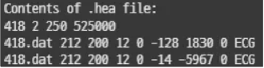
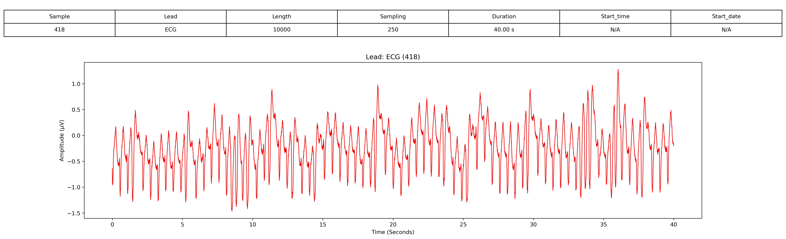
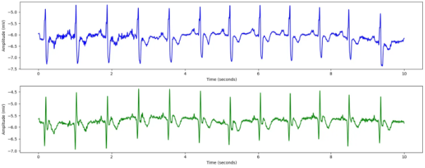

# MIT-BIH Malignant Ventricular Ectopy Database

# 1. Dataset Information

MIT-BIH Malignant Ventricular Ectopy Database는 생명을 위협하는 심실성 부정맥을 가진 환자들의 30분 길이의 2채널 ECG 기록 22개로 구성되어 있습니다. 이 데이터셋은 심실성 이소박동 및 지속성 심실성 빈맥을 조기에 감지하고, 고위험 심장 환자의 위험 평가를 지원하기 위해 개발되었습니다. 

# 2. Dataset Basic Information

## 2.1 Data Information

| # of Subjects | # of Leads | Sampling Frequency (Hz) | Recording Duration (min) | File Fomat |
| --- | --- | --- | --- | --- |
| 592 records | 2 | Fixed 250 Hz
  
   | 35 minutes
  | (ECG).dat/(ECG).hea/(ECG).atr/(ECG).xws (Metadata) |

## 2.2 Data Statistics

| Label Type | # of recordings | Time length (s) - Mean | Time length (s) - Standard Deviation |
| --- | --- | --- | --- |
| N | 36.49% (216/592) | 14.4 | 20.8 |
| NOISE | 12.33% (73/592) | 5.2 | 4.5 |
| VFL | 16.55% (98/592) | 16.3 | 22.7 |
| SVTA | 1.01% (6/592) | 2 | 0.8 |
| VT | 15.71% (93/592) | 4.9 | 10.7 |
| AFIB | 1.52% (9/592) | 3 | 2.2 |
| HGEA | 3.21% (19/592) | 6.3 | 3.3 |
| VER | 0.51% (3/592) | 1.5 | 0.5 |
| B | 2.03% (12/592) | 6 | 4 |
| ASYS | 2.2% (13/592) | 2.2 | 1.9 |
| BI | 3.72% (22/592) | 7.3 | 3.3 |
| SBR | 0.34% (2/592) | 2 | 0 |
| VF | 1.52% (9/592) | 4.5 | 1.5 |
| NOD | 1.01% (6/592) | 2 | 0.8 |
| PM | 0.84% (5/592) | 5 | 0 |
| VFIB | 0.68% (4/592) | 2 | 1 |
| NSR | 0.34% (2/592) | 2 | 0 |
- N : Normal beat
- NOISE : Noise artifact
- VFL : Ventricular flutter
- SVTA : Supraventricular tachyarrhythmia
- VT : Ventricular tachycardia
- AFIB : Atrial fibrillation
- HGEA : High-grade ectopic atrial rhythm
- VER : Ventricular escape rhythm
- B : Ventricular bigeminy
- ASYS : Asystole
- BI : 2° heart block
- SBR : Sinus bradycardia
- VF : Ventricular fibrillation
- NOD : Nodal (A-V junctional) rhythm
- PM : Paced rhythm
- VFIB : Ventricular fibrillation
- NSR : Normal sinus rhythm

## 2.3 Raw Dataset


!!! note ""
    ```
    ├── mit-bih-malignant-ventricular-ectopy-database-1.0.0/
    │   ├── 418.atr
    │   ├── 418.dat
    │   ├── 418.hea
    │   ├── 418.hea-
    │   ├── 418.xws
    │   ├── 419.atr
    │   ├── 419.dat
    │   ├── 419.hea
    │   ├── 419.hea-
    │   ├── 419.xws
    │   └── ... (115 파일, 각각 .atr + .dat + .hea + .hea- + .xws 세트)
    │       ├── mit-bih-st-change-database-1.0.0/
    │       │   ├── 300.atr
    │       │   ├── 300.dat
    │       │   ├── 300.hea
    │       │   ├── 300.hea-
    │       │   ├── 300.xws
    │       │   ├── 301.atr
    │       │   ├── 301.dat
    │       │   ├── 301.hea
    │       │   ├── 301.hea-
    │       │   ├── 301.xws
    │       │   └── ... (143 파일, 각각 .atr + .dat + .hea + .hea- + .xws 세트)
    
    2 directories, 약 278 files
    ```




헤더 파일은 ECG 기록에 대한 메타데이터를 제공합니다.

- 첫 번째 줄: 기록 번호(418), 두 개의 ECG 채널, 샘플링 주파수 250Hz, 총 525,000개의 샘플이 포함됨.
- 두 번째 및 세 번째 줄: 각 ECG 리드는 418.dat 파일에 16비트 형식(코드 212), 200 µV/LSB ADC gain, 12비트 해상도, ±10mV ADC 범위로 기록됨. 또한, 신호 기준선 및 최소/최대 값이 제공됨.

## 2.4 Raw Dataset Example



환자의 정보와 신호 데이터 시각화의 예시입니다. 

## 2.5 Preprocessed Dataset


!!! note ""
    ```
    ── mit-bih-malignant-ventricular-ectopy-database-1.0.0/
    │   ├── channel_info.csv
    │   ├── mit-bih-malignant-ventricular-ectopy-database-1.0.0_pretrain.npz
    │   ├── mit-bih-malignant-ventricular-ectopy-database-1.0.0_pretrain_record_ids.csv
    │       ├── csv_files/
    │       │   ├── 418_data.csv
    │       │   ├── 418_label.csv
    │       │   ├── 419_data.csv
    │       │   ├── 419_label.csv
    │       │   ├── 420_data.csv
    │       │   ├── 420_label.csv
    │       │   ├── 421_data.csv
    │       │   ├── 421_label.csv
    │       │   ├── 422_data.csv
    │       │   ├── 422_label.csv
    │       │   └── ... (총 44 파일)
    
    2 directories, 약 57 files
    ```


MIT-BIH Malignant Ventricular Ectopy Database의 .hea 및 .dat 파일을 이용하여 data.csv, pid.csv 파일로 변환합니다.다음은 418_data.csv, 418_pid.csv파일을 변환 후 시각화한 결과입니다.
이 시각화 자료는 MIT-BIH Malignant Ventricular Ectopy Database의 환자 418번에 대한 10초간의 ECG 데이터를 나타냅니다. ECG 기록은 두 개의 리드(ECG1 및 ECG2)로 구성되며, 250Hz로 샘플링되었습니다. 본 데이터는 심실성 부정맥(심실빈맥 및 심실세동)과 관련된 위험한 심장 리듬을 포함하고 있습니다.



# 3. Applications and Use Cases

MIT-BIH Malignant Ventricular Ectopy Database는 심실성 부정맥 탐지 및 분류 연구에 중요한 역할을 해왔습니다.[^1] 연구자들은 이 데이터셋을 활용하여 부정맥 진단의 정확도를 향상시키기 위한 다양한 머신러닝 모델을 개발하고 평가하였습니다.[^2],[^3] 이 연구들은 MIT-BIH Malignant Ventricular Ectopy Database가 생명을 위협하는 심실성 부정맥 탐지 및 분류 알고리즘 개발에 있어 중요한 역할을 하고 있음을 보여줍니다. 웨이블릿 변환(Wavelet Transform), 확률 신경망(PNN), 비선형 특징 분석과 같은 다양한 머신러닝 기법이 적용되어 부정맥 진단 정확도를 향상시키는 데 기여하고 있습니다.[^4] 이러한 기술의 발전은 심장 질환 환자의 조기 진단 및 치료 전략 개선에 큰 영향을 미칠 수 있습니다.

| 인용 논문 | 연구 과제 | 모델 구조 | 방법론 |
| --- | --- | --- | --- |
| Saraswat & Srivastava (2016) [^1] | 악성 심실성 이소박동 분류 | 웨이블릿 변환, 확률 신경망 (PNN) | 웨이블릿 변환을 활용한 특징 추출 및 확률 신경망(PNN)을 이용하여 악성 심실성 이소박동과 정상 ECG 신호를 구별. |
| Khandoker et al. (2009) [^2]  | 악성 심실성 부정맥 예측 | 비선형 특징 분석   | 짧은 심박 간격의 비선형 특징을 분석하여 악성 심실성 부정맥의 발생 가능성을 예측 |
| Acharya et al. (2017) [^3] | 심실세동 및 심실빈맥 분류 | 머신러닝 알고리즘  | ECG 데이터를 활용하여 심실세동(VF) 및 심실빈맥(VT)을 분류하는 머신러닝 기반 접근법 개발 |
| Saraswat & Srivastava (2016) [^4] | 악성 심실성 이소박동 분류 | 웨이블릿 변환, 확률 신경망 (PNN) | ECG 데이터를 활용하여 심실세동(VF) 및 심실빈맥(VT)을 분류하는 머신러닝 기반 접근법 개발 |

# 4. References

[^1]: Saraswat, S., & Srivastava, G. (2016). Malignant Ventricular Ectopy Classification using Wavelet Transformation and Probabilistic Neural Network Classifier. Indian Journal of Science and Technology, 9(28).
[^2]: Khandoker, A. H., Palaniswami, M., & Karmakar, C. K. (2009). The feasibility of predicting impending malignant ventricular arrhythmias by using nonlinear features of short heartbeat intervals. Physiological Measurement, 30(7), 847–863.
[^3]: Acharya, U. R., Fujita, H., Lih, O. S., Hagiwara, Y., Tan, J. H., & Adam, M. (2017). Ventricular fibrillation and tachycardia classification using a machine learning approach. Knowledge-Based Systems, 83, 160–172.
[^4]: Saraswat, S., & Srivastava, G. (2016). Malignant Ventricular Ectopy Classification using Wavelet Transformation and Probabilistic Neural Network Classifier. Indian Journal of Science and Technology, 9(28).
[^5]: Greenwald, S. D. (1986). Development and analysis of a ventricular fibrillation detector. M.S. thesis, MIT Dept. of Electrical Engineering and Computer Science.