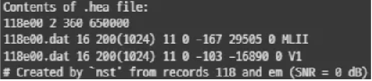
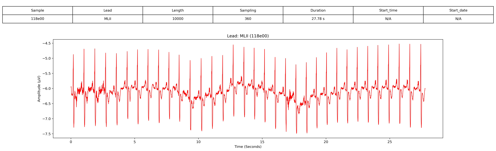
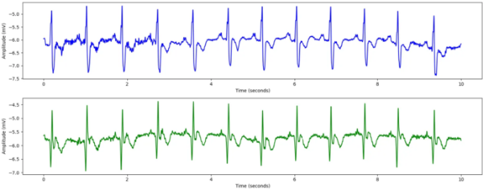

# MIT-BIH Noise Stress Test Database

# 1. Dataset Information

MIT-BIH noise stress database는 실제 환경에서 발생하는 다양한 노이즈 조건에서 ECG 분석 알고리즘의 강건성을 평가하기 위해 설계된 특수 데이터셋입니다. MIT-BIH arrthymia databse의 깨끗한 ECG 기록에 다양한 유형의 노이즈를 추가하여 실제 모니터링에서 발생할 수 있는 문제를 시뮬레이션하였습니다.

# 2. Dataset Basic Information

## 2.1 Data Information

| # of Subjects | # of Leads | Sampling Frequency (Hz) | Recording Duration (min) | File Fomat |
| --- | --- | --- | --- | --- |
| 26370 records | 2 | Fixed 360 Hz
  
   | 30 minutes
  | (ECG).dat/(ECG).hea/(ECG).atr/(ECG).xws (Metadata)                               bw.dat/bw.hea/bw.xws em.dat/em.hea/em.xws ma.dat/ma.hea/ma.xws (noise) |

## 2.2 Data Statistics

| Label Type | # of recordings | Time length (s) - Mean | Time length (s) - Standard Deviation |
| --- | --- | --- | --- |
| + | 2.37% (624/26370) | 52 | 51 |
| A | 2.18% (576/26370) | 96 | 0 |
| R | 49.28% (12996/26370) | 2166 | 0 |
| V | 10.47% (2760/26370) | 230 | 214 |
| x | 0.23% (60/26370) | 10 | 0 |
| ~ | 0.36% (96/26370) | 8 | 4 |
| N | 35.11% (9258/26370) | 1543 | 0 |
- + : Rhythm change annotation
- A : Atrial premature beat
- R : Right bundle branch block beat
- V : Premature ventricular contraction
- x : Non-conducted P-wave (blocked APC)
- ~ : Change in signal quality
- N : Normal beat

## 2.3 Raw Dataset


!!! note ""
    ```
    ├── mit-bih-noise-stress-test-database-1.0.0/
    │   ├── 118e00.atr
    │   ├── 118e00.dat
    │   ├── 118e00.hea
    │   ├── 118e00.xws
    │   ├── 118e06.atr
    │   ├── 118e06.dat
    │   ├── 118e06.hea
    │   ├── 118e06.xws
    │   ├── 118e12.atr
    │   ├── 118e12.dat
    │   └── ... (67 파일, 각각 .atr + .dat + .hea + .xws 세트)
    │       ├── old/
    │       │   ├── 118_02.dat
    │       │   ├── 118_02.hea
    │       │   ├── 118_04.dat
    │       │   ├── 118_04.hea
    │       │   ├── 118_06.dat
    │       │   ├── 118_06.hea
    │       │   ├── 118_08.dat
    │       │   ├── 118_08.hea
    │       │   ├── 118_10.dat
    │       │   ├── 118_10.hea
    │       │   └── ... (31 파일, 각각 .dat + .hea 세트)
    
    2 directories, 약 118 files
    ```




헤더 파일은 ECG 기록에 대한 메타데이터를 제공합니다.

- 첫 번째 줄: 기록 번호(118e00), 두 개의 ECG 채널(MLII 및 V1), 샘플링 주파수 360Hz, 총 650,000개의 샘플이 포함됨.
- 두 번째 및 세 번째 줄: 각 ECG 리드(MLII, V1)는 118e00.dat 파일에 16비트 형식(코드 16), 200 µV/LSB ADC gain, 11비트 해상도, ±10mV ADC 범위로 기록됨. 또한, 신호 기준선 및 최소/최대 값이 제공됨.
- 네 번째 줄: 이 기록은 MIT-BIH noise stress database에서 생성된 것으로, MIT-BIH Arrythmia database의 118번 기록에 0dB SNR의 전극 움직임(EM) 잡음을 추가하여 제작되었음을 나타냄.

## 2.4 Raw Dataset Example



환자의 정보와 신호 데이터 시각화의 예시입니다. 

## 2.5 Preprocessed Dataset


!!! note ""
    ```
    ├── mit-bih-noise-stress-test-database-1.0.0/
    │   ├── channel_info.csv
    │   ├── mit-bih-noise-stress-test-database-1.0.0_pretrain.npz
    │   ├── mit-bih-noise-stress-test-database-1.0.0_pretrain_record_ids.csv
    │       ├── csv_files/
    │       │   ├── 118e00_data.csv
    │       │   ├── 118e00_label.csv
    │       │   ├── 118e06_data.csv
    │       │   ├── 118e06_label.csv
    │       │   ├── 118e12_data.csv
    │       │   ├── 118e12_label.csv
    │       │   ├── 118e18_data.csv
    │       │   ├── 118e18_label.csv
    │       │   ├── 118e24_data.csv
    │       │   ├── 118e24_label.csv
    │       │   └── ... (27 파일)
    
    2 directories, 약 40 files
    ```


MIT-BIH noise stress database의 .hea 및 .dat 파일을 이용하여 data.csv, pid.csv 파일로 변환합니다. 다음은 118_data.csv, 118_pid.csv파일을 변환 후 시각화한 결과입니다.
이 시각화 자료는 MIT-BIH noise stress database의 환자 118번에 대한 10초간의 ECG 데이터를 나타냅니다. ECG 기록은 두 개의 리드(ECG1 및 ECG2)로 구성되며, 360Hz로 샘플링되었습니다. 본 데이터는 다양한 유형의 노이즈(Baseline wander, Muscle Artifact, Electrode Motion noise)가 추가된 상태에서 수집되었습니다.



# 3. Applications and Use Cases

MIT-BIH noise stress database는 ECG 신호 노이즈 제거, 부정맥 탐지, 노이즈 강인성 알고리즘 개발과 관련된 연구에서 중요한 역할을 해왔습니다.[^1],[^2],[^3],[^4],[^5],[^6] 이 데이터베이스는 기저선 변동(BW), 근육 잡음(MA), 전극 움직임(EM)과 같은 노이즈 유형에 대한 강건성을 평가할 수 있는 표준화된 벤치마크를 제공합니다.

| 인용 논문 | 연구 과제 | 모델 구조 | 방법론 |
| --- | --- | --- | --- |
| Li et al. (2022) [^1]  | ECG 노이즈 제거 | 딥 스코어 기반 확산 모델 | DeScoD-ECG를 활용하여 ECG 신호의 기저선 변동 및 노이즈 제거 기법 개발 |
| Romero et al. (2021) [^2] | 기저선 변동 제거 | 딥러닝 필터 | DeepFilter를 활용하여 딥러닝 기반 기저선 변동 노이즈 필터링 기법 제안 |
| Fan et al. (2023) [^3] | 부정맥 인식 | 노이즈 대응 알고리즘 | 고성능 노이즈 대응 부정맥 인식 알고리즘 설계 |
| Solosenko et al. (2022) [^4] | ECG 및 PPG 신호 시뮬레이션 | 신호 모델링 | 부정맥 에피소드 및 노이즈가 포함된 ECG 및 PPG 신호를 시뮬레이션하는 모델 개발 |
| Chatterjee & Thakur (2020) [^5] | 노이즈 제거 기법 리뷰 | 비교 분석 | ECG 신호의 다양한 노이즈 제거 기법을 종합적으로 분석 |
| Sarafan et al. (2022) [^6] | ECG 노이즈 제거 | 앙상블 칼만 필터 | 앙상블 칼만 필터를 활용한 새로운 ECG 노이즈 제거 기법 제안 |
| Moody et al. (1984) [^7] | 부정맥 탐지기 평가 | 통계적 분석 | 다양한 노이즈 환경에서 부정맥 탐지기의 성능을 평가하기 위한 노이즈 스트레스 테스트 도입 |

# 4. References

[^1]: Li, H., Ditzler, G., Roveda, J., & Li, A. (2022). DeScoD-ECG: Deep Score-Based Diffusion Model for ECG Baseline Wander and Noise Removal. arXiv preprint arXiv:2208.00542.

[^2]: Romero, F. P., Piñol, D. C., & Vázquez Seisdedos, C. R. (2021). DeepFilter: an ECG baseline wander removal filter using deep learning techniques. arXiv preprint arXiv:2101.03423.

[^3]: Fan, W., Si, Y., Yang, W., Sun, M., & Liu, X. (2023). A High-Performance Anti-Noise Algorithm for Arrhythmia Recognition. Sensors, 24(14), 4558.

[^4]: Solosenko, A., Petrėnas, A., Paliakaitė, B., Marozas, V., & Sörnmo, L. (2022). Model for Simulating ECG and PPG Signals with Arrhythmia Episodes. PhysioNet.

[^5]: Chatterjee, S., & Thakur, R. S. (2020). Review of noise removal techniques in ECG signals. IET Signal Processing, 14(9), 569-590.

[^6]: Sarafan, S., Vuong, H., Jilani, D., Malhotra, S., Lau, M. P. H., Vishwanath, M., Ghirmai, T., & Cao, H. (2022). A Novel ECG Denoising Scheme Using the Ensemble Kalman Filter. arXiv preprint arXiv:2207.11819.

[^7]: Moody, G. B., Muldrow, W. E., & Mark, R. G. (1984). A noise stress test for arrhythmia detectors. Computers in Cardiology, 11(3), 381-384.