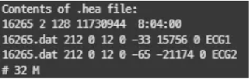
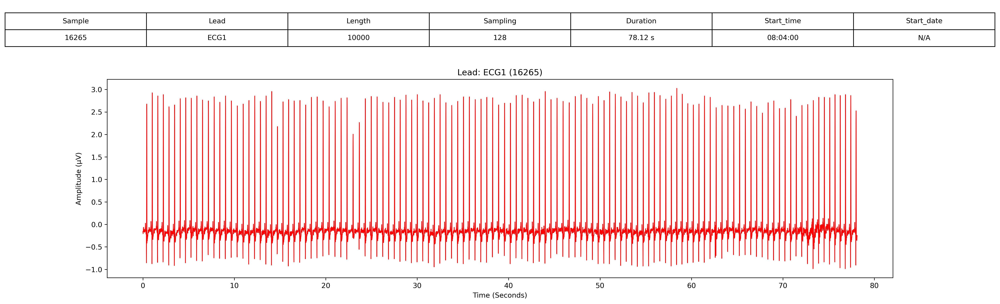
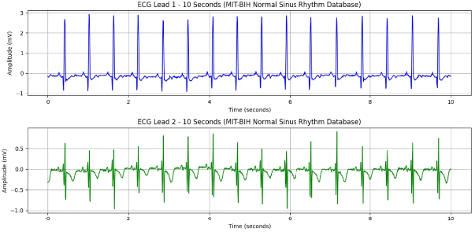

# 1. Dataset Information

MIT-BIH Normal Sinus Rhythm database는 정상 동리듬을 가진 18명의 장시간 ECG 기록으로 구성되어 있으며, 정상 및 비정상 심장 리듬을 비교하는 연구의 대조군 데이터셋으로 사용됩니다. 이 데이터는 Boston Beth Israel 병원에서 수집되었으며, 하루 동안 지속적으로 기록된 ECG 신호를 포함하고 있습니다.

# 2. Dataset Basic Information

## 2.1 Data Information

| # of Subjects | # of Leads | Sampling Frequency (Hz) | Recording Duration (min) | File Fomat |
| --- | --- | --- | --- | --- |
| 1806792 records | 2 | Fixed 128 Hz | Max 24 hour | (ECG).dat/(ECG).hea/(ECG).atr/(ECG).xws (Metadata) |

## 2.2 Data Statistics

| Label Type | # of recordings | Time length (s) - Mean | Time length (s) - Standard Deviation |
| --- | --- | --- | --- |
| N | 95.72% (1729502/1806792) | 96083.4 | 10689.7 |
| S | 0.01% (91/1806792) | 6.1 | 6.7 |
| \| | 3.88% (70068/1806792) | 3892.7 | 8061 |
| ~ | 0.39% (7095/1806792) | 394.2 | 457.1 |
| V | 0.0% (26/1806792) | 5.2 | 5.4 |
| F | 0.0% (8/1806792) | 4 | 2 |
| J | 0.0% (2/1806792) | 2 | 0 |

- N : Normal beat
- S : Supraventricular premature or ectopic beat
- | : Measurement annotation
- ~ : Change in signal quality
- V : Premature ventricular contraction
- F : Fusion of ventricular and normal beat
- J : Nodal (junctional) premature beat

## 2.3 Raw Dataset

!!! note ""
    ```
    ├── mit-bih-normal-sinus-rhythm-database-1.0.0/
    │   ├── 16265.atr
    │   ├── 16265.dat
    │   ├── 16265.hea
    │   ├── 16265.hea-
    │   ├── 16265.xws
    │   ├── 16272.atr
    │   ├── 16272.dat
    │   ├── 16272.hea
    │   ├── 16272.hea-
    │   ├── 16272.xws
    │   └── ... (97 파일, 각각 .atr + .dat + .hea + .hea- + .xws 세트)
    1 directories, 약 107 files
    ```



헤더 파일은 ECG 기록에 대한 메타데이터를 제공합니다.

- 첫 번째 줄: 기록 번호(16265), 두 개의 ECG 채널(ECG1 및 ECG2), 샘플링 주파수 128Hz, 총 11,730,944개의 샘플
- 두 번째 및 세 번째 줄: 각 ECG 리드(ECG1, ECG2)는 16265.dat에 16비트 형식(코드 212), 12비트 해상도, ±10mV의 ADC 범위로 기록됨. 신호 기준값과 최소/최대 값도 제공.
- 네 번째 줄: 환자 정보로 나이(32세), 성별(남성, M) 포함.
위의 사진은 PhysioNet 2017의 A00001.hea의 내용입니다. 05:05:15는 Start time, 1/05/2000은 Start date를 의미합니다. REFERENCE-original.csv 파일에 annotation이 들어있습니다. 각 파일 내의 특정 시점마다 symbol이 적혀 있는 다른 데이터셋들과 달리 시점이 아닌 파일 자체에 symbol이 부여되어 있습니다.

## 2.4 Raw Dataset Example



환자의 정보와 신호 데이터 시각화의 예시입니다. 

## 2.5 Preprocessed Dataset

!!! note ""
    ```
    ├── mit-bih-normal-sinus-rhythm-database-1.0.0/
    │   ├── channel_info.csv
    │   ├── mit-bih-normal-sinus-rhythm-database-1.0.0_pretrain.npz
    │   ├── mit-bih-normal-sinus-rhythm-database-1.0.0_pretrain_record_ids.csv
    │       ├── csv_files/
    │       │   ├── 16265_data.csv
    │       │   ├── 16265_label.csv
    │       │   ├── 16272_data.csv
    │       │   ├── 16272_label.csv
    │       │   ├── 16273_data.csv
    │       │   ├── 16273_label.csv
    │       │   ├── 16420_data.csv
    │       │   ├── 16420_label.csv
    │       │   ├── 16483_data.csv
    │       │   ├── 16483_label.csv
    │       │   └── ... (36 파일)
    2 directories, 약 49 files
    ```

MIT-BIH Normal Sinus Rhythm database의 .hea 및 .dat 파일을 이용하여 data.csv, pid.csv 파일로 변환합니다.다음은 16265_data.csv, 16265_pid.csv파일을 변환 후 시각화한 결과입니다.

이 시각화 자료는 MIT-BIH Normal Sinus Rhythm database의 환자 16265번에 대한 10초간의 ECG 데이터를 나타냅니다. ECG 기록은 두 개의 리드(ECG1 및 ECG2)로 구성되며, 128Hz로 샘플링되었습니다. 본 데이터는 정상적인 동리듬을 가진 건강한 성인의 ECG 신호를 포함하며, 심장 박동의 정상 패턴을 연구하는 데 사용됩니다.



# 3. Applications and Use Cases

MIT-BIH Normal Sinus Rhythm database는 동리듬 분석 및 감지, ECG 신호 처리 연구에서 활용되고 있습니다. [1],[2] 이 연구들은 MIT-BIH Normal Sinus Rhythm database가 동리듬 감지, ECG 특징 추출 및 심장 신호 처리를 위한 참조 데이터셋으로서 중요한 역할을 한다는 점을 보여줍니다.

| 인용 논문 | 연구 과제 | 모델 구조 | 방법론 |
| --- | --- | --- | --- |
| Huang et al. (2010) [1] | AF에서 정상 동리듬 전환 감지 | 신호 처리 | 심방세동과 정상 동리듬 간의 전환을 감지하는 새로운 방법을 개발함 |
| Sharma et al. (2012) [2] | ECG 리샘플링 및 균일 샘플링 | 데이터 처리 | ECG 파형을 원하는 간격으로 균일하게 리샘플링하는 기법을 제안함 |
|  |  |  |  |
|  |  |  |  |
|  |  |  |  |
|  |  |  |  |

# 4. References

[1] Huang, Chao, et al. "A novel method for detection of the transition between atrial fibrillation and sinus rhythm." IEEE Transactions on Biomedical Engineering58.4 (2010): 1113-1119.

[2] Sharma, Jitu, et al. "Uniform sampling of ECG waveform of MIT-BIH normal sinus rhythm database at desired intervals." International Journal of Computer Applications50.15 (2012).
