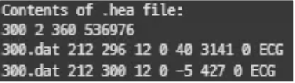
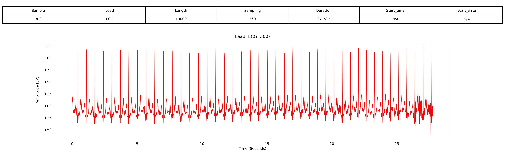
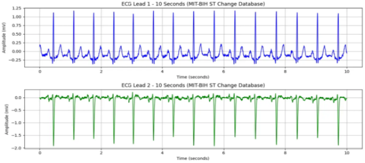

# 1. Dataset Information

MIT-BIH ST Change Database는 28개의 1.09시간~10.7분 길이의 두개 채널(2-channel) 심전도(ECG) 기록으로 구성되어 있으며, 허혈, 전도 이상 및 기타 심장 질환과 관련된 ST 분절 변화를 연구하기 위해 선정되었습니다. 이 데이터셋은 ST 분절의 상승 및 하강과 같은 중요한 심근 허혈 및 심근 경색의 지표를 연구하는 데 사용됩니다. 

# 2. Dataset Basic Information

## 2.1 Data Information

| # of Subjects | # of Leads | Sampling Frequency (Hz) | Recording Duration (min) | File Fomat |
| --- | --- | --- | --- | --- |
| 76181 records | 2 | Fixed 360 Hz | 1.09 hour~10.7 minutes | (ECG).dat/(ECG).hea/(ECG).atr/(ECG).xws (Metadata) |

## 2.2 Data Statistics

| Label Type | # of recordings | Time length (s) - Mean | Time length (s) - Standard Deviation |
| --- | --- | --- | --- |
| N | 98.5% (75038/76181) | 2679.9 | 1238.1 |
| S | 1.07% (815/76181) | 62.7 | 124 |
| V | 0.42% (322/76181) | 24.8 | 69.5 |
| ~ | 0.01% (6/76181) | 6 | 0 |

- N : Normal beat
- S : Supraventricular premature or ectopic beat
- V : Premature ventricular contraction
- ~ : Change in signal quality

## 2.3 Raw Dataset

!!! note ""
     ├── mit-bih-st-change-database-1.0.0/
     │   ├── 300.atr
     │   ├── 300.dat
     │   ├── 300.hea
     │   ├── 300.hea-
     │   ├── 300.xws
     │   ├── 301.atr
     │   ├── 301.dat
     │   ├── 301.hea
     │   ├── 301.hea-
     │   ├── 301.xws
     │   └── ... (143 파일, 각각 .atr + .dat + .hea + .hea- + .xws 세트)
    3 directories, 약 329 files

헤더 파일은 ECG 기록에 대한 메타데이터를 제공합니다.
- 첫 번째 줄: 환자 번호(300), 두 개의 ECG 채널, 샘플링 주파수 360Hz, 총 536,976개의 샘플로 구성됩니다.
- 두 번째 및 세 번째 줄: 각 ECG 리드는 300.dat 파일에 16비트 형식(코드 212), 296 µV/LSB 및 300 µV/LSB ADC gain, 12비트 해상도, ±10mV의 ADC 범위로 기록되었습니다. 또한 신호의 기준값과 최소/최대 값이 제공됩니다.

## 2.4 Raw Dataset Example

환자의 정보와 신호 데이터 시각화의 예시입니다. 

## 2.5 Preprocessed Dataset

!!! note ""
     ├── mit-bih-st-change-database-1.0.0/
     │   ├── channel_info.csv
     │   ├── mit-bih-st-change-database-1.0.0_pretrain.npz
     │   ├── mit-bih-st-change-database-1.0.0_pretrain_record_ids.csv
     │       ├── csv_files/
     │       │   ├── 300_data.csv
     │       │   ├── 300_label.csv
     │       │   ├── 301_data.csv
     │       │   ├── 301_label.csv
     │       │   ├── 302_data.csv
     │       │   ├── 302_label.csv
     │       │   ├── 303_data.csv
     │       │   ├── 303_label.csv
     │       │   ├── 304_data.csv
     │       │   ├── 304_label.csv
     │       │   └── ... (56 파일)
    2 directories, 약 69 files

MIT-BIH ST Change Database의 .hea 및 .dat 파일을 이용하여 data.csv, pid.csv 파일로 변환합니다.다음은 313_data.csv, 313_pid.csv파일을 변환 후 시각화한 결과입니다.
이 시각화 자료는 MIT-BIH ST Change Database의 환자 313번에 대한 10초간의 ECG 데이터를 나타냅니다. ECG 기록은 두 개의 리드(ECG1 및 ECG2)로 구성되며, 360Hz로 샘플링되었습니다. 본 데이터는 ST 분절 변화(ST elevation 및 ST depression)를 포함하여 허혈성 심장질환 및 기타 심전도 이상 패턴을 분석하는 데 사용됩니다.

# 3. Applications and Use Cases

MIT-BIH ST Change Database는 ST 분절 편차 감지, ECG 기반 생체 인증, ECG 신호 처리 연구에서 중요한 역할을 해왔습니다.[1],[2] 이 연구들은 MIT-BIH ST Change Database의 생체 인증, 실시간 모니터링, 잡음 감지 및 QRS 복합파 검출 분야에서의 활용 가능성을 입증합니다.[3],[4] 해당 데이터베이스는 ECG 신호 분석 및 임상 진단 향상에 중요한 역할을 하고 있습니다.

| 인용 논문 | 연구 과제 | 모델 구조 | 방법론 |
| --- | --- | --- | --- |
| Zhang et al. (2017) [1] | ECG 기반 생체 인증 | 다중 해상도 CNN | 강력한 ECG 생체 인증을 위한 HeartID CNN 모델 개발 |
| Elgendi (2013) [2] | 빠른 QRS 검출 | 지식 기반 방법 | 11개의 ECG 데이터베이스에서 평가된 최적화된 QRS 검출 알고리즘 제안 |
| Zhao et al. (2017) [3] | ECG 잡음 검출 및 분류 | 머신러닝 | 의료 모니터링을 위한 자동화된 ECG 잡음 분류 시스템 구축 |
| Deshmane & Madhe (2019) [4] | ECG 기반 개인 식별 | 스펙트럼 상관분석 및 딥러닝 | 스펙트럼 상관 기술과 딥러닝을 결합한 신원 확인 방법 개발 |

# 4. References

[1] Zhang, Qingxue, Dian Zhou, and Xuan Zeng. "HeartID: A multiresolution convolutional neural network for ECG-based biometric human identification in smart health applications." Ieee Access5 (2017): 11805-11816.
[2] Elgendi, Mohamed. "Fast QRS detection with an optimized knowledge-based method: Evaluation on 11 standard ECG databases." PloS one8.9 (2013): e73557.
[3] Satija, Udit, Barathram Ramkumar, and M. Sabarimalai Manikandan. "Automated ECG noise detection and classification system for unsupervised healthcare monitoring." IEEE Journal of biomedical and health informatics22.3 (2017): 722-732.
[4] Abdeldayem, Sara S., and Thirimachos Bourlai. "A novel approach for ECG-based human identification using spectral correlation and deep learning." IEEE Transactions on Biometrics, Behavior, and Identity Science2.1 (2019): 1-14.
[5] Albrecht, Paul. ST segment characterization for long term automated ECG analysis. Diss. Massachusetts Institute of Technology, Department of Electrical Engineering and Computer Science, 1983.
