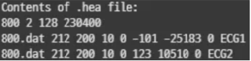
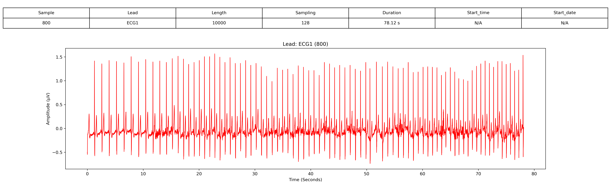
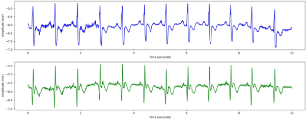

# 1. Dataset Information

MIT-BIH supraventricular arrhythmia database는 78개의 30분 길이 ECG 기록으로 구성되어 있으며, 특히 심방 및 방실 접합부 이소성 박동을 포함하는 대표적인 데이터셋을 제공하기 위해 선정되었습니다.

# 2. Dataset Basic Information

## 2.1 Data Information

| # of Subjects | # of Leads | Sampling Frequency (Hz) | Recording Duration (min) | File Fomat |
| --- | --- | --- | --- | --- |
| 187877 records | 2 | Fixed 128 Hz | 30 minutes | (ECG).dat/(ECG).hea/(ECG).atr/(ECG).xws (Metadata) |

## 2.2 Data Statistics

| Label Type | # of recordings | Time length (s) - Mean | Time length (s) - Standard Deviation |
| --- | --- | --- | --- |
| N | 86.41% (162339/187877) | 2081.3 | 485.9 |
| S | 6.49% (12188/187877) | 167 | 261.9 |
| V | 5.29% (9943/187877) | 148.4 | 174.9 |
| F | 0.01% (23/187877) | 3.8 | 5.9 |
| \| | 1.18% (2211/187877) | 48.1 | 102 |
| J | 0.0% (9/187877) | 9 | 0 |
| ~ | 0.58% (1082/187877) | 25.2 | 26.5 |
| Q | 0.04% (79/187877) | 4 | 5.1 |
| B | 0.0% (1/187877) | 1 | 0 |
| a | 0.0% (1/187877) | 1 | 0 |
| + | 0.0% (1/187877) | 1 | 0 |

- N : Normal beat
- S : Supraventricular premature or ectopic beat
- V : Premature ventricular contraction
- F : Fusion of ventricular and normal beat
- | : Measurement annotation
- J : Nodal (junctional) premature beat
- ~ : Change in signal quality
- Q : Unclassifiable beat
- B : Bundle branch block beat
- a : Aberrated atrial premature beat
- + : Rhythm change annotation

## 2.3 Raw Dataset

!!! note ""
     ├── mit-bih-supraventricular-arrhythmia-database-1.0.0/
     │   ├── 800.atr
     │   ├── 800.dat
     │   ├── 800.hea
     │   ├── 800.hea-
     │   ├── 800.xws
     │   ├── 801.atr
     │   ├── 801.atr-
     │   ├── 801.dat
     │   ├── 801.hea
     │   ├── 801.hea-
     │   └── ... (417 파일, 각각 .atr + .dat + .hea + .hea- + .xws 세트)
    1 directories, 약 427 files

헤더 파일은 ECG 기록에 대한 메타데이터를 제공합니다.
- 첫 번째 줄: 기록 번호(04043), 두 개의 ECG 채널, 샘플링 주파수 250Hz, 총 9,205,760개의 샘플, 그리고 기록 시작 시간(15:00:00)이 포함됩니다. ECG 신호는 약 10시간 14분 동안 250Hz로 샘플링되었습니다.
- 두 번째 및 세 번째 줄: 각 ECG 리드(ECG1, ECG2)는 04043.dat 파일에 16비트 형식(코드 212), 12비트 해상도, ±10mV ADC 범위로 저장됩니다. 또한, ADC 기준값 및 최소/최대 신호 진폭이 제공됩니다.

## 2.4 Raw Dataset Example

환자의 정보와 신호 데이터 시각화의 예시입니다. 

## 2.5 Preprocessed Dataset

!!! note ""
     ├── mit-bih-supraventricular-arrhythmia-database-1.0.0/
     │   ├── channel_info.csv
     │   ├── mit-bih-supraventricular-arrhythmia-database-1.0.0_pretrain.npz
     │   ├── mit-bih-supraventricular-arrhythmia-database-1.0.0_pretrain_record_ids.csv
     │       ├── csv_files/
     │       │   ├── 800_data.csv
     │       │   ├── 800_label.csv
     │       │   ├── 801_data.csv
     │       │   ├── 801_label.csv
     │       │   ├── 802_data.csv
     │       │   ├── 802_label.csv
     │       │   ├── 803_data.csv
     │       │   ├── 803_label.csv
     │       │   ├── 804_data.csv
     │       │   ├── 804_label.csv
     │       │   └── ... (156 파일)

MIT-BIH Supraventricular Arrhythmia database의 .hea 및 .dat 파일을 이용하여 data.csv, pid.csv 파일로 변환합니다. 다음은 800_data.csv, 800_pid.csv파일을 변환 후 시각화한 결과입니다.
이 시각화 자료는 MIT-BIH Supraventricular Arrhythmia database의 환자 800번에 대한 10초간의 ECG 데이터를 나타냅니다. ECG 기록은 두 개의 리드(ECG1 및 ECG2)로 구성되며, 128Hz로 샘플링되었습니다.

# 3. Applications and Use Cases

| 인용 논문 | 연구 과제 | 모델 구조 | 방법론 |
| --- | --- | --- | --- |
| Paparrizos et al. (2022)[1] | 시계열 이상 탐지 벤치마킹 | N/A | 단변량(Univariate) 시계열 이상 탐지 기법을 평가하기 위한 종합 벤치마크(TSB-UAD) 개발, MIT-BIH Supraventricular Arrhythmia database를 핵심 데이터셋으로 포함. |
| Liu et al.  (2022)[2] | 부정맥 분류 | LSTM 오토인코더 | 시계열 이상 탐지를 위한 LSTM 오토인코더를 활용하여 상심실성 부정맥을 분류. |
| Acharya et al. (2017)[3] | 심장 박동 분류 | 특징 선택 기법 | 데이터베이스 일반화 기준을 기반으로 특징 선택을 최적화하여 심장 박동 분류 성능 향상. |
| Zabihi et al. (2019)[4] | IoT 기반 eHealth에서 ECG 분류 | 머신러닝 모델 | IoT 기반 원격 건강 관리(eHealth)를 위한 지속 가능한 ECG 분류 시스템 BeatClass 개발. |
| Elgendi et al. (2013)[5] | QRS 검출 | 지식 기반 기법 | 11개의 표준 ECG 데이터베이스에서 최적화 및 평가된 빠른 QRS 검출 알고리즘 제안. |
| Kachuee et al. (2018)[6] | 심장 부정맥 분류 | 순환 신경망(RNN) | MIT-BIH Supraventricular Arrhythmia database를 활용한 심장 박동 단위(arrhythmia beat-bybeat) 부정맥 분류 모델 개발. |

MIT-BIH Supraventricular Arrhythmia database는 부정맥 탐지 및 ECG 분류 연구에 크게 기여해 왔습니다.[2],[6] 특징 선택 및 추출 기법을 적용한 연구들은 MIT-BIH Supraventricular Arrhythmia database 에 존재하는 다양한 부정맥 패턴을 활용하여 심장 박동 분류 정확도를 향상시켰습니다.[1][3] 또한, 실시간 및 IoT 기반 애플리케이션(예: BeatClass)은 연속적인 ECG 모니터링 및 진단을 위한 ECG 분류 솔루션의 가능성을 보여줍니다.[4]마지막으로, MIT-BIH Supraventricular Arrhythmia database를 활용한 최적화된 QRS 검출 알고리즘은 ECG 신호 정확도 및 효율성을 높여 보다 신뢰성 높은 부정맥 탐지를 가능하게 합니다.[5]

# 4. References

[1] Paparrizos, J., Kang, Y., Boniol, P., Tsay, R. S., Palpanas, T., & Franklin, M. J. (2022). TSB-UAD: An End-to-End Benchmark Suite for Univariate Time-Series Anomaly Detection. Proceedings of the VLDB Endowment, 15(8), 1697-1711.
[2] Liu, P., Sun, X., Han, Y., He, Z., Zhang, W., & Wu, C. (2022). Arrhythmia Classification of LSTM Autoencoder Based on Time Series Anomaly Detection. Biomedical Signal Processing and Control, 71, 103228.
[3] Acharya, U. R., Fujita, H., Lih, O. S., Hagiwara, Y., Tan, J. H., & Adam, M. (2017). Automated Detection of Arrhythmias Using Different Intervals of Tachycardia ECG Segments with Convolutional Neural Network. Information Sciences, 405, 81-90.
[4] Zabihi, M., Rad, A. B., & Kiranyaz, S. (2019). BeatClass: A Sustainable ECG Classification System in IoT-Based eHealth. IEEE Access, 7, 150673-150684.
[5] Elgendi, M., Jonkman, M., & De Boer, F. (2013). Fast QRS Detection with an Optimized Knowledge-Based Method: Evaluation on 11 Standard ECG Databases. PLOS ONE, 8(9), e73557.
[6] Kachuee, M., Fazeli, S., & Sarrafzadeh, M. (2018). Beat-by-Beat: Classifying Cardiac Arrhythmias with Recurrent Neural Networks. IEEE Journal of Biomedical and Health Informatics, 22(6), 1667-1677.
[7] Greenwald SD. Improved detection and classification of arrhythmias in noise-corrupted electrocardiograms using contextual information. Ph.D. thesis, Harvard-MIT Division of Health Sciences and Technology, 1990.
