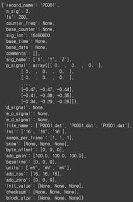
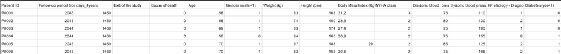
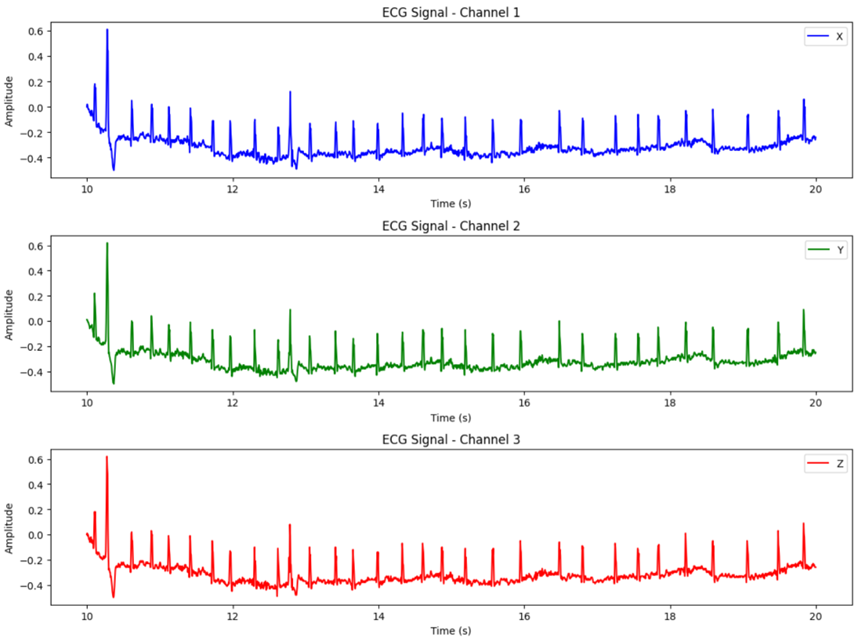
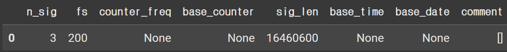
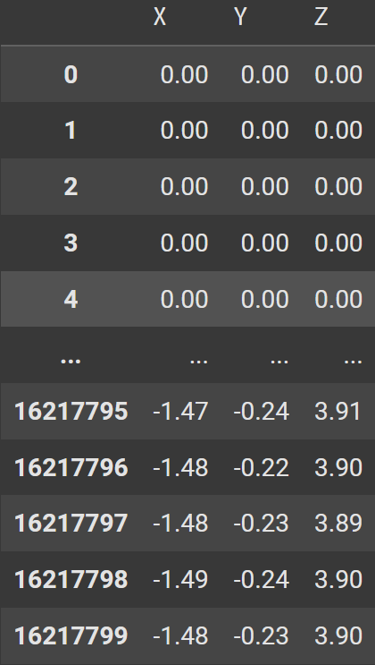
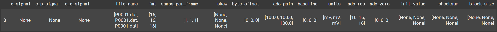

# 1. Dataset Information

MUSIC(MUerte Subita en Insuficiencia Cardiaca) 연구는 만성 심부전(CHF)을 가진 외래 환자의 심장 사망률과 갑작스러운 심부전(SCD)의 위험 예측 인자를 평가하기 위해 설계된 연구입니다.

연구 대상은 2003년 4월부터 2004년 12월까지 8개의 스페인 대학병원의 전문 HF 클리닉에서 연속적으로 등록된 992명의 CHF 환자로 구성되었으며, 2008년 11월까지 평균 44개월 동안 추적 관찰되었습니다.

세부 정보는[the official PhysioNet Challenge page.](https://physionet.org/content/music-sudden-cardiac-death/1.0.1/)에서 확인 가능합니다.

# 2. Dataset Basic Information

## 2.1 Data Information

| # of Leads | Sampling Frequency (Hz) | Recording Duration (min) | File Fomat |
| --- | --- | --- | --- |
| 2-(4%) or 3-(96%) | Hotler - 200Hz   High-resolution - 1000Hz | 24h | WFDB format |

- 환자별 leads
  - 2-leads(4%) or 3-leads(96%)
  - 2-leads : [‘X’,’Y’], 3-leads : [‘X’,’Y’,’Z’]
  - 2-leads : P0070, P0125, P0174, P0247, P0258, P0302, P0305, P0310, P0384, P0421, P0424, P0425, P0427, P0448, P0460, P0462, P0466, P0489, P0490, P0493, P0494, P0495, P0588, P0592, P0628, P0661, P0674, P0706, P0738, P0792, P0813, P0814, P0829, P0831, P0832, P0898, P0962, P1073.
  - 3-leads : 그 외
- Orthogonal leads X, Y, Z 사용
  - X : 좌우(Lateral) 방향 → 오른쪽에서 왼쪽으로 흐르는 전기 신호
  - Y : 상하(Superior-Inferior) 방향 → 머리에서 발 방향 또는 그 반대
  - Z : 전후(Anterior-Posterior) 방향 → 앞가슴에서 등 쪽 방향

## 2.2 Data Statistics

  데이터셋의 subject-info.csv에 환자별 Exit of the study의 이유(D번째 column), Cause of death(E번째 column)가 표기되어 있음.

| Label Type | # of recordings |
| --- | --- |
| Survivors | 70.06048387% (695/992) |
| Lost during follow-up | 1.10887096% (11/992) |
| Cardiac transplantation | 2.01612903% (20/992) |
| Non-cardiac deaths | 6.14919354% (61/992) |
| Death due to SCD | 9.47580645% (94/992) |
| Death due to Pump-failure death(PFD) | 11.18951612% (111/992) |
| Total | 1 (992/992) |

Column D : Cause of exit from the study

- 0 : survivor
- 1 : lost to follow-up
- 2 : cardiac transplantation
- 3 : Death - column E의 1,3,6,7의 모집단
Column E : Cause of death

- 0 : survivor
- 1 : non-cardiac death
- 3 : SCD
- 6-7 : Pump-failure death(PFD)

## 2.3 Raw Dataset

!!! note ""
    ```
    music-sudden-cardiac-death-in-chronic-heart-failure-1.0.1/
    ├── High-resolution_ECG
    │   ├── P0001_H.dat
    │   ├── P0001_H.hea
    │   └── ... (686*2개의 dat, hea 파일 : 환자별로 dat, hea 한개씩)
    ├── Holter_ECG
    │   ├── P0001.dat
    │   ├── P0001.hea
    │   └── ... (935*2개의 dat, hea 파일 : 환자별로 dat, hea 한개씩)
    ├── LICENSE.txt
    ├── RECORDS
    ├── SHA256SUMS.txt
    ├── subject-info.csv
    ├── subject-info_codes.csv
    └── subject-info_definitions.csv
    ```



데이터셋은 두개의 파일(Hotler_ECG, High-resolution_ECG)로 이루어져 있습니다.

좌측은 Holter_ECG 파일의 P0001.hea, P0001.dat 입니다.

ECG 신호에 대한 정보와 ECG 신호 데이터를 포함합니다.

subject-info.csv에 환자들의 임상정보들을 아래와 같이 포함하고 있습니다.



## 2.4 Raw Dataset Example

다음은 P0001에서 얻은 3개의 리드에 대한 ECG 신호 그래프입니다. MUSIC 데이터의 모든 ECG 신호는 초반 몇초간 0과 1이 반복되는 구간을 포함하고 있습니다. P0001에서는 10초간 이가 지속됩니다. 다음은 P0001의 10~20초 신호입니다.



## 2.5 Preprocessed Dataset

!!! note ""
    ```
    music-sudden-cardiac-death-in-chronic-heart-failure-1.0.1/
    ├── High-resolution_ECG
    │   └── music-sudden-cardiac-death-in-chronic-heart-failure-1.0.1_['X', 'Y', 'Z']
    │       ├── csv_files
    │       │   ├── P0001_H_data.csv
    │       │   ├── P0001_H_hea.csv
    │       │   ├── P0001_H_dat.csv
    │       │   ├── ... (897개의 ECG data,hea, dat csv 파일)
    │       │   └── channel_info.csv
    │       ├── music-sudden-cardiac-death-in-chronic-heart-failure-1.0.1_['X', 'Y', 'Z']*pretrain.npz
    *│       └──* music-sudden-cardiac-death-in-chronic-heart-failure-1.0.1*['X', 'Y', 'Z']pretrain_record_ids.csv
    └── Holter_ECG
    ├── music-sudden-cardiac-death-in-chronic-heart-failure-1.0.1['X', 'Y', 'Z']
    │   ├── csv_files
    │   │   ├── P0001_data.csv
    │   │   ├── P0001_hea.csv
    │   │   ├── P0001_dat.csv
    │   │   ├── ... (1028개의 ECG data, hea, dat csv 파일)
    │   │   └── channel_info.csv
    │   ├── music-sudden-cardiac-death-in-chronic-heart-failure-1.0.1_['X', 'Y', 'Z']*pretrain.npz
    *│   └── music-sudden-cardiac-death-in-chronic-heart-failure-1.0.1['X', 'Y', 'Z']pretrain_record_ids.csv*
    *└── music-sudden-cardiac-death-in-chronic-heart-failure-1.0.1['X', 'Y']
    ├── csv_files
    │   ├── P0070_data.csv
    │   ├── P0070_hea.csv
    │   ├── P0070_dat.csv
    │   │   ├── ... (37개의 ECG data, hea, dat csv 파일)
    │   └── channel_info.csv
    ├── music-sudden-cardiac-death-in-chronic-heart-failure-1.0.1_['X', 'Y']*pretrain.npz
    *└── music-sudden-cardiac-death-in-chronic-heart-failure-1.0.1['X', 'Y']_pretrain_record_ids.csv
    └── subject-info_codes.csv
    └── subject-info_definitions.csv
    └── subject-info.csv
    ```

Csv로 전환한 s20011.hea 파일입니다.



S20011.dat의 일부인 s20011의 ECG 신호입니다. 좌측은 표, 우측은 그래프입니다. 두개의 leads로부터 측정한 신호를 기록하였습니다.




.dat 파일은 ECG 신호에 대한 아래와 같은 정보들을 포함하고 있으며 아래와 같이 csv로 전환하였습니다.



# 3. Applications and Use Cases

  데이터셋은 2025년 1월에 발표되었기 때문에 인용되지 않았습니다.

  [1]에 따르면 해당 데이터셋은 만성 심부전(CHF) 환자에서 돌연 심장사(SCD)를 포함한 전체 심장 사망률을 예측하는 모델을 개발하기 위해 만들어졌습니다. 따라서 sujbect-info.csv의 label을 y값으로 심전도 데이터를 X로 하여 심전도 데이터에 따른 심장 사망률을 예측하는 모델 제작이 가능합니다.

  또한 심전도 데이터만을 이용하여 unlabeled pretraining을 진행할 수 있습니다.

# 4. References

[1] Alba Mart´ ın-Yebra, Antonio Bay´es de Luna, Rafael V´azquez4 Pere Caminal, Pablo Laguna, Juan Pablo Mart´ ınez (2025), The MUSIC Database: Sudden Cardiac Death in Heart Failure Patients.

[2] Goldberger, A., Amaral, L., Glass, L., Hausdorff, J., Ivanov, P. C., Mark, R., ... & Stanley, H. E. (2000). PhysioBank, PhysioToolkit, and PhysioNet: Components of a new research resource for complex physiologic signals. Circulation [Online]. 101 (23), pp. e215–e220.
