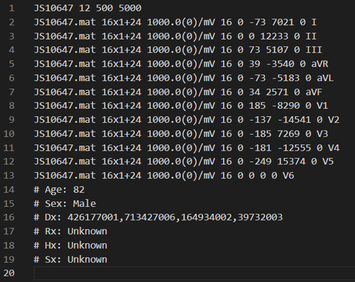
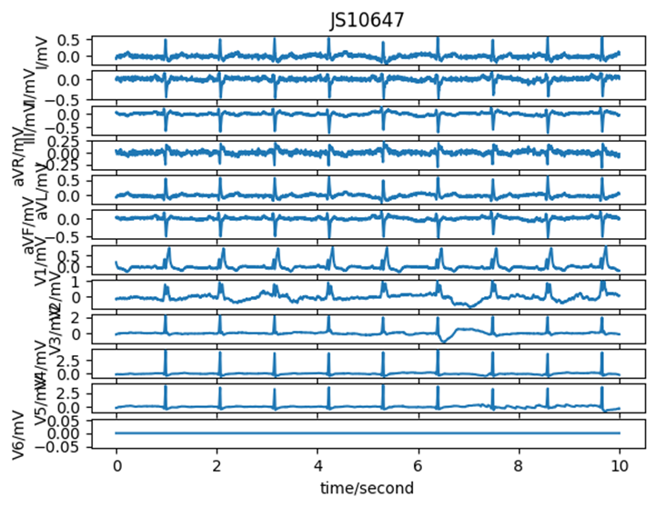
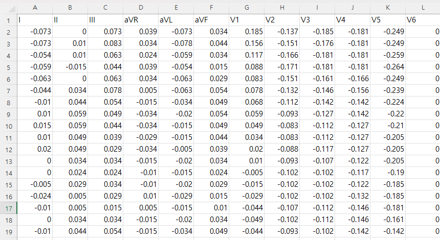
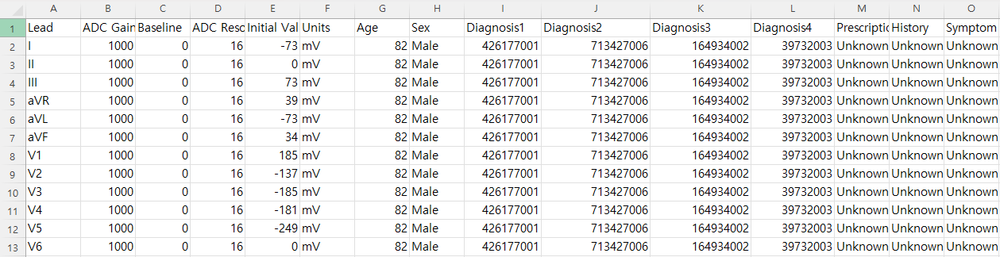

# NINGBO

# 1. Dataset Information

본 데이터는 ‘The PhysioNet/Computing in Cardiology Challenge 2021’의 데이터 중 하나로 Ningbo First Hospital을 통해 수집되었습니다. 2013년부터 2018년까지 총 40258명의 환자에게 얻어진 12-lead ECG 데이터이며, 500Hz의 샘플링 속도로 10초간 기록되었습니다. 라벨에는 11개의 심장 리듬 유형과 67가지의 추가적인 심장 질환 등이 포함되어 있습니다. 

# 2. Dataset Basic Information

## 2.1 Data Information

| # of Subjects | # of Leads | Sampling Frequency (Hz) | Recording Duration (min) | File Fomat |
| --- | --- | --- | --- | --- |
| More than 7,000 (8,528 records) | 12 | 500Hz
  
   | 10  | MATLAB V4 files
.mat (ECG)
.hea (Metadata) |

## 2.2 Data Statistics

| Label Type | Proportion (# of recordings/Total) |
| --- | --- |
| Sinus Bradycardia (SB)  | 36.29852456% (12,670/34,905) |
| Sinus Rhythm (SR) | 18.04612519% (6,299/34,905) |
| Atrial Fibrillation (AF) | % (/34,905) |
| Sinus Tachycardia (ST) | 16.29279472% (5,687/34,905) |
| Atrial Flutter (AFL) | 21.81635868% (7,615/34,905) |
| Sinus Irregularity (SI) | % (/34,905) |
| Supraventricular Tachycardia (SVT) | 0.39249391% (137/34,905) |
| Atrial Tachycardia (AT) | 0.50422575% (176/34,905) |
| Atrioventricular Nodal Reentrant Tachycardia (AVNRT) | % (/34,905) |
| Atrioventricular Reentrant Tachycardia (AVRT) | 0.05156854% (18/34,905) |
| Sinus Atrial to Atrial Wandering Rhythm (SAAWR) | % (/34,905) |
- Sinus Bradycardia (SB): : 동성 서맥 – 정상 동성 리듬이지만 심박수가 60bpm 이하로 느려진 상태, P-QRS-T 파형이 규칙적
- Sinus Rhythm (SR): 정상 동성 리듬 – 정상적인 심박수(60~100bpm)를 유지하는 심장 리듬, P-QRS-T 파형 정상
- Atrial Fibrillation (AF): 심방세동 – 비정상적인 심방의 빠른 전기 신호로 인해 심박수가 불규칙함, QRS 간격이 불규칙적
- Sinus Tachycardia (ST): 동성 빈맥 – 정상 동성 리듬이지만 심박수가 100bpm 이상으로 빠른 상태, P-QRS-T 파형 규칙적
- Atrial Flutter (AFL): 심방 조동 – 심방이 규칙적으로 매우 빠르게 수축하는 리듬 (약 250~350bpm), 톱니 모양 P파가 보이며 QRS 간격이 일정함
- Sinus Irregularity (SI): 동성 부정맥 – 정상 동성 리듬이지만 심박수 변화가 크고 불규칙한 형태, P-QRS-T 파형은 있지만, RR 간격이 불규칙
- Supraventricular Tachycardia (SVT): 상심실성 빈맥 – 심실이 아닌 심방이나 방실 결절에서 기원하는 빠른 심장 리듬, P파가 희미하거나 보이지 않음
- Atrial Tachycardia (AT): 심방 빈맥 – 심방에서 기원하는 비정상적으로 빠른 심장 리듬, P파가 QRS보다 앞서 나타남
- Atrioventricular Nodal Reentrant Tachycardia (AVNRT): 방실결절 회귀 빈맥 – 방실결절 내에서 전기 신호가 순환하면서 발생하는 빠른 리듬, P파가 QRS와 겹치거나, QRS 뒤에 보일 수 있음
- Atrioventricular Reentrant Tachycardia (AVRT): 방실 회귀 빈맥 – 부전도로(accessory pathway)로 인해 비정상적인 전기 회로가 형성되는 빈맥, 델타파가 나타날 수 있으며, WPW 증후군과 연관
- Sinus Atrial to Atrial Wandering Rhythm (SAAWR): 동-심방 유주 리듬 – 동결절의 지배를 벗어나 심장 여러 부위에서 전기 신호가 형성되는 리듬, 심박수 변화가 크고, P파 형태가 다양

## 2.3 Raw Dataset


!!! note ""
    ```
    training/ 
    
    ├── ningbo/
    
    │ ├── g1/ 
    
    │ │ ├── JS10647.hea
    
    │ │ ├── JS10647.mat
    
    │ │ ├── JS10648.hea
    
    │ │ ├── ... (999 samples, 1998 files: 각각 .mat + .hea 세트)
    
    │ │ ├── index.html
    
    │ │└── RECORDS
    
    │ ├── g2 ~ g34/ 
    
    │ │ ├── JS11646.hea
    
    │ │ ├── JS11646.mat
    
    │ │ ├── JS11647.hea
    
    │ │ ├── ... (1000 samples, 2000 files: 각각 .mat + .hea 세트)
    
    │ │ ├── index.html
    
    │ │└── RECORDS
    
    │ ├── g35/ 
    
    │ │ ├── JS44646.hea
    
    │ │ ├── JS44646.mat
    
    │ │ ├── JS44647.hea
    
    │ │ ├── ... (905 samples, 1812 files: 각각 .mat + .hea 세트)
    
    │ │ ├── index.html
    
    │ │ └── RECORDS
    
    │ └── ... (35 dictionaries, 약 70,000 files) 
    
    ├── index.html
    
    35 directories, 약 70,000 files
    ```


각 레코드는 300Hz 샘플링 주파수 기준으로 기록된 싱글 리드 ECG 신호를 포함하며, 다음 두 파일로 구성되어 있습니다: 

- .mat 파일: ECG 신호 자체를 저장 (12차원 배열 형태)
- .hea 파일: 레코드의 메타데이터 (샘플 수, 레이블, 채널 정보 등)를 저장



위의 사진은 NINGBO의 JS10647.hea의 내용입니다. 각 파일 내의 특정 시점마다 symbol이 적혀 있는 다른 데이터 셋들과 달리 시점이 아닌 하나의 #Dx에 symbol이 부여되어 있습니다. 다중 annotation도 존재합니다. 

## 2.4 Raw Dataset Example

아래는 신호 데이터 시각화의 예시입니다. 



JS10647 데이터셋을 시각화하였습니다. JS10647.mat를 lead 별로 신호 plotting 한 예시입니다.





모든 .mat, .hea 파일을 csv 파일로 변환하였습니다. *_data.csv 파일에는 라벨 별로 신호 정보를 기입하였습니다. *_label.csv 파일에는 각 행에 lead 별 정보를 담았고, annotation의 경우 여러 개의 라벨링이 존재할 경우 Diagnosis 1, Diagnosis 2와 같이 기입하였습니다. 

## 2.5 Preprocessed Dataset


!!! note ""
    ```
    PhysioNet_2017_Challenge/ 
    ├── csv_files/
    │   ├── JS10647_data.csv
    │   ├── JS10647_label.csv
    │   └── JS10648_data.csv
    │   ... (69,810 more files)
    ├── NINGBO_finetune.npz
    ├── NINGBO_finetune_record_ids.csv
    
    ├── channel_info.csv
    └── label_1.csv
    
    1 directories,  files
    ```


csv_files 폴더에는 신호 데이터를 담고 있는 ()_data.csv 파일과 환자 정보 및 annotation 정보를 담고 있는 ()_label.csv 파일이 포함되어 있습니다. 해당 데이터는 파인튜닝(finetune)을 위한 용도로 사용되며, 위의 모든 데이터를 통합하여 라벨 정보와 함께 NINGBO_finetune.npz 파일로 정리하였습니다.

# 3. Applications and Use Cases

이 데이터셋은 총 11개의 Label을 가지고 있으며, 각 label은 리듬 유형을 의미합니다. 

| 인용 논문 | 연구 과제 | 모델 구조 | 방법론 |
| --- | --- | --- | --- |
| Zheng J et al.(2020) [^1] | Multilabel classification | Gradient Boosting Tree(GBT), Extreme
Gradient Boosting Tree(EGBT) | Group the specific label and classification the ECG data into each groups accurate.
 Atrial fibrillation detection |

[^1] 논문에서는 라벨의 빈도수 및 환자의 특성을 정리하고, 라벨을 SB, AFIB, GSVT, SR의 총 4개의 그룹으로 합쳐 ECG 분류모델에서 활용하였습니다. 연구에서는 Gradient Boosting Tree(GBT) 및 Extreme Gradient Boosting Tree(EGBT) 모델을 활용하여 4개의 그룹을 분류하였습니다. 분류 결과 정확도 및 F1-score가 99%에 가까운 성능을 보였습니다. 

# 4. References

[^1]: Zheng J, Chu H, Struppa D, Zhang J, Yacoub SM, El-Askary H, Chang A, Ehwerhemuepha L, Abudayyeh I, Barrett A, Fu G. Optimal multi-stage arrhythmia classification approach. Scientific reports. 2020 Feb 19;10(1):1-7.

[^2]: Reyna, M., Sadr, N., Gu, A., Perez Alday, E. A., Liu, C., Seyedi, S., Shah, A., & Clifford, G. (2022). Will Two Do? Varying Dimensions in Electrocardiography: The PhysioNet/Computing in Cardiology Challenge 2021 (version 1.0.3). *PhysioNet*. [https://doi.org/10.13026/34va-7q14](https://doi.org/10.13026/34va-7q14).