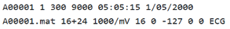
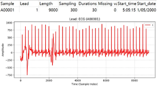

# PhysioNet 2017

# 1. Dataset Information

PhysioNet/Computing in Cardiology Challenge 2017[^1]은 단일 리드 ECG 신호(30~60초 길이)에서 부정맥(arrhythmia)을 자동으로 탐지하는 알고리즘 개발을 목표하기 위해 설계된 데이터셋입니다. 특히 휴대형 장치나 웨어러블에서 측정한 **싱글 리드(single-lead)** ECG 데이터를 다룹니다.

# 2. Dataset Basic Information

## 2.1 Data Information

| # of Subjects | # of Leads | Sampling Frequency (Hz) | Recording Duration (min) | File Fomat |
| --- | --- | --- | --- | --- |
| More than 7,000 (8,528 records) | 1 | Fixed 300 Hz
  
   | Approximately 10 – 60 seconds
  | MATLAB V4 files
.mat (ECG)
.hea (Metadata) |
- Lead에 대한 명확한 정보는 주어져있지 않습니다

## 2.2 Data Statistics

| Label Type | # of recordings | Time length (s) - Mean | Time length (s) - Standard Deviation |
| --- | --- | --- | --- |
| Normal | 5154 (60.44%)  | 31.9 | 10.0 |
| AF | 771 (9.04%) | 31.6 | 12.5 |
| Other rhythm | 2557 (29.98%) | 34.1 | 11.8 |
| Noisy | 46 (0.54%) | 27.1 | 9.0 |
| Total | 8528 | 32.5 | 10.9 |
- Normal (N): Normal sinus rhythm
- Atrial Fibrillation (AF or A): Presence of atrial fibrillation
- Other Rhythm (O): Any arrhythmia or rhythm disorder not classified as normal or AF
- Noisy (~): Poor-quality signals unsuitable for reliable analysis

## 2.3 Raw Dataset


!!! note ""
    ```
    PhysioNet_2017_Challenge/ 
    
    ├── training/ 
    
    │ ├── A00001.mat 
    
    │ ├── A00001.hea 
    
    │ ├── A00002.mat 
    
    │ ├── A00002.hea 
    
    │ └── ... (8,528 파일: 각각 .mat + .hea 세트) 
    
    ├── validation/ 
    
    │ ├── A30001.mat 
    
    │ ├── A30001.hea 
    
    │ └── ... (1,500+ 파일) 
    
    ├── testing/ 
    
    │ ├── A40001.mat 
    
    │ ├── A40001.hea 
    
    │ └── ... (1,500+ 파일) 
    
    ├── sample-records/ 
    
    │ ├── sample001.mat 
    
    │ ├── sample001.hea 
    
    │ └── ... (샘플 몇 개) 
    
    ├── README.txt 
    
    └── LICENSE.txt
    
    5 directories, 약 20,000 files
    ```


각 레코드는 300Hz 샘플링 주파수 기준으로 기록된 싱글 리드 ECG 신호를 포함하며, 다음 두 파일로 구성되어 있습니다: 

- .mat 파일: ECG 신호 자체를 저장 (1차원 배열 형태)
- .hea 파일: 레코드의 메타데이터 (샘플 수, 레이블, 채널 정보 등)를 저장
    
    
    

위의 사진은 PhysioNet 2017의 A00001.hea의 내용입니다. 05:05:15는 Start time, 1/05/2000은 Start date를 의미합니다. REFERENCE-original.csv 파일에 annotation이 들어있습니다. 각 파일 내의 특정 시점마다 symbol이 적혀 있는 다른 데이터셋들과 달리 시점이 아닌 파일 자체에 symbol이 부여되어 있습니다.

## 2.4 Raw Dataset Example



환자의 정보와 신호 데이터 시각화의 예시입니다. 

## 2.5 Preprocessed Dataset


!!! note ""
    ```
    PhysioNet_2017_Challenge/ 
    ├── csv_files/
    │   ├── A00001_re_data.csv
    │   ├── A00001_re_pid.csv
    │   └── A00002_re_data.csv
    │   ... (20352 more files)
    ├── PhysioNet_2017_finetune.npz
    ├── channels_info.csv
    └── labels.csv
    
    1 directories, 17060 files
    ```


csv_files 폴더에는 개별 신호 데이터를 담고 있는 ()_re_data.csv 파일과 환자 정보를 담고 있는 ()_re_pid.csv 파일이 포함되어 있습니다. 해당 데이터는 파인튜닝(finetune)을 위한 용도로 사용되며, 위의 모든 데이터를 통합하여 라벨 정보와 함께 PhysioNet_2017_finetune.npz 파일로 정리하였습니다.

# 3. Applications and Use Cases

해당 데이터셋은 Rhythm Label(N, A, O, ~)을 갖고 있습니다. 이 Label을 이용하여 할 수 있는 Task는 Atrial fibrillation detection, Arrhythmia detection입니다.

| 인용 논문 | 연구 과제 | 모델 구조 | 방법론 |
| --- | --- | --- | --- |
| Mei et al. (2018) [^2] | Arrhythmia detection | SVM, bagging trees | Feature extraction from heart rate variability and spectral analysis |
| Parvaneh et  al. (2018) [^3] | Atrial fibrillation | CNN + RNN | Signal quality analysis integrated with deep learning |
| Xiong et al. (2018) [^4] | Arrhythmia  detection | CNN | Robust ECG signal classification using novel neural network architecture |
| Han et al. (2020) [^5] | Atrial fibrillation | CNN | Investigation of deep learning model vulnerabilities to adversarial attacks in ECG analysis |
| Datta et al.(2017) [^6] | Atrial fibrillation   | Cascaded Binary Classifier | Identification of normal, AF, and other abnormal rhythms using a cascaded approach |
| Zhao et al. (2020) [^7] | Atrial fibrillation   | CNN | Kalman-based spectro-temporal ECG analysis combined with deep convolutional networks |
- Atrial fibrillation detection

[2][3][4][^7] N(정상), A(심방세동), O(기타 부정맥), Noise로 이루어진 4가지 클래스(label)를 활용해 Atrial fibrillation을 검출하고, ECG 데이터를 분류하는 Arrhythmia detection 모델을 학습하고 평가하였습니다.

- Arrhythmia detection

[^5] 이 논문에서는 단일 리드 ECG를 Normal, Atrial Fibrillation(AF), Other, Noise 네 가지 레이블로 분류하는 Arrhythmia detection 모델을 다룹니다. 심방세동(AF)과 정상(Normal)을 중심으로 오진 상황(Adversarial Attack)에 대한 취약성을 보여주는 논문입니다. 결과적으로 Arrhythmia detection(특히 AF 검출 포함)을 위한 Multi-class classification 모델을 대상으로, 소량의 ‘교란(perturbation)’이 예측을 바꿀 수 있다는 사실을 실증한 연구입니다.

- 이 외

[^6] 이 논문에서는 단일 리드 ECG를 N, A, O, Noise의 네 가지 레이블로 구분하는 Arrhythmia detection을 수행하기 위해, 2단계 이진 분류기를 연쇄적으로 연결하는 Multi-class 분류 방식을 제안하였습니다.

# 4. References

[^1]: Clifford GD, Liu C, Moody B, Li-wei HL, Silva I, Li Q, Johnson AE, Mark RG. AF classification from a short single lead ECG recording: The PhysioNet/computing in cardiology challenge 2017. In 2017 Computing in Cardiology (CinC) 2017 Sep 24 (pp. 1-4). IEEE. [https://doi.org/10.22489/CinC.2017.065-469](https://doi.org/10.22489/CinC.2017.065-469)

[^2]: Mei, Z., Gu, X., Chen, H., & Chen, W. (2018). Automatic atrial fibrillation detection based on heart rate variability and spectral features. IEEE Access, 6, 53566–53575. [http://dx.doi.org/10.1109/ACCESS.2018.2871220](http://dx.doi.org/10.1109/ACCESS.2018.2871220).

[^3]: Parvaneh Saman, Jonathan Rubin, Rahman Asif, Bryan Conroy, and Saeed Babaeizadeh. 2017. “Densely Connected Convolutional Networks and Signal Quality Analysis to Detect Atrial Fibrillation Using Short Single-Lead ECG Recordings.” In 2017 Computing in Cardiology Conference (CinC). Computing in Cardiology. 10.22489/cinc.2017.160-246

[^4]: Xiong, Z., Stiles, M. K., & Zhao, J. (2017, September). Robust ECG signal classification for detection of atrial fibrillation using a novel neural network. In *2017 Computing in Cardiology (CinC)* (pp. 1-4). IEEE.

[^5]: Han, X., Hu, Y., Foschini, L., Chinitz, L., Jankelson, L., & Ranganath, R. (2020). Deep learning models for electrocardiograms are susceptible to adversarial attack. *Nature medicine*, *26*(3), 360-363.

[^6]: Datta, S., Puri, C., Mukherjee, A., Banerjee, R., Choudhury, A. D., Singh, R., ... & Khandelwal, S. (2017, September). Identifying normal, AF and other abnormal ECG rhythms using a cascaded binary classifier. In *2017 Computing in cardiology (cinc)* (pp. 1-4). IEEE.

[^7]: Zhao, Z., Särkkä, S., & Rad, A. B. (2020). Kalman-based spectro-temporal ECG analysis using deep convolutional networks for atrial fibrillation detection. *Journal of Signal Processing Systems*, *92*(7), 621-636.