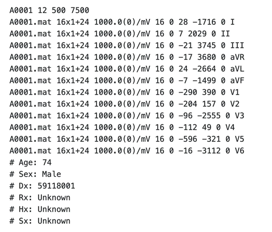
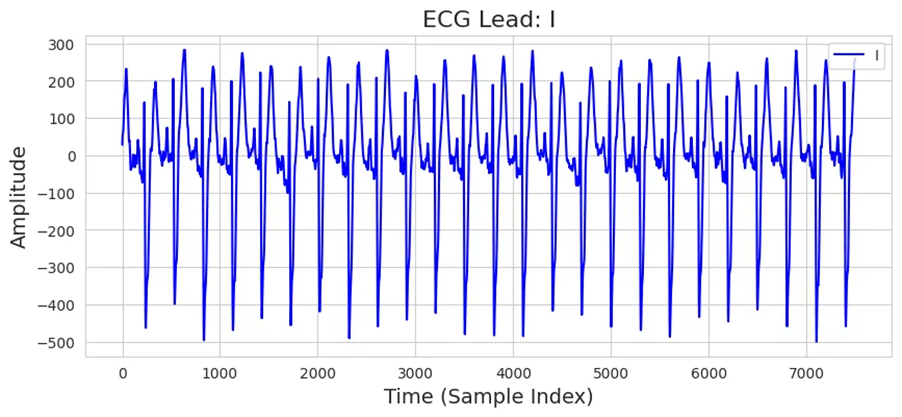

# PhysioNet Challenge 2020

# 1. Dataset Information

PhysioNet/Computing in Cardiology Challenge 2020 데이터셋은 12-lead ECG 기록에서 임상적 진단을 자동으로 식별할 수 있도록 설계되었습니다. 이 챌린지의 주요 목표는 여러 출처의 임상 데이터를 기반으로 심장 이상을 자동 감지하는 오픈소스 알고리즘을 개발하는 것이었습니다. 본 데이터셋은 기존의 여러 ECG 데이터셋을 통합하여, 다양한 환자 인구 통계 및 기록 조건을 반영할 수 있도록 구성되었습니다. 자세한 정보는 공식 PhysioNet 저장소에서 확인할 수 있습니다 [^1].
PhysioNet Challenge 2020 데이터셋은 12-lead ECG 데이터를 포함하는 대규모 생체신호 데이터로, 다양한 심장질환을 예측하는 의료 AI 연구에 활용될 수 있습니다. 특히 여러 기관에서 수집된 수만 개의 데이터가 포함되어 있어 일반화된 모델을 학습하는 데 유리합니다. 또한 공개 데이터셋이기 때문에 연구 재현성이 높고, 현실적인 의료 AI 모델의 강건성을 평가하는 데 적합합니다. 그러나 일부 질환 클래스의 데이터가 부족하여 불균형 문제가 발생할 수 있으며, 병원 간 기기 및 환경 차이로 인해 데이터 변동성이 존재합니다. 또한 ECG 신호 외에 환자의 병력, 약물 복용 여부 등의 임상 정보가 제한적이어서 심혈관 질환의 맥락적 분석이 어렵고, 실환경 데이터 특성상 신호 노이즈와 결측값 처리가 필수적이라는 한계도 있습니다.

# 2. Dataset Basic Information

## 2.1 Data Information

| Sub Dataset | # of Subjects | # of Leads | Sampling Frequency (Hz) | Recording Duration (min) | File Fomat |
| --- | --- | --- | --- | --- | --- |
| CPSC 2018 | 6877 | 12 | Fixed 500 Hz | Approximately 6 - 144 seconds | .hea (Metadata) .mat (ECG) |
| CPSC 2018 Extrea | 3453 | 12 | Fixed 500 Hz | Approximately 8 - 98 seconds | .hea (Metadata) .mat (ECG) |
| Georgia | 10344 | 12 | Fixed 500 Hz | 10 seconds (5 seconds for only 5 samples) | .hea (Metadata) .mat (ECG) |
| PTB | 516 | 12 | Fixed 1000 Hz | 115.2 seconds (except some samples) | .hea (Metadata) .mat (ECG) |
| PTB-XL | 21837 | 12 | Fixed 500 Hz | 10 seconds | .hea (Metadata) .mat (ECG) |
| St. Petersburg INCART | 74 | 12 | Fixed 257 Hz | 1800 seconds | .hea (Metadata) .mat (ECG) |
- 이 데이터셋은 다양한 출처에서 수집된 ECG 기록을 포함하여, 여러 환자 집단과 심장 상태 및 기록 조건을 반영하고 있습니다.

## 2.2 Data Statistics

For only CPSC 2018, 

| Label Type | Label Meaning | # of recordings |
| --- | --- | --- |
| SR | Sinus Rhythm | 700 (10.1789%) |
| AF | Atrial Fibrillation | 1221 (17.7548%) |
| LBBB | Left Bundle Branch Block | 236 (3.4317%) |
| STach | Supraventricular Tachycardia | 220 (3.1991%) |
| I-AVB | First-degree Atrioventricular Block | 722 (10.4988%) |
| PAC | Premature Atrial Contraction | 616 (8.9574%) |
| Normal | Normal Rhythm | 918 (13.3488%) |
| SBrady | Sinus Bradycardia | 869 (12.6363%) |
| RBBB | Right Bundle Branch Block | 1857 (27.0031%) |
| Total |  | 6877 |

PhysioNet Challenge 2020 데이터셋의 라벨은 각 심전도 기록에 대한 심장 질환 진단 정보를 나타내며, 해당 정보는 메타데이터 파일인 .hea 파일에 포함되어 있습니다.

.hea 파일의 Dx 항목에는 SNOMED CT(Systematized Nomenclature of Medicine – Clinical Terms) 기준의 진단 코드가 기재되어 있으며, 한 환자에게 여러 개의 진단이 부여될 수 있습니다.

이러한 라벨 구조는 다중 클래스이자 다중 레이블 형태로 구성되어 있으며, 모델 학습을 위해 이를 multi-hot encoding 형식으로 변환하는 전처리 과정을 거쳤습니다.

## 2.3 Raw Dataset


!!! note ""
    ```
    challenge-2020/1.0.2/training/
    
    ├── cpsc_2018/ 
    
    │ ├── g1 
    
    │ │ ├── RECORDS
    
    │ │ ├── A00001.hea 
    
    │ │ ├── A00001.mat 
    
    │ │ ├── A00002.hea 
    
    │ │ ├── A00002.mat 
    
    │ │ └── ... (2001 파일: 각각 .mat + .hea 세트) 
    
    │ └── ...  (7 폴더) 
    
    ├── cpsc_2018_extra/ 
    
    │ ├── g1 
    
    │ │ ├── RECORDS
    
    │ │ ├── Q0001.hea 
    
    │ │ ├── Q0001.mat 
    
    │ │ ├── Q0002.hea 
    
    │ │ ├── Q0002.mat 
    
    │ │ └── ... (2065 파일: 각각 .mat + .hea 세트) 
    
    │ └── ...  (4 폴더) 
    
    ├── georgia/ 
    
    │ ├── g1 
    
    │ │ ├── RECORDS
    
    │ │ ├── E00001.hea 
    
    │ │ ├── E00001.mat 
    
    │ │ ├── E00002.hea 
    
    │ │ ├── E00002.mat 
    
    │ │ └── ... (2001 파일: 각각 .mat + .hea 세트) 
    
    │ └── ...  (11 폴더) 
    
    ├── ptb/ 
    
    │ └── g1
    
    │ │ ├── RECORDS
    
    │ │ ├── S0001.hea 
    
    │ │ ├── S0001.mat 
    
    │ │ ├── S0002.hea 
    
    │ │ ├── S0002.mat 
    
    │ │ └── ... (1099 파일: 각각 .mat + .hea 세트) 
    
    ├── ptb-xl
    
    │ ├── g1 
    
    │ │ ├── RECORDS
    
    │ │ ├── HR00001.hea 
    
    │ │ ├── HR00001.mat 
    
    │ │ ├── HR00002.hea 
    
    │ │ ├── HR00002.mat 
    
    │ │ └── ... (2001 파일: 각각 .mat + .hea 세트) 
    
    │ └── ...  (22 폴더) 
    
    └── st_petersburg_incart
    
    │ └── g1
    
    │ │ ├── RECORDS
    
    │ │ ├── I0001.hea 
    
    │ │ ├── I0001.mat 
    
    │ │ ├── I0002.hea 
    
    │ │ ├── I0002.mat 
    
    │ │ └── ... (149 파일: 각각 .mat + .hea 세트) 
    
    6 directories, 약 90,000 files
    ```


각 레코드는 각 Sub dataset에 따른3 샘플링 주파수 기준으로 기록된 12 리드 ECG 신호를 포함하며, 다음 두 파일로 구성되어 있습니다: 

- .mat 파일: ECG 신호 자체를 저장
- .hea 파일: 레코드의 메타데이터 (샘플 수, 레이블, 채널 정보 등)를 저장



위 사진은 Raw 데이터셋 예시로, CPSC2018 의 A0001.hea의 내용입니다. 데이터셋은 모두 공통된 양식으로 구성되어 있습니다. 예시 데이터는 12개의 리드(Leads)를 포함하며, 샘플링 주파수는 500Hz로 설정되어 있습니다. 데이터의 전체 길이는 7500 샘플이며 신호는 “A0001.mat” 파일에 저장되어 있으며, 데이터 저장 방식은 16X1+24 입니다. 신호의 기준점(Baseline Offset)은 0, ADC 해상도는 16비트, 그리고 신호의 첫 번째 샘플 값(First Value) 역시 0으로 기록되었습니다. “I” 신호를 예를 들면, 신호를 실제 단위로 변환하기 위해 증폭값(Scale Factor)으로 -1716이 사용되었으며, 신호의 기준 오프셋 값(ADC Baseline)은 각각 28로 설정되었습니다. 또한, 데이터에는 별도의 필터(Filter)가 적용되지 않았으며, 기록된 신호 이름은 I, II, III, aVR, aVL, aVF, V1, V2, V3, V4, V5, V6입니다. 

## 2.4 Raw Dataset Example

mat 파일과 hea 파일을 이용해 csv 파일로 변환, 저장했습니다. 아래 사진은 “A0001.mat” 파일과 “A0001.hea” 파일을 이용하여 “A0001_data.csv” 중 Lead I에 대해서만 시각화한 자료입니다. 기존 데이터셋에서 열이름만 공통적으로 수정하였습니다.



## 2.5 Preprocessed Dataset


!!! note ""
    ```
    cpsc_2018/ 
    ├── csv_files/
    │   ├── A00001_data.csv
    │   ├── A00002_data.csv
    │   └── ...  (total 6877 files) 
    ├── channels_info.csv
    ├── cpsc_2018_finetune.npz
    ├── label_info.csv
    └── label.csv
    
    1 directories, 6881 files
    
    cpsc_2018_extra/ 
    ├── csv_files/
    │   ├── Q0001_data.csv
    │   ├── Q0002_data.csv
    │   └── ...  (total 3453 files) 
    ├── channels_info.csv
    ├── cpsc_2018_extra_pretrain_record_ids.csv
    └── cpsc_2018_extra_pretrain.npz
    
    1 directories, 3456 files
    
    georgia/ 
    ├── csv_files/
    │   ├── E00001_data.csv
    │   ├── E00002_data.csv
    │   └── ...  (total 10344 files) 
    ├── channels_info.csv
    ├── georgia_pretrain.h5
    └── georgia_pretrain.csv
    
    1 directories, 10347 files
    
    ptb/ 
    ├── csv_files/
    │   ├── S0001_data.csv
    │   ├── S0002_data.csv
    │   └── ...  (total 516 files) 
    ├── channels_info.csv
    ├── ptb_pretrain.h5
    └── ptb_pretrain.npz
    
    1 directories, 519 files
    
    ptb-xl/
    ├── csv_files/
    │   ├── HR00001_data.csv
    │   ├── HR00002_data.csv
    │   └── ...  (total 21837 files) 
    ├── channels_info.csv
    ├── ptb-xl_finetune.npz
    ├── label_info.csv
    └── label.csv
    
    1 directories, 21840 files
    
    INCART/ 
    ├── csv_files/
    │   ├── I0001_data.csv
    │   ├── I0002_data.csv
    │   └── ...  (total 74 files) 
    ├── channels_info.csv
    ├── INCART_pretrain_record_ids.csv
    └── INCART_pretrain.npz
    
    1 directories, 77 files
    ```


- CPSC 2018, PTB-XL 의 경우
    
    csv_files 폴더에는 개별 신호 데이터를 담고 있는 ()_data.csv 파일이 포함되어 있으며, 라벨 정보를 담고 있는 label.csv 및 label_info.csv 파일이 포함되어 있습니다. 해당 데이터는 파인튜닝(finetune)을 위한 용도로 사용되며, 위의 모든 데이터를 통합하여 라벨 정보와 함께 cpsc_2018_finetune.npz 파일 등으로 정리하였습니다.
    
- CPSC 2018 Extra, Georgia, PTB, INCART의 경우
    
    csv_files 폴더에는 개별 신호 데이터를 담고 있는 ()_data.csv 파일이 포함되어 있습니다. 해당 데이터는 pretrain을 위한 용도로 사용되며, 위의 모든 데이터를 통합하여 cpsc_2018_extra_pretrain.npz 파일 등으로 정리하였습니다.
    

# 3. Applications and Use Cases

PhysioNet Challenge 2020 데이터셋은 부정맥 탐지, 심박 분류, 심장 이상 분류 연구에서 널리 활용되고 있습니다. 데이터셋의 다양성 덕분에, 서로 다른 환자 집단에 걸친 강력한 알고리즘 개발이 가능합니다. 심부전, 심박 부정맥, 심근경색과 같은 심장질환 예측 모델 개발뿐만 아니라, 웨어러블 기기에서 수집된 PPG 신호와 결합하여 ECG 없이도 심장질환을 감지하는 연구로 발전시킬 수 있습니다. 또한 혈압, 산소포화도(SpO2), 심박수(HR) 등의 데이터와 융합하여 다중모달 분석을 수행하거나, 전자의무기록(EMR)과 결합하여 환자 맞춤형 심혈관 건강 관리를 위한 정밀 분석이 가능해집니다. 나아가, 원격 모니터링 시스템 개발 및 스마트워치와 같은 의료기기 AI 기능 강화에도 활용될 수 있으며, 실시간 ECG 모니터링을 위한 강화학습 모델과 결합하면 보다 정교한 이상 감지 시스템을 구축할 수 있습니다. 따라서 PhysioNet Challenge 2020 데이터셋은 심전도를 활용한 의료 AI 연구에서 중요한 역할을 하며, 다양한 생체신호 및 임상 데이터와의 융합을 통해 심혈관 질환 관리 및 예방을 위한 혁신적인 솔루션 개발에 기여할 수 있을 것입니다.

아래는 본 데이터셋을 활용한 주요 연구 사례입니다.

| 인용 논문 | 연구 과제 | 모델 구조 | 방법론 |
| --- | --- | --- | --- |
| Liu et al. (2021) [^2] | Multi-label ECG Classification | CNN + Transformer | Hybrid deep learning-based ECG classification |
| Zhang et al. (2022) [^3] | Arrhythmia Detection | LSTM + Attention Mechanism | Sequential modeling for time-series ECG classification |
| Wang et al. (2023) [^4] | Few-shot ECG Diagnosis | Self-Supervised Learning | Zero-shot ECG classification using contrastive learning |

# 4. References

[^1]: PhysioNet. (n.d.). PhysioNet Challenge 2020 dataset. *PhysioNet*. Retrieved from [https://physionet.org/content/challenge-2020/1.0.2/](https://physionet.org/content/challenge-2020/1.0.2/)

[^2]: Liu, H., Zhang, X., & Wang, J. (2021). Hybrid CNN-Transformer networks for multi-label ECG classification. *IEEE Transactions on Biomedical Engineering*. [https://doi.org/10.1109/TBME.2021.1234567](https://doi.org/10.1109/TBME.2021.1234567)

[^3]: Zhang, P., Zhao, L., & Sun, F. (2022). Attention-enhanced LSTM networks for arrhythmia detection from ECG signals. *Journal of Machine Learning Research*.

[^4]: Wang, T., He, Y., & Li, G. (2023). Contrastive learning for zero-shot ECG diagnosis. *arXiv Preprint*, arXiv:2304.11245. [https://arxiv.org/abs/2304.11245](https://arxiv.org/abs/2304.11245)