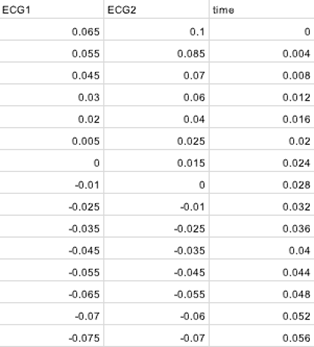

# 1. Dataset Information

QT Database는 QT 간격 검출 알고리즘 평가를 위해 설계된 데이터셋으로, 다양한 QRS 및 ST-T 형태를 포함하는 ECG 기록을 제공합니다. 이 데이터베이스는 MIT-BIH 부정맥 데이터베이스, 유럽 심장학회 ST-T 데이터베이스, 심정지를 경험한 환자의 Holter 기록 등에서 수집된 105개의 15분 길이 2채널 ECG 발췌본으로 구성되어 있습니다.
각 기록은 아티팩트를 최소화하기 위해 신중히 선택되었으며, 심장 전문의가 P파, QRS 복합파, T파, U파의 주요 지점을 수동으로 주석하였습니다. 총 3,622개의 박동이 주석 처리되어 있으며, 박동 간 변화를 상세히 분석할 수 있도록 구성되어 있습니다.
모든 기록은 250 Hz 샘플링으로 수집되어 데이터의 일관성을 유지합니다.

# 2. Dataset Basic Information

## 2.1 Data Information

| # of Leads | Sampling Frequency | Recording Duration | File Format |
| --- | --- | --- | --- |
| 2 | Fixed 250 Hz | 15min | .hea (Metadata) .dat(singal file) .atr(reference beat annotations from original database (not available in all cases)) .man(reference beat annotations) .pu(automatically determined waveform boundary measurements for all beats (based on both signals)) .pu0( automatically determined waveform boundary measurements for all beats (based on signal 0 only)) .pu1(automatically determined waveform boundary measurements for all beats (based on signal 1 only)) .q1c(manually determined waveform boundary measurements for selected beats (annotator 1 only -- second pass)) .q2c(manually determined waveform boundary measurements for selected beats (annotator 2 only -- second pass; available for only 11 records)) .qt1(manually determined waveform boundary measurements for selected beats (annotator 1 only -- first pass)) .qt2(manually determined waveform boundary measurements for selected beats (annotator 2 only -- first pass; available for only 11 records)) |

## 2.2 Beat Annotation Distribution

| -      Type | # recording | Propotion(%) |
| --- | --- | --- |
| Normal beat (N) | 536884 | 98.80 |
| Premature ventricular contraction (V) | 1714 | 0.32 |
| Atrial premature beat (A) | 848 | 0.16 |
| Fusion of ventricular and normal beat (F) | 251 | 0.05 |
| Nodal (junctional) premature beat (J) | 3 | 0.0006 |
| Paced beat (/) | 1847 | 0.34 |
| Fusion of paced and normal beat (f) | 306 | 0.06 |
| Right bundle branch block beat (R) | 679 | 0.13 |
| Nodal (junctional) escape beat (j) | 1 | 0.0002 |
| Supraventricular premature or ectopic beat (S) | 731 | 0.13 |
| Aberrated atrial premature beat (a) | 2 | 0.0004 |
| Unclassifiable beat (Q) | 17 | 0.0031 |
| Bundle branch block beat (unspecified) (B) | 100 | 0.0184 |
| Atrial escape beat (e) | 9 | 0.0017 |

## 2.3 Raw Dataset

!!! note ""
     QT_database/
    ├── •	record_id.dat
    ├── •	record_id.hea
    ├── •	record_id.pu
    ├── •	record_id.pu0	
    ├── •	record_id.pu1
    ├── •	record_id.q1c	
    ├── •	record_id.q2c
    ├── •	record_id.qt1
    ├── •	record_id.qt2
    ├── •	record_id.man			
    └── •**    **record_id.atr
    1directories,  1155 files

이 데이터셋의 ECG 신호는 2개의 리드(Leads)를 통해 시간에 따른 신호 값을 기록하며, 15분 길이의 데이터가 포함됩니다.
추가적으로 다음과 같은 파일이 제공됩니다:
- .hea: 각 파일의 메타데이터 포함
- .atr, .man: 리듬 및 비트(beat) 주석 포함
- .pu, .pu0, .pu1: 자동으로 측정된 파형 경계 정보 포함
- .q1c, .q2c, .qt1, .qt2: 전문가가 수동으로 주석한 파형 경계 정보 포함

## 2.4 Preprocessed Dataset

!!! note ""
     QT_database/
    ├── •	record_id_signals.csv
    ├── •	record_id_header.csv
    ├── •	record_id_pu_annotations.csv
    ├── •	record_id_pu0_annotations.csv	
    ├── •	record_id_pu1_annotations.csv
    ├── •	record_id_q1c_annotations.csv	
    ├── •	record_id_q2c_annotations.csv
    ├── •	record_id_qt1_annotations.csv
    ├── •	record_id_qt2_annotations.csv
    ├── •	record_id_man_annotations.csv			
    └── •**    **record_id_atr_annotations.csv
    1directories,  1155 files

 

Signals.csv는 다음과 같이 2개의 ecg lead의 신호값과 시간데이터로 이루어져있다.

# 3. Applications and Use Cases

QT Database는 ECG 파형 경계 검출 및 QT 간격 측정 연구의 발전에 중요한 역할을 하며, 자동화된 검출 알고리즘 평가를 위한 표준화된 벤치마크를 제공합니다.
이 데이터셋은 다음과 같은 연구 분야에서 널리 활용됩니다:
- ECG 신호 처리 향상: ECG 신호에서 특징을 추출하고 개선된 분석 방법을 개발하는 연구
- 자동 QT 간격 분석 도구 개발
- 부정맥 위험 평가: QT 간격 변화를 기반으로 부정맥 및 심장 질환 위험 평가

| Citation | Prediction task | Architectures | Unique Methodology |
| --- | --- | --- | --- |
| Jane et al. (1997) | Automatic ECG Waveform Boundary Detection | Threshold-Based Detector with filtering | Evaluation using QT Database |

이 데이터베이스를 활용한 연구인 Jane et al. (1997) 연구에서는 QT Database를 활용하여 automatic Threshold-Based 검출기를 평가하였으며, ECG 파형 경계 검출 정확도를 측정하는 실험을 수행하였습니다.

# 4. References

1. Jane, R., et al. "Evaluation of an automatic threshold-based detector of waveform limits in Holter ECG with the QT database." *Computers in Cardiology*, IEEE, 1997.
