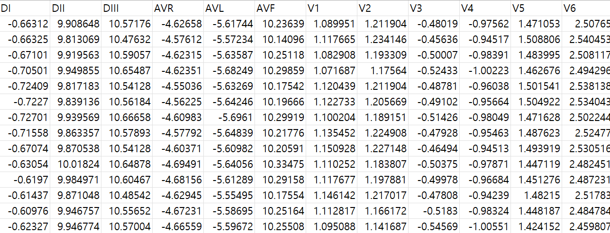

# SaMi-Trop ECG Dataset

# 1. Dataset Information

SaMi-Trop ECG 데이터셋은 만성 샤가스 심근병증을 대상으로 한 NIH 지원 코호트 연구의 하위 집합으로, 1,631명의 환자로부터 수집된 12-리드 심전도(ECG) 기록과 나이 및 사망 여부 주석을 포함하고 있습니다. 각 ECG 검사는 400Hz로 샘플링되었으며, 4096 샘플로 표준화된 12개 리드 신호를 제공합니다. 데이터셋에는 환자의 나이, 성별, ECG 판독 결과(정상 여부), 사망 여부 및 추적 관찰 기간 등의 정보가 포함되어 있습니다. 이 데이터셋은 심전도로 예측한 나이와 사망 위험도 간의 연관성을 분석하는 연구에 활용되었으며, 심장 건강 및 예후 예측 연구에 유용한 자료로 활용될 수 있습니다.

# 2. Dataset Basic Information

## 2.1 Data Information

| # of Leads | Sampling Frequency | Recording Duration | File Format |
| --- | --- | --- | --- |
| 12 | Fixed 400 Hz | 7 seconds
(2800 sample)
10 seconds
(4000 sample) | Exams.csv(metadata)
Exams.hdf5(signal) |

## 2.2 Raw Dataset


!!! note ""
    ```
    SaMi_trop_dataset/
    
    ├── •	Exams.csv
    
    └── •    ****Exams.hdf5
    
    1directories,  2files
    ```


SaMi-Trop 데이터셋은 시간에 따른 12-리드 ECG 신호와 각 기록의 메타데이터를 포함하고 있습니다.

- Exams.csv: 환자의 메타데이터 포함 (나이, 성별, 사망 여부, ECG 판독 결과 등)
- Exams.hdf5: ECG 신호 저장

## 2.3 Preprocessed Dataset


!!! note ""
    ```
    SaMi_trop_dataset/
    
    ├── •	Exams.csv			
    
    └── •    ****record_id.csv
    
    1directories,  525 files
    ```


 

해당 hdf5파일을 열어 record별로 csv형식으로 저장하였습니다.



실제 저장된 데이터의 예시입니다.

# 3. Applications and Use Cases

SaMi-Trop ECG Dataset은 심장 질환 분류(Cardiac Disease Classification), 위험 예측(Risk Prediction), 장기 건강 모니터링(Long-term Health Monitoring) 등의 연구에 활용될 수 있습니다.

이 데이터셋은 다음과 같은 연구 분야에서 중요한 역할을 합니다:

- 심장 질환 분류 (Multi-class ECG Disease Classification)
- 심장 나이 예측 (Heart Age Estimation from ECG)
- 사망 위험 예측 및 장기 건강 모니터링
- 자기 지도 학습(Self-Supervised Learning, SSL) 기반 ECG 표현 학습

| Citation | Prediction task | Architectures | Unique Methodology |
| --- | --- | --- | --- |
| Song et al. (2024) | Multi-class ECG Disease Classification,
Heart Age Estimation from ECG | Hybrid Self-Supervised Learning
based Foundation model | Self-supervised Learning based ECG model
 |

이 데이터셋을 활용한 Song et al. (2024) 연구에서는 Hybrid Self-Supervised Learning 기반 ECG Foundation Model을 구축하여 다중 클래스 심장 질환 분류 및 심장 나이 예측을 수행하였습니다.

# 4. References

[^1]: Song, Junho, et al. "Foundation Models for ECG: Leveraging Hybrid Self-Supervised Learning for Advanced Cardiac Diagnostics." *arXiv preprint arXiv:2407.07110* (2024).