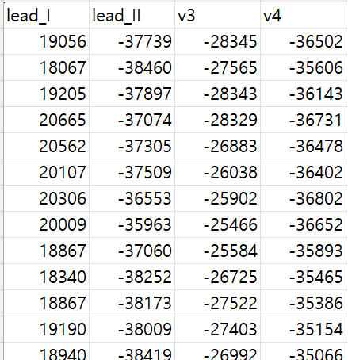

# 1. Dataset Information

SensSmartTech Database는 다양한 심박수 조건에서 ECG, PCG, PPG, ACC 신호를 정밀하게 동기화하여 수집한 멀티센서 기반 심혈관 생리 데이터셋으로, 심장 기능의 전기적·기계적 활동을 정량적으로 분석할 수 있도록 설계되었습니다. 특히 이 데이터셋은 심박수가 안정된 휴식 상태뿐 아니라, 운동 후 회복기에 이르는 넓은 생리적 범위를 포함하고 있어 심박수 변화에 따른 생체 신호의 특성 변화를 연구하는 데 매우 유용합니다.

이 중 ECG 데이터는 총 4개의 리드(Lead I, Lead II, V3, V4)를 통해 수집되었으며, 사지 유도와 흉부 유도를 모두 포함하여 다양한 관점에서 심장의 전기 신호를 포착할 수 있습니다. 32명의 건강한 성인 자원자로부터 수집된 총 338개의 30초 기록은, 각 개인의 다양한 생리적 조건에서 수집되어 ECG 신호의 개인 간·내적 변이성을 포괄할 수 있는 구조를 가지고 있습니다. 이 데이터는 고해상도 ECG 신호 분석, 심박수 기반 특성 조정, 그리고 웨어러블 센서 기반 헬스케어 알고리즘 개발에 폭넓게 활용될 수 있습니다.

# 2. Dataset Basic Information

## 2.1 Data Information

| # of Leads | Sampling Frequency | Recording Duration | File Format |
| --- | --- | --- | --- |
| 4 | Fixed 500 Hz | 30 seconds | .dat(wfdb form) .csv (signal) |

## 2.2 Raw Dataset

!!! note ""
    ```
    SensSmartTech_Dataset/
    └── CSV/
    └── WFDB/
    2directories,  676files
    ```

CSV 폴더 안에는 338개의 원본 ECG데이터 파일이 있고 WFDB안에는 338개의 같은 ECG데이터 파일이 리샘플링 되어 저장되어있습니다.

## 2.3 Preprocessed Dataset

!!! note ""
    ```
    SensSmartTech_Dataset/
    └── •** **	record_time_data.csv
    1directories,  338 files
    ```

 
원본 데이터셋중 ECG csv만 모아 저장하였습니다.



실제 저장된 데이터의 예시입니다.

# 3. Applications and Use Cases

SensSmartTech Database는 다양한 심박수 조건에서 동기화된 ECG, PPG, ACC, PCG 신호를 포함하고 있어, 심박수 기반 바이오마커 정량화, 웨어러블 기반 심박 추정, 운동 후 생리학적 반응 평가 등의 연구에 널리 활용될 수 있습니다. 특히, 원시 신호 기반으로 전기-기계적 커플링과 HR 기반 보정 기법을 개발하는 데 유용합니다.

- 심박수 추정 정확도 평가: ECG를 참조로 PPG 및 ACC 기반 HR 추정 알고리즘 검증
- 신호 품질 변화 분석: 운동 전후의 SNR 변화 및 노이즈 영향 분석

| **Citation** | **Prediction task** | **Architectures** | **Unique Methodology** |
| --- | --- | --- | --- |
| Petrović et al. (2024) | Heart Rate Estimation from PPG and ACC | Signal Processing + Peak Detection | Evaluated PPG & ACC-based HR estimation during post-exercise relaxation using SensSmartTech; |

Petrović et al. (2024) 연구에서는 PPG 및 ACC 신호를 활용하여 운동 후 이완기 동안의 HR 추정 정확도를 평가하였으며, ECG 기반 HR과 비교 시 RMSE 3 bpm 이하의 높은 정확도를 입증하였습니다. 해당 연구는 웨어러블 환경에서의 심박 추정 알고리즘 타당성을 실험적으로 검증하였고, 향후 HR 기반 바이오마커 보정, 심혈관 질환 조기 진단 등에 응용 가능함을 시사하였습니다.

# 4. References

1. J. Petrović *et al*., "Validation of Heart Rate Estimation from Photoplethysmograph and Accelerometer Recordings During Post-Exercise Relaxation," *2024 11th International Conference on Electrical, Electronic and Computing Engineering (IcETRAN)*, Nis, Serbia, 2024, pp. 1-5, doi: 10.1109/IcETRAN62308.2024.10645151.
