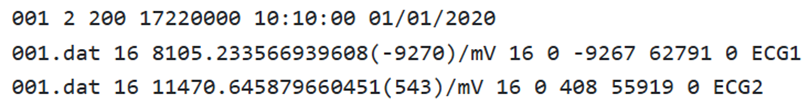
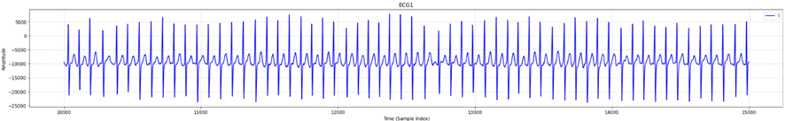

# 1. Dataset Information

SHDB-AF(Saitama Heart Database Atrial Fibrillation)는 일본에서 수집된 새로운 공개 홀터(Holter) ECG 데이터베이스로, 발작성 심방세동(paroxysmal atrial fibrillation)이 있는 100명의 환자 데이터를 포함하고 있습니다. 이 데이터는 리듬 레벨의 수동 주석(beat-level annotation)을 포함하며, 심방세동(AF) 이벤트 탐지를 위한 딥러닝 모델의 일반화 성능을 평가하기 위해 개발되었습니다.
- 심방세동(AF)은 흔히 발생하는 심방 부정맥으로, 삶의 질 저하 및 뇌졸중, 심부전과 같은 심각한 합병증을 유발할 수 있습니다.
- 기계 학습 및 딥러닝(DL) 기술의 발전은 진단 정확도 향상의 가능성을 보여주었으며, 다양한 인구 집단(인종, 나이, 성별)에 대한 일반화 성능 평가의 중요성이 대두되고 있습니다.
- SHDB-AF 데이터베이스는 기존의 ECG 데이터셋과 달리 일본인을 대상으로 수집된 데이터로, ArNet2 및 RawECGNet과 같은 딥러닝 모델을 다양한 분포 변화(distribution shift)에서 검증하는 데 사용되었습니다.

# 2. Dataset Basic Information

## 2.1 Data Information

| # of Subjects | # of Leads | Sampling Frequency (Hz) | Recording Duration (min) | File Fomat |
| --- | --- | --- | --- | --- |
| More than 10,000,000 (10,574,142 records) | 2 | Fixed 200 Hz (Resampled 125Hz) | Approximately 9-24 hours | .dat (ECG) .hea (Metadata) .atr (Rhythm annotation) .qrs (R-peak annotation) |

## 2.2 Data Statistics

| Label Type | # of recordings | Intervals |
| --- | --- | --- |
| AFIB | 2,512,959 (23.77%) | 809 |
| AFL | 195,659 (1.85%) | 45 |
| AT | 48,800 (0.46%) | 57 |
| PAT & NOD | 4,416 (0.04%) | 9 |
| N | 7,812,308 (73.88%) | - |
| Total | 10,574,142 |  |

- AFIB : Atrial fibrillation
- AFL : Atrial flutter
- AT : Atrial tachycardia
- PAT & (NOD : Other supraventricular tachycardias such as Wolf-Parkinson-White & intranodal tachycardias
- N : other, such as NSR, that were not labeled

| Length | Count |
| --- | --- |
| 6,480,000 | 1 |
| 14,357,400 | 1 |
| 16,944,000 | 1 |
| 17,088,000 | 1 |
| 17,160,000 | 4 |
| 17,220,000 | 17 |
| 17,280,000 | 67 |
| 17,306,000 | 1 |
| 17,316,000 | 1 |
| 17,340,000 | 6 |

## 2.3 Raw Dataset

!!! note ""
     SHDB-AF/
    ├── 001.atr
    ├── 001.dat
    ├── 001.hea
    ├── 001.qrs
    ├── 002.atr
    ├── …(400 파일: 각각 .atr + .dat + .hea + .qrs 세트) 
    ├── AdditionalData.csv
    ├── ANNOTATORS
    ├── example.jpg
    ├── LICENSE.txt
    ├── README.md
    ├── RECORDS
    └── SHA256SUMS.txt
    0 directories, 407 files

각 레코드는 200Hz 샘플링 주파수 기준으로 기록된 2개의 리드 ECG 신호를 포함하며, 다음 4개의 파일로 구성되어 있습니다: 
- .atr 파일: 심장 이벤트에 대한 주석 정보를 포함한 Annotation file (timestamp와 이벤트 코드로 구성)
- .hea 파일: 레코드의 메타데이터 (샘플 수, 레이블, 채널 정보 등)를 저장
- .dat 파일: ECG 신호 자체를 저장 (2차원 배열 형태) 
- .qrs 파일: QRS 복합파(심전도에서 주요 전기적 활동을 나타내는 파형)의 위치(시간)를 기록 (일반적으로 R-peak의 시점을 저장)

위의 사진은 SHDB-AF의 001.hea의 내용입니다. 10:10:00는 Start time, 01/01/2020은 Start date를 의미합니다.

## 2.4 Raw Dataset Example

SHDB-AF의 dat, hea, atr, qrs 파일들을 이용하여 data.csv, label.csv 파일로 변환합니다. 아래는 data.csv를 일부 시각화한 예시입니다.

Additional.csv는 각 파일의 patient의 Gender, Age, Dx(진단명), AFL(심방세동 여부), Previous ablation(카테터 절제술 여부), Pacemaker(심장 조율기 이식 여부), AAD(복용한 약물)에 대한 임상 정보를 포함합니다.

## 2.5 Preprocessed Dataset

!!! note ""
     SHDB-AF/
     ├── csv_files/
     │   ├── 001_data.csv
     │   ├── 001_label.csv
     │   └── 002_data.csv
     │   ... (total 200 files)
     ├── channels_info.csv
     ├── SHDB-AF_pretrain_record_ids.csv
     └── SHDB-AF_pretrain.npz
    1 directories, 203 files

csv_files 폴더에는 개별 신호 데이터를 담고 있는 ()_data.csv 파일과 레이블 정보를 담고 있는 ()_label.csv 파일이 포함되어 있습니다. 해당 데이터는 pretrain을 위한 용도로 사용되며, 위의 모든 데이터를 통합하여 라벨 정보와 함께 SHDB-AF_pretrain.npz 파일로 정리하였습니다.

# 3. Applications and Use Cases

현재까지 해당 데이터셋을 활용한 관련 연구가 현재 없지만, 주어진 Label을 통해 Atrial fibrillation classification과 Biometric Identification을 진행할 수 있습니다.

# 4. References

[1] Tsutsui, K., Brimer, S. B., Ben-Moshe, N., Sellal, J. M., Oster, J., Mori, H., Ikeda, Y., Arai, T., Nakano, S., Kato, R., & Behar, J. A. (2024). SHDB-AF: A Japanese Holter ECG database of atrial fibrillation. arXiv preprint arXiv:2406.16974. [https://arxiv.org/abs/2406.16974](https://arxiv.org/abs/2406.16974).
