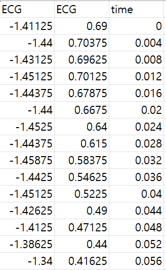

# Sudden Cardiac Death Holter Database

# 1. Dataset Information

Sudden Cardiac Death Holter Database는 심장 급사의 전기생리학적 특징을 연구하고, 치명적인 부정맥 감지 알고리즘을 개발 및 평가하기 위해 설계된 데이터셋입니다. 이 데이터베이스는 23명의 환자로부터 수집된 장시간 Holter ECG 기록을 포함하며, 모든 환자는 지속적인 심실성 부정맥을 경험하였고, 대부분 실제 심정지를 겪었습니다. 데이터는 다양한 심장 리듬 패턴을 포함하고 있으며, 심박 변이도 분석 및 조기 경고 시스템 개발과 같은 연구에 활용될 수 있습니다.

# 2. Dataset Basic Information

## 2.1 Data Information

| # of Leads | Sampling Frequency | Recording Duration | File Format |
| --- | --- | --- | --- |
| 2 | Fixed 250 Hz | 3h56min~25h08min | .dat(ecg)
.atr (audited annotation)
.ari(unaudited annotation)
.hea (Metadata) |

## 2.2 Annotation Distribution

| -      Type | # recording | Proportion(%) |
| --- | --- | --- |
| Normal beat (N) | 745671 | 86.07 |
| Premature ventricular contraction (V) | 23600 | 2.72 |
| Supraventricular premature or ectopic beat (S) | 384 | 0.044 |
| Fusion of ventricular and normal beat (F) | 309 | 0.036 |
| Nodal (junctional) premature beat (J) | 1508 | 0.17 |
| Paced beat (/) | 23123 | 2.67 |
| Fusion of paced and normal beat (f) | 412 | 0.048 |
| Bundle branch block beat (unspecified) (B) | 54725 | 6.32 |
| Unclassifiable beat (Q) | 82 | 0.0095 |
| Aberrated atrial premature beat (a) | 1 | 0.0001 |
| Artifact/Irregular beat(|) | 16403 | 1.89 |
| Noisy Signal (~) | 83 | 0.0096 |
| Ventricular Escape Beat (E) | 16 | 0.0018 |

## 2.3 Raw Dataset


!!! note ""
    ```
    Sudden_cardiac_dataset/
    
    ├── •	record_num.dat
    
    ├── •	record_num.hea
    
    ├── •	record_num.ari
    
    ├── •	record_num.atr
    
    └── •    ****clinical_info.csv
    
    1directories,  82files
    ```


이 데이터셋은 2개의 리드(Leads)를 통해 시간에 따른 ECG 신호 값을 기록하며, 장시간(최대 25시간) 연속적으로 측정된 신호를 제공합니다.

추가적으로 다음과 같은 파일이 포함되어 있습니다:

- clinical_info: 각 환자의 임상 정보 포함
- .hea: 메타데이터 정보 포함
- ari: unaudited 주석이 포함된 파일
- .atr:audited 주석이 포함된 파일

## 2.4 Preprocessed Dataset


!!! note ""
    ```
    Sudden_cardiac_dataset
    
    ├── •	record_num_header.csv
    
    ├── •	record_num_data.csv
    
    ├── •	record_num_label.csv
    
    └── •    ****clinical_info.csv
    
    1directories,  70 files
    ```


 

- clinical_info.csv: 각 환자의 임상 정보 포함
- header.csv: 메타데이터 정보 포함
- label.csv: 비트(beat) 주석이 포함된 파일(atr기반)
- data.csv: ecg신호 파일



실제 저장된 데이터의 예시입니다.

# 3. Applications and Use Cases

Sudden Cardiac Death (SCD) Holter Database는 장기 ECG 기록을 활용한 SCD 위험 예측 및 조기 탐지 연구에 널리 사용됩니다. 이 데이터셋을 통해 다음과 같은 연구가 가능합니다:

- SCD 위험 예측: 장기 ECG 신호 기반 심정지 가능성 평가
- 심박 변이도 분석: 심장 리듬 패턴 변화를 분석하여 이상 징후 탐색
- 부정맥 감지: AI 및 머신러닝 기반 조기 경고 시스템 개발

| Citation | Prediction task | Architectures | Unique Methodology |
| --- | --- | --- | --- |
| Gao, Weidong, et al. (2024) | Sudden Cardiac Death (SCD) Risk Prediction | SVM | proposed SCD Index (SCDI) based on ECG |

이 데이터셋을 사용한 연구인 Gao et al. (2024)에서는 SVM(Support Vector Machine) 모델을 사용하여 Sudden Cardiac Death (SCD) 위험을 예측하는 알고리즘을 개발하였으며, ECG 특징을 활용한 새로운 SCD Index (SCDI)를 제안하여 SCD 발생 가능성을 정량화하는 방법을 도입하였습니다.

# 4. References

[^1]: Gao, Weidong, and Jie Liao. "Sudden Cardiac Death Risk Prediction Based on Noise Interfered Single-Lead ECG Signals." *Electronics* 13.21 (2024): 4274.