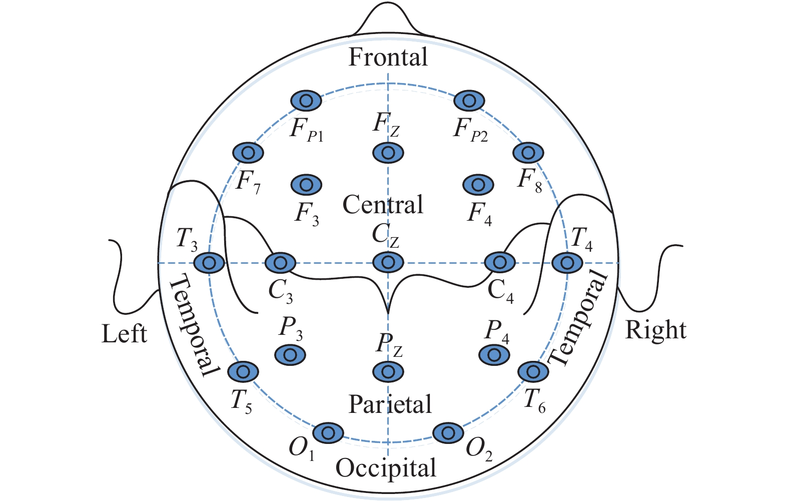

# 2.1. 전극 배치 및 채널 수 (Electrode Placement & Channels)

EEG 측정은 전극을 두피 위 여러 지점에 부착하여 수행됩니다. 전극의 위치는 국제 표준화된 시스템에 따라 명명되며, 가장 대표적으로는 **10-20 시스템**이 사용됩니다.

이 시스템은 두개골의 크기와 형태에 따라 전극을 일정한 비율 간격으로 배치하여 신뢰할 수 있는 측정을 가능하게 합니다. 국제임상신경생리학회(IFCN, International Federation of Clinical Neurophysiology)가 공식 표준으로 채택하였으며, 전 세계 임상 및 연구 현장에서 공통 언어처럼 사용됩니다.

## 전극 명명 규칙

전극 이름은 **뇌 영역 문자 + 위치 번호(또는 z)**의 조합으로 구성됩니다.

### 영역 문자 (Lobe Letter)와 기능적 대응

| 문자 | 영역 | 주요 관련 기능 |
|---|---|---|
| **Fp** | Frontal pole (전전두극) | 고차 인지, 의사결정, 작업 기억, 충동 억제 |
| **F** | Frontal (전두엽) | 계획, 주의 집중, 실행 제어, 언어 생성(좌반구) |
| **C** | Central (중심부) | 일차 운동 피질 및 체성감각 피질 — Motor Imagery의 핵심 영역 |
| **T** | Temporal (측두엽) | 청각 처리, 언어 이해, 기억, 감정(편도체 인접) |
| **P** | Parietal (두정엽) | 공간 지각, 감각 통합 — P300 신호가 가장 강하게 나타나는 영역 |
| **O** | Occipital (후두엽) | 시각 처리 — SSVEP 기반 BCI에서 핵심 전극 위치 |

> **참고**: 전극 위치와 기능적 뇌 영역 간의 대응은 통계적 경향이며, 개인 간 해부학적 차이가 존재합니다. 정밀한 소스 로컬라이제이션을 위해서는 고밀도 EEG와 MRI 기반 개인화 분석이 필요합니다.[^1]

### 번호 및 z 규칙

- **홀수 번호** (예: F3, C3, P3): 왼쪽 반구(좌뇌)
- **짝수 번호** (예: F4, C4, P4): 오른쪽 반구(우뇌)
- **z** (예: Fz, Cz, Pz, Oz): 정중선(midline sagittal plane), 좌우 중앙

> **예시**: C3는 중심부 왼쪽 반구 전극으로, 우측 손/팔의 Motor Imagery 신호 측정에 핵심적으로 활용됩니다. 반대로 C4는 좌측 손/팔의 Motor Imagery와 연관됩니다.

## 전극 배치 시스템

| 시스템 | 전극 수 | 특징 | 주요 용도 |
|---|---|---|---|
| **10-20 시스템** | 21채널 | IFCN 공식 표준, 두개골 길이의 10% 또는 20% 간격으로 배치 | 임상 진단, 기초 연구 |
| **10-10 시스템** | 최대 64~128채널 | 10-20의 중간점을 세분화한 확장 시스템 | 고해상도 연구, BCI |
| **10-5 시스템** | 약 345채널 | 매우 고밀도, 공간 분해능 최대화 | 뇌 매핑, 소스 로컬라이제이션 |

## 채널 수와 분석의 Trade-off

채널 수가 많을수록 공간 해상도가 높아지고 소스 추정 정확도가 향상됩니다. 그러나 이와 동시에 다음과 같은 현실적 비용이 발생합니다.

- **장비 비용 증가**: 고밀도 EEG 시스템은 저밀도 대비 수십 배 이상 고가
- **착용 준비 시간 증가**: 고밀도 캡 장착에는 전도성 젤 도포 등으로 상당한 준비 시간이 필요
- **아티팩트 발생 가능성 증가**: 전극 수가 많을수록 접촉 불량 채널이 생길 확률 증가
- **연산 비용 증가**: 입력 차원이 커질수록 딥러닝 모델의 학습 비용 증가

따라서 연구 목적에 따라 **채널 수를 전략적으로 선택**하는 것이 중요합니다. Motor Imagery BCI는 C3/Cz/C4 등 소수 채널로도 충분한 성능을 낼 수 있으며, 정밀한 소스 로컬라이제이션 연구에서는 고밀도 시스템이 필수적입니다.

---

[^1]: Jurcak, V., Tsuzuki, D., & Dan, I. (2007). 10/20, 10/10, and 10/5 systems revisited: Their validity as relative head-surface-based positioning systems. *NeuroImage*, 34(4), 1600–1611. https://doi.org/10.1016/j.neuroimage.2006.09.024
