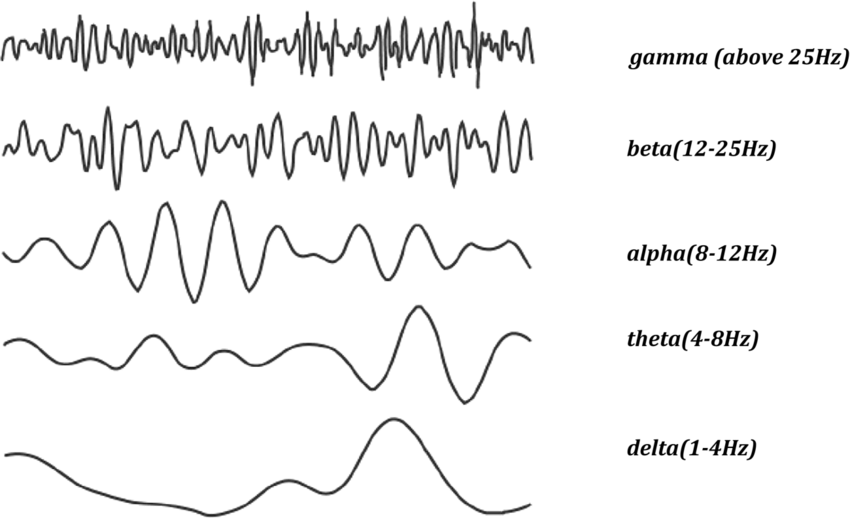

# 2.4. 주파수 밴드와 의미 (Frequency Bands)

EEG 신호는 여러 주파수 대역으로 분해되어 분석됩니다. 각각의 밴드는 뇌의 상태나 기능과 밀접하게 연관되어 있습니다.

### **Delta (1–4 Hz)**

- **관련 뇌 기능**: 깊은 수면, 무의식, 뇌 손상 가능성
- **특징**: 주로 수면 중 나타나며, 깨어 있는 상태에서의 과도한 Delta 활동은 뇌 손상이나 인지 저하와 관련될 수 있습니다.

---

### **Theta (4–8 Hz)**

- **관련 뇌 기능**: 졸림, 명상, 창의적 사고, 기억 형성
- **특징**: 이완된 상태나 인지적 몰입 시 증가하며, 어린이에게서 자연스럽게 많이 나타납니다.

---

### **Alpha (8–12 Hz)**

- **관련 뇌 기능**: 이완, 눈을 감은 안정 상태
- **특징**: 후두엽에서 뚜렷하며, 눈을 뜨거나 주의를 기울일 때 억제됩니다. (Alpha suppression은 집중 신호)

---

### **Beta (12–25 Hz)**

- **관련 뇌 기능**: 주의 집중, 논리적 사고, 인지적 각성
- **특징**: 전두엽 중심으로 활성화되며, 문제 해결이나 스트레스 상태에서 뚜렷해집니다.

---

### **Gamma (25Hz 이상)**

- **관련 뇌 기능**: 고도 인지, 작업 기억, 의식적 사고
- **특징**: 뇌의 여러 영역 간 통합적 정보 처리를 반영하며, 복잡한 인지 작업 중 증가합니다.
