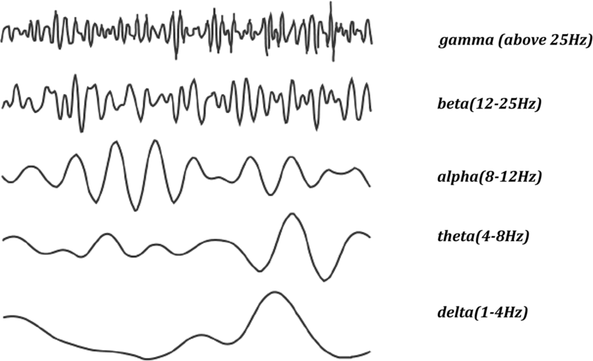

# 2.4. 주파수 밴드와 의미 (Frequency Bands)

EEG 신호는 여러 주파수 대역으로 분해되어 분석됩니다. 각각의 밴드는 뇌의 상태나 기능과 밀접하게 연관되어 있습니다.

## 주파수 밴드 범위에 대한 주의사항

EEG 주파수 밴드의 경계값은 **문헌마다 다소 차이가 있습니다.** Sapien Labs가 발표한 연구에 따르면, 주파수 밴드의 경계는 역사적으로 수학적 원칙보다는 경험적·실용적 기준에 따라 정해져 왔으며, 개별 논문들 사이에서 상당한 변이가 존재합니다.[^1] 아래의 범위는 임상 및 연구에서 가장 널리 통용되는 값이지만, 사용하는 데이터셋과 연구 맥락에 따라 다를 수 있습니다.

## 주파수 밴드 요약

| 밴드 | 일반적 범위 | 주요 관련 기능 |
|---|---|---|
| **Delta** | 0.5–4 Hz | 깊은 수면, 뇌 손상 지표 |
| **Theta** | 4–8 Hz | 졸림, 기억 형성, 창의적 사고 |
| **Alpha** | 8–13 Hz | 이완, 눈 감은 안정 상태 |
| **Beta** | 13–30 Hz | 주의 집중, 인지적 각성 |
| **Gamma** | 30 Hz 이상 | 고차 인지, 복잡한 정보 통합 |

---

### **Delta (0.5–4 Hz)**

- **관련 뇌 기능**: 깊은 수면(N3 단계), 무의식 상태
- **특징**: 정상 성인이 깨어 있는 상태에서는 거의 나타나지 않습니다. 수면 중 서파수면(Slow-wave sleep)에서 두드러지며, 각성 상태에서 과도한 Delta 활동이 관찰되면 뇌 손상, 뇌종양, 뇌졸중 등을 의심할 수 있어 임상적으로 중요한 지표입니다.

---

### **Theta (4–8 Hz)**

- **관련 뇌 기능**: 졸림, 명상, 기억 인코딩, 창의적 사고
- **특징**: 이완 상태나 인지적 몰입 시 증가하며, 어린이에게서 자연스럽게 많이 나타납니다. 해마와 관련된 기억 형성 과정과 밀접하며, 전두엽 Theta(Frontal Theta) 증가는 인지 부하(Mental Workload)의 생체 지표로 활용됩니다.

---

### **Alpha (8–13 Hz)**

- **관련 뇌 기능**: 이완, 눈을 감은 안정 상태, 주의 억제
- **특징**: 주로 후두엽(O1, O2, Oz 전극)에서 뚜렷하게 나타납니다. 눈을 뜨거나 특정 자극에 주의를 기울일 때 Alpha가 억제(Alpha suppression 또는 Event-Related Desynchronization, ERD)되며, 이는 해당 영역이 활성화되고 있다는 신호입니다. Motor Imagery에서 운동 피질의 Alpha/Mu 리듬 억제가 핵심 특징으로 사용됩니다.

---

### **Beta (13–30 Hz)**

- **관련 뇌 기능**: 주의 집중, 논리적 사고, 인지적 각성, 운동 유지
- **특징**: 전두엽과 중심부(F, C 계열 전극)에서 주로 활성화됩니다. 문제 해결, 스트레스, 또는 집중 상태에서 증가하며, Motor Imagery에서 실제 운동이나 상상 운동 후 Beta가 억제(Beta ERD)되었다가 회복되는 패턴(Event-Related Synchronization, ERS)이 나타납니다. 일부 연구에서는 12–30 Hz 또는 13–25 Hz로 정의하기도 하므로, 사용 데이터셋의 기준을 확인하는 것이 중요합니다.

---

### **Gamma (30 Hz 이상)**

- **관련 뇌 기능**: 고차 인지, 작업 기억, 감각 통합, 의식적 사고
- **특징**: 뇌의 여러 영역 간 동기화(Synchronization)를 통한 통합적 정보 처리를 반영합니다. 복잡한 인지 작업 중 증가하며, 특히 시각 피질에서의 Gamma 리듬은 감각 결합(sensory binding)과 관련이 있습니다. 일부 연구에서는 25 Hz 이상을 Gamma로 정의하기도 합니다. 고주파 특성상 근전도(EMG) 아티팩트와 혼재될 가능성이 높아 데이터 품질 관리가 중요합니다.

---

[^1]: Donoghue, T., et al. (2020). The Remarkable Inconsistency of EEG Frequency Band Definitions. Sapien Labs. [https://sapienlabs.org/the-remarkable-inconsistency-of-frequency-band-definitions/](https://sapienlabs.org/the-remarkable-inconsistency-of-frequency-band-definitions/)
