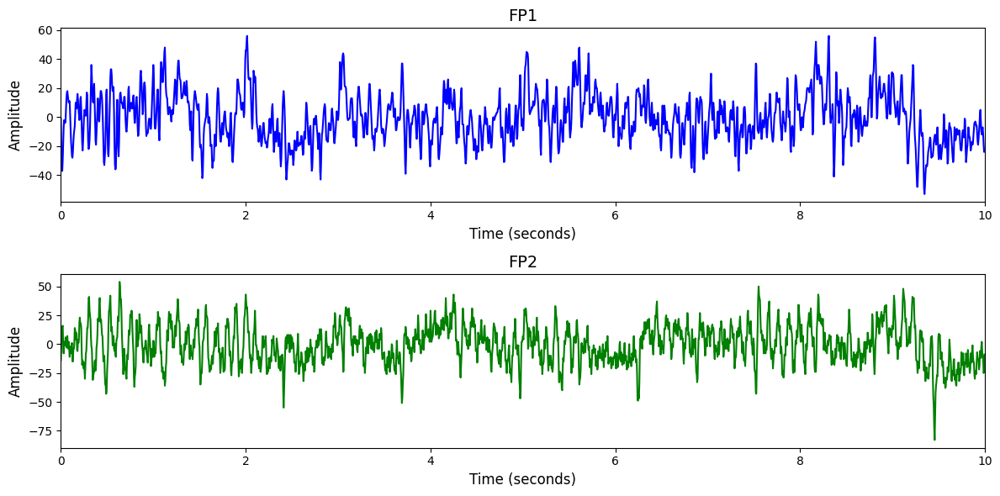

# 1. Dataset Information

이 데이터셋은 수면 장애 진단을 위해 MGH 수면 연구소에서 수집된 1,985명의 수면 데이터로, EEG, EOG, EMG 등 다양한 생리 신호가 포함되어 있습니다. 수면 단계는 AASM 기준에 따라 30초 간격으로 깨어 있음, 단계 1\~3, REM, 미정의로 라벨링되었으며, 각종 각성 이벤트도 전문 기술자에 의해 주석 처리되었습니다 [1].

# 2. Dataset Basic Information

## 2.1 Data Information

| # of Subjects | # of Leads | Sampling Frequency (Hz) | Recording Duration (min) | File Fomat |
| --- | --- | --- | --- | --- |
| 1985 | 6 | 200 | 0.(5 | (EEG).mat, (annotation).arousal, (header).hea |

## 2.2 Data Statistics

*EEG 전극에 해당하는 데이터만을 사용해 통계 분석을 수행하였습니다.

| Label Type | #of recordings | EEG Mean | EEG Std | EEG Max | EEG Median | EEG Min |
| --- | --- | --- | --- | --- | --- | --- |
| Wakefulness | 23546 | -0.001251 | 63.711523 | 7584.000000 | 0.000000 | -7039.000000 |
| Stage 1 | 43033 | -0.001344 | 77.303495 | 8774.000000 | 0.000000 | -8440.000000 |
| Stage 2 | 38469 | -0.000813 | 35.118652 | 5378.000000 | 0.000000 | -6580.000000 |
| Stage 3 | 11886 | 0.000125 | 23.307957 | 4041.000000 | 0.000000 | -4234.000000 |
| REM | 6700 | 0.000114 | 27.470803 | 6207.000000 | 0.000000 | -5550.000000 |
| Undefined | 316947 | 0.000939 | 35.953358 | 7291.000000 | 0.000000 | -7581.000000 |
| Total | 440581 | 0.000085 | 46.499087 | 8774.000000 | 0.000000 | -8440.000000 |

## 2.3 Raw Dataset

!!! note ""
     2018_PhysioNet_Challenge/
     ├── test/
     │   ├── te03-0024/
     │   │   ├── te03-0024.hea
     │   │   └── te03-0024.mat
     │   ├── te03-0031/
     │   │   ├── te03-0031.hea
     │   │   └── te03-0031.mat
     │   ├── te03-0032/
     │   │   ├── te03-0032.hea
     │   │   └── te03-0032.mat
     │   ├── te03-0037/
     │   │   ├── te03-0037.hea
     │   │   └── te03-0037.mat
    …
    │   ├── te14-0286/
    │   │   ├── te14-0286.hea
    │   │   └── te14-0286.mat
    │   └── RECORDS
    └── training/
    ├── tr03-0005/
    │   ├── tr03-0005-arousal.mat
    │   ├── tr03-0005.arousal
    │   └── tr03-0005.hea
    │   ... (1 more files)
    ├── tr03-0029/
    │   ├── tr03-0029-arousal.mat
    │   ├── tr03-0029.arousal
    │   └── tr03-0029.hea
    │   ... (1 more files)
    ├── tr03-0052/
    │   ├── tr03-0052-arousal.mat
    │   ├── tr03-0052.arousal
    │   └── tr03-0052.hea
    │   ... (1 more files)
    …
    ├── tr14-0291/
    │   ├── tr14-0291-arousal.mat
    │   ├── tr14-0291.arousal
    │   └── tr14-0291.hea
    │   ... (1 more files)
    ├── ANNOTATORS
    └── RECORDS
    
    1984 directories, 5953 files

총 1985명의 피험자 데이터를 포함하며 training과 test 폴더로 구성되어 있습니다. 각 피험자 폴더는 tr** 또는 te**로 시작하며, .hea 파일은 신호 정보 헤더, .arousal.mat 및 .arousal 파일은 각성(arousal) 이벤트 주석 정보를 담고 있습니다. 일부 피험자의 폴더에는 수면 단계 주석 및 다양한 생리신호가 포함된 원시 신호 파일들이 함께 저장되어 있으며, EEG, EOG, EMG, EKG, SaO₂ 등의 생리신호가 수집되었습니다. 데이터는 폴더 구조상 개별 피험자 단위로 분리되어 있으며, 각 폴더에는 다수의 주석 및 메타데이터가 존재해 세밀한 수면 분석이 가능합니다.

## 2.4 Raw Dataset Example

## 2.5 Preprocessed Dataset

!!! note ""
     2018_PhysioNet_Challenge/
     ├── npy_files/
     │   ├── sess1004_sub3_trial1.npy
     │   ├── sess1004_sub3_trial10.npy
     │   └── sess1004_sub3_trial100.npy
     │   ... (440578 more files)
     ├── channels.csv
     └── labels.csv
    1 directories, 440583 files

# 3. Applications and Use Cases

| 인용 논문 | 연구 과제 | 모델 구조 | 방법론 |
| --- | --- | --- | --- |
| Perslev (2021[2] | EEG 기반 자동 수면 단계 분류 (sleep staging) | Fully Convolutional Network (U-Sleep) | 전-합성곱 신경망 구조를 사용하여 EEG/EOG 시계열 데이터를 입력받고, 수면 단계를 프레임 단위(최소 30초 간격 이하)로 예측. 다양한 수면 주기 길이와 채널 조합을 처리할 수 있도록 설계되었으며, 각 레이어는 시간 축 정보를 유지한 채 특징을 추출하여 최종적으로 다중 클래스 분류기에서 수면 단계를 출력함. |
| Phan (2022) [3] | 자동 수면 단계 분류 (Sleep Staging) | ATCNet (Attention-based Temporal Convolutional Network)Multi-view Sequence-to-Sequence 모델 (XSleepNet) | 원시 신호와 시간-주파수 이미지의 두 가지 뷰를 동시에 입력으로 받아 각각의 뷰에 대해 generalization/overfitting 수준을 기반으로 동적으로 학습률을 조정. 두 뷰의 특징을 조합하여 통합 표현을 학습하며, 이때 각 뷰의 gradient를 blending하여 정보 손실 없이 융합. 이를 통해 데이터셋 크기나 특성에 강인한 수면 단계 분류 성능 확보. |

# 4. References

[1] Ghassemi, Mohammad M., et al. "You snooze, you win: the physionet/computing in cardiology challenge 2018." *2018 Computing in Cardiology Conference (CinC)*. Vol. 45. IEEE, 2018.
[2] Perslev, Mathias, et al. "U-Sleep: resilient high-frequency sleep staging." *NPJ digital medicine* 4.1 (2021): 72.
[3] Phan, Huy, et al. "XSleepNet: Multi-view sequential model for automatic sleep staging." *IEEE Transactions on Pattern Analysis and Machine Intelligence* 44.9 (2021): 5903-5915.
