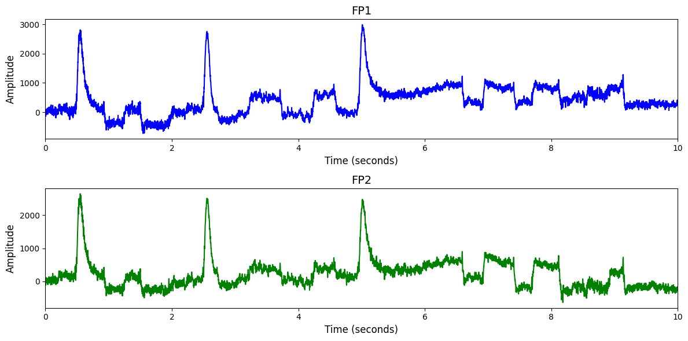

# 1. Dataset Information

BCI IV 1 데이터셋[1]은 총 7명의 건강한 피실험자를 대상으로 수집된 EEG 데이터로, 좌손, 우손, 발 움직임을 상상하는 2가지 운동 이미지 과제를 포함하며, 중립 상태(의도 없음) 구간도 포함되어 있습니다. 64채널 EEG(0.05–200Hz, 1000Hz 샘플링)로 연속적으로 기록되었으며, 캘리브레이션 단계(2회)와 평가 단계(4회)로 구성되어 비동기식 BCI 환경에서 분류기를 적용하는 과제를 다룹니다.

# 2. Dataset Basic Information

## 2.1 Data Information

| # of Subjects | # of Leads | Sampling Frequency (Hz) | Recording Duration (min) | File Fomat |
| --- | --- | --- | --- | --- |
| 7 | 264 | 1000 | 30 | (EEG).txt |

## 2.2 Data Statistics

*EEG 전극에 해당하는 데이터만을 사용해 통계 분석을 수행하였습니다.

| Label Type | #of recordings | EEG Mean | EEG Std | EEG Max | EEG Median | EEG Min |
| --- | --- | --- | --- | --- | --- | --- |
| Left hand | 701 | 404.373595 | 640.654519 | 19775 | 317.0 | -7453 |
| Right hand | 501 | 247.893381 | 594.385310 | 10144 | 140.0 | -9382 |
| Foot | 198 | 703.739417 | 704.763899 | 22352 | 699.0 | -12633 |
| **Total** | 1400 | 353.497880 | 920.587126 | 22352 | 292 | -12633 |

 

## 2.3 Raw Dataset

!!! note ""
    ```
    BCI IV-1/
    ├── BCICIV_calib_ds1a_1000Hz_cnt.txt
    ├── BCICIV_calib_ds1a_1000Hz_mrk.txt
    └── BCICIV_calib_ds1a_1000Hz_nfo.txt
    ... (67 more files)
    0 directories, 70 files
    ```

각 세트는 1000Hz 기준으로 EEG 데이터(_cnt.txt), 마커 파일(_mrk.txt), 메타 정보 파일(_nfo.txt)의 3개 파일씩 이루어져 있습니다. 라벨링은 _mrk.txt 파일에서 이루어지며, 첫 번째 열은 이벤트 발생 시점을, 두 번째 열은 클래스 라벨을 나타냅니다. 클래스 이름은 _nfo.txt 파일 두 번째 줄에서 확인할 수 있으며, 각 실험마다 선택된 두 가지 클래스(예: left, foot)에 따라 -1.0과 1.0으로 구분됩니다.

## 2.4 Raw Dataset Example



## 2.5 Preprocessed Dataset

!!! note ""
    ```
    BCI_IV_1/
    ├── npy_files/
    │   ├── sub1_trial1.npy
    │   ├── sub1_trial10.npy
    │   └── sub1_trial100.npy
    │   ... (1397 more files)
    ├── channels.csv
    └── labels.csv
    1 directories, 1402 files
    ```

# 3. Applications and Use Cases

| 인용 논문 | 연구 과제 | 모델 구조 | 방법론 |
| --- | --- | --- | --- |
| Raoof & Gupta (2024) [2] | EEG 기반 Motor Imagery 데이터 생성 및 분류 | GANs 및 Transfer Learning 기반 하이브리드 모델 | GAN 기반 데이터 증강과 TL 기법을 활용하여 데이터 부족 및 EEG의 비정상성 문제를 해결하고 MI EEG 데이터를 효과적으로   생성 및 분류하는 방법 제안 |
| Leotta et al. (2021) [3] | EEG 기반 Motor Imagery 분류 (특히 cross-subject 성능 개선) | CNN 기반 | DynamicNet 툴로 EEGNet을 구현하고, 전통적 FBCSP 대비 성능을 비교하여 cross-subject MI 분류 정확도를 약 25% 향상 |

# 4. References

[1] Benjamin Blankertz, Guido Dornhege, Matthias Krauledat, Klaus-Robert Müller, and Gabriel Curio. The non-invasive Berlin Brain-Computer Interface: Fast acquisition of effective performance in untrained subjects. NeuroImage, 37(2):539-550, 2007

[2] Cisotto, Giulia, et al. "hvEEGNet: a novel deep learning model for high-fidelity EEG reconstruction." *Frontiers in Neuroinformatics* 18 (2024): 1459970.

[3] Zancanaro, Alberto, et al. "CNN-based approaches for cross-subject classification in motor imagery: From the state-of-the-art to DynamicNet." *2021 IEEE conference on computational intelligence in bioinformatics and computational biology (CIBCB)*. IEEE, 2021.
