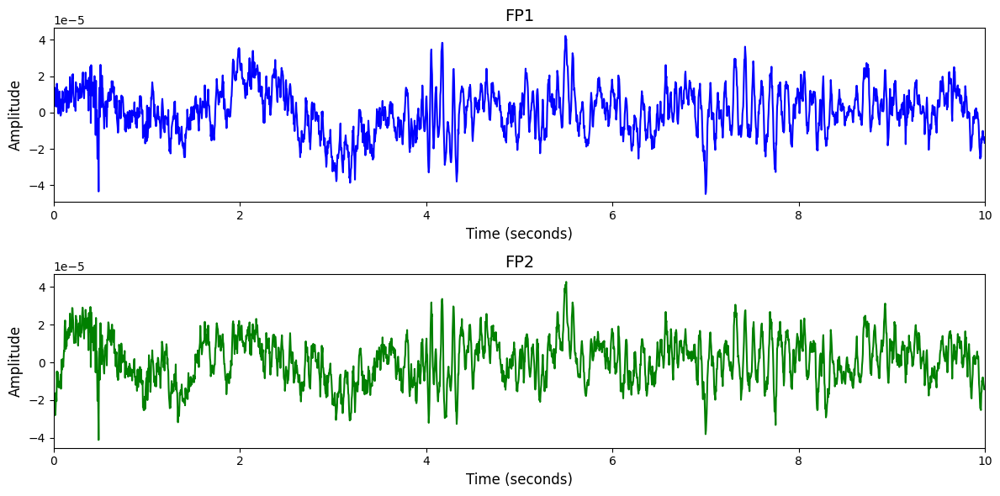

# BCI IV-2a

# 1. Dataset Information

BCI IV-2a 데이터셋[^1]은 Graz University of Technology에서 수집된 것으로, 9명의 피실험자를 대상으로 4가지 motor imagery task(왼손, 오른손, 양발, 혀 움직임 상상)를 수행하면서 EEG 신호를 기록한 데이터입니다. 각 피실험자는 서로 다른 날에 두 번의 세션을 진행했으며, 세션마다 6개의 run으로 구성되고, 한 run 당 48개의 trial(각 클래스별 12개 trial)이 포함되어 총 288개의 trial이 기록되었습니다

# 2. Dataset Basic Information

## 2.1 Data Information

| # of Subjects | # of Leads | Sampling Frequency (Hz) | Recording Duration (min) | File Fomat |
| --- | --- | --- | --- | --- |
| 9 | 22 | 250 | 30 | (EEG).gdf |

## 2.2 Data Statistics

*EEG 전극에 해당하는 데이터만을 사용해 통계 분석을 수행하였습니다.

| Label Type | #of recordings | EEG Mean | EEG Std | EEG Max | EEG Median | EEG Min |
| --- | --- | --- | --- | --- | --- | --- |
|
  Left hand
   | 
 465 | 
  -0.000001
   | 
  0.000048
   | 
  0.0001
   | 
  1.953125e-07
   | 
  -0.0016
   |
|
  Right hand
   | 
  465
   | 
  -0.000001
   | 
  0.000053
   | 
  0.0001
   | 
  9.765625e-08
   | 
  -0.0016
   |
|
  Foot
   | 
466 | 
  -0.000001
   | 
  0.000053
   | 
  0.0001
   | 
  2.929687e-07
   | 
  -0.0016
   |
|
  Tongue
   | 
  466
   | 
  -0.000001
   | 
  0.000051
   | 
  0.0001
   | 
  3.417969e-07
   | 
  -0.0016
   |
| total | 1852 |   -0.000001 |   0.000051 |   0.0001 |   1.395723e-07 |   -0.0016 |

## 2.3 Raw Dataset


!!! note ""
    ```
    BCI IV-2a/
    ├── A01E.gdf
    ├── A01T.gdf
    └── A02E.gdf
    ... (15 more files)
    
    0 directories, 18 files
    ```


BCI IV-2a 데이터셋은 하나의 폴더 안에 총 18개의 GDF 파일로 구성되어 있으며, 9명의 피실험자마다 각각 Training 파일과 Evaluation 파일이 하나씩 존재합니다. 각 GDF 파일은 EEG 신호와 이벤트 정보를 포함하고 있으며, Training 파일에는 모든 trial의 클래스 라벨이 포함되어 있습니다. 라벨링은 파일 내부의 이벤트 정보(h.EVENT.TYP)로 관리되며, 클래스는 왼손(769), 오른손(770), 발(771), 혀(772)로 구분됩니다. 이벤트 발생 시점(h.EVENT.POS)과 함께 duration(h.EVENT.DUR) 정보도 제공되어 trial 구간을 명확히 식별할 수 있습니다.

## 2.4 Raw Dataset Example



## 2.5 Preprocessed Dataset


!!! note ""
    ```
    BCI_IV_2a/
    ├── npy_files/
    │   ├── sess1_sub1_trial1.npy
    │   ├── sess1_sub1_trial10.npy
    │   └── sess1_sub1_trial11.npy
    │   ... (1849 more files)
    ├── channels.csv
    └── labels.csv
    
    1 directories, 1854 files
    ```


# 3. Applications and Use Cases

| 인용 논문 | 연구 과제 | 모델 구조 | 방법론 |
| --- | --- | --- | --- |
|
  Altaheri (2022) [^2]         
   | 
  EEG 기반 Motor Imagery 분류 
   | 
  Attention 기반 Temporal
  Convolutional Network (ATCNet)
   | 
  Convolution, Multi-head Self-Attention, Temporal Convolution 블록으로
  구성된 ATCNet 모델을 사용하여 전처리 없이 raw EEG에서 MI 특징을 추출하고, sliding window 기법으로 데이터
  증강 및 모델 성능 향상
   
   |
|
  Ingolfsson et al. (2020) [^3]
   | 
  임베디드 EEG 기반
  Motor Imagery 분류 (MI-BMI)
   | 
  경량화 Temporal Convolutional Network
  (EEG-TCNet)
   | 
  EEG-TCNet 모델을 통해 적은 수의 파라미터와 낮은 계산 복잡도로
  BCI IV-2a 및 MOABB 데이터셋에서 높은 분류 정확도를 달성하고, subject별 최적화로 성능을 향상하여 엣지 디바이스에서도 효율적인
  MI 분류 수행
   
   |

# 4. References

[^1]: Brunner, C., Leeb, R., Müller-Putz, G. R., Schlögl, A., & Pfurtscheller, G. (2008). BCI Competition 2008 – Graz data set A. *Graz University of Technology, Austria.*

[^2]: Altaheri, Hamdi, Ghulam Muhammad, and Mansour Alsulaiman. "Physics-informed attention temporal convolutional network for EEG-based motor imagery classification." IEEE transactions on industrial informatics 19.2 (2022): 2249-2258.

[^3]: Ingolfsson, Thorir Mar, et al. "EEG-TCNet: An accurate temporal convolutional network for embedded motor-imagery brain–machine interfaces." 2020 IEEE International Conference on Systems, Man, and Cybernetics (SMC). IEEE, 2020.