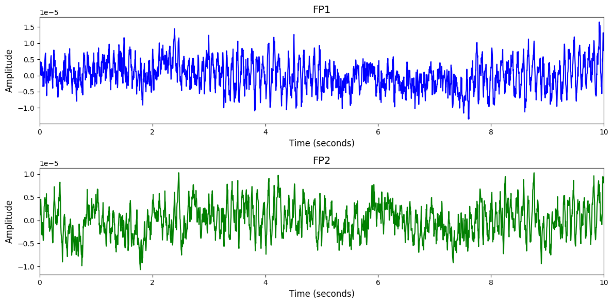

# BCI IV-2b

# 1. Dataset Information

이 데이터셋은 Graz University of Technology에서 수집된 EEG 데이터로, 9명의 피실험자가 참여하여 왼손과 오른손 운동 이미지를 수행하며 수집되었습니다. 각 피실험자는 두 번의 스크리닝 세션(피드백 없음)과 세 번의 온라인 피드백 세션을 포함한 총 5번의 세션에 참여했으며, 각 세션은 여러 run으로 구성되어 다양한 시각적 큐(화살표)와 음향 신호를 통해 실험이 진행되었습니다. 

# 2. Dataset Basic Information

## 2.1 Data Information

| # of Subjects | # of Leads | Sampling Frequency (Hz) | Recording Duration (min) | File Fomat |
| --- | --- | --- | --- | --- |
| 9 | 3 | 250 | 20 | (EEG).gdf |

## 2.2 Data Statistics

*EEG 전극에 해당하는 데이터만을 사용해 통계 분석을 수행하였습니다.

| Label Type | #of recordings | EEG Mean | EEG Std | EEG Max | EEG Median | EEG Min |
| --- | --- | --- | --- | --- | --- | --- |
| Left hand | 1227 | 0.00 | 0.000006 | 0.000100 |
0.00   | 
  -0.0001
   |
| Right hand | 1226 | 0.00 | 0.000006 | 0.000100 |
0.00   | 
  -0.0001
   |
| **Total** | 2453 | 0.00 | 0.000005 |   0.000100 | 0.00   |   -0.0001 |

## 2.3 Raw Dataset


!!! note ""
    ```
    BCI IV-2b/
    ├── B0101T.gdf
    ├── B0102T.gdf
    └── B0103T.gdf
    ... (42 more files)
    
    0 directories, 45 files
    ```


BCI IV-2b 데이터셋은 하나의 폴더 안에 총 45개의 GDF 파일로 구성되어 있으며, 9명의 피실험자마다 5개 세션(3개 training, 2개 evaluation) 파일이 존재합니다. 각 GDF 파일에는 EEG 및 EOG 신호와 함께 이벤트 기반 라벨링이 포함되어 있으며, 클래스는 왼손(이벤트 코드 769)과 오른손(이벤트 코드 770) 두 가지입니다. 이벤트 정보는 이벤트 발생 시점(h.EVENT.POS), 유형(h.EVENT.TYP), 그리고 duration(h.EVENT.DUR)으로 기록되어 있어 각 trial 구간을 정확하게 식별할 수 있습니다.

## 2.4 Raw Dataset Example



## 2.5 Preprocessed Dataset


!!! note ""
    ```
    BCI_IV_2b/
    ├── npy_files/
    │   ├── sess1_sub1_trial1.npy
    │   ├── sess1_sub1_trial10.npy
    │   └── sess1_sub1_trial11.npy
    │   ... (2450 more files)
    ├── channels.csv
    └── labels.csv
    
    1 directories, 2455 files
    ```


# 3. Applications and Use Cases

| 인용 논문 | 연구 과제 | 모델 구조 | 방법론 |
| --- | --- | --- | --- |
| Kim (2023) [^2] | EEG 기반 Motor Imagery 데이터 증강 및 분류 성능 향상 | CropCat 기반 데이터 증강 기법 | 서로 다른 라벨의 데이터를 공간 및 시간 축에서 자른 후 연결하는 CropCat-spatial과 CropCat-temporal 기법을 통해 새로운 데이터를 생성하고, 비율 기반 라벨 조정으로 데이터 부족 문제를 해결하여 모델의 feature distribution 을 개선 및 분류 성능 향상 | 서로 다른 라벨의 데이터를 공간 및 시간 축에서 자른 후 연결하는 CropCat-spatial과 CropCat-temporal 기법을 통해 새로운 데이터를 생성하고, 비율 기반 라벨 조정으로 데이터 부족 문제를 해결하여 모델의 feature distribution 을 개선 및 분류 성능 향상 |
   |
| Wang (2023) [^3] | EEG 기반 Motor Imagery 분류 및 재활 BCI 시스템 개발 | Channel-Attention 기반 Swin Transformer 모델 | EEG 채널 간 상관관계를 반영하는 channel-attention과 Swin Transformer 구조를 결합하여 EEG의 시간-스펙트럼-공간적 특징을 효과적으로 추출하고, 고차원 데이터 문제를 극복하여 motor imagery 분류 성능 향상 | EEG 채널 간 상관관계를 반영하는 channel-attention과 Swin Transformer 구조를 결합하여 EEG의 시간-스펙트럼-공간적 특징을 효과적으로 추출하고, 고차원 데이터 문제를 극복하여 motor imagery 분류 성능 향상 |
   |

# 4. References

[^1]: Leeb, R., Brunner, C., Müller-Putz, G. R., Schlögl, A., & Pfurtscheller, G. (2008). BCI Competition 2008 – Graz data set B. Graz University of Technology, Austria. 

[^2]: Kim, Sung-Jin, Dae-Hyeok Lee, and Yeon-Woo Choi. "Cropcat: Data augmentation for smoothing the feature distribution of eeg signals." 2023 11th International Winter Conference on Brain-Computer Interface (BCI). IEEE, 2023.

[^3]: Wang, Han, et al. "A novel algorithmic structure of EEG channel attention combined with swin transformer for motor patterns classification." IEEE transactions on neural systems and rehabilitation engineering 31 (2023): 3132-3141.