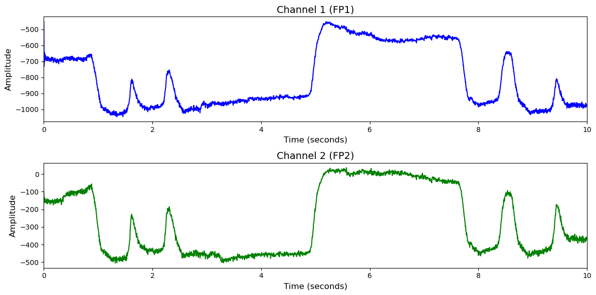

# 1. Dataset Information

BCI-NER Challenge 데이터셋 [1] 은 P300-Speller 기반 BCI(Brain-Computer Interface) 시스템에서의 오탐지(Error Detection) 과제를 위한 공개 EEG 데이터셋으로, IEEE Neural Engineering Conference (NER2015)에서 BCI Challenge의 일환으로 제공되었습니다. 총 26명의 건강한 피험자가 실험에 참여하였으며, 각 피험자는 총 5개의 세션에서 5글자 단어들을 따라 입력(copy spelling)하는 과제를 수행하였습니다. 각 글자 선택은 P300-Speller 방식으로 이루어졌으며, 각 항목이 빠르게(4회) 또는 천천히(8회) 깜빡이는 조건이 주어졌습니다. EEG는 56채널로 측정되었으며, 피드백(정답/오답)이 화면에 표시된 직후의 뇌 반응을 바탕으로 오류 발생 여부(오류정현상, Error-related potential; ErrP)를 탐지하기 위해 수집되었습니다.

# 2. Dataset Basic Information

## 2.1 Data Information

| # of Subjects | # of Leads | Sampling Frequency (Hz) | Recording Duration (min) | File Fomat |
| --- | --- | --- | --- | --- |
| 26 | 56 | 200 | 1714 | (EEG).csv |

## 2.2 Data Statistics

*EEG 전극에 해당하는 데이터만을 사용해 통계 분석을 수행하였습니다.

| Label Type | #of recordings | EEG Mean | EEG Std | EEG Max | EEG Median | EEG Min |
| --- | --- | --- | --- | --- | --- | --- |
| Incorrect (0) | 2579 (29.2%) | 3.467930 | 113.318321 | 449.131104 | 6.261878 | -415.934479 |
| Correct (1) | 6261 (70.8%) | 3.423628 | 105.272926 | 440.201691 | 4.028111 | -377.445435 |
| **Total** | 8840 | 3.4458 | 109.29562 | 444.666398 | 5.144995 | -396.689957 |

## 2.3 Raw Dataset

!!! note ""
     BCI-NER Challenge/
     ├── test/
     │   ├── Data_S01_Sess01.csv
     │   ├── Data_S01_Sess02.csv
     │   └── Data_S01_Sess03.csv
     │   ... (47 more files)
     ├── train/
     │   ├── Data_S02_Sess01.csv
     │   ├── Data_S02_Sess02.csv
     │   └── Data_S02_Sess03.csv
     │   ... (77 more files)
     └── TrainLabels.csv
    │
    └── true_labels.csv
    2 directories, 132 files

Trainlabels.csv와 true_labels.csv에 라벨 정보가 담겨있습니다.

## 2.4 Raw Dataset Example

## 2.5 Preprocessed Dataset

!!! note ""
     BCI-NER Challenge/
     ├── test_npy_files/
     │   ├── sess01_sub01_trial001.npy
     │   ├── sess01_sub01_trial002.npy
     │   └── sess01_sub01_trial003.npy
     │   ... (3397 more files)
     ├── train_npy_files/
     │   ├── sess01_sub02_trial001.npy
     │   ├── sess01_sub02_trial002.npy
     │   └── sess01_sub02_trial003.npy
     │   ... (5437 more files)
     ├── BCI-NER Challenge_test.h5
     ├── BCI-NER Challenge_train.h5
     └── BCI-NER Challenge_train.npz
     ... (3 more files)
    2 directories, 8846 files

한 trial(자극)별로 split하고 .npy로 변환하였으며 이 파일명은 labels.csv의 1열과 대응되고, 2열엔 정수형 레이블이 있습니다.

# 3. Applications and Use Cases

| 인용 논문 | 연구 과제 | 모델 구조 | 방법론 |
| --- | --- | --- | --- |
| Gjølbye (2024) [1] | 대규모 EEG 데이터를 위한 Self-Supervised Pretraining 성능 향상 | BENDR (Transformer 기반 SSL 모델) | TUH EEG Corpus를 대상으로 Python 기반 고속 EEG 전처리 파이프라인(SPEED)을 설계하여, 채널 정규화, 노이즈 제거(Zapline), ICA/ICLabel 기반 아티팩트 제거, 결측 채널 보간 등 수행. Pretraining 후 다양한 downstream 데이터셋에서 probing 평가 실시. |
| Barachant & Cycon (2016) [2] | Grasp-and-Lift EEG Challenge 데이터에서 손 동작 이벤트 감지 및 정확도 향상 | Riemannian Geometry 기반 커널 + Tangent Space Projection + Regularized Linear Discriminant Analysis (rLDA) | EEG 신호의 공분산 행렬을 계산 후 SPD manifold 상에서 Riemannian mean을 기준으로 Tangent space에 투영하고, 이를 특징으로 사용하여 rLDA로 분류. 필터뱅크 적용하여 멀티스케일 특징 추출. 피험자 독립적 학습을 위해 전체 데이터를 통합 학습. |

# 4. References

[1]  Perrin Margaux, Maby Emmanuel, Daligault Sebastien, Bertrand Olivier, and Mattout J ´ er´ emie. (2012). Objective and Subjective Evaluation of Online Error Correction during P300-Based Spelling. Advances in Human-Computer Interaction, 2012:1–13
[2] Gjølbye, A., Skerath, L., Lehn-Schiøler, W., Langer, N., & Hansen, L. K. (2024). *SPEED: Scalable preprocessing of EEG data for self-supervised learning*. Proceedings of the 2024 IEEE International Workshop on Machine Learning for Signal Processing (MLSP).
[3] Barachant, A., & Cycon, R. (2016). *Pushing the limits of BCI accuracy: Winning solution of the Grasp & Lift EEG Challenge*. Proceedings of the Sixth International Brain-Computer Interface Meeting
