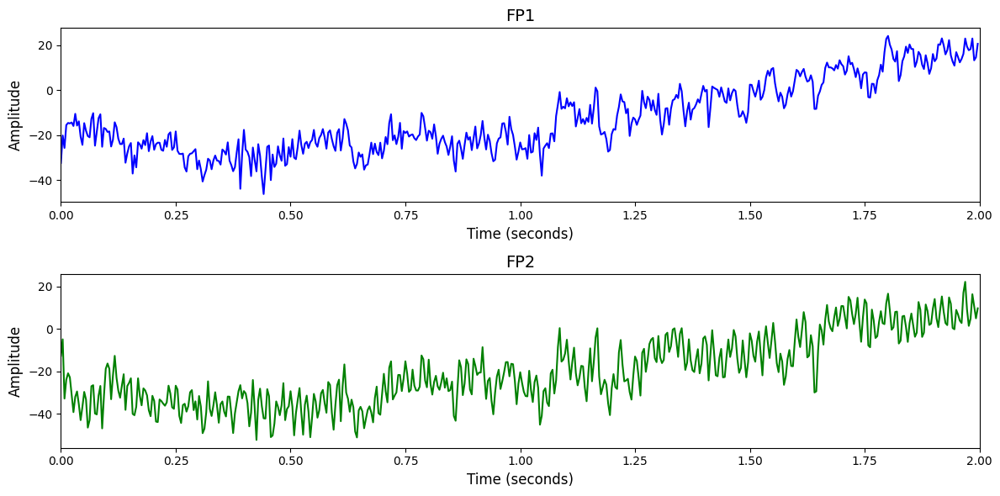

# BCI2020-3

# 1. Dataset Information

이 데이터셋은 다중 클래스 상상 음성 분류(Multi-class Imagined Speech Classification)를 위한 EEG 데이터로, Open Science Framework([https://osf.io/pq7vb/](https://osf.io/pq7vb/))에서 공개되어 있다 [^1]. 총 15명의 피험자가 기본 의사소통에 활용 가능한 다섯 개의 단어 및 문구(‘hello’, ‘help me’, ‘stop’, ‘thank you’, ‘yes’)를 상상하여 발화하는 실험에 참여하였다. 각 클래스당 70회의 시도가 수행되었으며, 이 중 60회는 학습용, 10회는 검증용으로 제공된다(총 350 trials). 

실험은 24인치 모니터 앞에 앉은 상태에서 진행되었으며, 피험자는 무음 상태에서 발화만 상상하도록 지시받았고, 교차 자극(0.8–1.2초) 후 약 2초 동안 해당 단어를 상상 발화하였다. 이 과정을 4회 반복한 뒤, 3초간의 휴식기가 주어졌다. EEG는 BrainAmp 시스템을 통해 64채널로 수집되었으며, 전극 배치는 국제 10-20 시스템을 따르고, 전극 임피던스는 15kΩ 이하로 유지되었다.

# 2. Dataset Basic Information

## 2.1 Data Information

| # of Subjects | # of Leads | Sampling Frequency (Hz) | Recording Duration (min) | File Fomat |
| --- | --- | --- | --- | --- |
| 15 | 64 | 256 | 0.05 | (EEG).mat |

## 2.2 Data Statistics

*EEG 전극에 해당하는 데이터만을 사용해 통계 분석을 수행하였습니다.

| Label Type | #of recordings | EEG Mean | EEG Std | EEG Max | EEG Median | EEG Min |
| --- | --- | --- | --- | --- | --- | --- |
| Hello | 1050 | 31.777317 | 154.987965 | 7846.298542 | 26.935370 | -3276.510992 |
| Help me | 1050 | 21.390024 | 145.354735 | 4072.994824 | 22.813929 | -3167.100970 |
| Stop | 1050 | 22.839833 | 131.777996 | 4561.056747 | 24.434343 | -3682.559567 |
| Thank you | 1050 | 20.190850 | 124.641634 | 3600.859853 | 23.887419 | -3276.862884 |
| Yes | 1050 | 26.801436 | 206.463276 | 16383.626710 | 25.680284 | -16417.028035 |
| Total | 5250 | 28.120593 | 167.129502 | 16383.626710 | 26.103952 | -16417.028035 |

## 2.3 Raw Dataset


!!! note ""
    ```
    Track#3 Imagined speech classification/
    ├── Test set/
    │   ├── Data_Sample01.mat
    │   ├── Data_Sample02.mat
    │   └── Data_Sample03.mat
    │   ... (13 more files)
    ├── Training set/
    │   ├── Data_Sample01.mat
    │   ├── Data_Sample02.mat
    │   └── Data_Sample03.mat
    │   ... (12 more files)
    ├── Validation set/
    │   ├── Data_Sample01.mat
    │   ├── Data_Sample02.mat
    │   └── Data_Sample03.mat
    │   ... (12 more files)
    ├── Data_description(Track3).pdf
    └── answer_sheet_track3.xlsx
    
    3 directories, 48 files
    ```


데이터는 MATLAB .mat 형식으로 제공되며, 학습 데이터(Training Set), 검증 데이터(Validation Set), 테스트 데이터(Test Set)로 구성된다. 각 파일은 epo(EEG 데이터, 라벨, 시간 정보 등 포함)와 mnt(채널 위치 및 정보) 구조체를 포함한다. EEG는 -500ms부터 2600ms까지의 시간 범위를 포함하고 있다.

## 2.4 Raw Dataset Example



## 2.5 Preprocessed Dataset


!!! note ""
    ```
    BCIC2020-3/
    ├── test_npy_files/
    │   ├── sub01_trial01.npy
    │   ├── sub01_trial02.npy
    │   └── sub01_trial03.npy
    │   ... (747 more files)
    ├── train_npy_files/
    │   ├── sub01_trial01.npy
    │   ├── sub01_trial02.npy
    │   └── sub01_trial03.npy
    │   ... (4497 more files)
    ├── validation_npy_files/
    │   ├── sub01_trial01.npy
    │   ├── sub01_trial02.npy
    │   └── sub01_trial03.npy
    │   ... (747 more files)
    ├── BCIC2020-3.h5
    ├── BCIC2020-3.npz
    └── channels.csv
    ... (3 more files)
    
    3 directories, 6006 files
    ```


# 3. Applications and Use Cases

| 인용 논문 | 연구 과제 | 모델 구조 | 방법론 |
| --- | --- | --- | --- |
| Hsu (2023) [^2] | MI EEG 신호에서 시공간 및 스펙트럼 중요도 조절을 통한 분류 성능 향상 | Wavelet-based Temporal-Spectral-Attention Correlation Coefficient | 시공간-스펙트럼 도메인에서 EEG 특징의 중요도를 주파수/채널 축 기준으로 가중치를 부여해 추출. iTFE로 초기 특징 추출 후, DEC 모듈로 채널 중요도 자동 조정, WTS 모듈로 시간-스펙트럼 분류 특징 강조. 최종 단순 분류기를 통해 분류 수행. |
|
Han (2023) [^3]         
   | Calibration 없이도 일반화 가능한 MI-BCI 시스템 구축 | Gradient-based Meta-learning + Intermittent Freezing | 메타러닝 기반 zero-calibration EEG 프레임워크 제안. 간헐적 파라미터 동결 전략을 통해 class-relevant feature만 선택적으로 학습하고, 새로운 사용자(특히 stroke 환자)에게도 일반화 가능. |

# 4. References

[^1]: Jeong, Ji-Hoon, et al. "2020 International brain–computer interface competition: A review." Frontiers in human neuroscience 16 (2022): 898300.

[^2]: Hsu, Wei-Yen, and Ya-Wen Cheng. "EEG-channel-temporal-spectral-attention correlation for motor imagery EEG classification." *IEEE Transactions on Neural Systems and Rehabilitation Engineering* 31 (2023): 1659-1669.

[^3]: Han, Ji-Wung, et al. "META-EEG: Meta-learning-based class-relevant EEG representation learning for zero-calibration brain–computer interfaces." *Expert Systems with Applications* 238 (2024): 121986.