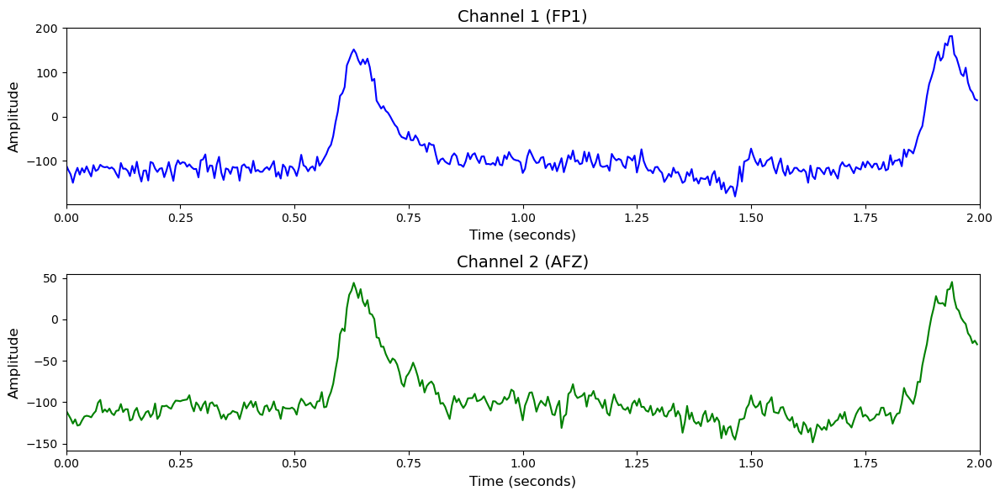

# Berlin (dsr)

# 1. Dataset Information

Berlin(dsr) 데이터셋[^1]은 자극 판별 및 선택 반응(discrimination/selection response, DSR) 과제를 기반으로 수집되었습니다.  26명의 피험자는 화면에 나타나는 'O' 또는 'X' 자극에 대해 버튼을 누르는 방식으로 반응하였고, 각 세션은 세 번 반복되어 총 180회의 trial이 수행되었습니다.

# 2. Dataset Basic Information

## 2.1 Data Information

| # of Subjects | # of Leads | Sampling Frequency (Hz) | Recording Duration (min) | File Fomat |
| --- | --- | --- | --- | --- |
| 26 | 30 | 200 | 320 | (EEG).mat |

## 2.2 Data Statistics

*EEG 전극에 해당하는 데이터만을 사용해 통계 분석을 수행하였습니다.

| Label Type | #of recordings | EEG Mean | EEG Std | EEG Max | EEG Median | EEG Min |
| --- | --- | --- | --- | --- | --- | --- |
| Go (0) | 2678     (30.1%) | 10.348152   | 39.399933 | 275.388550  | 8.588854   | -113.134674   |
| No-go (1) | 6214     (69.9%) | 10.589199   | 39.427715 | 276.190582  | 8.889562   | -115.004555   |
| **Total** | 8892 | 10.469 | 39.413824 | 275.789566 | 8.739208 | -114.069615 |

## 2.3 Raw Dataset


!!! note ""
    ```
    Berlin_dsr/
    ├── VP001-EEG/
    │   ├── cnt_dsr.mat
    │   ├── mnt_dsr.mat
    │   └── mrk_dsr.mat
    ├── VP002-EEG/
    │   ├── cnt_dsr.mat
    │   ├── mnt_dsr.mat
    │   └── mrk_dsr.mat
    └── VP003-EEG/
    ├── cnt_dsr.mat
    ├── mnt_dsr.mat
    └── mrk_dsr.mat
    ... (23 more directories)
    
    26 directories, 9 files
    ```


mrk_dsr.mat를 통해 trial별 timepoint 정보와 라벨을 알 수 있습니다.

## 2.4 Raw Dataset Example



## 2.5 Preprocessed Dataset


!!! note ""
    ```
    Berlin_dsr/
    ├── npy_files/
    │   ├── sub01_trial001.npy
    │   ├── sub01_trial002.npy
    │   └── sub01_trial003.npy
    │   ... (8889 more files)
    ├── Berlin_dsr.h5
    ├── Berlin_dsr.npz
    └── channels.csv
    ... (1 more files)
    
    1 directory, 8896 files
    ```


한 trial(자극)별로 split하고 .npy로 변환하였으며 이 파일명은 labels.csv의 1열과 대응되고, 2열엔 정수형 레이블이 있습니다.

# 3. Applications and Use Cases

| 인용 논문 | 연구 과제 | 모델 구조 | 방법론 |
| --- | --- | --- | --- |
| Rabbani & Islam (2023) [^2] | EEG-NIRS 동시 측정 데이터를 활용한 인지 과제 분류 | CNN, LSTM, GRU 기반 다양한 모델 조합 (CNN-LSTM-GRU 등) | EEG 및 fNIRS 각각 전처리 후 개별 딥러닝 모델 (CNN, LSTM 등)로 특징 학습, 예측 결과들을 융합하여 최종 분류. 3가지 과제(n-back, DSR, WG)에 대해 정확도와 AUC 평가 수행. CNN-LSTM-GRU 구조가 가장 우수한 성능 달성 (Acc 96%, AUC 100%). |

# 4. References

[^1]: Shin, J., von Lühmann, A., Kim, D.-W., Mehnert, J., Hwang, H.-J., & Müller, K.-R. (2018). Simultaneous acquisition of EEG and NIRS during cognitive tasks for an open access dataset. *Scientific Data*, 5, 180003. https://doi.org/10.1038/sdata.2018.3

[^2]: Rabbani, M. H. R., & Islam, S. M. R. (2023). *Deep learning networks based decision fusion model of EEG and fNIRS for cognitive task classification*. Springer Professional. https://www.springerprofessional.de/en/deep-learning-networks-based-decision-fusion-model-of-eeg-and-fn/25558736