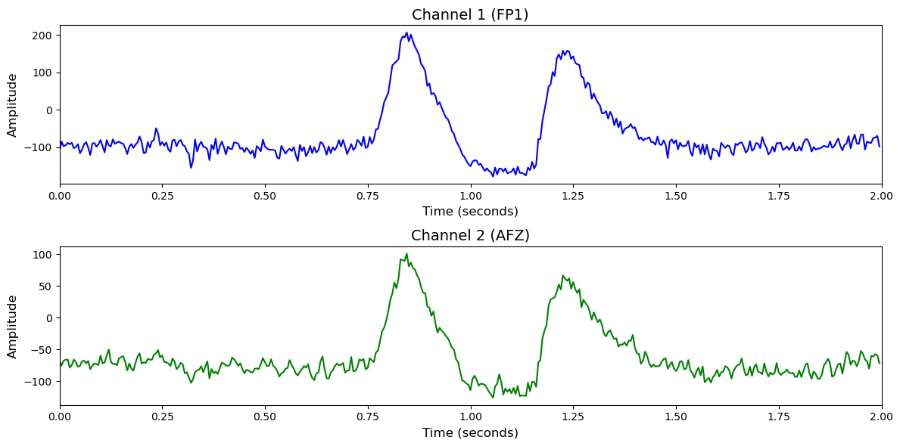

# 1. Dataset Information

Berlin(nback) 데이터셋[1]은 작업 기억 부하를 측정하기 위한 n-back 과제를 기반으로 수집되었습니다. 26명의 피험자가 0-back, 2-back, 3-back 세 조건을 포함한 과제를 수행하며, 각 조건은 총 3세션에 걸쳐 반복되었습니다.

# 2. Dataset Basic Information

## 2.1 Data Information

| # of Subjects | # of Leads | Sampling Frequency (Hz) | Recording Duration (min) | File Fomat |
| --- | --- | --- | --- | --- |
| 26 | 30 | 200 | 478 | (EEG).mat |

## 2.2 Data Statistics

*EEG 전극에 해당하는 데이터만을 사용해 통계 분석을 수행하였습니다.

| Label Type | #of recordings | EEG Mean | EEG Std | EEG Max | EEG Median | EEG Min |
| --- | --- | --- | --- | --- | --- | --- |
| Non-Target (0) | 5746     (44.7%) | -1.340103 | 50.640553 | 326.318359 | -3.105937 | -154.735703 |
| Target (1) | 6214     (69.9%) | 1.489478 | 49.101074 | 306.743774 | 0.013752 | -151.023422 |
| **Total** | 12844 | 1.4895 | 49.870814 | 316.531067 | -1.54609 | -152.879563 |

## 2.3 Raw Dataset

!!! note ""
     Berlin_nback/
     ├── VP001-EEG/
     │   ├── cnt_nback.mat
     │   ├── mnt_nback.mat
     │   └── mrk_nback.mat
     ├── VP002-EEG/
     │   ├── cnt_nback.mat
     │   ├── mnt_nback.mat
     │   └── mrk_nback.mat
     └── VP003-EEG/
     ├── cnt_nback.mat
     ├── mnt_nback.mat
     └── mrk_nback.mat
     ... (23 more directories)
    26 directories, 9 files

mrk_dsr.mat를 통해 trial별 timepoint 정보와 라벨을 알 수 있습니다.

## 2.4 Raw Dataset Example

## 2.5 Preprocessed Dataset

!!! note ""
     Berlin_nback/
     ├── npy_files/
     │   ├── sess01_sub01_trial001.npy
     │   ├── sess01_sub01_trial002.npy
     │   └── sess01_sub01_trial003.npy
     │   ... (12841 more files)
     ├── Berlin_nback.h5
     ├── Berlin_nback.npz
     └── channels.csv
     ... (1 more files)
    1 directory, 12848 files

한 trial(자극)별로 split하고 .npy로 변환하였으며 이 파일명은 labels.csv의 1열과 대응되고, 2열엔 정수형 레이블이 있습니다.

# 3. Applications and Use Cases

| 인용 논문 | 연구 과제 | 모델 구조 | 방법론 |
| --- | --- | --- | --- |
| Rabbani & Islam (2023) [2] | EEG-NIRS 동시 측정 데이터를 활용한 인지 과제 분류 | CNN, LSTM, GRU 기반 다양한 모델 조합 (CNN-LSTM-GRU 등) | EEG 및 fNIRS 각각 전처리 후 개별 딥러닝 모델 (CNN, LSTM 등)로 특징 학습, 예측 결과들을 융합하여 최종 분류. 3가지 과제(n-back, DSR, WG)에 대해 정확도와 AUC 평가 수행. CNN-LSTM-GRU 구조가 가장 우수한 성능 달성 (Acc 96%, AUC 100%). |

# 4. References

[1] Shin, J., von Lühmann, A., Kim, D.-W., Mehnert, J., Hwang, H.-J., & Müller, K.-R. (2018). Simultaneous acquisition of EEG and NIRS during cognitive tasks for an open access dataset. *Scientific Data*, 5, 180003. https://doi.org/10.1038/sdata.2018.3
[2] Rabbani, M. H. R., & Islam, S. M. R. (2023). *Deep learning networks based decision fusion model of EEG and fNIRS for cognitive task classification*. Springer Professional. https://www.springerprofessional.de/en/deep-learning-networks-based-decision-fusion-model-of-eeg-and-fn/25558736
