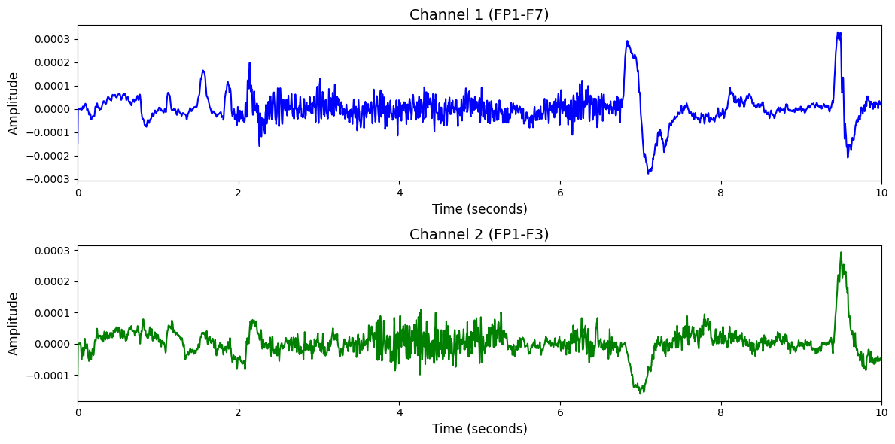

# 1. Dataset Information

CHB-MIT[1] 데이터셋은 소아 간질 환자 23명을 대상으로 수집된 EEG 데이터로, 발작 감지 알고리즘 개발을 목적으로 사용됩니다. 23명 환자 중 일부는 여러 번의 발작 데이터를 포함하며, 각 환자의 데이터는 서로 다른 수의 세션으로 구성되어 있습니다. EEG는 23개의 채널로 256Hz 샘플링 속도로 기록되었으며, 각 세션은 수 시간에 걸쳐 연속적으로 기록되었습니다. 본 데이터셋은 발작 전/후 상태를 포함한 다양한 뇌파 패턴을 분석하는 데 유용하며, 환자별로 편차가 큰 실제 환경의 임상 데이터를 반영하고 있습니다.

# 2. Dataset Basic Information

## 2.1 Data Information

| # of Subjects | # of Leads | Sampling Frequency (Hz) | Recording Duration (min) | File Fomat |
| --- | --- | --- | --- | --- |
| 22 | 23 | 256 | 1440 | (EEG).edf, (summary).txt |

## 2.2 Data Statistics

*EEG 전극에 해당하는 데이터만을 사용해 통계 분석을 수행하였습니다.

| Label Type | #of recordings | EEG Mean | EEG Std | EEG Max | EEG Median | EEG Min |
| --- | --- | --- | --- | --- | --- | --- |
| Non-Seizure (0) | 885 (81.64%) | 0.000000 | 0.000053 | 0.001362 | 0.000000 | -0.001360 |
| Seizure (1) | 199 (18.36%) | 0.000000 | 0.000053 | 0.001362 | 0.000000 | -0.001360 |
| Total | 1084 | 0.000000 | 0.000062 | 0.001280 | 0.000000 | -0.001270 |

## 2.3 Raw Dataset

!!! note ""
     CHB-MIT/
     ├── files/
     │   ├── chbmit/
     │   │   ├── 1.0.0/
     │   │   │   ├── chb01/
     │   │   │   │   ├── chb01-summary.txt
     │   │   │   │   ├── chb01_01.edf
     │   │   │   │   └── chb01_02.edf
     │   │   │   │   ... (48 more files)
     │   │   │   ├── chb02/
     │   │   │   │   ├── chb02-summary.txt
     │   │   │   │   ├── chb02_01.edf
     │   │   │   │   └── chb02_02.edf
     │   │   │   │   ... (38 more files)
     │   │   │   ├── chb03/
     │   │   │   │   ├── chb03-summary.txt
     │   │   │   │   ├── chb03_01.edf
     │   │   │   │   └── chb03_01.edf.seizures
     │   │   │   │   ... (44 more files)
     │   │   │   ├── chb04/
     │   │   │   │   ├── chb04-summary.txt
     │   │   │   │   ├── chb04_01.edf
     │   │   │   │   └── chb04_02.edf
     │   │   │   │   ... (44 more files)
     │   │   │   ├── chb05/
     │   │   │   │   ├── chb05-summary.txt
     │   │   │   │   ├── chb05_01.edf
     │   │   │   │   └── chb05_02.edf
     │   │   │   │   ... (43 more files)
     │   │   │   ├── chb06/
     │   │   │   │   ├── chb06-summary.txt
     │   │   │   │   ├── chb06_01.edf
     │   │   │   │   └── chb06_01.edf.seizures
     │   │   │   │   ... (24 more files)
     │   │   │   ├── chb07/
     │   │   │   │   ├── chb07-summary.txt
     │   │   │   │   ├── chb07_01.edf
     │   │   │   │   └── chb07_02.edf
     │   │   │   │   ... (21 more files)
     │   │   │   ├── chb08/
     │   │   │   │   ├── chb08-summary.txt
     │   │   │   │   ├── chb08_02.edf
     │   │   │   │   └── chb08_02.edf.seizures
     │   │   │   │   ... (24 more files)
     │   │   │   ├── chb09/
     │   │   │   │   ├── chb09-summary.txt
     │   │   │   │   ├── chb09_01.edf
     │   │   │   │   └── chb09_02.edf
     │   │   │   │   ... (21 more files)
     │   │   │   ├── chb10/
     │   │   │   │   ├── chb10-summary.txt
     │   │   │   │   ├── chb10_01.edf
     │   │   │   │   └── chb10_02.edf
     │   │   │   │   ... (31 more files)
     │   │   │   ├── chb11/
     │   │   │   │   ├── chb11-summary.txt
     │   │   │   │   ├── chb11_01.edf
     │   │   │   │   └── chb11_02.edf
     │   │   │   │   ... (37 more files)
     │   │   │   ├── chb12/
     │   │   │   │   ├── chb12-summary.txt
     │   │   │   │   ├── chb12_06.edf
     │   │   │   │   └── chb12_06.edf.seizures
     │   │   │   │   ... (36 more files)
     │   │   │   ├── chb13/
     │   │   │   │   ├── chb13-summary.txt
     │   │   │   │   ├── chb13_02.edf
     │   │   │   │   └── chb13_03.edf
     │   │   │   │   ... (40 more files)
     │   │   │   ├── chb14/
     │   │   │   │   ├── chb14-summary.txt
     │   │   │   │   ├── chb14_01.edf
     │   │   │   │   └── chb14_02.edf
     │   │   │   │   ... (32 more files)
     │   │   │   ├── chb15/
     │   │   │   │   ├── chb15-summary.txt
     │   │   │   │   ├── chb15_01.edf
     │   │   │   │   └── chb15_02.edf
     │   │   │   │   ... (53 more files)
     │   │   │   ├── chb16/
     │   │   │   │   ├── chb16-summary.txt
     │   │   │   │   ├── chb16_01.edf
     │   │   │   │   └── chb16_02.edf
     │   │   │   │   ... (24 more files)
     │   │   │   ├── chb17/
     │   │   │   │   ├── chb17-summary.txt
     │   │   │   │   ├── chb17a_03.edf
     │   │   │   │   └── chb17a_03.edf.seizures
     │   │   │   │   ... (23 more files)
     │   │   │   ├── chb18/
     │   │   │   │   ├── chb18-summary.txt
     │   │   │   │   ├── chb18_01.edf
     │   │   │   │   └── chb18_02.edf
     │   │   │   │   ... (41 more files)
     │   │   │   ├── chb19/
     │   │   │   │   ├── chb19-summary.txt
     │   │   │   │   ├── chb19_01.edf
     │   │   │   │   └── chb19_02.edf
     │   │   │   │   ... (32 more files)
     │   │   │   ├── chb20/
     │   │   │   │   ├── chb20-summary.txt
     │   │   │   │   ├── chb20_01.edf
     │   │   │   │   └── chb20_02.edf
     │   │   │   │   ... (34 more files)
     │   │   │   ├── chb21/
     │   │   │   │   ├── chb21-summary.txt
     │   │   │   │   ├── chb21_01.edf
     │   │   │   │   └── chb21_02.edf
     │   │   │   │   ... (36 more files)
     │   │   │   ├── chb22/
     │   │   │   │   ├── chb22-summary.txt
     │   │   │   │   ├── chb22_01.edf
     │   │   │   │   └── chb22_02.edf
     │   │   │   │   ... (33 more files)
     │   │   │   ├── chb23/
     │   │   │   │   ├── chb23-summary.txt
     │   │   │   │   ├── chb23_06.edf
     │   │   │   │   └── chb23_06.edf.seizures
     │   │   │   │   ... (11 more files)
     │   │   │   ├── chb24/
     │   │   │   │   ├── chb24-summary.txt
     │   │   │   │   ├── chb24_01.edf
     │   │   │   │   └── chb24_01.edf.seizures
     │   │   │   │   ... (33 more files)
     │   │   │   ├── .DS_Store
     │   │   │   ├── ANNOTATORS
     │   │   │   └── RECORDS
     │   │   │   ... (5 more files)
     └── robots.txt
    31 directories, 893 files

각 환자 폴더에는 환자의 다수 EEG 세션이 EDF 형식으로 저장되어 있으며, 발작이 포함된 일부 세션은 발작 발생 시간 정보를 담은 .edf.seizure 파일과 함께 제공됩니다. 각 폴더의 ch##-summary.txt 파일은 각 환자 폴더에서 발작이 포함된 파일들에 대해 파일 별로 발작 시작 시간과 종료 시간, 발작 횟수 등의 정보를 포함하고 있습니다. 실험 환경은 병원에서 실제 환자의 데이터를 기반으로 하여, 현실적인 간질 발작 감지 알고리즘 개발에 적합한 구조로 설계되어 있습니다.

## 2.4 Raw Dataset Example

## 2.5 Preprocessed Dataset

!!! note ""
     CHB-MIT/
     ├── npy_files/
     │   ├── sess01_sub01_trial01.npy
     │   ├── sess01_sub02_trial01.npy
     │   └── sess01_sub03_trial01.npy
     │   ... (1074 more files)
     ├── CHB-MIT.npz
     ├── channels.csv
     └── labels.csv
    1 directories, 1080 files

# 3. Applications and Use Cases

| 인용 논문 | 연구 과제 | 모델 구조 | 방법론 |
| --- | --- | --- | --- |
| Yang et al. (2023) [2] | EEG 기반 발작 탐지 및 다양한 생체신호 분류 | Transformer 기반 Attention 모델 (BIOT) | 다양한 생체신호 간 차이를 보정할 수 있도록 biosignal sentence 생성 후 Transformer에 입력. CHB-MIT 등에서 전이 학습을 수행하며, 발작 탐지 정확도 검증. |
| Mir et al. (2023) [3] | EEG 기반 간질 발작 자동 진단 | 심층 오토인코더와 양방향 순환신경망 기반 모델 (Deep-EEG) | CHB-MIT 및 실제 병원 데이터셋을 기반으로 EEG를 세그먼트화 후 Bi-LSTM으로 분류. 민감도 99.8%, 정밀도 99.9% 달성. |
| Wang et al. (2025) [4] | EEG 기반 범용 BCI 모델 학습 (Foundation Model) | Criss-Cross Transformer 기반 모델 (CBraMod) | 12개 공개 EEG 데이터셋 중 하나로 CHB-MIT 포함. Masked EEG reconstruction 기반 self-supervised pretraining, spatial-temporal attention 분리 학습 구조. |

# 4. References

[1] Ali Hossam Shoeb. Application of Machine Learning to Epileptic Seizure Onset Detection and Treatment. Doctoral Dissertation, *Massachusetts Institute of Technology*, 2009.
[2] Chaoqi Yang, M. Brandon Westover, and Jimeng Sun. BIOT: Biosignal Transformer for Cross-data Learning in the Wild. *Advances in Neural Information Processing Systems (NeurIPS)*, 2023.
[3] Waseem Ahmad Mir, Mohd Anjum, Izharuddin, and Sana Shahab. Deep-EEG: An Optimized and Robust Framework and Method for EEG-Based Diagnosis of Epileptic Seizure. *Diagnostics*, 13(4):773, 2023.
[4] Jiquan Wang, Sha Zhao, Zhiling Luo, Yangxuan Zhou, Haiteng Jiang, Shijian Li, Tao Li, and Gang Pan. CBraMod: A Criss-Cross Brain Foundation Model for EEG Decoding. *Proceedings of the International Conference on Learning Representations (ICLR)*, 2025.
