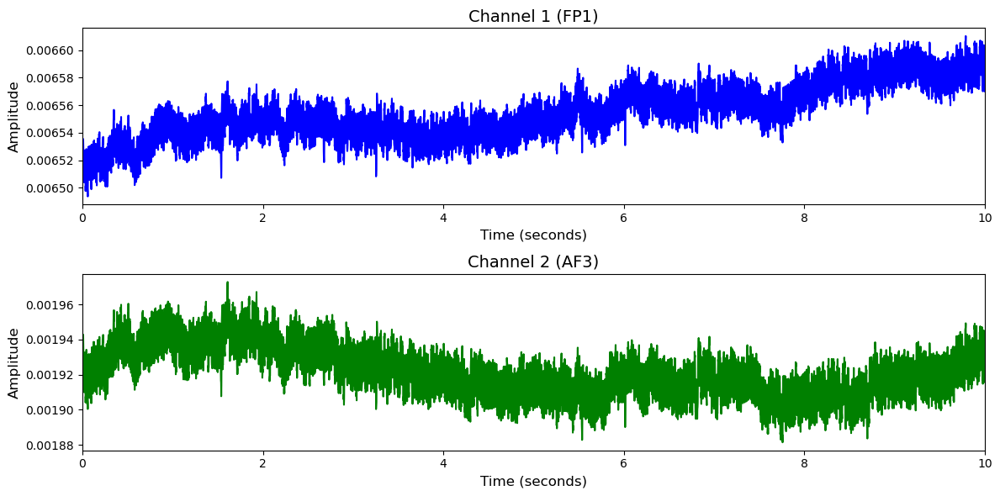

# DEAP

# 1. Dataset Information

DEAP 데이터셋[^1] 은 인간의 감정 상태 분석을 위해 수집된 멀티모달 생체신호 데이터셋으로, 32명의 피험자가 감정 유도 음악 영상 40개(각 1분 길이)를 시청하는 동안 EEG 및 주변 생리 신호가 측정되었습니다. 각 영상 시청 후, 피험자는 valence, arousal, dominance, like/dislike에 대해 평가하였습니다. 이 중 22명의 피험자에 대해서는 얼굴 영상 데이터도 함께 수집되었습니다.

# 2. Dataset Basic Information

## 2.1 Data Information

| # of Subjects | # of Leads | Sampling Frequency (Hz) | Recording Duration (min) | File Fomat |
| --- | --- | --- | --- | --- |
| 32 | 32 | 512 | 1280 | (EEG).bdf |

## 2.2 Data Statistics

*EEG 전극에 해당하는 데이터만을 사용해 통계 분석을 수행하였습니다.

Arousal

| Label Type | #of recordings | EEG Mean | EEG Std | EEG Max | EEG Median | EEG Min |
| --- | --- | --- | --- | --- | --- | --- |
| Low (0) | 442     (35.6%) | -0.003015   | 0.009538 | 0.024028  | -0.003184   | -0.019977  |
| High(1) | 798     (64.4%) | -0.003189   | 0.008634 | 0.018790  | -0.003193   | -0.018907  |
| **Total** | 1240 | -0.003 | 0.009086 | 0.021409 | -0.00319 | -0.019442 |

Valence

| Label Type | #of recordings | EEG Mean | EEG Std | EEG Max | EEG Median | EEG Min |
| --- | --- | --- | --- | --- | --- | --- |
| Low (0) | 457     (36.9%) | -0.002840   | 0.009042 | 0.020112  | -0.002885   | -0.019404  |
| High(1) | 783     (63.1%) | -0.003295   | 0.008905 | 0.020971  | -0.003368   | -0.019220  |
| **Total** | 1240 | -0.003 | 0.0089735 | 0.0205415 | -0.00313 | -0.019312 |

Dominance

| Label Type | #of recordings | EEG Mean | EEG Std | EEG Max | EEG Median | EEG Min |
| --- | --- | --- | --- | --- | --- | --- |
| Low (0) | 412     (33.2%) | -0.002848 | 0.008897 | 0.021141  | -0.002936     | -0.019411  |
| High(1) | 828     (66.8%) | -0.003266   | 0.008984 | 0.020412  | -0.003316   | -0.019226  |
| **Total** | 1240 | -0.003 | 0.0089405 | 0.0207765 | -0.00313 | -0.0193185 |

Liking

| Label Type | #of recordings | EEG Mean | EEG Std | EEG Max | EEG Median | EEG Min |
| --- | --- | --- | --- | --- | --- | --- |
| Low (0) | 377     (30.4%) | -0.003846   | 0.008677 | 0.017818  | -0.003926   | -0.019902  |
| High(1) | 863     (69.6%) | -0.002813   | 0.009077 | 0.021895  | -0.002868   | -0.019019 |
| **Total** | 1240 | -0.003 | 0.008877 | 0.0198565 | -0.0034 | -0.0194605 |

## 2.3 Raw Dataset


!!! note ""
    ```
    DEAP/
    ├── s01.bdf
    ├── s02.bdf
    └── s03.bdf
    ... (29 more files)
    ```


각 bdf 파일의 evt 채널에 라벨정보가 기록되어 있습니다.

## 2.4 Raw Dataset Example



## 2.5 Preprocessed Dataset


!!! note ""
    ```
    DEAP/
    ├── npy_files/
    │   ├── sub01_trial01.npy
    │   ├── sub01_trial02.npy
    │   └── sub01_trial03.npy
    │   ... (1237 more files)
    ├── DEAP.h5
    ├── DEAP.npz
    └── channels.csv
    ... (4 more files)
    
    1 directories, 1247 files
    ```


한 trial(자극)별로 split하고 .npy로 변환하였으며 이 파일명은 labels.csv의 1열과 대응되고, 2열엔 정수형 레이블이 있습니다.

# 3. Applications and Use Cases

| 인용 논문 | 연구 과제 | 모델 구조 | 방법론 |
| --- | --- | --- | --- |
| Mouazen et al. (2025) [^2] | EEG 기반 감정 인식 | 하이브리드 CNN (AlexNet + DenseNet)  | DEAP 데이터셋에서 EEG 신호를 AlexNet과 DenseNet으로 병렬 특징 추출; PCA로 차원 축소 후 다중 클래스 SVM으로 감정 분류. Valence 95.54%, Arousal 97.26% 정확도 달성 |
| Li et al. (2023) [^3] | EEG 채널 최적화 및 감정 인식 성능 향상	 | MTLFuseNet (딥러닝 기반 특징 융합 + Multi-task Learning)	 | EEG 신호에서 심층 잠재 특징을 융합하고, 여러 감정 분류 태스크를 동시에 학습하는 다중 작업 학습 기법을 활용하여 DEAP 데이터셋에서 감정 인식 성능을 향상

 |

# 4. References

[^1]: DEAP: A Database for Emotion Analysis ;Using Physiological Signals in *IEEE Transactions on Affective Computing*, vol. 3, no. 1, pp. 18-31, Jan.-March 2012, doi: 10.1109/T-AFFC.2011.15.

[^2]: *Enhancing EEG-Based Emotion Detection with Hybrid Models - MDPI*. (2025). https://www.mdpi.com/1424-8220/25/6/1827

[^3]: *A novel emotion recognition model based on deep latent feature ...* (2023). https://www.sciencedirect.com/science/article/abs/pii/S0950705123005063