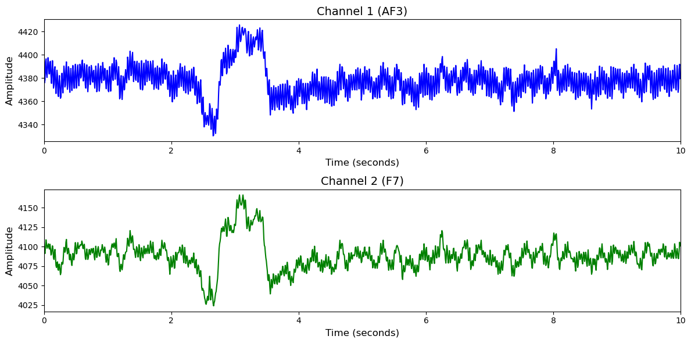

# DREAMER

# 1. Dataset Information

DREAMER 데이터셋[^1] 은 23명의 피험자를 대상으로 EEG 및 ECG 신호를 수집한 감정 인식용 생체신호 데이터셋입니다. 데이터는 피험자들이 총 18개의 감정을 유도하는 영상 클립을 시청하는 동안 수집되었으며, 각 클립 이후 피험자는 valence, arousal, dominance에 대한 자기평가를 수행하였습니다. EEG는 14채널 무선 장비인 Emotiv EPOC을 통해, ECG는 비침습 센서를 통해 측정되었으며, 모든 트라이얼에서 두 생체신호가 동시에 기록되었습니다.

# 2. Dataset Basic Information

## 2.1 Data Information

| # of Subjects | # of Leads | Sampling Frequency (Hz) | Recording Duration (min) | File Fomat |
| --- | --- | --- | --- | --- |
| 23 | 14 | 128 | 1373 | (EEG).mat |

## 2.2 Data Statistics

*EEG 전극에 해당하는 데이터만을 사용해 통계 분석을 수행하였습니다.

Arousal

| Label Type | #of recordings | EEG Mean | EEG Std | EEG Max | EEG Median | EEG Min |
| --- | --- | --- | --- | --- | --- | --- |
| Low (0) | 114 (27.5%) | 4252.909668   | 200.532761 | 5921.723145   | 4298.551758   | 3188.286133 |
| High(1) | 300 (72.5%) | 4252.547852 | 196.983887 | 5999.411621   | 4296.896484   | 3268.009521   |
| **Total** | 414 | 4252.7 | 198.75832 | 5960.56738 | 4297.724 | 3228.147827 |

Valence

| Label Type | #of recordings | EEG Mean | EEG Std | EEG Max | EEG Median | EEG Min |
| --- | --- | --- | --- | --- | --- | --- |
| Low (0) | 161 (38.9%) | 4253.330566   | 193.863358 | 5907.255859   | 4297.635254   | 3350.772461   |
| High(1) | 253    (61.1%) | 4252.211914   | 200.583008 | 6023.144043   | 4297.173828   | 3179.067871   |
| **Total** | 414 | 4252.8 | 197.22318 | 5965.19995 | 4297.405 | 3264.920166 |

Dominance

| Label Type | #of recordings | EEG Mean | EEG Std | EEG Max | EEG Median | EEG Min |
| --- | --- | --- | --- | --- | --- | --- |
| Low (0) | 95 (22.9%) | 4252.610840   | 195.771484 | 5850.987305   | 4296.737793   | 3180.256348   |
| High(1) | 319     (77.1%) | 4252.658691   | 198.609406 | 6015.384766   | 4297.534668   | 3265.377441   |
| **Total** | 414 | 4252.6 | 197.19045 | 5933.18604 | 4297.136 | 3222.816895 |

## 2.3 Raw Dataset


!!! note ""
    ```
    DREAMER/
    └── DREAMER.mat
    
    0 directories, 1 files
    ```


mat파일의 stimuli필드에 각 실험의 데이터가 담겨있고 score필드를 통해 valence, dominance, arousal 척도를 알 수 있어 이를 기반으로 라벨링이 가능합니다.

## 2.4 Raw Dataset Example



## 2.5 Preprocessed Dataset


!!! note ""
    ```
    DREAMER/
    ├── npy_files/
    │   ├── sub01_trial01.npy
    │   ├── sub01_trial02.npy
    │   └── sub01_trial03.npy
    │   ... (411 more files)
    ├── DREAMER.h5
    ├── DREAMER.npz
    └── DREAMER_None.npz
    ... (4 more files)
    ...
    1 directories, 1247 files
    ```


한 trial(자극)별로 split하고 .npy로 변환하였으며 이 파일명은 labels.csv의 1열과 대응되고, 2열엔 정수형 레이블이 있습니다.

# 3. Applications and Use Cases

| 인용 논문 | 연구 과제 | 모델 구조 | 방법론 |
| --- | --- | --- | --- |
| Li et al. (2023) [^2] | EEG 기반 감정 인식 | MTLFuseNet | EEG 신호의 심층 잠재 특징 융합 및 다중 작업 학습(multi-task learning) 기법을 활용해 감정 인식 성능 향상 |
| Liu et al. (2020) [^3] | EEG 신호 감정 인식 | Multi-level Features Guided Capsule Network (MLF-CapsNet) | EEG 신호로부터 다양한 수준의 특징(시간, 주파수, differential entropy)을 추출하고 캡슐 네트워크 구조를 통해 특징 간 계층적 관계를 학습하여 감정 인식 성능을 향상 |

# 4. References

[^1]: *DREAMER: A Database for Emotion Recognition Through EEG and ...* (2017). https://ieeexplore.ieee.org/document/7887697/

[^2]: *A novel emotion recognition model based on deep latent feature ...* (2023). https://www.sciencedirect.com/science/article/abs/pii/S0950705123005063

[^3]: *Multi‑channel EEG‑based emotion recognition via a multi‑level features guided capsule network*. Computers in Biology and Medicine (2020) https://doi.org/10.1016/j.compbiomed.2020.103927