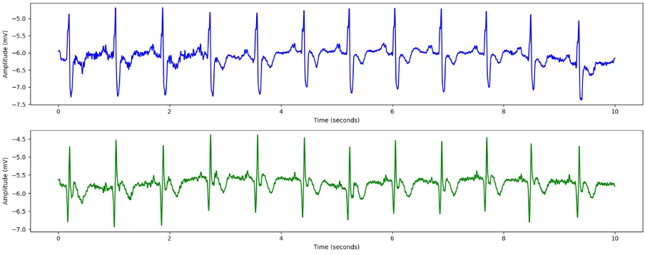

# Emobrain

# 1. Dataset Information

Emobrain 데이터셋 [^1] 은 eNTERFACE’06 워크숍에서 수집된 것으로, **fNIRS, EEG, 얼굴 영상, 주변 생리 신호(GSR, 호흡, 혈압)** 등을 활용한 **다중 모달 감정 인식 연구**를 위해 설계된 멀티모달 생체신호 데이터셋입니다.  **EEG + fNIRS + 주변 생리신호 기반 실험**으로, **5명의 피험자**가 세 세션에 걸쳐 **IAPS 이미지**를 보고 감정을 유도한 후, valence와 arousal을 자가 평가하는 방식으로 진행되었습니다. 각 세션은 30개의 블록(총 90 블록, 450장의 이미지)으로 구성되어 있으며, 감정 자극은 calm, positive-exciting, negative-exciting 세 가지 범주로 나뉘어 있습니다.

# 2. Dataset Basic Information

## 2.1 Data Information

| # of Subjects | # of Leads | Sampling Frequency (Hz) | Recording Duration (min) | File Fomat |
| --- | --- | --- | --- | --- |
| 5 | 54 | 1024 | 16000 | (EEG).edf |

## 2.2 Data Statistics

*EEG 전극에 해당하는 데이터만을 사용해 통계 분석을 수행하였습니다.

| Label Type | #of recordings | EEG Mean | EEG Std | EEG Max | EEG Median | EEG Min |
| --- | --- | --- | --- | --- | --- | --- |
| Calm (0) | 7405 (36.4%) | 0.02175 | 33.677 | 223.759 | 0.2784 | -203.759 |
| Positive (1) | 8901 (43.7%) | -0.0141 | 36.076 | 208.902 | 0.2649 | -178.215 |
| Negative (2) | 4049 (19.9%) | -0.00225 | 24.645 | 130.019 | 0.1226 | -112.813 |
| **Total** | 20355 | 0.0018 | 31.466 | 187.56 | 0.221967 | -164.929 |

## 2.3 Raw Dataset


!!! note ""
    ```
    Emobrain
    enterface06_EMOBRAIN/
    ├── Data/
    │ ├── Common/
    │ │ ├── IAPS_Classes_EEG_fNIRS.txt
    │ │ ├── IAPS_Eval_Arousal_EEG_fNIRS.txt
    │ │ └── IAPS_Eval_Valence_EEG_fNIRS.txt
    │ │ ... (16 more files)
    │ ├── EEG/
    │ │ ├── Part1_IAPS_SES1_EEG_fNIRS_03082006.bdf
    │ │ ├── Part1_IAPS_SES1_EEG_fNIRS_03082006.bdf.mrk
    │ │ └── Part1_IAPS_SES2_EEG_fNIRS_07082006.bdf
    │ │ ... (27 more files)
    │ └── fNIRS/
    │ ├── PART1_IAPS_SES1_EEG_fNIRS_03082006.txt
    │ ├── PART1_IAPS_SES1_EEG_fNIRS_06082006.txt
    │ └── PART1_IAPS_SES3_EEG_fNIRS_08082006.txt
    │ ... (13 more files)
    ├── eNTERFACE06_EMOBRAIN.JPG
    ├── eNTERFACE06_EMOBRAIN.html
    └── eNTERFACE06_EMOBRAIN_license.txt
    4 directories, 68 files
    ```


## 2.4 Raw Dataset Example



## 2.5 Preprocessed Dataset


!!! note ""
    ```
    Emobrain/
    ├── Emobrain_npy/
    │   ├── part0_ses0_0.npy
    │   ├── part0_ses0_1.npy
    │   └── part0_ses0_10.npy
    │   ... (552 more files)
    ├── npy_files/
    │   ├── sess1_sub1_trial1.npy
    │   ├── sess1_sub1_trial10.npy
    │   └── sess1_sub1_trial100.npy
    │   ... (552 more files)
    ├── Emobrain.h5
    ├── Emobrain.npz
    └── channels.csv
    ... (3 more files)
    
    2 directories, 1116 files
    ```


한 trial(자극)별로 split하고 .npy로 변환하였으며 이 파일명은 labels.csv의 1열과 대응되고, 2열엔 정수형 레이블이 있습니다.

# 3. Applications and Use Cases

| 인용 논문 | 연구 과제 | 모델 구조 | 방법론 |
| --- | --- | --- | --- |
| Savran et al. (2006) [^1] | fNIRS, EEG, 비디오 기반 멀티모달 감정 인식 시스템 개발 | 모달리티별 전처리 후 특징 추출, 분류기 (TBM for video, PCA/ICA for fNIRS/EEG) | 세 가지 감정(평온, 긍정적 흥분, 부정적 흥분) 유도를 위한 실험 프로토콜 설계.  Feature-level 및 Decision-level fusion 적용. Active Appearance Model, TBM, Laplacian EEG, Power-band energy, GSR/HRV 통계 등 다양한 기법 사용. 데이터 동기화 및 멀티모달 데이터베이스 구축. |
| Jiang, Zhao, & Lu (2024) [^2] | 대규모 EEG 데이터로 다양한 태스크에 일반화 가능한 EEG 파운데이션 모델 학습 | EEG 패치 기반 Transformer, Vector-Quantized Neural Tokenizer , Fourier Spectrum Decoder | 20여 개 EEG 데이터셋 (총 2,500시간) 기반으로 EEG 채널을 patch 단위로 분할한 뒤, neural tokenizer를 통해 spectrum-based 토큰으로 양자화. 이후 masked token prediction 방식으로 Transformer를 self-supervised pretraining. Temporal -Spatial Embedding 포함.  |

# 4. References

[^1]: Savran, A., Ciftci, K., Chanel, G., Cruz Mota, J., Viet, L. H., Sankur, B., Akarun, L., Caplier, A., & Rombaut, M. (2006). *Emotion Detection in the Loop from Brain Signals and Facial Images*. Final Report, eNTERFACE'06 Workshop, Dubrovnik, Croatia. Retrieved from [http://www.enterface.net](http://www.enterface.net/)

[^2]: Jiang, W.-B., Zhao, L.-M., & Lu, B.-L. (2024). *Large brain model for learning generic representations with tremendous EEG data in BCI*. In Proceedings of the International Conference on Learning Representations (ICLR). [https://github.com/935963004/LaBraM](https://github.com/935963004/LaBraM)