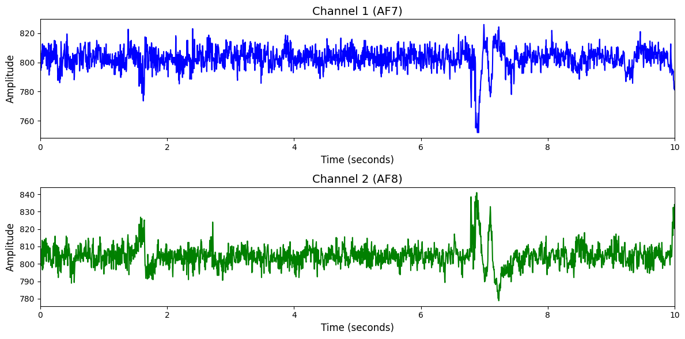

# 1. Dataset Information

Fatigueset 데이터셋[1]은 정신적 피로와 피로화의 상호작용 및 생리적 반응을 다차원적으로 분석하기 위해 수집된 멀티모달 센서 데이터셋입니다. 총 12명의 참가자가 세 차례 세션을 통해 다양한 수준의 신체 활동(저, 중, 고강도)과 인지 과제를 수행하였으며, 각 세션에서 EEG, ECG, PPG, EDA, 피부 온도, 가속도계, 자이로스코프 등 4종의 웨어러블 장치를 통해 생체 신호를 수집하였습니다. 실험은 휴식, 신체 활동, 인지 과제 순으로 구성되며, 각 구간에서 주관적 피로도와 2가지 인지 과제(CRT, 2-back task)를 통해 피로화 정도를 정량화하였습니다. 해당 데이터셋은 피로 탐지 및 관리 기술 개발, 인지 상태 추론, 생체 신호 기반 모델링 등에 활용됩니다.

# 2. Dataset Basic Information

## 2.1 Data Information

| # of Subjects | # of Leads | Sampling Frequency (Hz) | Recording Duration (min) | File Fomat |
| --- | --- | --- | --- | --- |
| 12 | 4 | 256 | 21.2 | (EEG).csv, (metadata).csv |

## 2.2 Data Statistics

*EEG 전극에 해당하는 데이터만을 사용해 통계 분석을 수행하였습니다.

# Fatigue_subjective_labels

| Label Type | #of recordings | EEG Mean | EEG Std | EEG Max | EEG Median | EEG Min |
| --- | --- | --- | --- | --- | --- | --- |
| Non-Fatigue(0) | 34 (94.44%) | 790.401672 | 195.648361 | 1635.018311 | 803.418823 | 13.968254 |
| Fatigue(1) | 2 (5.56%) | 804.526001 | 86.788414 | 1631.465210 | 804.450562 | 0.000000 |
| **Total** | 36 | 792.022461 | 216.097809 | 1650.000000 | 804.249084 | 0.000000 |

# Fatigue_objective_labels

| Label Type | #of recordings | EEG Mean | EEG Std | EEG Max | EEG Median | EEG Min |
| --- | --- | --- | --- | --- | --- | --- |
| Non-Fatigue(0) | 34 (94.44%) | 791.563049 | 189.362152 | 1633.931641 | 803.492065 | 13.968254 |
| Fatigue(1) | 2 (5.56%) | 785.363770 | 190.510864 | 1649.395630 | 803.241760 | 0.000000 |
| **Total** | 36 | 792.022461 | 216.097809 | 1650.000000 | 804.249084 | 0.000000 |

## 2.3 Raw Dataset

!!! note ""
    ```
    Fatigueset/
    ├── 01/
    │   ├── 01/
    │   │   ├── chest_bb_interval.csv
    │   │   ├── chest_physiology_summary.csv
    │   │   └── chest_raw_acc.csv
    │   │   ... (36 more files)
    │   ├── 02/
    │   │   ├── chest_bb_interval.csv
    │   │   ├── chest_physiology_summary.csv
    │   │   └── chest_raw_acc.csv
    │   │   ... (36 more files)
    │   ├── 03/
    │   │   ├── chest_bb_interval.csv
    │   │   ├── chest_physiology_summary.csv
    │   │   └── chest_raw_acc.csv
    │   │   ... (36 more files)
    ├── 02/
    │   ├── 01/
    │   │   ├── chest_bb_interval.csv
    │   │   ├── chest_physiology_summary.csv
    │   │   └── chest_raw_acc.csv
    │   │   ... (42 more files)
    │   ├── 02/
    │   │   ├── chest_bb_interval.csv
    │   │   ├── chest_physiology_summary.csv
    │   │   └── chest_raw_acc.csv
    │   │   ... (42 more files)
    │   └── 03/
    │       ├── chest_bb_interval.csv
    │       ├── chest_physiology_summary.csv
    │       └── chest_raw_acc.csv
    │       ... (36 more files)
    ├── 03/
    │   ├── 01/
    │   │   ├── chest_bb_interval.csv
    │   │   ├── chest_physiology_summary.csv
    │   │   └── chest_raw_acc.csv
    │   │   ... (36 more files)
    │   ├── 02/
    │   │   ├── chest_bb_interval.csv
    │   │   ├── chest_physiology_summary.csv
    │   │   └── chest_raw_acc.csv
    │   │   ... (36 more files)
    │   └── 03/
    │       ├── chest_bb_interval.csv
    │       ├── chest_physiology_summary.csv
    │       └── chest_raw_acc.csv
    │       ... (36 more files)
    ├── 04/
    │   ├── 01/
    │   │   ├── chest_bb_interval.csv
    │   │   ├── chest_physiology_summary.csv
    │   │   └── chest_raw_acc.csv
    │   │   ... (53 more files)
    │   ├── 02/
    │   │   ├── chest_bb_interval.csv
    │   │   ├── chest_physiology_summary.csv
    │   │   └── chest_raw_acc.csv
    │   │   ... (36 more files)
    │   └── 03/
    │       ├── chest_bb_interval.csv
    │       ├── chest_physiology_summary.csv
    │       └── chest_raw_acc.csv
    │       ... (36 more files)
    ├── 05/
    │   ├── 01/
    │   │   ├── chest_bb_interval.csv
    │   │   ├── chest_physiology_summary.csv
    │   │   └── chest_raw_acc.csv
    │   │   ... (36 more files)
    │   ├── 02/
    │   │   ├── chest_bb_interval.csv
    │   │   ├── chest_physiology_summary.csv
    │   │   └── chest_raw_acc.csv
    │   │   ... (42 more files)
    │   └── 03/
    │       ├── chest_bb_interval.csv
    │       ├── chest_physiology_summary.csv
    │       └── chest_raw_acc.csv
    │       ... (36 more files)
    ├── 06/
    │   ├── 01/
    │   │   ├── chest_bb_interval.csv
    │   │   ├── chest_physiology_summary.csv
    │   │   └── chest_raw_acc.csv
    │   │   ... (42 more files)
    │   ├── 02/
    │   │   ├── chest_bb_interval.csv
    │   │   ├── chest_physiology_summary.csv
    │   │   └── chest_raw_acc.csv
    │   │   ... (42 more files)
    │   └── 03/
    │       ├── chest_bb_interval.csv
    │       ├── chest_physiology_summary.csv
    │       └── chest_raw_acc.csv
    │       ... (36 more files)
    ├── 07/
    │   ├── 01/
    │   │   ├── chest_bb_interval.csv
    │   │   ├── chest_physiology_summary.csv
    │   │   └── chest_raw_acc.csv
    │   │   ... (36 more files)
    │   ├── 02/
    │   │   ├── chest_bb_interval.csv
    │   │   ├── chest_physiology_summary.csv
    │   │   └── chest_raw_acc.csv
    │   │   ... (36 more files)
    │   └── 03/
    │       ├── chest_bb_interval.csv
    │       ├── chest_physiology_summary.csv
    │       └── chest_raw_acc.csv
    │       ... (36 more files)
    ├── 08/
    │   ├── 01/
    │   │   ├── chest_bb_interval.csv
    │   │   ├── chest_physiology_summary.csv
    │   │   └── chest_raw_acc.csv
    │   │   ... (36 more files)
    │   ├── 02/
    │   │   ├── chest_bb_interval.csv
    │   │   ├── chest_physiology_summary.csv
    │   │   └── chest_raw_acc.csv
    │   │   ... (36 more files)
    │   └── 03/
    │       ├── chest_bb_interval.csv
    │       ├── chest_physiology_summary.csv
    │       └── chest_raw_acc.csv
    │       ... (36 more files)
    ├── 09/
    │   ├── 01/
    │   │   ├── chest_bb_interval.csv
    │   │   ├── chest_physiology_summary.csv
    │   │   └── chest_raw_acc.csv
    │   │   ... (36 more files)
    │   ├── 02/
    │   │   ├── chest_bb_interval.csv
    │   │   ├── chest_physiology_summary.csv
    │   │   └── chest_raw_acc.csv
    │   │   ... (42 more files)
    │   └── 03/
    │       ├── chest_bb_interval.csv
    │       ├── chest_physiology_summary.csv
    │       └── chest_raw_acc.csv
    │       ... (36 more files)
    ├── 10/
    │   ├── 01/
    │   │   ├── chest_bb_interval.csv
    │   │   ├── chest_physiology_summary.csv
    │   │   └── chest_raw_acc.csv
    │   │   ... (42 more files)
    │   ├── 02/
    │   │   ├── chest_bb_interval.csv
    │   │   ├── chest_physiology_summary.csv
    │   │   └── chest_raw_acc.csv
    │   │   ... (36 more files)
    │   └── 03/
    │       ├── chest_bb_interval.csv
    │       ├── chest_physiology_summary.csv
    │       └── chest_raw_acc.csv
    │       ... (42 more files)
    ├── 11/
    │   ├── 01/
    │   │   ├── chest_bb_interval.csv
    │   │   ├── chest_physiology_summary.csv
    │   │   └── chest_raw_acc.csv
    │   │   ... (36 more files)
    │   ├── 02/
    │   │   ├── chest_bb_interval.csv
    │   │   ├── chest_physiology_summary.csv
    │   │   └── chest_raw_acc.csv
    │   │   ... (36 more files)
    │   └── 03/
    │       ├── chest_bb_interval.csv
    │       ├── chest_physiology_summary.csv
    │       └── chest_raw_acc.csv
    │       ... (36 more files)
    ├── 12/
    │   ├── 01/
    │   │   ├── chest_bb_interval.csv
    │   │   ├── chest_physiology_summary.csv
    │   │   └── chest_raw_acc.csv
    │   │   ... (36 more files)
    │   ├── 02/
    │   │   ├── chest_bb_interval.csv
    │   │   ├── chest_physiology_summary.csv
    │   │   └── chest_raw_acc.csv
    │   │   ... (36 more files)
    │   └── 03/
    │       ├── chest_bb_interval.csv
    │       ├── chest_physiology_summary.csv
    │       └── chest_raw_acc.csv
    │       ... (36 more files)
    ├── README.md
    ├── metadata.csv
    └── pre_task_survey.xlsx
    ... (1 more files)
    48 directories, 1473 files
    ```

폴더는 참가자 번호(예: 01, 02, ..., 12)와 각 참가자의 세션 번호(01, 02, 03)로 계층화되어 있으며, 각 세션 폴더에는 가슴 ECG 밴드로부터 수집된 호흡 간격(chest_bb_interval.csv), 생리 요약 정보(chest_physiology_summary.csv), 원시 가속도 데이터(chest_raw_acc.csv) 등 총 30개 이상의 센서 데이터 파일이 포함되어 있습니다. 최상위 디렉토리에는 전체 메타데이터(metadata.csv), 참가자 설문(pre_task_survey.xlsx), 안내 문서(README.md)가 함께 포함되어 있어 실험 설계와 측정 환경을 참고할 수 있습니다.

## 2.4 Raw Dataset Example



## 2.5 Preprocessed Dataset

!!! note ""
    ```
    Fatigueset/
    ├── npy_files/
    │   ├── sess01_sub01_trial01.npy
    │   ├── sess01_sub02_trial01.npy
    │   └── sess01_sub03_trial01.npy
    │   ... (33 more files)
    ├── Fatigueset.h5
    ├── Fatigueset.npz
    ├── fatigue_objective_labels.csv
├── fatigue_subjective_labels.csv
└── channels.csv
    1 directories, 41 files
    ```

# 3. Applications and Use Cases

| 인용 논문 | 연구 과제 | 모델 구조 | 방법론 |
| --- | --- | --- | --- |
| Kodikara et al. (2024) [2] | 다중 웨어러블 센서를 활용한 정신적 피로 추론 모델 개발 | Random Forest, XGBoost, MLP 기반 이진 분류 모델 | FatigueSet 데이터셋을 기반으로 4개의 웨어러블(Headband, Chestband, Earable, Wristband)에서 수집된 생리 신호 데이터를 활용하여 심리적/생리적 피로를 이진 분류. 개별 디바이스 기반(device-specific) 및 다중 디바이스 기반(multi-device) 모델을 비교 분석함. Nested Cross-Validation을 통해 일반화 성능을 평가하고, 다양한 시간 윈도우(1~60초)로 모델 성능 비교 수행. |

# 4. References

[1] Kalanadhabhatta, M., Min, C., Montanari, A., & Kawsar, F. (2023). FatigueSet: A Multi-modal Dataset for Modeling Mental Fatigue and Fatigability. In *Proceedings of the 2023 ACM International Joint Conference on Pervasive and Ubiquitous Computing *(UbiComp ’23).

[2] Kodikara, C., Wijekoon, S., & Meegahapola, L. (2024). *FatigueSense: Multi-Device and Multi-Modal Wearable Sensing for Detecting Mental Fatigue*. ACM Transactions on Computing for Healthcare (ACM Trans. Comput. Healthcare), Article No. 3709363.

---
