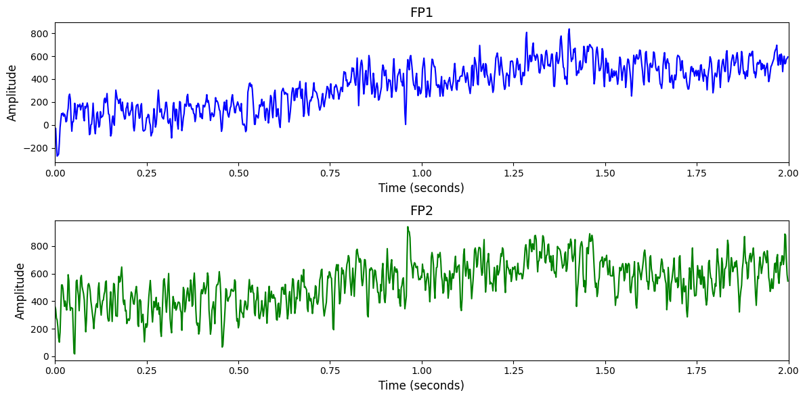

# 1. Dataset Information

Grasp and Lift Challenge 물체를 들어올리는 과제를 수행하는 동안 12명의 피험자로부터 32채널 EEG, 5개 EMG, 3D 손/물체 위치, 접촉력/토크 데이터를 기록한 데이터셋이다. 총 3,936개의 trial에서 무게와 마찰 조건이 무작위로 변화되며, 각 trial마다 16개의 이벤트 시점과 18개의 행동 특성 지표가 함께 제공된다. 이 데이터는 감각-운동 해석 및 행동 예측 연구에 활용될 수 있다 [1].

# 2. Dataset Basic Information

## 2.1 Data Information

| # of Subjects | # of Leads | Sampling Frequency (Hz) | Recording Duration (min) | File Fomat |
| --- | --- | --- | --- | --- |
| 12 | 32 | 500 | 0.083 | (EEG).csv, (annotation).csv |

## 2.2 Data Statistics

*EEG 전극에 해당하는 데이터만을 사용해 통계 분석을 수행하였습니다.

| Label Type | #of recordings | EEG Mean | EEG Std | EEG Max | EEG Median | EEG Min |
| --- | --- | --- | --- | --- | --- | --- |
| HandStart | 3110 | 122.606794 | 312.928916 | 14862.000000 | 115.000000 | -5687.000000 |
| FirstDigitTouch | 3114 | 124.950225 | 288.573317 | 7599.000000 | 120.000000 | -5601.000000 |
| Replace | 3120 | 121.352676 | 293.877601 | 8753.000000 | 118.000000 | -5664.000000 |
| LiftOff | 3120 | 157.240680 | 305.561744 | 19046.000000 | 151.000000 | -5734.000000 |
| BothReleased | 3118 | 89.768196 | 288.174669 | 7401.000000 | 86.000000 | -5746.000000 |
| BothStartLoadPhase | 3120 | 106.008998 | 304.049205 | 17307.000000 | 102.000000 | -5740.000000 |
| none | 12175 | 94.323272 | 307.751985 | 23603.000000 | 87.000000 | -8543.000000 |
| Total | 30877 | 112.310546 | 301.690121 | 23603.000000 | 105.000000 | -8543.000000 |

## 2.3 Raw Dataset

!!! note ""
    ```
    Grasp_and_Lift_EEG_Challenge/
    ├── test/
    │   ├── subj10_series10_data.csv
    │   ├── subj10_series9_data.csv
    │   └── subj11_series10_data.csv
    │   ... (21 more files)
    └── train/
    2 directories, 216 files
    ```

Grasp-and-Lift EEG Challenge 데이터셋은 train과 test 두 개의 하위 폴더로 구성되어 있으며, 각 폴더에는 실험 참가자별 시리즈 단위의 데이터 파일이 포함되어 있다. 각 파일은 subj번호_series번호 형식의 이름을 가지며, *_data.csv 파일에는 EEG, EMG, 위치, 힘/토크 등의 생체신호가 시간 순서대로 기록되어 있고, *_events.csv 파일에는 각 trial에서의 주요 동작 이벤트(예: 손가락 접촉, 물체 들어올림 등)의 발생 시점이 주석으로 포함되어 있다.

## 2.4 Raw Dataset Example



## 2.5 Preprocessed Dataset

!!! note ""
    ```
    Grasp_and_Lift_EEG_Challenge/
    ├── npy_files/
    │   ├── sess1_sub10_trial1.npy
    │   ├── sess1_sub10_trial10.npy
    │   └── sess1_sub10_trial100.npy
    │   ... (30874 more files)
    ├── channels.csv
    └── labels.csv
    1 directories, 30879 files
    ```

# 3. Applications and Use Cases

| 인용 논문 | 연구 과제 | 모델 구조 | 방법론 |
| --- | --- | --- | --- |
| Pancholi (2022) [2] | EEG 기반 손 운동 궤적 복원을 위한 연속 운동 추정 및 소스 정보 통합 | MLP, CNN-LSTM, WPD CNN-LSTM + sLORETA | 뇌 소스 위치 정보(sLORETA 기반)를 활용하여 EEG 채널 선택 및 세그먼트 분할 정확도 향상. 다중 deep 모델(MLP, CNN-LSTM, WPD-CNN-LSTM)을 이용해 손 궤적을 연속적으로 추정. |
| Ma (2023) [3] | 개인 맞춤형 MI EEG 신호 분류 정확도 향상 | MBGA-Net (Multi-Branch Graph Adaptive Network) | EEG의 시공간적 도메인 특징에 따라 신호를 적절한 시간-주파수 도메인 브랜치로 분류하고, 그래프 attention 및 잔차 연결 기반 CNN으로 intra/inter-channel 정보를 추출. 각 브랜치가 format에 특화된 표현을 학습. |

# 4. References

[1] Luciw, Matthew D., Ewa Jarocka, and Benoni B. Edin. "Multi-channel EEG recordings during 3,936 grasp and lift trials with varying weight and friction." *Scientific data* 1.1 (2014): 1-11.

[2] Pancholi, Sidharth, et al. "Source aware deep learning framework for hand kinematic reconstruction using EEG signal." *IEEE Transactions on Cybernetics* 53.7 (2022): 4094-4106.

[3] Ma, Weifeng, et al. "MBGA-Net: A multi-branch graph adaptive network for individualized motor imagery EEG classification." *Computer Methods and Programs in Biomedicine* 240 (2023): 107641.
